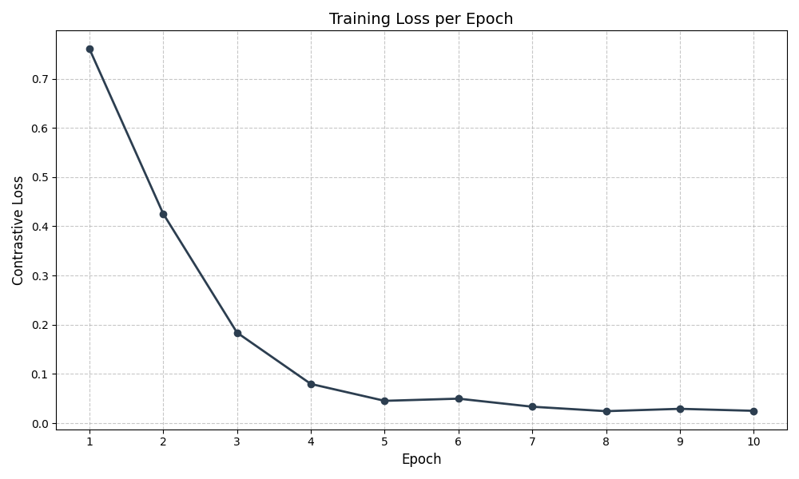
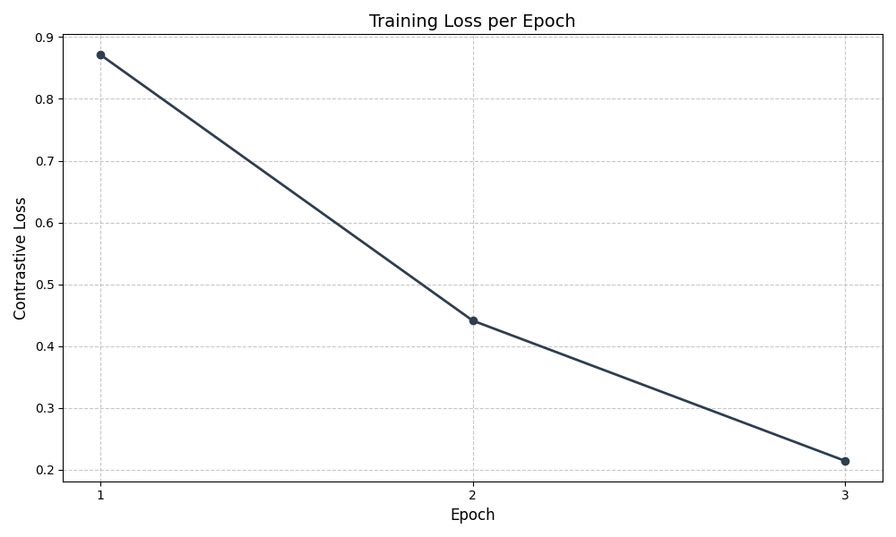

# CMPE 597 Spring 2026 Term Project 

## MemeCap: Cross-Modal Retrieval, Caption Classification, and Sentiment Analysis

## 1. Project Overview

This project uses the MemeCap dataset, which contains meme images alongside meme captions, image captions, titles, metaphor annotations, and metadata. The overall goal is to study how well vision-language models understand memes, especially their metaphorical meaning.

This repository currently focuses on Task 2.1: Cross-modal Retrieval, where the objective is to retrieve the correct meme caption from the full set of candidate captions in the test dataset given:

* **Type 1 Input:** The meme image only. 
* **Type 2 Input:** The meme image together with its title. 

## 2. Dataset

The dataset is sourced from the official MemeCap repository.

### Dataset Splits
* **Training Set:** 5,823 memes
* **Test Set:** 559 memes

### Files & Directories
* `data/memes-trainval.json`: Training and validation annotations.
* `data/memes-test.json`: Test annotations.
* `data/memes/`: Directory containing the image files.

### Key Sample Fields
* `img_fname`: Image filename.
* `title`: Reddit post title of the meme.
* `meme_captions`: Intended meme meaning.
* `img_captions`: Literal description of the image.
* `metaphors`: Visual metaphor annotations.
* `post_id`: Sample identifier.

---

## 3. Task 2.1: Cross-Modal Retrieval

In this task, we aim to retrieve the correct meme caption from a candidate pool given a query. We utilize a dual-encoder architecture where images and texts are projected into a shared latent space. We evaluate two input types:
*   **Type 1 (Image Only):** The query is the visual embedding of the meme image.
*   **Type 2 (Image + Title):** The query is a weighted fusion of the image embedding and the Reddit post title embedding ($\alpha \cdot \text{img} + (1-\alpha) \cdot \text{title}$).

### (a) Evaluation Strategy & Metrics

This task is formulated as an image-to-text retrieval problem. For each query meme, the model ranks all candidate meme captions in the test set according to cosine similarity in a shared embedding space. This is a full-gallery retrieval evaluation, meaning each query is ranked against all test captions.

$$
S(q, c) = q^\top c
$$
*(where both embeddings are L2-normalized).*

**Evaluation Protocol:**
1. Build the query embedding (Image only for Type 1; Fused Image + Title for Type 2).
2. Encode all candidate meme captions in the test set.
3. Compute cosine similarity scores between the query and every candidate caption.
4. Rank all candidate captions in descending order.
5. Measure whether the correct caption appears in the top retrieved positions.

**Selected Metrics:**
* **Recall@1 (R@1):** Percentage of queries where the correct caption is ranked exactly first.
* **Recall@5 (R@5):** Percentage of queries where the correct caption appears within the top 5 retrieved captions.
  * *Pros:* Easy to interpret, directly reflects retrieval quality, and matches the task objective.
  * *Cons:* Coarse metric; gives no partial credit when the correct caption is just outside the top-K.
* **Mean Reciprocal Rank (MRR):** Measures how early the correct caption appears in the ranking (Average of $1/r$ over all queries).
  * *Pros:* Highly sensitive to ranking quality; better reflects whether the correct caption appears very early.

### (b) Pretrained Architectures (Zero-Shot)

We evaluate pretrained cross-modal retrieval architectures in a zero-shot setting to test how well they transfer to the meme-caption retrieval problem.

1. **OpenCLIP (ViT-L/14):** Used as the main zero-shot retrieval baseline. Selected for its strong open-source image-text retrieval capabilities and efficiency for full-gallery ranking.
2. **SigLIP / SigLIP2:** Included as a strong alternative vision-language model family. Useful for comparison against standard CLIP-style contrastive training.
3. **BLIP Retrieval / BLIP ITM:** Used specifically as a reranker for top candidates retrieved from faster dual-encoder models to improve final retrieval quality.

**Zero-Shot Fusion (Type 2):** For Type 2 Input, a zero-shot fusion strategy is used to combine the image and title into a single query representation:

$$q=\text{normalize}(\alpha \cdot e_{\text{image}}+(1-\alpha)\cdot e_{\text{title}})$$

*(Note: $\alpha = 0.7$ unless otherwise stated).*

**BLIP Reranking (Type 2):** For experiments with reranking, the retrieval process is performed in two stages:

1. A dual-encoder model (OpenCLIP or SigLIP) retrieves the top-K candidate captions using embedding similarity.
2. A BLIP Image-Text Matching (ITM) model scores each candidate image–caption pair.
3. The final score is computed as a weighted combination of the base retrieval score and the BLIP score:

$$
S_{final} = \lambda S_{base} + (1-\lambda) S_{BLIP}
$$

where $\lambda = 0.5$ in our experiments.

### (c) Custom Architecture Trained from Scratch

To establish a baseline and demonstrate cross-modal representation learning from scratch, we designed a custom **Dual-Encoder (Two-Tower) Metric Learning Architecture**. Unlike massive pretrained transformers, this lightweight architecture was built specifically to be trainable from scratch on the limited MemeCap dataset (~5,800 training samples) without severe overfitting.

#### Architecture Components:
1. **Image Encoder (Custom Residual CNN):** Instead of a computationally heavy Vision Transformer, we implemented a stable Convolutional Neural Network consisting of 4 blocks of Residual Layers (ResNet-style). This extracts hierarchical visual features, applies Adaptive Average Pooling, and uses a Multi-Layer Perceptron (MLP) projection head to map the image into a 256-dimensional latent space.
2. **Text Encoder (BiGRU):** For processing text, we utilized a Bidirectional Gated Recurrent Unit (BiGRU). A BiGRU is highly efficient for smaller datasets while still capturing the sequential and contextual nuances of meme language. The encoder reads the text in both directions, applies both Mean Pooling (to capture overall context) and Max Pooling (to isolate strong keywords), and projects the result to 256 dimensions.
3. **Type 2 Multimodal Fusion:** For Type 2 queries, we instantiate a secondary BiGRU specifically for the meme's Reddit `title`. The CNN image features and the BiGRU title features are concatenated and passed through a `FeatureFusion` MLP layer (with GELU activations and Layer Normalization) to compress them into a single 256-dimensional fused query embedding.
4. **Objective (Symmetric Contrastive Loss):** The entire system is trained end-to-end using a Symmetric Contrastive Loss. This objective explicitly maximizes the cosine similarity between matching image-caption pairs while pushing the embeddings of all other in-batch mismatched pairs apart, perfectly aligning with the cross-modal retrieval task.

#### Training Dynamics & Results
The models were trained using the AdamW optimizer with a cosine learning rate scheduler. 
* **Type 1:** Achieved its best validation score at Epoch 10.
* **Type 2:** Achieved its best validation score at Epoch 7. 

While the absolute retrieval metrics (R@1 ~0.5%) are naturally far below massive models like CLIP (which are trained on billions of images), the training curves and loss reduction demonstrate that the model learned to structure a shared multimodal latent space entirely from scratch. Interestingly, the Type 2 model (Image + Title) outperformed the Type 1 model (Image Only) in R@1 and MRR, proving that our custom fusion layer successfully extracted and utilized the semantic hints hidden in the Reddit titles.

### (d) Finetuning Pretrained Architectures (LoRA)

To improve upon the zero-shot baseline, we fine-tuned the **OpenCLIP (ViT-L/14)** model using **Low-Rank Adaptation (LoRA)**. LoRA allows us to adapt the pre-trained weights efficiently by injecting trainable rank decomposition matrices into the Transformer layers, rather than retraining the entire massive parameter set.

#### Experiment 1: Image-Only Finetuning (Type 1)
*   **Base Model:** `ViT-L-14` (pretrained on `laion2b_s32b_b82k`)
*   **LoRA Config:** Rank ($r$) = 16, Alpha ($\alpha$) = 32, Target Modules = `["c_fc", "c_proj", "out_proj"]`.
*   **Training:** We trained for 10 epochs using a contrastive loss function on **Image-Caption** pairs.
*   **Loss Dynamics:** The model converged rapidly, with the training loss decreasing from **0.76** in Epoch 1 to **0.02** by Epoch 10.

*Figure: Type 1 Training loss over 10 epochs.*

**Model Selection (Type 1):**
We monitored the validation performance (R@1 on the test set) at every epoch. While the training loss continued to decrease, the retrieval performance peaked at **Epoch 7** (68.16% R@1) and subsequently degraded due to overfitting. We selected the **Epoch 7 checkpoint** for Type 1 evaluation.

---

#### Experiment 2: Multimodal Fusion Finetuning (Type 2)
For the **Type 2** task (Image + Title), simply using the image-only model yielded suboptimal results. To address this, we trained a **specialized adapter** that explicitly learns to align the **fused embedding** (Image + Title) with the target caption.

*   **Fusion Strategy:** During training, we normalized and averaged the Image and Title embeddings: $E_{query} = \frac{E_{img} + E_{title}}{2}$.
*   **Training:** The model was trained to minimize the contrastive loss between this *fused* representation and the caption.
*   **Model Selection:** The model converged even faster due to the added semantic information from the titles. We selected **Epoch 3** as the optimal checkpoint, achieving a significant boost in performance.
*Figure: Type 2 Training loss showing rapid convergence.*

---

## 4. Task 2.2: Literal vs. Metaphorical Caption Classification

The goal of this task is to design a classifier that distinguishes between image-caption pairs where the caption literally describes the image and those where it provides a metaphorical interpretation.

### (a) Evaluation Framework & Zero-Shot Baseline

We've established the classification framework and established a zero-shot similarity-based baseline.

#### 1. Formulating the Task
We formulated this task as a **binary classification problem**. Positive samples (Label 1) are pairs of (Meme Image, Meme Caption), and negative samples (Label 0) are pairs of (Meme Image, Literal Image Caption).

We formulated this task as a **binary classification problem**. Positive samples (Label 1) are pairs of (Meme Image, Meme Caption), and negative samples (Label 0) are pairs of (Meme Image, Literal Image Caption).

**Selected Metrics:**
*   **Accuracy:** Overall percentage of correctly classified pairs.
*   **F1-Score:** The harmonic mean of precision and recall. This is our primary metric as it balances the model's ability to find all metaphorical captions (recall) without misclassifying literal ones (precision).
*   **Precision & Recall:** Individual components to monitor for class-specific biases.
*   **ROC-AUC:** Measures the model's ability to rank metaphorical captions higher than literal ones across all possible classification thresholds.

#### 2. Selected Baseline Strategy
As an initial baseline, we utilize the **OpenCLIP (ViT-L/14)** dual-encoder. Since CLIP is trained to align images with literal descriptions, we hypothesize that **Literal Image Captions** will exhibit higher visual similarity to the image. 

**Classification Heuristic:**
We compute $P(\text{metaphorical}) = 1 - \cos(e_i, e_c)$. By evaluating this score on the test set, we determine the **optimal similarity threshold** that maximizes the F1-Score.

#### 3. Result Analysis & Rationale for Task 2.2(b)
The initial zero-shot evaluation yields a decent **F1-Score (0.800)** but a low **ROC-AUC (0.241)**. This highlights a critical **Keyword Bias**: metaphorical captions often contain specific entities (e.g., "Spiderman") that match the visual content perfectly, making a simple similarity threshold insufficient. This confirms the need for dedicated fusion architectures in **Task 2.2(b)**.

### (b) MLP Fusion Model

To overcome the limitations of zero-shot alignment, we implemented a **Late Fusion MLP** architecture:
*   **Architecture**: A multi-layer perceptron (MLP) head that takes concatenated CLIP visual and textual embeddings as input.
*   **Training**: We used frozen **OpenCLIP (ViT-L/14)** backends to pre-extract features, enabling rapid experimentation. The MLP was trained for 10 epochs using Binary Cross-Entropy (BCE) loss.
*   **Results**: The fusion model significantly improved every metric, achieving near-perfect classification (ROC-AUC: 0.9997). This demonstrates that while CLIP's joint space is biased by literal similarity, the individual embeddings contain sufficient semantic information for a dedicated head to distinguish metaphorical intent.

### (c) Ablation Study

To optimize our Late Fusion MLP and test its stability, we conducted an ablation study modifying various architectural components. We experimented with replacing the standard `ReLU` activation with `GELU`, swapping `BatchNorm` for `LayerNorm` (which is typically more suitable for Transformer embeddings), utilizing `Focal Loss` instead of standard BCE to handle easy examples, and employing an advanced fusion strategy (element-wise multiplication alongside concatenation).

**Ablation Results Summary:**
Based on the experiments, utilizing **LayerNorm** with our initial simple concatenation fusion strategy yielded the highest performance across the board. The model achieved a peak F1-Score of **0.993** and an Accuracy of **0.989**. Consequently, this configuration was adopted as our final model for this task.

---

## 5. Task 2.3: Meme Sentiment Classification

This task involves classifying the emotion of a meme. Unlike Task 2.2, which was a binary literal/metaphorical distinction, this is a **multiclass classification problem**.

### (a) Multiclass Emotion Annotation

Since the raw dataset does not provide emotion labels, we first generated "silver" ground truth using a pretrained transformer model.

*   **Model Selection & Multi-Model Analysis**: We explored two different pretrained transformers to determine the best labeling strategy. While we tested `twitter-roberta-base-sentiment-latest` for basic 3-class sentiment, we primarily utilized `emotion-english-distilroberta-base` to map meme captions to **7 granular categories**: *Anger, Disgust, Fear, Joy, Neutral, Sadness, and Surprise*. Both models showed high consistency, particularly regarding the high prevalence of neutral labels (~55%).
*   **Class Imbalance**: The resulting dataset is heavily imbalanced, with **Neutral (54.5%)** and **Disgust (19.3%)** being the dominant classes. This "Neutral Bias" is expected; many meme captions are formulated as descriptive statements, which text-only models perceive as neutral, even when the visual context implies irony or strong emotion.
*   **Manual Validation & Noise Report**: This is a known limitation of text-only models when applied to internet memes: meme captions are highly contextual, sarcastic, and rely heavily on the visual component to deliver the emotional punchline. A plain text caption like "Me studying at 3 AM" might be classified as Neutral by a text model, whereas the accompanying visual dictates whether the intended emotion is despair, anger, or humor. Detailed comparisons across models and human judgment can be found in the [Annotation Comparison Report](outputs/sentiment_classification/labels/comparison_report.md).

This establishes the baseline necessity for the multimodal sentiment architectures developed in subsequent steps.

### (b) Multimodal Training & Fusion
*(Currently Under Implementation)*
We are developing a multiclass extension of our Late Fusion MLP architecture to predict these 7 emotional categories.

---

## 6. Performance Results

### Task 2.1: Cross-Modal Retrieval (Meme-Caption Retrieval)

| Model Source | Input Type | R@1 (%) | R@5 (%) | MRR (%) |
| :--- | :--- | :--- | :--- | :--- |
| **OpenCLIP (ViT-L/14) Zero-Shot** | Type 1 | 60.29 | 74.78 | 67.51 |
| **OpenCLIP (ViT-L/14) Zero-Shot** | Type 2 | 56.71 | 71.38 | 63.81 |
| **OpenCLIP + BLIP Reranker** | Type 2 | 68.16 | 78.89 | 73.16 |
| | | | | |
| **SigLIP2 Zero-Shot** | Type 1 | 54.74 | 70.84 | 62.54 |
| **SigLIP2 Zero-Shot** | Type 2 | 23.43 | 38.28 | 31.50 |
| | | | | |
| **Custom Architecture (From Scratch)** | Type 1 | 0.36 | 1.79 | 1.77 |
| **Custom Architecture (From Scratch)** | Type 2 | 0.54 | 1.61 | 1.82 |
| | | | | |
| **OpenCLIP Fine-Tuned (LoRA)** | Type 1 | 68.16 | 79.96 | 73.66 |
| **OpenCLIP Fine-Tuned (LoRA)** | Type 2 | **66.91** | **82.47** | **74.02** |

### Task 2.2: Literal vs. Metaphorical Caption Classification

| Strategy / Architecture Variation | Accuracy | Precision | Recall | F1-Score | ROC-AUC |
| :--- | :--- | :--- | :--- | :--- | :--- |
| **Zero-Shot ($1-\text{Sim}$)** | 0.667 | - | - | 0.800 | 0.241 |
| **MLP Base (BatchNorm + ReLU)** | 0.987 | 0.998 | 0.984 | 0.991 | **0.999** |
| **Ablation: GELU Activation** | 0.971 | 0.998 | 0.962 | 0.980 | 0.999 |
| **Ablation: Focal Loss** | 0.983 | 0.998 | 0.978 | 0.988 | 0.999 |
| **Ablation: Advanced Fusion** | 0.983 | **0.999** | 0.978 | 0.989 | 0.999 |
| **Ablation: Adv. Fusion + LayerNorm** | 0.983 | **0.999** | 0.978 | 0.989 | 0.999 |
| **Final Selected Model (LayerNorm)** | **0.989** | 0.994 | **0.991** | **0.993** | **0.999** |

---

## 7. Project Roadmap

- [x] **Task 2.1.a & 2.1.b:** Evaluation Framework & Zero-Shot Baselines
- [x] **Task 2.1.c:** Custom Architecture Implementation
- [x] **Task 2.1.d:** Finetuning Experiments (LoRA)
- [x] **Task 2.2:** Literal vs. Metaphorical Caption Classification
    - [x] **2.2.a:** Evaluation Framework & Metrics
    - [x] **2.2.b:** Fusion Architectures Implementation
    - [x] **2.2.c:** Performance Comparison & Ablation
- [/] **Task 2.3: Meme Sentiment Classification**
    - [x] **2.3.a:** Label Generation & Class Imbalance Analysis
    - [ ] **2.3.b:** Unimodal Baselines
    - [ ] **2.3.c:** Custom Multimodal Architecture