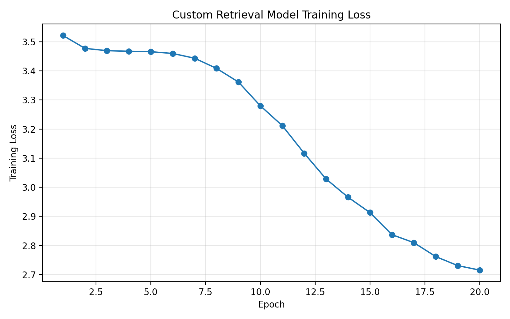
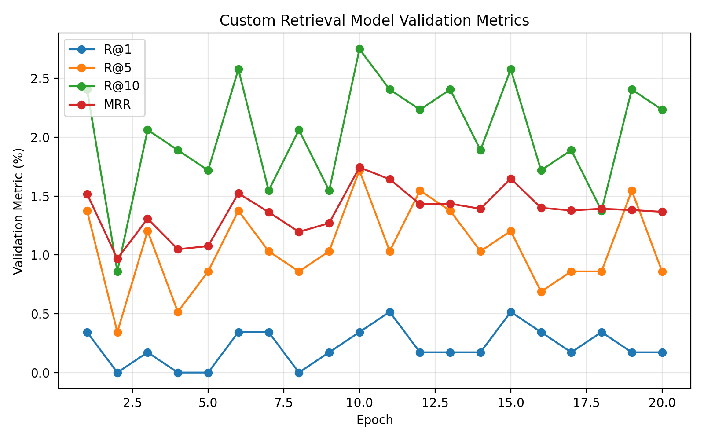
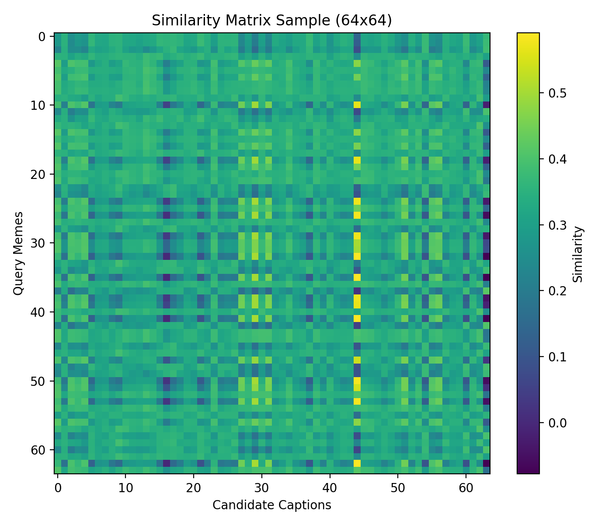
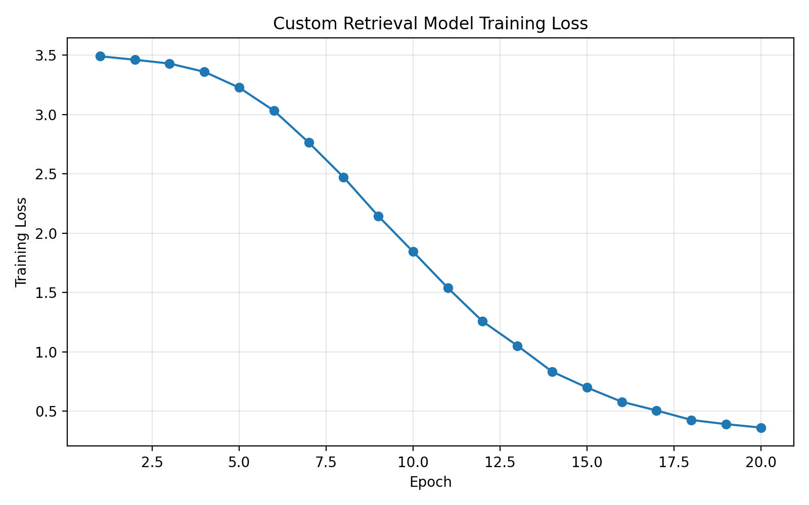
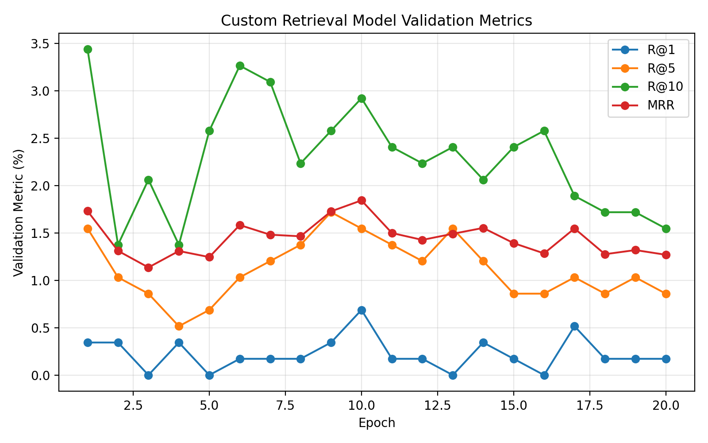
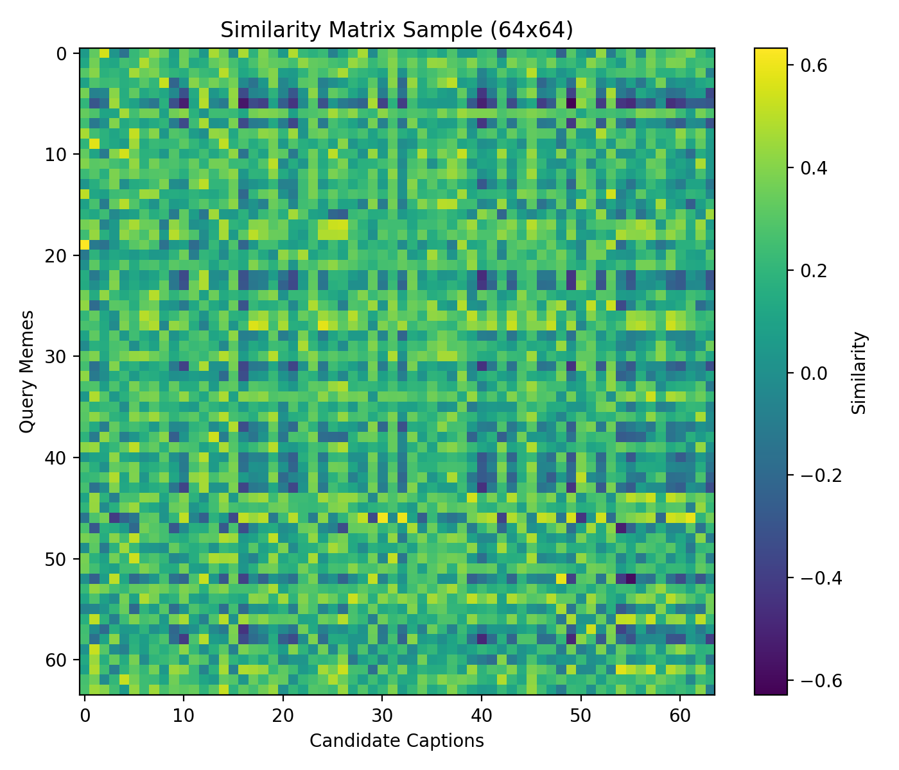
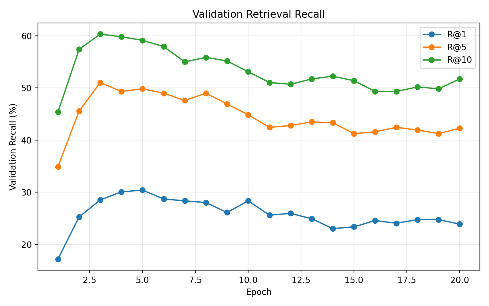
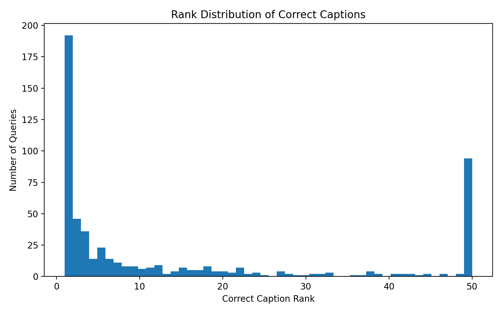
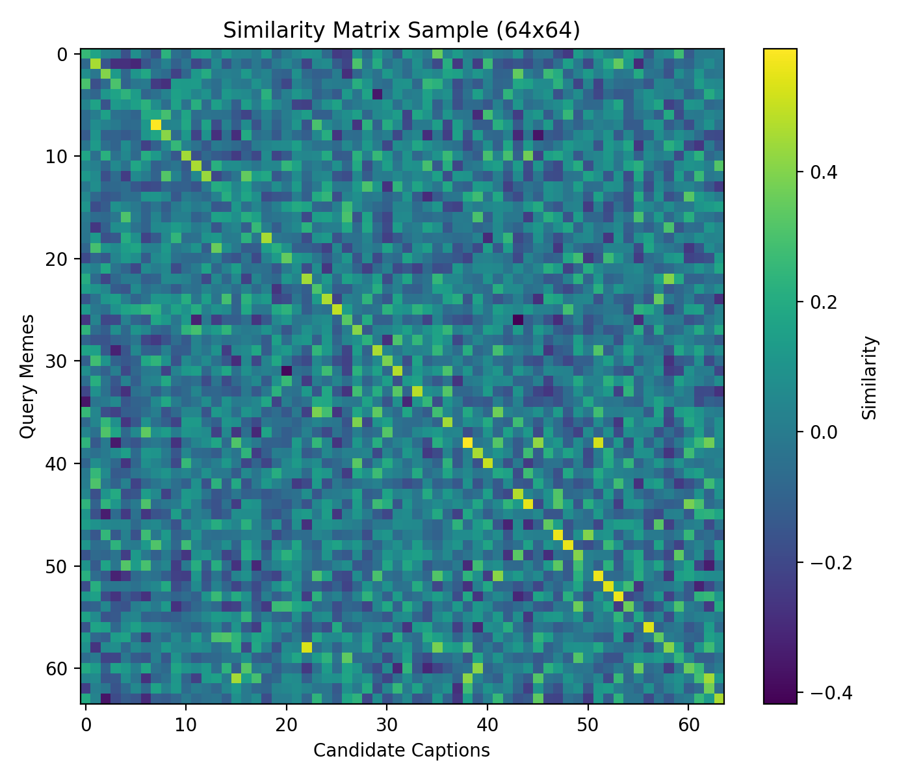

# CMPE 597 Spring 2026 Term Project 

## MemeCap: Cross-Modal Retrieval, Caption Classification, and Sentiment Analysis

## 1. Project Overview

This project uses the MemeCap dataset, which contains meme images alongside meme captions, image captions, titles, metaphor annotations, and metadata. The overall goal is to study how well vision-language models understand memes, especially their metaphorical meaning.

This repository currently focuses on Task 2.1: Cross-modal Retrieval, where the objective is to retrieve the correct meme caption from the full set of candidate captions in the test dataset given:

* **Type 1 Input:** The meme image only. 
* **Type 2 Input:** The meme image together with its title. 

## 2. Dataset

The dataset is sourced from the official MemeCap repository.

### Dataset Splits
* **Training Set:** 5,823 memes
* **Test Set:** 559 memes

### Files & Directories
* `data/memes-trainval.json`: Training and validation annotations.
* `data/memes-test.json`: Test annotations.
* `data/memes/`: Directory containing the image files.

### Key Sample Fields
* `img_fname`: Image filename.
* `title`: Reddit post title of the meme.
* `meme_captions`: Intended meme meaning.
* `img_captions`: Literal description of the image.
* `metaphors`: Visual metaphor annotations.
* `post_id`: Sample identifier.

---

## 3. Task 2.1: Cross-Modal Retrieval

In this task, the goal is to retrieve the correct meme caption from a candidate pool given a meme query. We formulate the task as a cross-modal retrieval problem, where query memes and candidate captions are embedded into a shared latent space and ranked using cosine similarity.

We evaluate two query types:

- **Type 1 — Image Only:** the query is represented only by the meme image.
- **Type 2 — Image + Title:** the query is represented by a fusion of the meme image embedding and the Reddit post title embedding.

For Type 2, we use the following fusion formulation:

\[
q = \text{normalize}(\alpha e_{\text{image}} + (1-\alpha)e_{\text{title}})
\]

where \(q\) is the final query embedding.

---

### (a) Evaluation Strategy and Metrics

For each query meme, the model ranks all candidate meme captions in the test set according to similarity in the shared embedding space:

\[
S(q, c) = q^\top c
\]

where both query and caption embeddings are L2-normalized.

The evaluation protocol is:

1. Build the query embedding.
2. Encode all candidate meme captions.
3. Compute query-caption similarity scores.
4. Rank all candidate captions in descending similarity.
5. Measure whether the correct caption appears near the top of the ranking.

We report the following retrieval metrics:

- **Recall@1 (R@1):** percentage of queries where the correct caption is ranked first.
- **Recall@5 (R@5):** percentage of queries where the correct caption appears in the top 5.
- **Recall@10 (R@10):** percentage of queries where the correct caption appears in the top 10.
- **Mean Reciprocal Rank (MRR):** average reciprocal rank of the correct caption.

---

### (b) Pretrained Architectures: Zero-Shot Retrieval

We first evaluate pretrained vision-language models without any task-specific training.

The main zero-shot models are:

1. **OpenCLIP ViT-L/14:** our main zero-shot baseline.
2. **SigLIP2:** an alternative pretrained vision-language model family.
3. **OpenCLIP + BLIP Reranker:** a two-stage retrieval pipeline where OpenCLIP retrieves candidates and BLIP reranks them.

For Type 2 zero-shot retrieval, the image and title embeddings are fused before ranking the candidate captions.

---

### (c) Custom Architecture Trained from Scratch

To satisfy the custom model requirement, we implemented a lightweight dual-encoder retrieval model trained from scratch.

The architecture consists of:

- **Image Encoder:** a custom residual CNN that maps meme images into a 256-dimensional latent space.
- **Caption Encoder:** a BiGRU text encoder that maps meme captions into the same 256-dimensional latent space.
- **Type 2 Title Fusion:** for Type 2, the Reddit title is encoded separately and fused with the image representation.
- **Training Objective:** symmetric contrastive loss over in-batch image-caption pairs.

The model is trained using AdamW and a cosine learning rate schedule. We split the training data into train and validation subsets and select the best checkpoint using validation retrieval performance.

#### Custom Model Results

| Model | Input Type | R@1 (%) | R@5 (%) | R@10 (%) | MRR (%) |
| :--- | :--- | ---: | ---: | ---: | ---: |
| Custom Architecture From Scratch | Type 1 | 0.18 | 1.25 | 2.68 | 1.46 |
| Custom Architecture From Scratch | Type 2 | 0.18 | 1.07 | 2.15 | 1.38 |

The from-scratch model performs far below pretrained CLIP-based models, which is expected because the MemeCap training set is small compared to the web-scale pretraining data used by CLIP. However, it still demonstrates an end-to-end attempt to learn a cross-modal image-caption embedding space from raw images and text tokens.

The following training curves and retrieval visualizations show the behavior of the custom model:

**Type 1: Image Only**







**Type 2: Image + Title**







The loss curves verify that the model is optimizing the contrastive objective, but the validation recall and similarity matrices show that the learned embedding space remains weak for full-gallery retrieval. This supports the main finding that large-scale pretrained vision-language representations are crucial for meme-caption retrieval.

---

### (d) OpenCLIP Finetuning with LoRA

To improve the pretrained OpenCLIP baseline, we fine-tune **OpenCLIP ViT-L/14** using **Low-Rank Adaptation (LoRA)**.

LoRA adapts the pretrained model by adding small trainable low-rank matrices to selected transformer layers, while keeping the main pretrained weights frozen.

Configuration:

- **Base model:** `ViT-L-14`
- **Pretraining:** `laion2b_s32b_b82k`
- **LoRA rank:** \(r = 16\)
- **LoRA alpha:** \(\alpha = 32\)
- **Target modules:** `c_fc`, `c_proj`, `out_proj`

The corrected LoRA training pipeline uses validation-based checkpoint selection. After each epoch, the adapter is evaluated on a held-out validation split using full-gallery retrieval. The best checkpoint is selected using:

\[
\text{selection score} = R@5 + 0.5 \times R@1
\]

Only the best adapter is saved under:

```text
outputs/retrieval/finetune/type1/best_lora/
outputs/retrieval/finetune/type2/best_lora/
```

Recent validation-selected LoRA checkpoints:

| LoRA Model | Best Epoch | Validation R@1 | Validation R@5 | Validation R@10 | Validation MRR |
| :--- | ---: | ---: | ---: | ---: | ---: |
| Type 1 | 2 | 61.86 | 78.35 | 82.65 | 69.31 |
| Type 2 | 1 | 66.32 | 79.73 | 83.33 | 72.41 |

These early best epochs show that OpenCLIP adapts very quickly to MemeCap. Longer finetuning can overfit, so validation-based checkpoint selection is important.

---

### (e) Additional Experiment: Frozen CLIP Projection Heads

As extra work beyond the project requirements, we trained small projection heads on top of frozen OpenCLIP embeddings.

Instead of training a model from raw pixels and text tokens, this experiment keeps OpenCLIP fixed and only learns lightweight task-specific projection heads:

```text
frozen CLIP query embedding   -> projection MLP
frozen CLIP caption embedding -> projection MLP
```

The model is trained with symmetric contrastive loss. We also use hard negatives mined from frozen OpenCLIP similarities. This tests whether a small MemeCap-specific alignment layer can improve retrieval without full finetuning.

This experiment is not meant to replace LoRA, but it provides a useful middle ground between:

- **From-scratch training**, which satisfies the custom architecture requirement but performs poorly because the dataset is small.
- **Zero-shot CLIP**, which is already strong but not specifically adapted to MemeCap.
- **LoRA finetuning**, which gives the best adaptation but modifies the pretrained model through trainable adapters.

Projection-head results:

| Model | Input Type | R@1 (%) | R@5 (%) | R@10 (%) | MRR (%) |
| :--- | :--- | ---: | ---: | ---: | ---: |
| CLIP Projection Head | Type 1 | 34.35 | 55.64 | 64.04 | 44.33 |
| CLIP Projection Head | Type 2 | 29.34 | 52.24 | 62.61 | 40.41 |

The projection-head model significantly improves over the from-scratch custom model, but remains below zero-shot OpenCLIP and LoRA. This is expected because the underlying CLIP encoders remain frozen, and only the small projection heads are trained.

The validation curves show that the projection heads learn quickly and then begin to overfit, so validation-based checkpoint selection is necessary.

Example visualizations:







In the rank histogram, the final bin represents all cases where the correct caption is ranked 50 or worse.
---

## 4. Task 2.2: Literal vs. Metaphorical Caption Classification

The goal of this task is to design a classifier that distinguishes between image-caption pairs where the caption literally describes the image and those where it provides a metaphorical interpretation.

### (a) Evaluation Framework & Zero-Shot Baseline

We've established the classification framework and established a zero-shot similarity-based baseline.

#### 1. Formulating the Task
We formulated this task as a **binary classification problem**. Positive samples (Label 1) are pairs of (Meme Image, Meme Caption), and negative samples (Label 0) are pairs of (Meme Image, Literal Image Caption).

**Selected Metrics:**
*   **Accuracy:** Overall percentage of correctly classified pairs.
*   **F1-Score:** The harmonic mean of precision and recall. This is our primary metric as it balances the model's ability to find all metaphorical captions (recall) without misclassifying literal ones (precision).
*   **Precision & Recall:** Individual components to monitor for class-specific biases.
*   **ROC-AUC:** Measures the model's ability to rank metaphorical captions higher than literal ones across all possible classification thresholds.

#### 2. Selected Baseline Strategy
As an initial baseline, we utilize the **OpenCLIP (ViT-L/14)** dual-encoder. Since CLIP is trained to align images with literal descriptions, we hypothesize that **Literal Image Captions** will exhibit higher visual similarity to the image. 

**Classification Heuristic:**
We compute $P(\text{metaphorical}) = 1 - \cos(e_i, e_c)$. By evaluating this score on the test set, we determine the **optimal similarity threshold** that maximizes the F1-Score.

#### 3. Result Analysis & Rationale for Task 2.2(b)
The initial zero-shot evaluation yields a decent **F1-Score (0.800)** but a low **ROC-AUC (0.241)**. This highlights a critical **Keyword Bias**: metaphorical captions often contain specific entities (e.g., "Spiderman") that match the visual content perfectly, making a simple similarity threshold insufficient. This confirms the need for dedicated fusion architectures in **Task 2.2(b)**.

### (b) MLP Fusion Model

To overcome the limitations of zero-shot alignment, we implemented a **Late Fusion MLP** architecture:
*   **Architecture**: A multi-layer perceptron (MLP) head that takes concatenated CLIP visual and textual embeddings as input.
*   **Training**: We used frozen **OpenCLIP (ViT-L/14)** backends to pre-extract features, enabling rapid experimentation. The MLP was trained for 10 epochs using Binary Cross-Entropy (BCE) loss.
*   **Results**: The fusion model significantly improved every metric, achieving near-perfect classification (ROC-AUC: 0.9997). This demonstrates that while CLIP's joint space is biased by literal similarity, the individual embeddings contain sufficient semantic information for a dedicated head to distinguish metaphorical intent.

### (c) Ablation Study

To optimize our Late Fusion MLP and test its stability, we conducted an ablation study modifying various architectural components. We experimented with replacing the standard `ReLU` activation with `GELU`, swapping `BatchNorm` for `LayerNorm` (which is typically more suitable for Transformer embeddings), utilizing `Focal Loss` instead of standard BCE to handle easy examples, and employing an advanced fusion strategy (element-wise multiplication alongside concatenation).

**Ablation Results Summary:**
Based on the experiments, utilizing **LayerNorm** with our initial simple concatenation fusion strategy yielded the highest performance across the board. The model achieved a peak F1-Score of **0.993** and an Accuracy of **0.989**. Consequently, this configuration was adopted as our final model for this task.

---

## 5. Task 2.3: Meme Sentiment Classification

In this task, we classify each meme into one of seven emotion classes: **Anger, Disgust, Fear, Joy, Neutral, Sadness, and Surprise**. Since MemeCap does not provide sentiment labels, we first generated silver labels and then trained unimodal and multimodal classifiers on those labels.

### (a) Emotion Label Generation

We tested several label-generation strategies. Text-only emotion models were not reliable enough because meme sentiment often depends on irony and visual context. We also tried different VLM prompts, but some early versions overpredicted specific classes such as **Fear** or **Anger**. We finally used **Qwen-VL-Chat** with a simpler 7-class prompt.

We generated two final label sets:

- **Caption-only labels:** Qwen receives only the meme caption.
- **Image+caption labels:** Qwen receives both the meme image and the meme caption.

For the image+caption setting, the prompt treats the caption as the primary evidence and uses the image only as supporting context. This helped reduce literal interpretation of visual templates.

Final image+caption label distribution:

| Split | Anger | Disgust | Fear | Joy | Neutral | Sadness | Surprise | Invalid |
|---|---:|---:|---:|---:|---:|---:|---:|---:|
| Train | 17.57% | 1.55% | 13.45% | 28.03% | 22.19% | 4.05% | 13.14% | 0.03% |
| Test | 18.07% | 1.97% | 14.85% | 29.16% | 18.07% | 3.22% | 14.49% | 0.18% |

We also tested a 3-class setup (**Positive, Negative, Neutral**), but manual inspection showed that it was too coarse for our final task. Therefore, we continued with the 7-class labels.

Label folders:

```text
outputs/sentiment_classification/labels/Qwen_VL_Chat_image_caption_simple_prompt/
outputs/sentiment_classification/labels/Qwen_VL_Chat_caption_only_simple_prompt/
```
### (b) Unimodal Baselines

We used frozen **CLIP ViT-L/14** to investigate whether image-only and text-only embeddings carry sentiment information.

For each meme, we extracted:

- **768-dimensional image embeddings** from the CLIP vision encoder
- **768-dimensional text embeddings** from the CLIP text encoder

Both embeddings were L2-normalized before classification. We then trained separate MLP classifiers for image-only and text-only inputs.

The corrected training script uses:

- configurable label keys
- validation split from the training set
- validation-based model selection
- class-weighted cross entropy for label imbalance
- final test evaluation after model selection
- accuracy, macro F1, weighted F1, classification report, and confusion matrix

Implementation:

```text
src/tasks/sentiment_classification/train_unimodal.py
```

#### 7-Class Image+Caption Labels

| Model | Accuracy | Macro F1 | Weighted F1 |
|---|---:|---:|---:|
| Image-only MLP | 0.3405 | 0.2835 | 0.3414 |
| Text-only MLP | 0.4677 | 0.4238 | 0.4646 |

#### 7-Class Caption-Only Labels

| Model | Accuracy | Macro F1 | Weighted F1 |
|---|---:|---:|---:|
| Image-only MLP | 0.3041 | 0.2616 | 0.3001 |
| Text-only MLP | 0.4812 | 0.4350 | 0.4754 |

The text-only baseline is clearly stronger than the image-only baseline. This is expected because the meme caption directly describes the intended meaning, while meme images are often reusable templates whose emotion depends on the text.

### (c) Multimodal Custom Architecture

For the multimodal classifier, we used frozen **CLIP ViT-L/14** image and text embeddings and combined them with a late-fusion MLP.

Each meme is represented as:

```text
image embedding: 768 dim
text embedding : 768 dim
fused input    : 1536 dim
```

The model concatenates the image and text embeddings, then passes the fused vector through an MLP classifier:

```text
Linear(1536 -> 256)
LayerNorm
GELU
Dropout
Linear(256 -> 128)
LayerNorm
GELU
Dropout
Linear(128 -> 7)
```

The training setup uses validation-based model selection, class-weighted cross entropy, label smoothing, dropout, and AdamW.

Implementation:
```text
src/tasks/sentiment_classification/train_multimodal.py
```

#### 7-Class Image+Caption Labels

| Model | Accuracy | Macro F1 | Weighted F1 |
|---|---:|---:|---:|
| Late Fusion MLP | 0.4857 | 0.4262 | 0.4938 |

#### 7-Class Caption-Only Labels

| Model | Accuracy | Macro F1 | Weighted F1 |
|---|---:|---:|---:|
| Late Fusion MLP | 0.5045 | 0.4652 | 0.5018 |

The multimodal model improves over both unimodal baselines in both label settings. This suggests that although text embeddings carry the strongest sentiment signal, image embeddings still provide complementary information when fused with text.

## 6. Performance Results

### Task 2.1: Cross-Modal Retrieval Results

| Model Source | Input Type | R@1 (%) | R@5 (%) | R@10 (%) | MRR (%) |
| :--- | :--- | ---: | ---: | ---: | ---: |
| **OpenCLIP (ViT-L/14) Zero-Shot** | Type 1 | 60.29 | 74.78 | - | 67.51 |
| **OpenCLIP (ViT-L/14) Zero-Shot** | Type 2 | 56.71 | 71.38 | - | 63.81 |
| **OpenCLIP + BLIP Reranker** | Type 2 | 68.16 | 78.89 | - | 73.16 |
| **SigLIP2 Zero-Shot** | Type 1 | 54.74 | 70.84 | - | 62.54 |
| **SigLIP2 Zero-Shot** | Type 2 | 23.43 | 38.28 | - | 31.50 |
| **Custom Architecture From Scratch** | Type 1 | 0.18 | 1.25 | 2.68 | 1.46 |
| **Custom Architecture From Scratch** | Type 2 | 0.18 | 1.07 | 2.15 | 1.38 |
| **CLIP Projection Head** | Type 1 | 34.35 | 55.64 | 64.04 | 44.33 |
| **CLIP Projection Head** | Type 2 | 29.34 | 52.24 | 62.61 | 40.41 |
| **OpenCLIP Fine-Tuned LoRA** | Type 1 | 61.85 | 78.35 | 82.64 | 69.30 |
| **OpenCLIP Fine-Tuned LoRA** | Type 2 | **66.32** | **79.72** | **83.33** | **72.40** |

The results show a large gap between models trained from scratch and pretrained vision-language models. The custom CNN+GRU dual encoder performs close to random retrieval, which is expected because the MemeCap training set is small and meme-caption alignment is difficult to learn without large-scale pretraining. In contrast, OpenCLIP already provides strong zero-shot retrieval, and LoRA finetuning further improves the pretrained representation.

The CLIP projection-head experiment provides a useful middle ground. It keeps OpenCLIP frozen and trains only small projection heads, improving substantially over the fully custom model while remaining below full LoRA finetuning.

### Task 2.2: Literal vs. Metaphorical Caption Classification

| Strategy / Architecture Variation | Accuracy | Precision | Recall | F1-Score | ROC-AUC |
| :--- | :--- | :--- | :--- | :--- | :--- |
| **Zero-Shot ($1-\text{Sim}$)** | 0.667 | - | - | 0.800 | 0.241 |
| **MLP Base (BatchNorm + ReLU)** | 0.987 | 0.998 | 0.984 | 0.991 | **0.999** |
| **Ablation: GELU Activation** | 0.971 | 0.998 | 0.962 | 0.980 | 0.999 |
| **Ablation: Focal Loss** | 0.983 | 0.998 | 0.978 | 0.988 | 0.999 |
| **Ablation: Advanced Fusion** | 0.983 | **0.999** | 0.978 | 0.989 | 0.999 |
| **Ablation: Adv. Fusion + LayerNorm** | 0.983 | **0.999** | 0.978 | 0.989 | 0.999 |
| **Final Selected Model (LayerNorm)** | **0.989** | 0.994 | **0.991** | **0.993** | **0.999** |

### Task 2.3: Meme Sentiment Classification (7-Class)

This task classifies each meme into one of seven emotion categories: **Anger, Disgust, Fear, Joy, Neutral, Sadness, and Surprise**. Since MemeCap does not provide sentiment labels, we first generated silver labels using Qwen-VL-Chat and then trained unimodal and multimodal classifiers on these labels.

---

#### (a) Multiclass Emotion Annotation and Class Imbalance

We tested several annotation strategies before selecting the final label set. Text-only sentiment models often produced biased labels because they could not use the visual context of memes. Some early VLM prompts also caused label collapse, such as overpredicting **Fear** or **Anger**. We therefore used a simpler final Qwen-VL-Chat prompt that focuses on the meme poster's intended emotion.

We generated two final 7-class label sets:

- **Caption-only labels:** Qwen receives only the MemeCap meme caption.
- **Image+caption labels:** Qwen receives both the meme image and the meme caption.

For the image+caption setting, the prompt treats the meme caption as the primary evidence and uses the image only as supporting context. This reduces literal interpretation of visual meme templates.

Final **image+caption** label distribution:

| Split | Anger | Disgust | Fear | Joy | Neutral | Sadness | Surprise | Invalid |
| :--- | ---: | ---: | ---: | ---: | ---: | ---: | ---: | ---: |
| Train | 17.57% | 1.55% | 13.45% | 28.03% | 22.19% | 4.05% | 13.14% | 0.03% |
| Test | 18.07% | 1.97% | 14.85% | 29.16% | 18.07% | 3.22% | 14.49% | 0.18% |

The train and test distributions are reasonably consistent, suggesting that the final prompt behaves stably across splits. The labels are still imbalanced, but this is expected because meme emotions are not uniformly distributed. We therefore use **macro F1** as the main evaluation metric and class-weighted cross entropy during classifier training.

We also tested a 3-class polarity setup (**Positive, Negative, Neutral**), but manual inspection showed that it was too coarse and often failed to preserve the intended fine-grained emotion. Therefore, the final experiments use the 7-class Qwen labels.

---

#### (b) Unimodal Baselines

For Task 2.3.b, we used frozen **CLIP ViT-L/14** encoders to extract:

- 768-dimensional image embeddings
- 768-dimensional text embeddings

Both embeddings were L2-normalized before classification. We trained separate MLP classifiers for image-only and text-only inputs. The corrected training pipeline uses a validation split, validation-based model selection, class-weighted cross entropy, and final test evaluation after model selection.

##### 7-Class Image+Caption Labels

| Model | Accuracy | Macro F1 | Weighted F1 |
| :--- | ---: | ---: | ---: |
| Image-only MLP | 0.3405 | 0.2835 | 0.3414 |
| Text-only MLP | 0.4677 | 0.4238 | 0.4646 |

##### 7-Class Caption-Only Labels

| Model | Accuracy | Macro F1 | Weighted F1 |
| :--- | ---: | ---: | ---: |
| Image-only MLP | 0.3041 | 0.2616 | 0.3001 |
| Text-only MLP | 0.4812 | 0.4350 | 0.4754 |

The text-only baseline clearly outperforms the image-only baseline in both label settings. This shows that the meme caption carries the main sentiment signal. The image-only model still performs above random chance, but meme images are often reusable templates whose emotional meaning depends heavily on the accompanying caption.

---

#### (c) Multimodal Custom Architecture

For Task 2.3.c, we trained a multimodal late-fusion MLP using both CLIP image and text embeddings. The 768-dimensional image embedding and 768-dimensional text embedding are concatenated into a 1536-dimensional joint representation.

The late-fusion classifier uses a regularized MLP with LayerNorm, GELU activations, dropout, class-weighted cross entropy, label smoothing, and AdamW optimization.

##### 7-Class Image+Caption Labels

| Model | Accuracy | Macro F1 | Weighted F1 |
| :--- | ---: | ---: | ---: |
| Late Fusion MLP | 0.4857 | 0.4262 | 0.4938 |

##### 7-Class Caption-Only Labels

| Model | Accuracy | Macro F1 | Weighted F1 |
| :--- | ---: | ---: | ---: |
| Late Fusion MLP | 0.5045 | 0.4652 | 0.5018 |

---

#### Overall Comparison

##### Image+Caption Label Setting

| Model | Accuracy | Macro F1 | Weighted F1 |
| :--- | ---: | ---: | ---: |
| Image-only MLP | 0.3405 | 0.2835 | 0.3414 |
| Text-only MLP | 0.4677 | 0.4238 | 0.4646 |
| Multimodal Late Fusion MLP | **0.4857** | **0.4262** | **0.4938** |

##### Caption-Only Label Setting

| Model | Accuracy | Macro F1 | Weighted F1 |
| :--- | ---: | ---: | ---: |
| Image-only MLP | 0.3041 | 0.2616 | 0.3001 |
| Text-only MLP | 0.4812 | 0.4350 | 0.4754 |
| Multimodal Late Fusion MLP | **0.5045** | **0.4652** | **0.5018** |

The results show **text dominance with useful visual complementarity**. Text embeddings are much stronger than image embeddings because the meme caption directly describes the intended meaning. However, adding image embeddings improves over the text-only baseline in both settings, especially for caption-only labels, where macro F1 improves from **0.4350** to **0.4652**. This suggests that visual context still contributes useful information when combined with the caption, even though the caption remains the main sentiment anchor.

---

## 7. Project Roadmap

- [x] **Task 2.1.a & 2.1.b:** Evaluation Framework & Zero-Shot Baselines
- [x] **Task 2.1.c:** Custom Architecture Implementation
- [x] **Task 2.1.d:** Finetuning Experiments (LoRA)
- [x] **Task 2.2:** Literal vs. Metaphorical Caption Classification
    - [x] **2.2.a:** Evaluation Framework & Metrics
    - [x] **2.2.b:** Fusion Architectures Implementation
    - [x] **2.2.c:** Performance Comparison & Ablation
- [x] **Task 2.3: Meme Sentiment Classification**
    - [x] **2.3.a:** Label Generation (Qwen-VL Few-Shot)
    - [x] **2.3.b:** Unimodal Baselines (Image vs. Text)
    - [x] **2.3.c:** Custom Multimodal Architecture (Late Fusion)
