# Qwen-VL 3-Class Manual Quality Check - caption_only

Use this file to inspect silver-label noise.

Labels: Positive, Negative, Neutral

Suggested manual fields:
- Correct? yes/no/ambiguous
- Human label
- Notes

---

## 1. Predicted label: **Positive**

- **Title:** Sweettarts>>>>>
- **Meme caption:** Meme poster is trying to convey that Sweettarts are a cooler version of smarties.
- **Raw model response:** `Positive.`
- **Manual judgment:** 
- **Human label if different:** 
- **Notes:** 

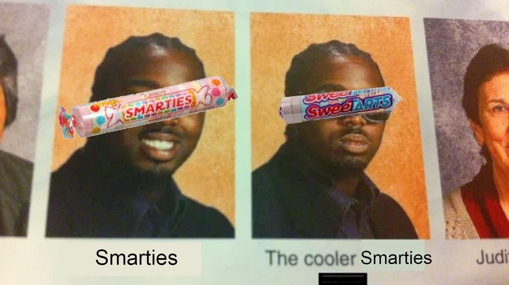

---

## 2. Predicted label: **Positive**

- **Title:** Harry Potter in a nutshell
- **Meme caption:** The meme poster is expressing amusement at how much Harry Potter screws things up in all of the movies and still ends up with praise from Dumbeldore.
- **Raw model response:** `Positive.`
- **Manual judgment:** 
- **Human label if different:** 
- **Notes:** 

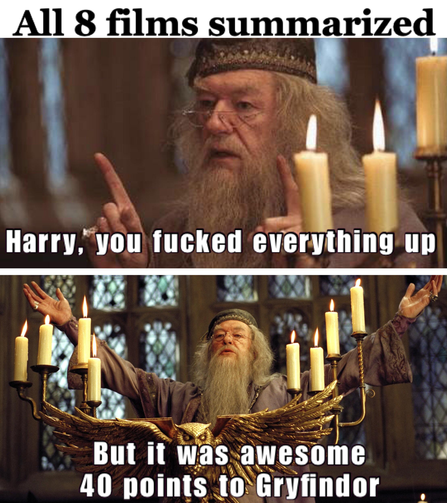

---

## 3. Predicted label: **Positive**

- **Title:** Friend zoned
- **Meme caption:** The meme poster is trying to express the feelings of a frog that, a frog is accepting the rejection of its proposal but got a chance to be a friend with its crush.
- **Raw model response:** `Positive.`
- **Manual judgment:** 
- **Human label if different:** 
- **Notes:** 

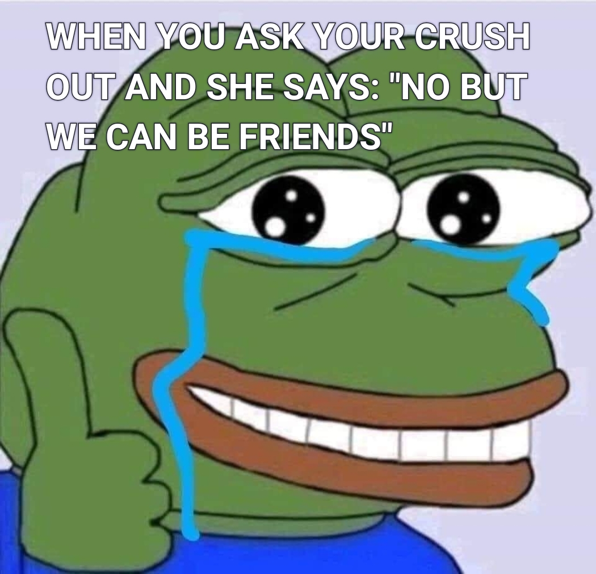

---

## 4. Predicted label: **Positive**

- **Title:** Im going to be the main roll in the next 40 year old virgin
- **Meme caption:** Meme poster is conveying that they are proud to be virgin even after being an adult.
- **Raw model response:** `Positive.`
- **Manual judgment:** 
- **Human label if different:** 
- **Notes:** 

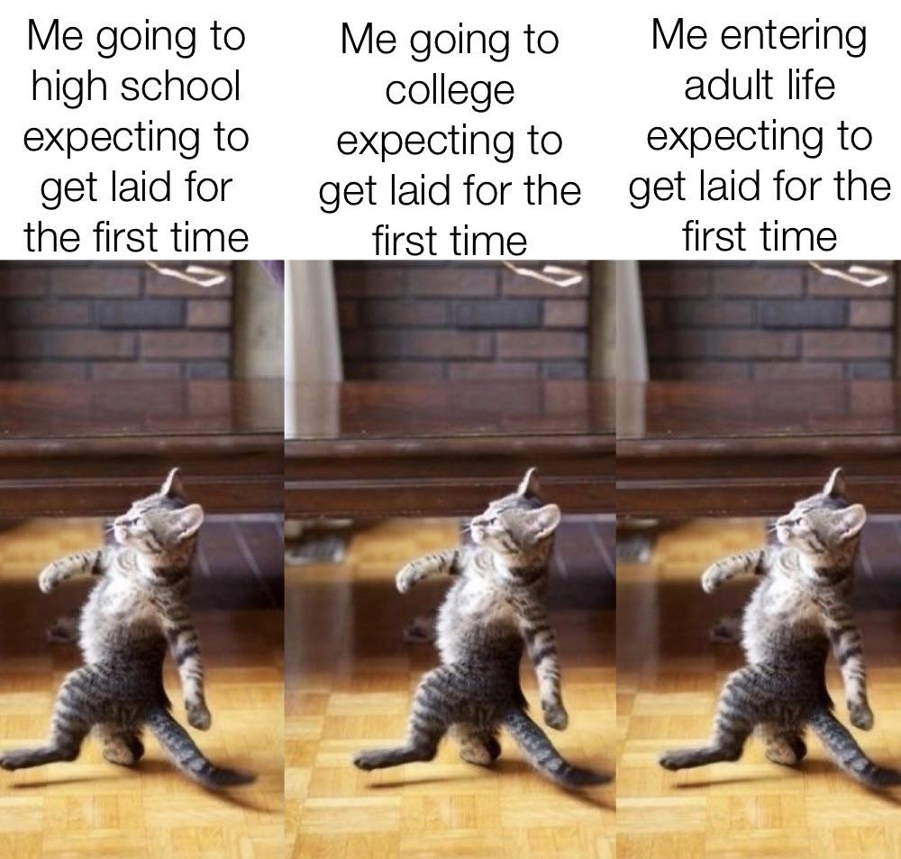

---

## 5. Predicted label: **Positive**

- **Title:** Thank you, Batman.
- **Meme caption:** Meme poster is trying to convey that dead celebrities are welcoming a new dead person to heaven thanks to Batman.
- **Raw model response:** `Positive.`
- **Manual judgment:** 
- **Human label if different:** 
- **Notes:** 

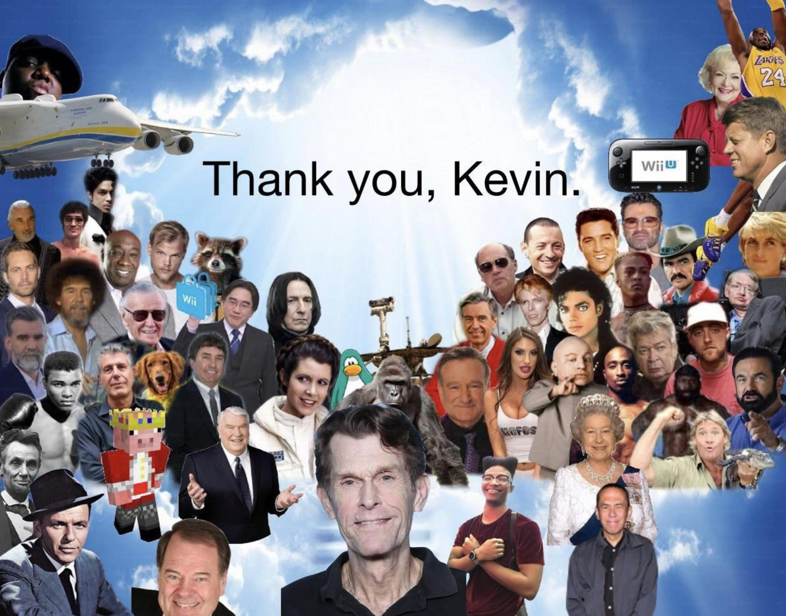

---

## 6. Predicted label: **Positive**

- **Title:** One Frame
- **Meme caption:** Meme poster is trying to convey that people who speedrun that fast aren't human
- **Raw model response:** `Positive.`
- **Manual judgment:** 
- **Human label if different:** 
- **Notes:** 

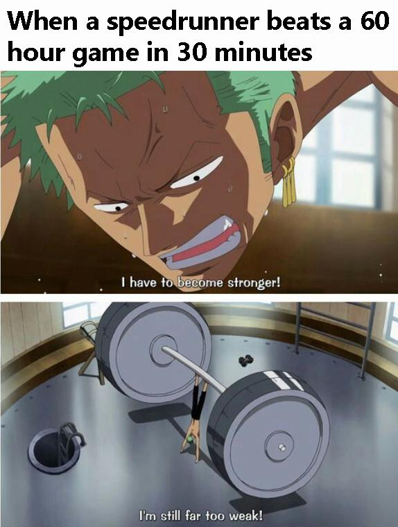

---

## 7. Predicted label: **Positive**

- **Title:** And Nobody Can Say Otherwise.
- **Meme caption:** Meme poster is trying to convey that Famous amos tastes differently, perhaps even better cold.
- **Raw model response:** `Positive.`
- **Manual judgment:** 
- **Human label if different:** 
- **Notes:** 

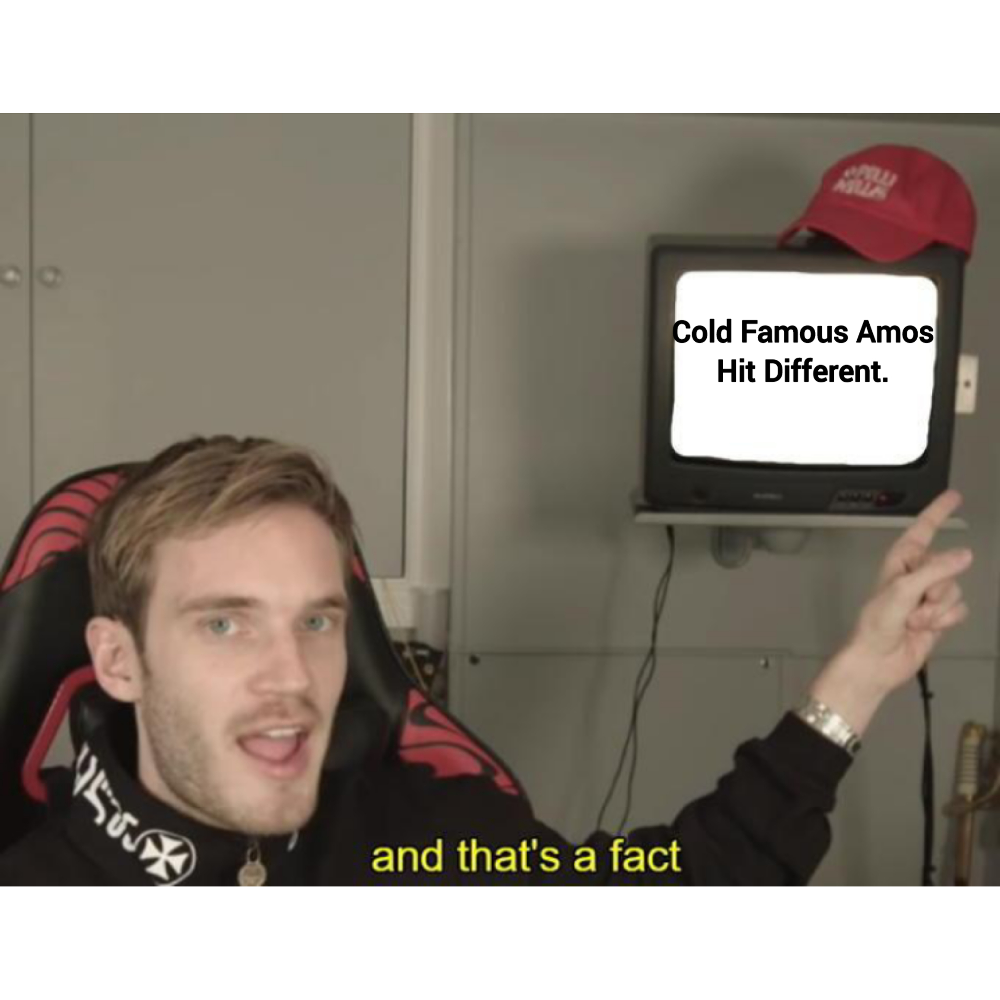

---

## 8. Predicted label: **Positive**

- **Title:** One of the happiest moments in life
- **Meme caption:** The protester is happy to see the fbi agent after the riot.
- **Raw model response:** `Positive.`
- **Manual judgment:** 
- **Human label if different:** 
- **Notes:** 

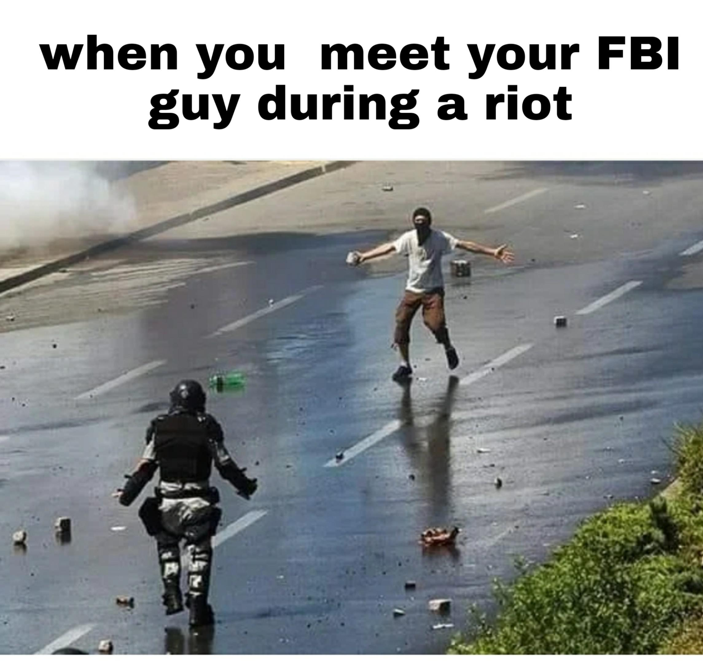

---

## 9. Predicted label: **Positive**

- **Title:** Dang, that's crazy.
- **Meme caption:** Meme poster is conveying that they won't be quiet even when they are on their 11th dang.
- **Raw model response:** `Positive.`
- **Manual judgment:** 
- **Human label if different:** 
- **Notes:** 

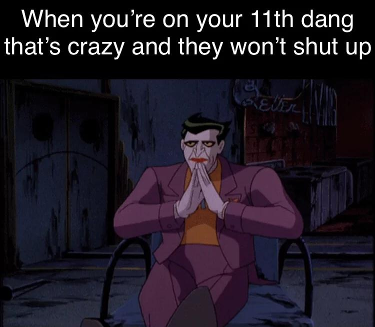

---

## 10. Predicted label: **Positive**

- **Title:** Gets better
- **Meme caption:** Meme poster looks better the longer they go without a haircut.
- **Raw model response:** `Positive.`
- **Manual judgment:** 
- **Human label if different:** 
- **Notes:** 

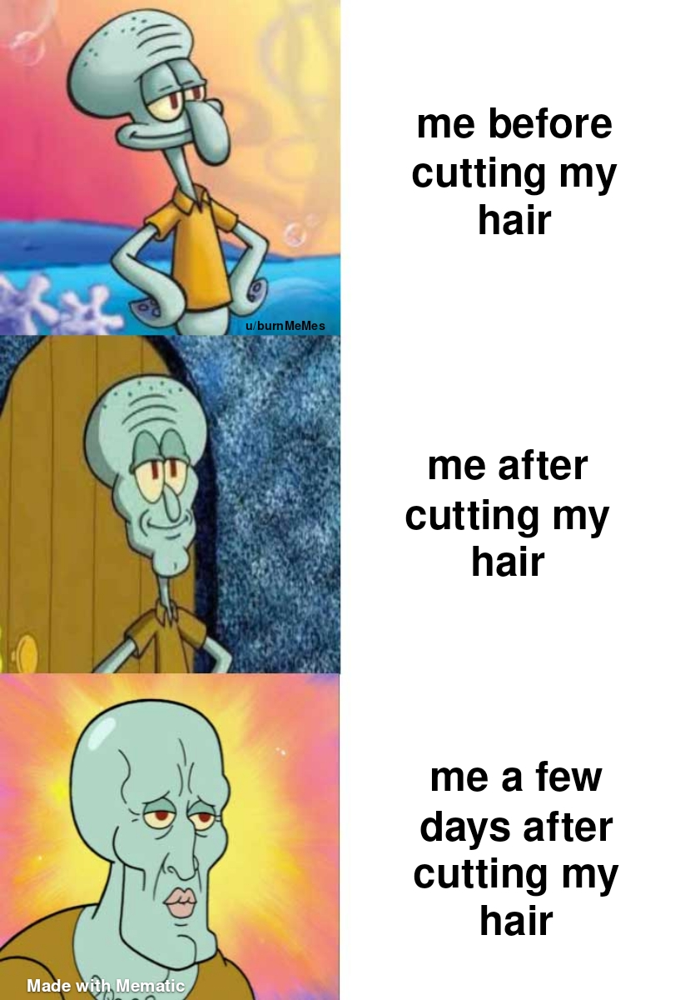

---

## 11. Predicted label: **Negative**

- **Title:** Pinochet moment
- **Meme caption:** Poster believes September 11 has a bad history of negative events.
- **Raw model response:** `Negative.`
- **Manual judgment:** 
- **Human label if different:** 
- **Notes:** 

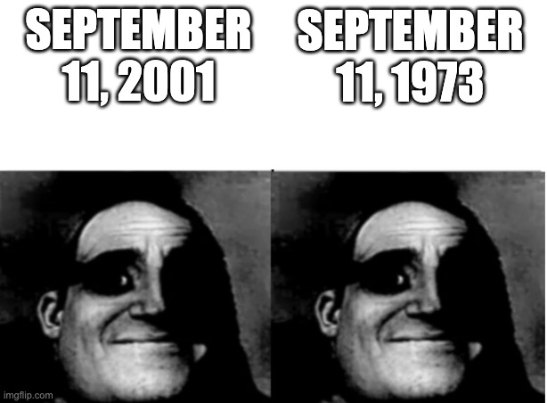

---

## 12. Predicted label: **Negative**

- **Title:** I couldnt hold back the tears
- **Meme caption:** Meme poster is trying to convey sadness over how cats run away when they're about to die.
- **Raw model response:** `Negative.`
- **Manual judgment:** 
- **Human label if different:** 
- **Notes:** 

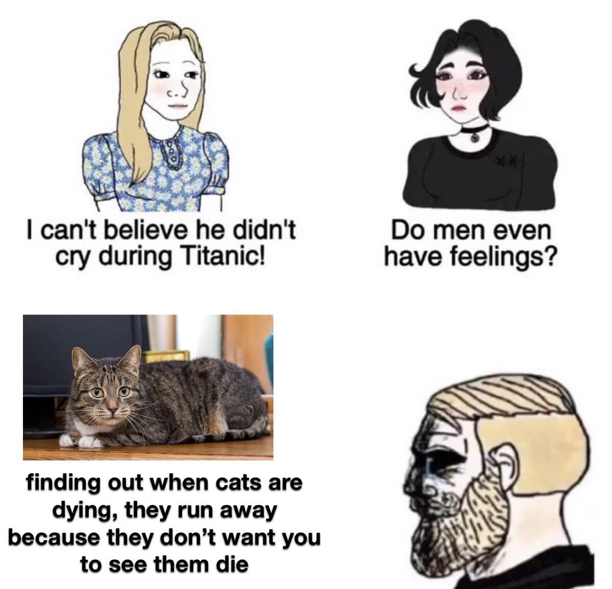

---

## 13. Predicted label: **Negative**

- **Title:** Size don't matter
- **Meme caption:** Meme poster gets angry to talk about boobs with man.
- **Raw model response:** `Negative.`
- **Manual judgment:** 
- **Human label if different:** 
- **Notes:** 

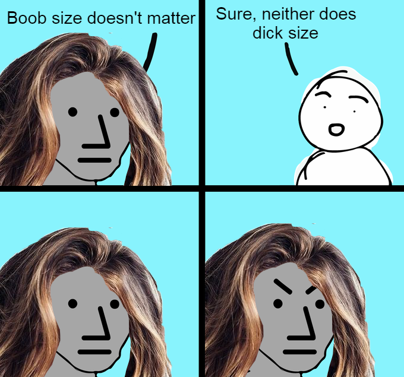

---

## 14. Predicted label: **Negative**

- **Title:** Whats your favorite type of cheese ?
- **Meme caption:** Meme poster is trying to convey that their weekend is going to be trash.
- **Raw model response:** `Negative.`
- **Manual judgment:** 
- **Human label if different:** 
- **Notes:** 

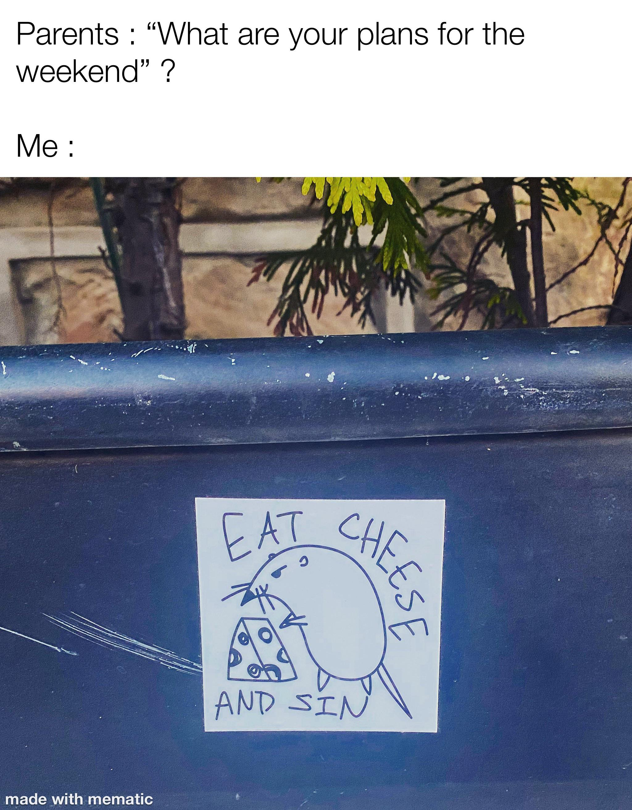

---

## 15. Predicted label: **Negative**

- **Title:** When you can't save everyone...
- **Meme caption:** The meme poster mocks Jeff Bezos for his poor decision and unkind behavior.
- **Raw model response:** `Negative.`
- **Manual judgment:** 
- **Human label if different:** 
- **Notes:** 

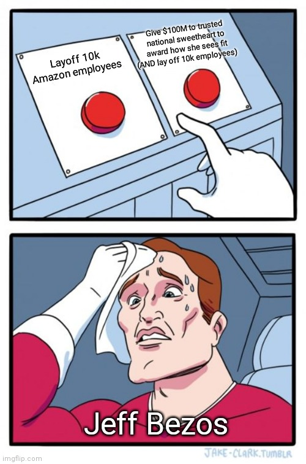

---

## 16. Predicted label: **Negative**

- **Title:** Populations too big? I can solve that.
- **Meme caption:** Meme poster believes that Russia's current military aggression has led to huge losses of life and might lead to even more in the future.
- **Raw model response:** `Negative.`
- **Manual judgment:** 
- **Human label if different:** 
- **Notes:** 

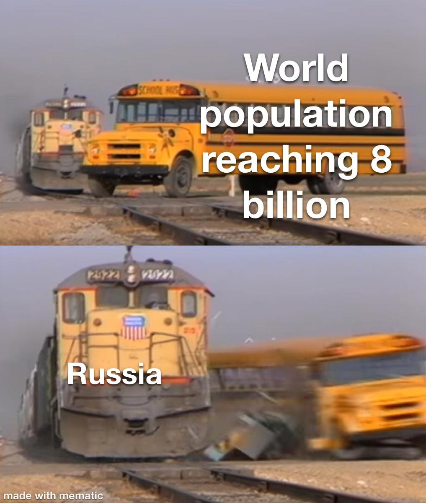

---

## 17. Predicted label: **Negative**

- **Title:** Gordy please, dont do this
- **Meme caption:** The meme poster feels that the year 2020 has crushed his life.
- **Raw model response:** `Negative.`
- **Manual judgment:** 
- **Human label if different:** 
- **Notes:** 

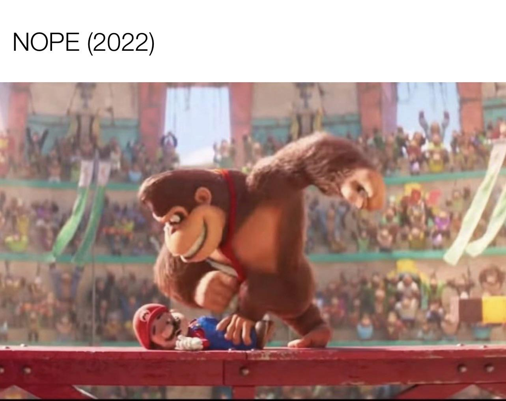

---

## 18. Predicted label: **Negative**

- **Title:** Betrayal at its finest
- **Meme caption:** Meme poster is angry at the rice for killing his laptop when it is supposed to help fix them.
- **Raw model response:** `Negative.`
- **Manual judgment:** 
- **Human label if different:** 
- **Notes:** 

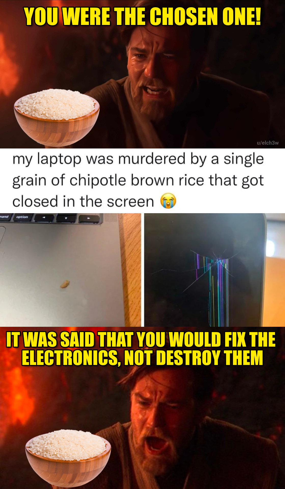

---

## 19. Predicted label: **Negative**

- **Title:** Guess the country
- **Meme caption:** The meme poster dislikes the world cup is being conducted in Qatar despite the fact that this was his country's first world cup.
- **Raw model response:** `Negative.`
- **Manual judgment:** 
- **Human label if different:** 
- **Notes:** 

---

## 20. Predicted label: **Negative**

- **Title:** a shame
- **Meme caption:** Meme poster is trying to convey that they think Elon Musk is ruining Twitter.
- **Raw model response:** `Negative.`
- **Manual judgment:** 
- **Human label if different:** 
- **Notes:** 

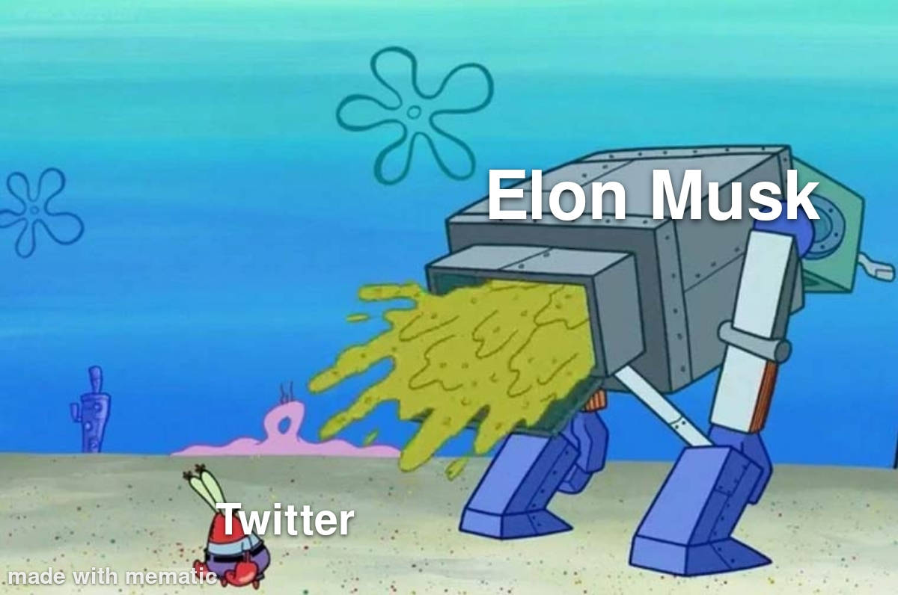

---

## 21. Predicted label: **Neutral**

- **Title:** Can someone tell me what the point of it was?
- **Meme caption:** Meme poster agrees that, he don't know what was the point of Nyan cat!
- **Raw model response:** `Neutral.`
- **Manual judgment:** 
- **Human label if different:** 
- **Notes:** 

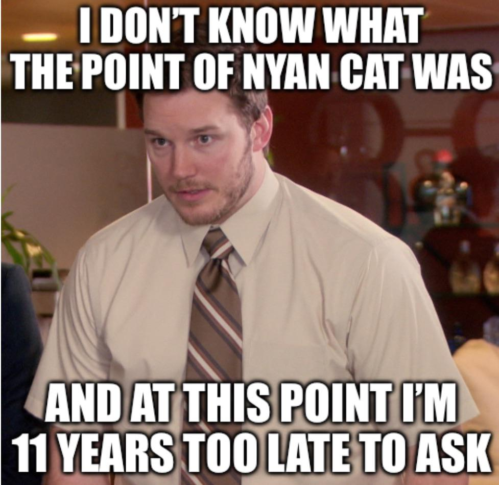

---

## 22. Predicted label: **Neutral**

- **Title:** Hyde from new netflix series Wednesday looks like he's from Plants vs Zombies
- **Meme caption:** Meme poster can't tell the difference between two types of zombies.
- **Raw model response:** `Neutral.`
- **Manual judgment:** 
- **Human label if different:** 
- **Notes:** 

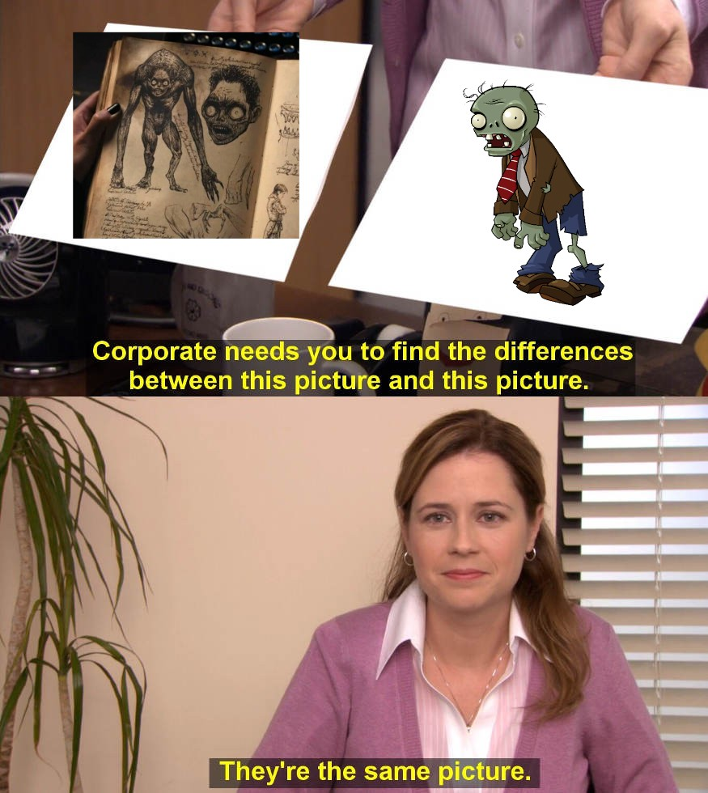

---

## 23. Predicted label: **Neutral**

- **Title:** god damnit stop leaning in to talk...I can smell everything you ever ate
- **Meme caption:** Meme poster is trying to convey that their teacher's coffee breath grosses them out.
- **Raw model response:** `Neutral.`
- **Manual judgment:** 
- **Human label if different:** 
- **Notes:** 

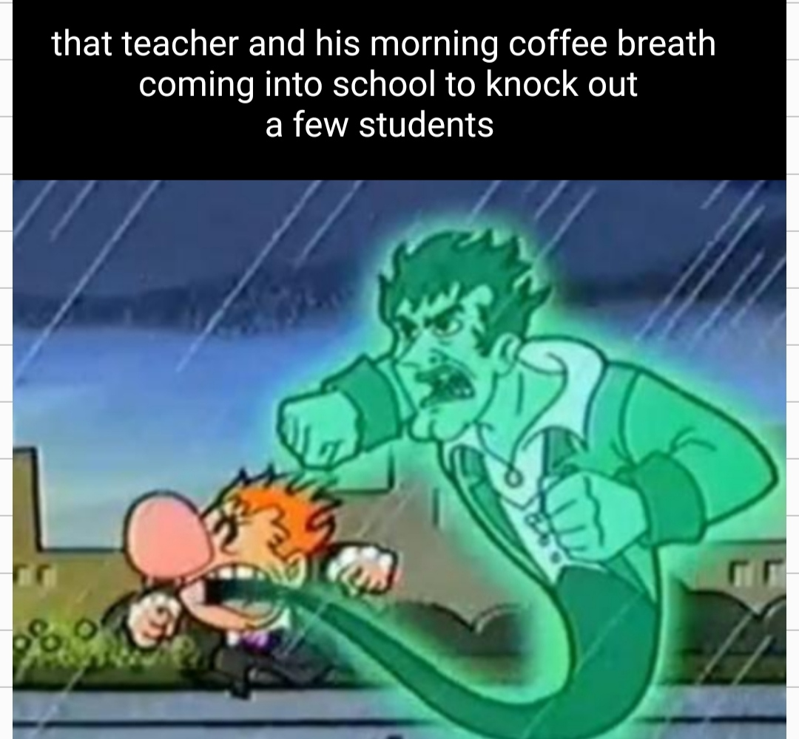

---

## 24. Predicted label: **Neutral**

- **Title:** inescapable
- **Meme caption:** Meme poster believes all christmas music is overplayed.
- **Raw model response:** `Neutral.`
- **Manual judgment:** 
- **Human label if different:** 
- **Notes:** 

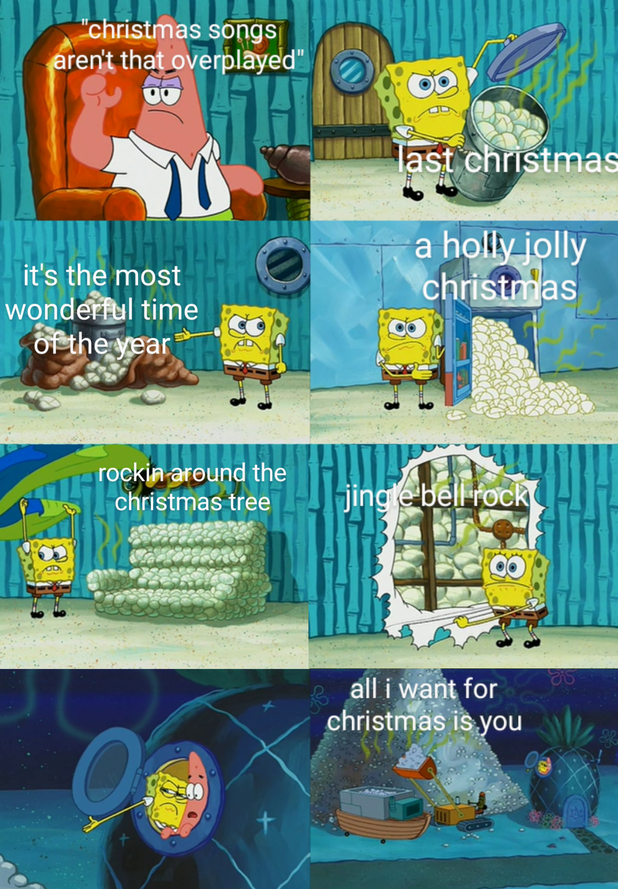

---

## 25. Predicted label: **Neutral**

- **Title:** Twitter much(sk)
- **Meme caption:** Meme poster is trying to convey that Elon Musk is driving himself crazy with Twitter like Roadrunner and the coyote.
- **Raw model response:** `Neutral.`
- **Manual judgment:** 
- **Human label if different:** 
- **Notes:** 

---

## 26. Predicted label: **Neutral**

- **Title:** I love Amusement Parks
- **Meme caption:** Meme poster is trying to convey how their relationships with other bumper car drivers evolve over time.
- **Raw model response:** `Neutral.`
- **Manual judgment:** 
- **Human label if different:** 
- **Notes:** 

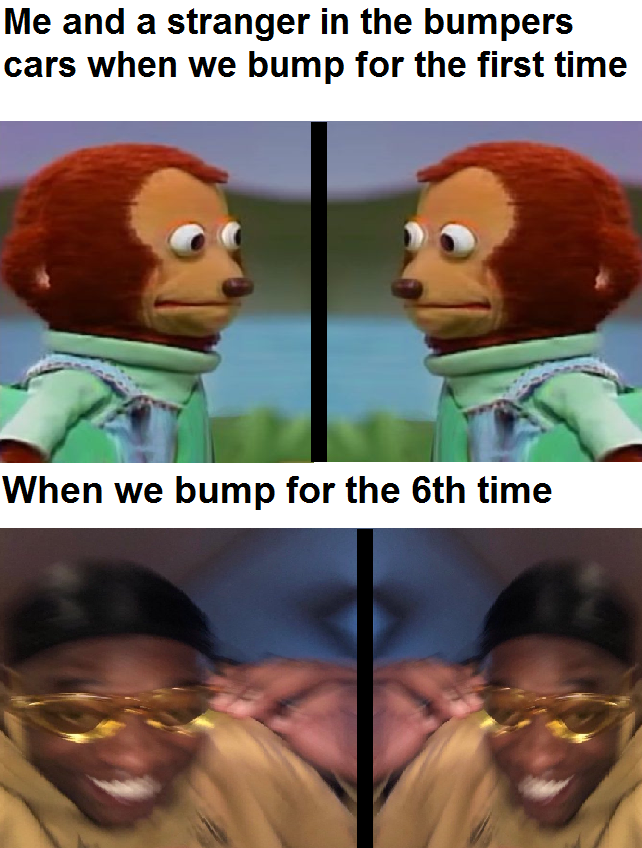

---

## 27. Predicted label: **Neutral**

- **Title:** This is about self-preservation
- **Meme caption:** Meme poster is trying to convey that they knock first to avoid seeing something heinous, not out of politeness.
- **Raw model response:** `Neutral.`
- **Manual judgment:** 
- **Human label if different:** 
- **Notes:** 

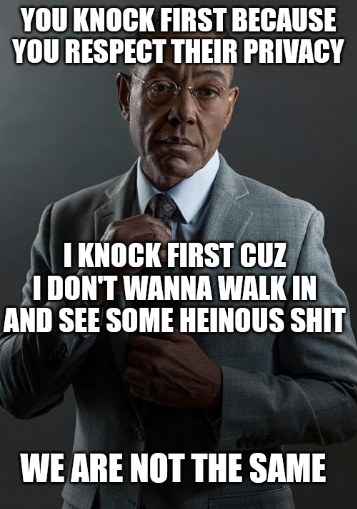

---

## 28. Predicted label: **Neutral**

- **Title:** Ok doctor, no problem bud 
- **Meme caption:** The meme poster is saying he can have so little of the indulgences that he likes such as Food and Liquor that he might as well be a plant.
- **Raw model response:** `Neutral.`
- **Manual judgment:** 
- **Human label if different:** 
- **Notes:** 

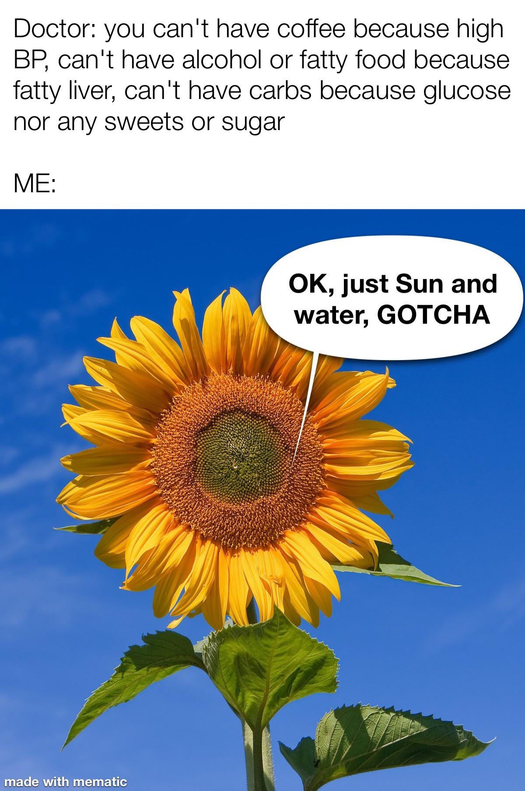

---

## 29. Predicted label: **Neutral**

- **Title:** FIFA: Origins
- **Meme caption:** Meme poster is trying to convey that they're confused in a choice to make
- **Raw model response:** `Neutral.`
- **Manual judgment:** 
- **Human label if different:** 
- **Notes:** 

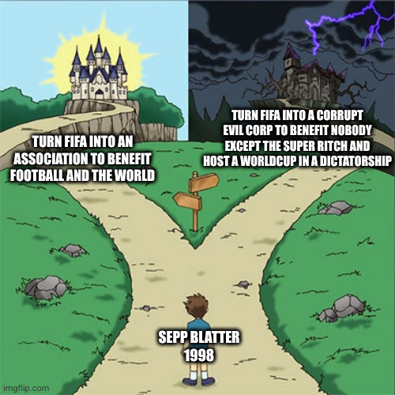

---

## 30. Predicted label: **Neutral**

- **Title:** Work Smarter, Not Harder
- **Meme caption:** Meme poster wants to use his psychological demons to their advantage.
- **Raw model response:** `Neutral.`
- **Manual judgment:** 
- **Human label if different:** 
- **Notes:** 

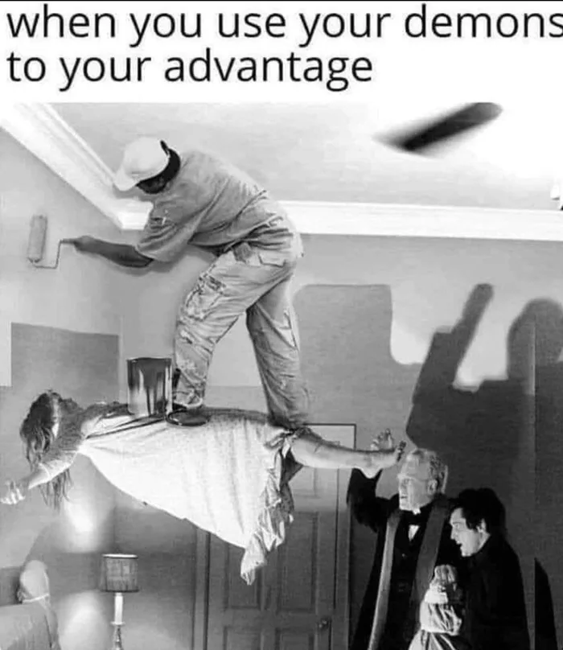

---

