# Qwen-VL 3-Class Manual Quality Check - image_caption

Use this file to inspect silver-label noise.

Labels: Positive, Negative, Neutral

Suggested manual fields:
- Correct? yes/no/ambiguous
- Human label
- Notes

---

## 1. Predicted label: **Positive**

- **Title:** ya see officer what happened is was
- **Meme caption:** Poster thinks he can talk himself out of legal trouble
- **Raw model response:** `Positive.`
- **Manual judgment:** 
- **Human label if different:** 
- **Notes:** 

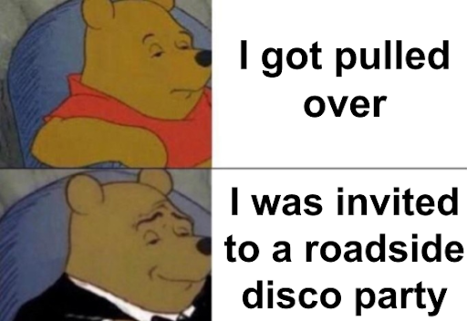

---

## 2. Predicted label: **Positive**

- **Title:** its finaly spooktober
- **Meme caption:** Meme poster trying to convey that the life after death
- **Raw model response:** `Positive.`
- **Manual judgment:** 
- **Human label if different:** 
- **Notes:** 

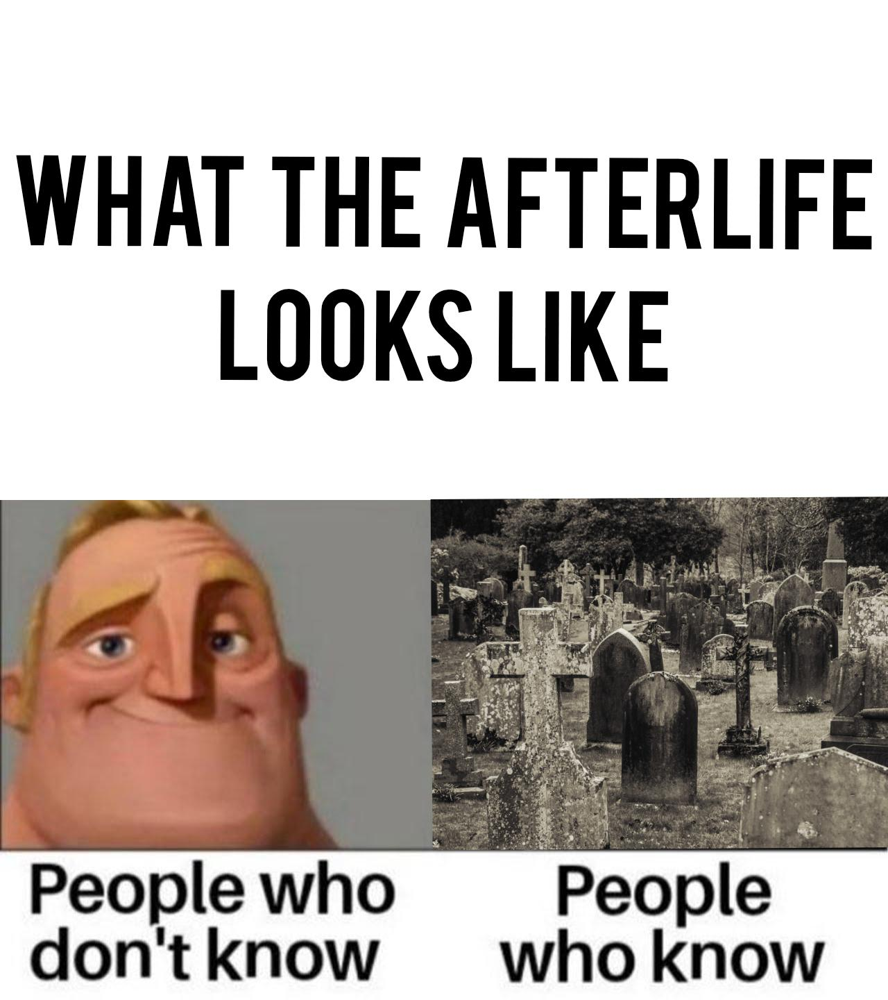

---

## 3. Predicted label: **Positive**

- **Title:** We all know what year it is
- **Meme caption:** Meme poster is trying to convey that artist creation causes earth to split in half.
- **Raw model response:** `Positive.`
- **Manual judgment:** 
- **Human label if different:** 
- **Notes:** 

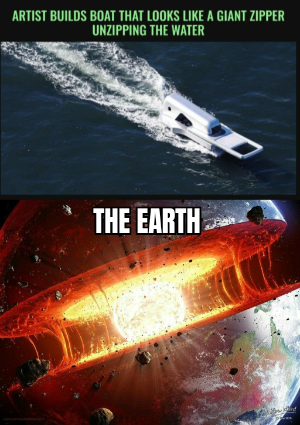

---

## 4. Predicted label: **Positive**

- **Title:** Coincidence? I think not!
- **Meme caption:** Meme poster mocks Hollywood for showing male 3-d antagonists rather than female 3-D antagonists.
- **Raw model response:** `Positive`
- **Manual judgment:** 
- **Human label if different:** 
- **Notes:** 

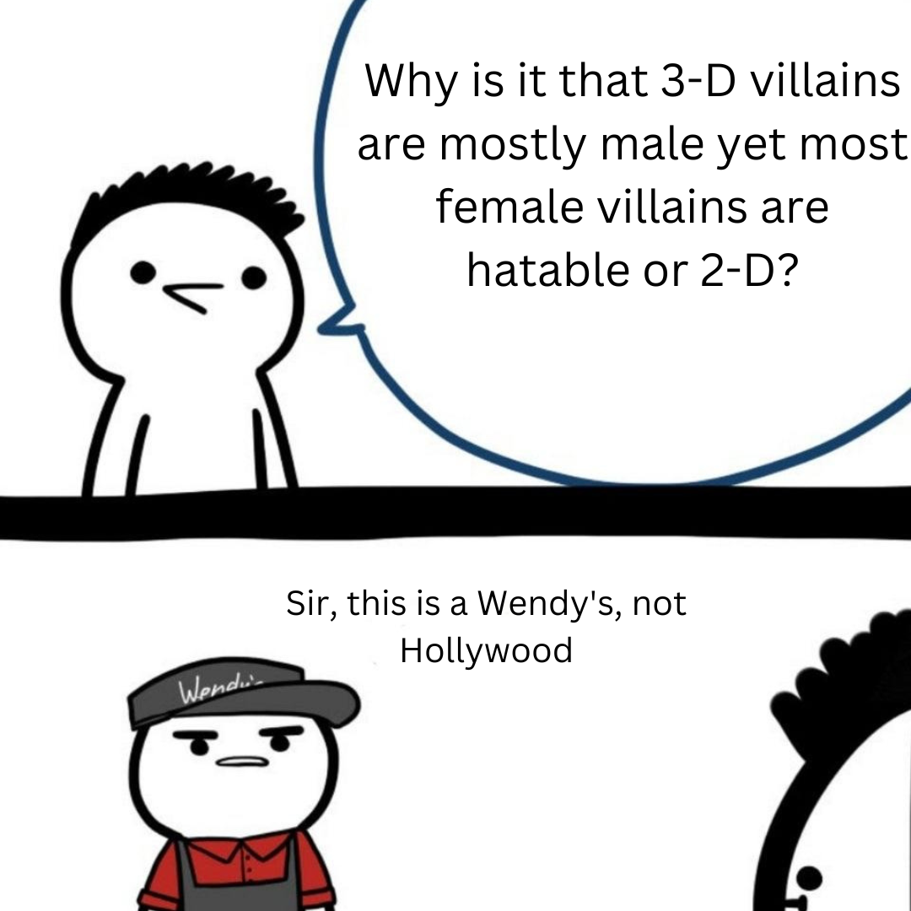

---

## 5. Predicted label: **Positive**

- **Title:** That's... That's groundbreaking
- **Meme caption:** Meme poster is trying to convey that a monkey has no problems because it is a monkey.
- **Raw model response:** `Positive.`
- **Manual judgment:** 
- **Human label if different:** 
- **Notes:** 

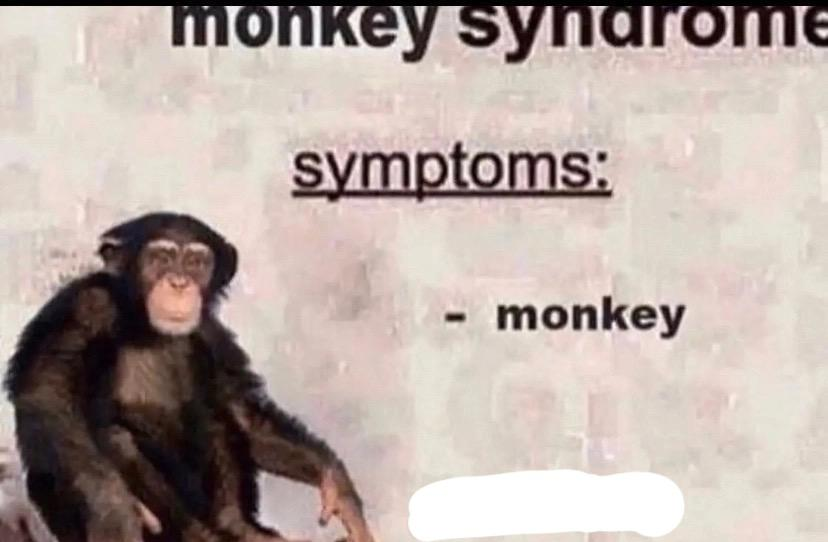

---

## 6. Predicted label: **Positive**

- **Title:** bro aint wrong
- **Meme caption:** Meme poster thinks that a death from old age is winning against all other causes of death.
- **Raw model response:** `Positive`
- **Manual judgment:** 
- **Human label if different:** 
- **Notes:** 

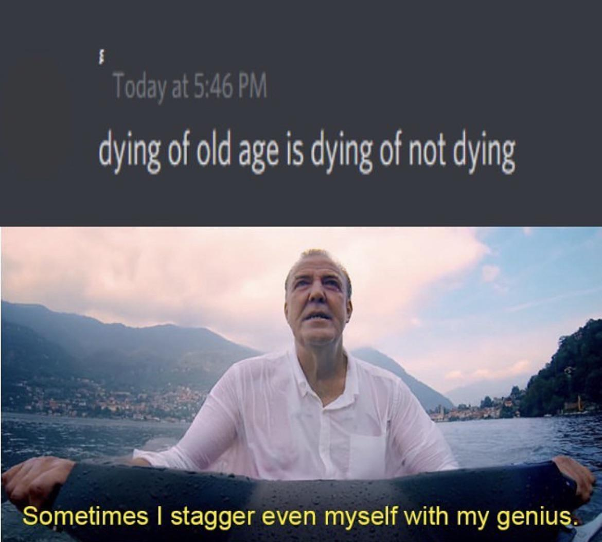

---

## 7. Predicted label: **Positive**

- **Title:** Whoever made this! U got me
- **Meme caption:** The poster is talking about how their cat acts.
- **Raw model response:** `Positive`
- **Manual judgment:** 
- **Human label if different:** 
- **Notes:** 

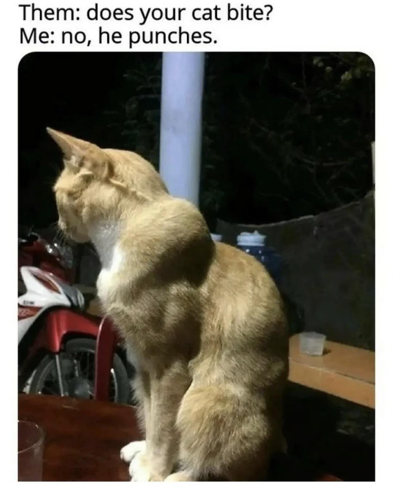

---

## 8. Predicted label: **Positive**

- **Title:** I dont like where this is going
- **Meme caption:** Meme poster thinks music boxes sound much scarier when there are no lights on.
- **Raw model response:** `Positive`
- **Manual judgment:** 
- **Human label if different:** 
- **Notes:** 

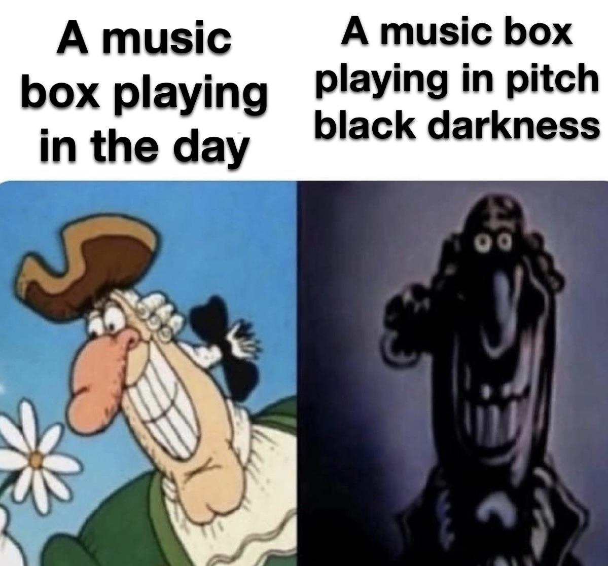

---

## 9. Predicted label: **Positive**

- **Title:** Never ask Volkswagen this.
- **Meme caption:** Meme poster is trying to convey that Volkswagen doesn't you to remember who founded them in 1937.
- **Raw model response:** `Positive`
- **Manual judgment:** 
- **Human label if different:** 
- **Notes:** 

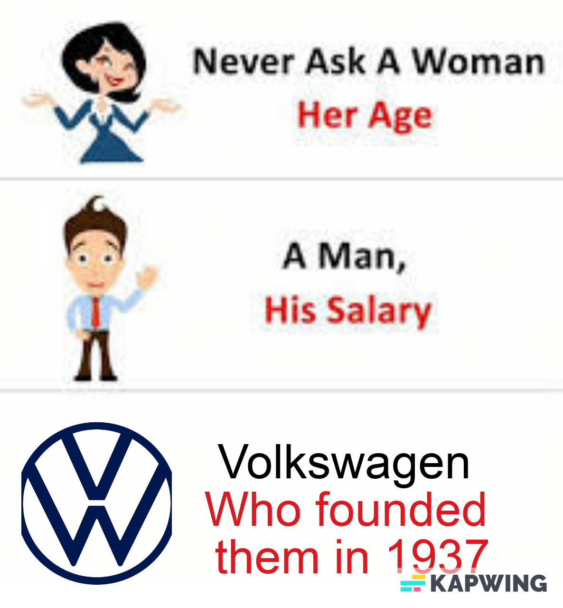

---

## 10. Predicted label: **Positive**

- **Title:** who knew 25 years later this quote would fit Kanye.... it's like they say life imitates art
- **Meme caption:** Meme poster is trying to convey that Kayne West's kids will tell their therapist the wildest stories about his beliefs later on.
- **Raw model response:** `Positive.`
- **Manual judgment:** 
- **Human label if different:** 
- **Notes:** 

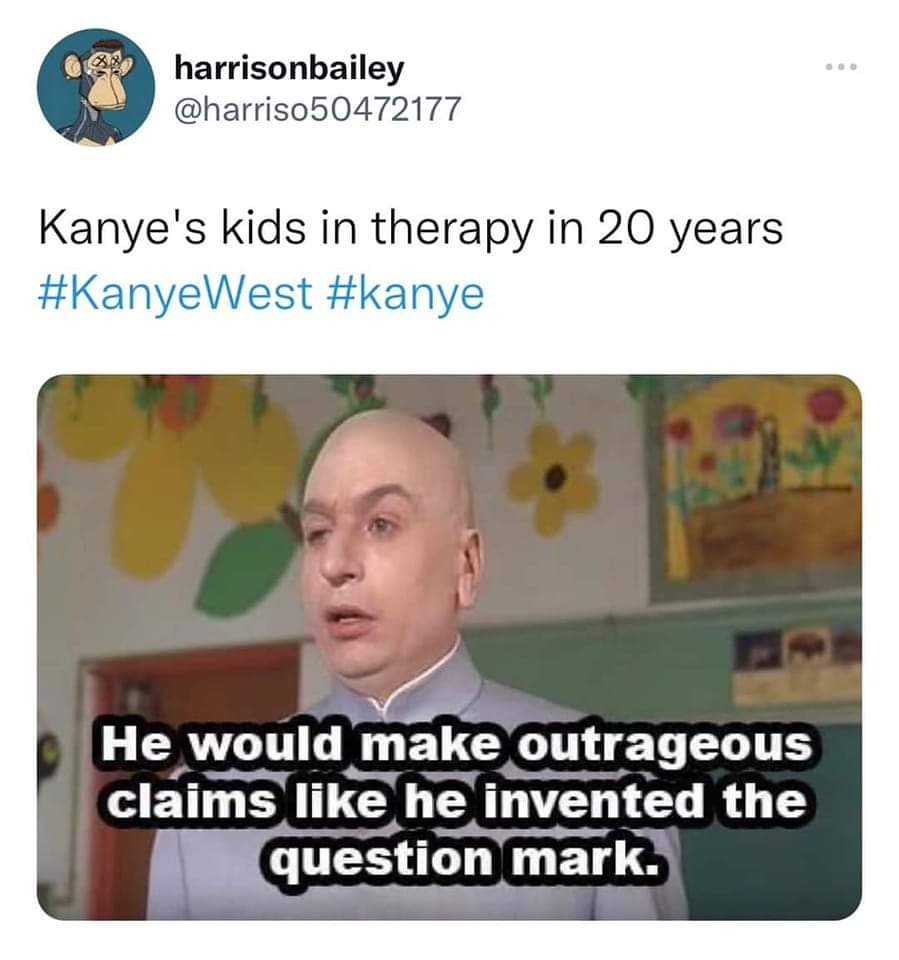

---

## 11. Predicted label: **Negative**

- **Title:** Accurate asf
- **Meme caption:** Meme poster is trying to convey that New burger places all have bad tasting too fancy burgers, hipster chefs, ugly lighting and the same basic brick walls.
- **Raw model response:** `Negative.`
- **Manual judgment:** 
- **Human label if different:** 
- **Notes:** 

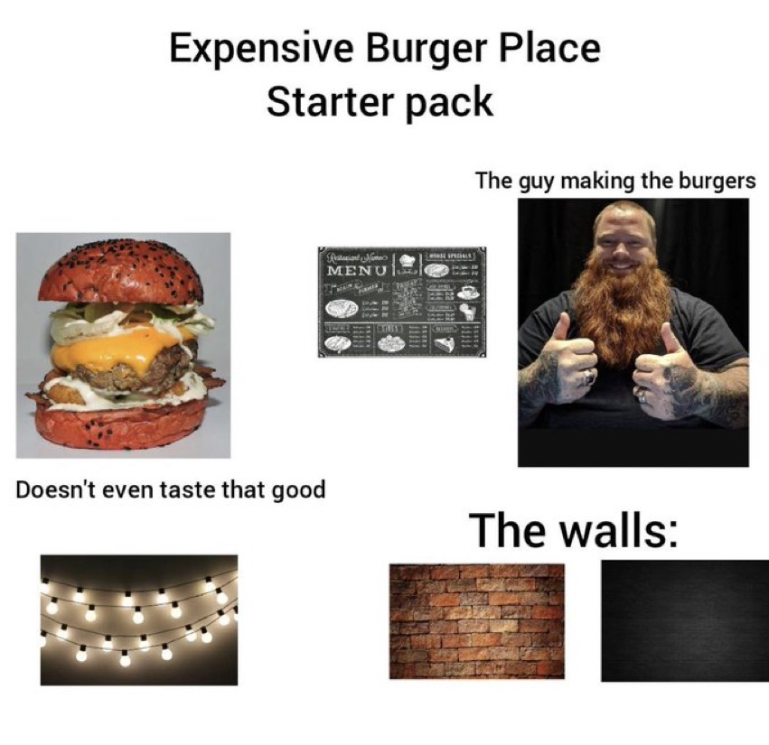

---

## 12. Predicted label: **Negative**

- **Title:** wholesome kiddo
- **Meme caption:** The meme poster announced on social media that he would eat straws to mock turtles.
- **Raw model response:** `Negative.`
- **Manual judgment:** 
- **Human label if different:** 
- **Notes:** 

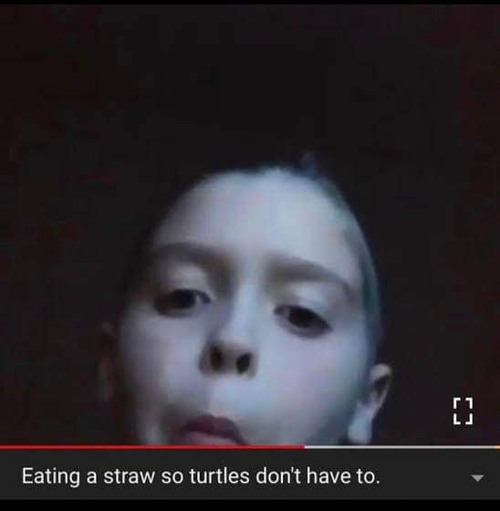

---

## 13. Predicted label: **Negative**

- **Title:** Gotham City
- **Meme caption:** Meme poster is trying to convey that People in America are starting to look like Supervillains.
- **Raw model response:** `Negative.`
- **Manual judgment:** 
- **Human label if different:** 
- **Notes:** 

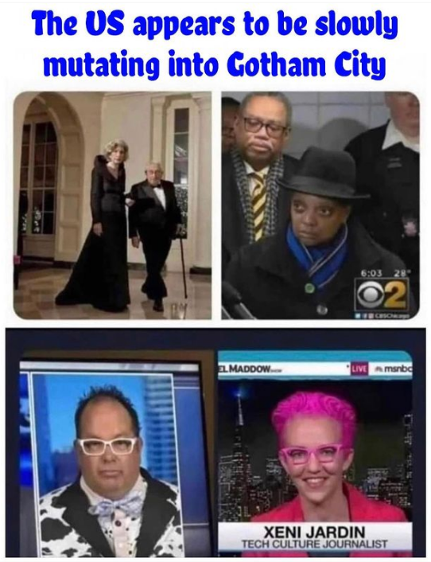

---

## 14. Predicted label: **Negative**

- **Title:** I couldnt hold back the tears
- **Meme caption:** Meme poster is trying to convey sadness over how cats run away when they're about to die.
- **Raw model response:** `Negative.`
- **Manual judgment:** 
- **Human label if different:** 
- **Notes:** 

---

## 15. Predicted label: **Negative**

- **Title:** atleast it wasn't in the center of a lake .
- **Meme caption:** Meme poster doesn't believe the google maps.
- **Raw model response:** `Negative.`
- **Manual judgment:** 
- **Human label if different:** 
- **Notes:** 

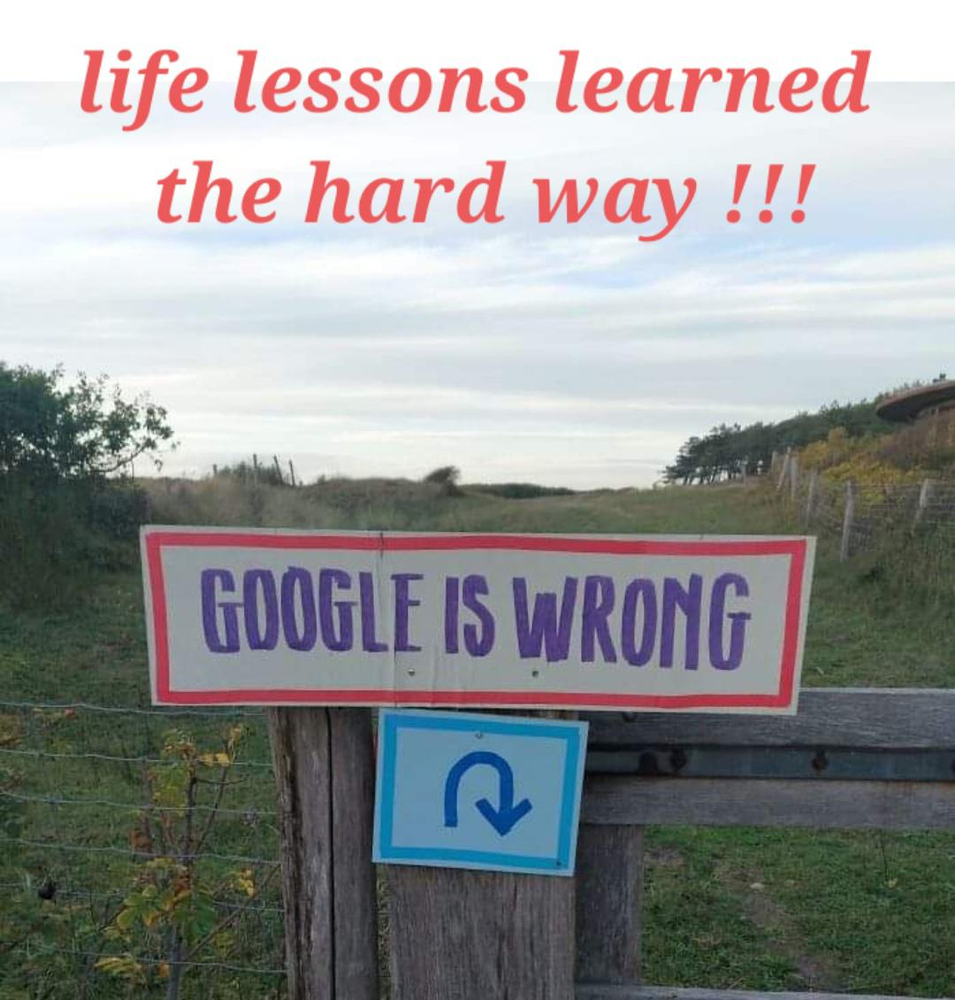

---

## 16. Predicted label: **Negative**

- **Title:** Oh God, oh God no...
- **Meme caption:** Meme poster is trying to convey that the cat killed the hamster the meme poster can't find.
- **Raw model response:** `Negative.`
- **Manual judgment:** 
- **Human label if different:** 
- **Notes:** 

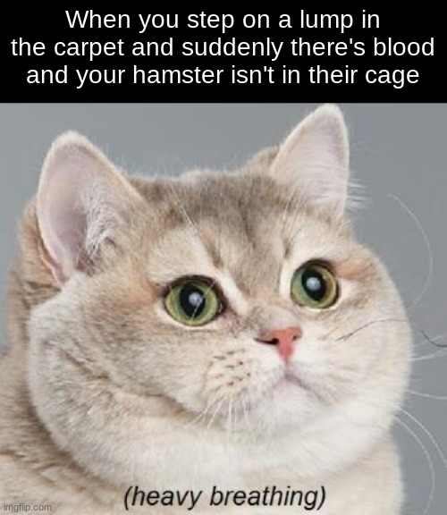

---

## 17. Predicted label: **Negative**

- **Title:** Thats a nice kidney you have there
- **Meme caption:** A girlfriend is amused their boyfriend wants to steal their heart until they learn they are a organ trafficer.
- **Raw model response:** `Negative`
- **Manual judgment:** 
- **Human label if different:** 
- **Notes:** 

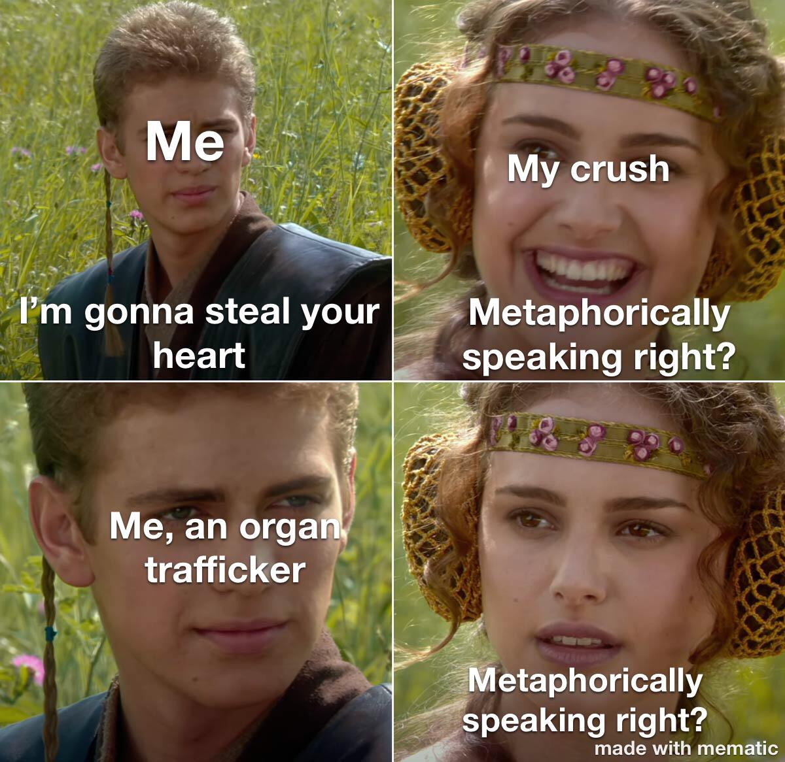

---

## 18. Predicted label: **Negative**

- **Title:** You've probably had your suspicions already
- **Meme caption:** Meme poster is trying to convey that by reading his meme you're in the wrong place hence the scary looking Spongebob.
- **Raw model response:** `Negative.`
- **Manual judgment:** 
- **Human label if different:** 
- **Notes:** 

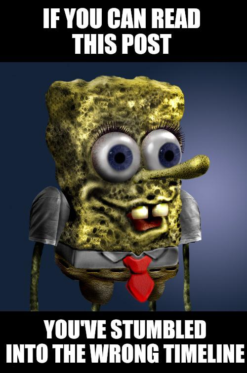

---

## 19. Predicted label: **Negative**

- **Title:** Menaces of the Ocean.
- **Meme caption:** Meme poster thinks Dolphins are actually much more dangerous and scary than sharks
- **Raw model response:** `Negative.`
- **Manual judgment:** 
- **Human label if different:** 
- **Notes:** 

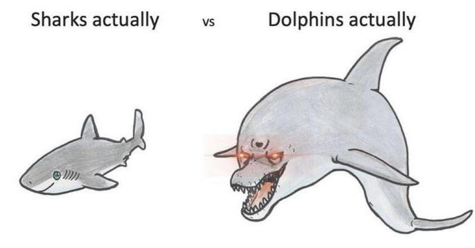

---

## 20. Predicted label: **Negative**

- **Title:** HE'S FRIED NOW
- **Meme caption:** The meme poster is trying to convey they dislike the character anakin
- **Raw model response:** `Negative.`
- **Manual judgment:** 
- **Human label if different:** 
- **Notes:** 

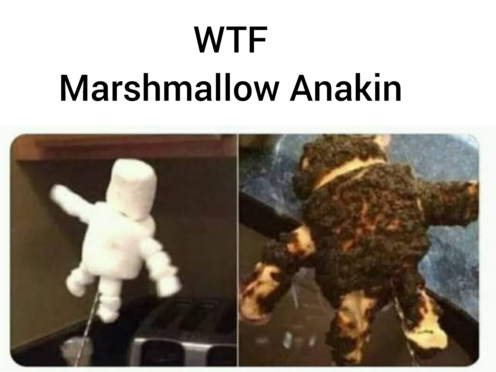

---

## 21. Predicted label: **Neutral**

- **Title:** release your hold on me foul demon!
- **Meme caption:** Meme poster is trying to get healthy but feels temptation eating unhealthy foods.
- **Raw model response:** `Neutral.`
- **Manual judgment:** 
- **Human label if different:** 
- **Notes:** 

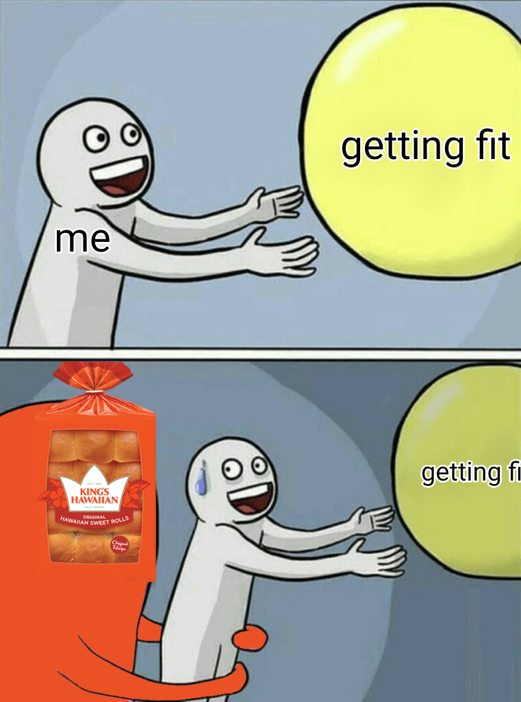

---

## 22. Predicted label: **Neutral**

- **Title:** Absolutely horrified.
- **Meme caption:** The meme poster feels like a confused and scared andy dwyer when he has to ask questions.
- **Raw model response:** `Neutral.`
- **Manual judgment:** 
- **Human label if different:** 
- **Notes:** 

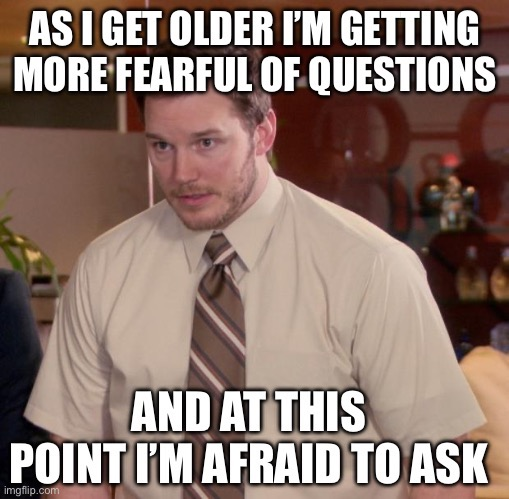

---

## 23. Predicted label: **Neutral**

- **Title:** This is literally the only way I pass time during class.
- **Meme caption:** Meme poster is conveying some random people advising the meme poster about the reality of airdrops.
- **Raw model response:** `Neutral.`
- **Manual judgment:** 
- **Human label if different:** 
- **Notes:** 

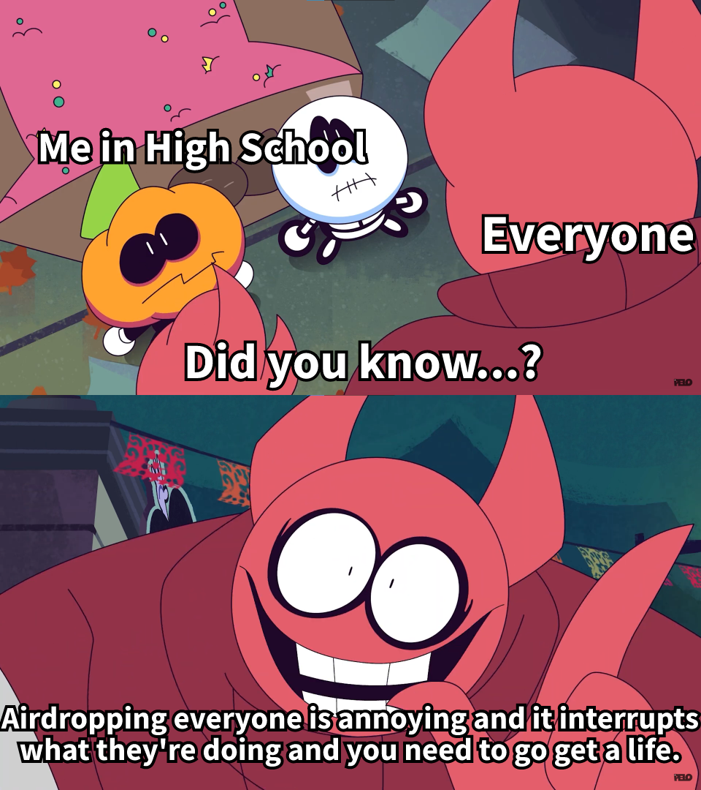

---

## 24. Predicted label: **Neutral**

- **Title:** My situation
- **Meme caption:** There aren't enough days on the weekend to complete all of your tasks if you only do one task a day.
- **Raw model response:** `Neutral.`
- **Manual judgment:** 
- **Human label if different:** 
- **Notes:** 

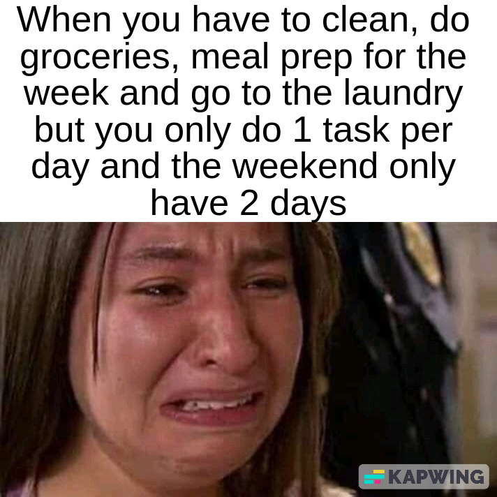

---

## 25. Predicted label: **Neutral**

- **Title:** There's a million pasta dishes, why?
- **Meme caption:** Meme poster doesn't understand why carbonara is trending on Reddit.
- **Raw model response:** `Neutral.`
- **Manual judgment:** 
- **Human label if different:** 
- **Notes:** 

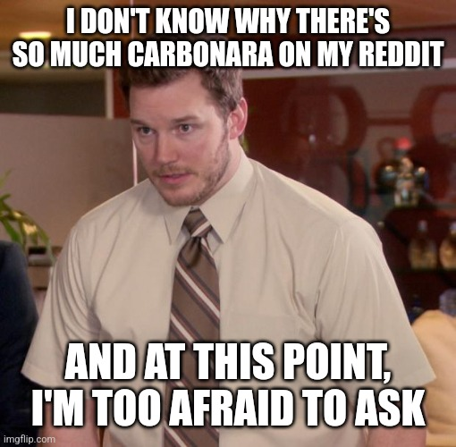

---

## 26. Predicted label: **Neutral**

- **Title:** And then the nurse asks you who that was.
- **Meme caption:** Meme poster is trying to convey that they're uncomfortable going for a prostate exam.
- **Raw model response:** `Neutral.`
- **Manual judgment:** 
- **Human label if different:** 
- **Notes:** 

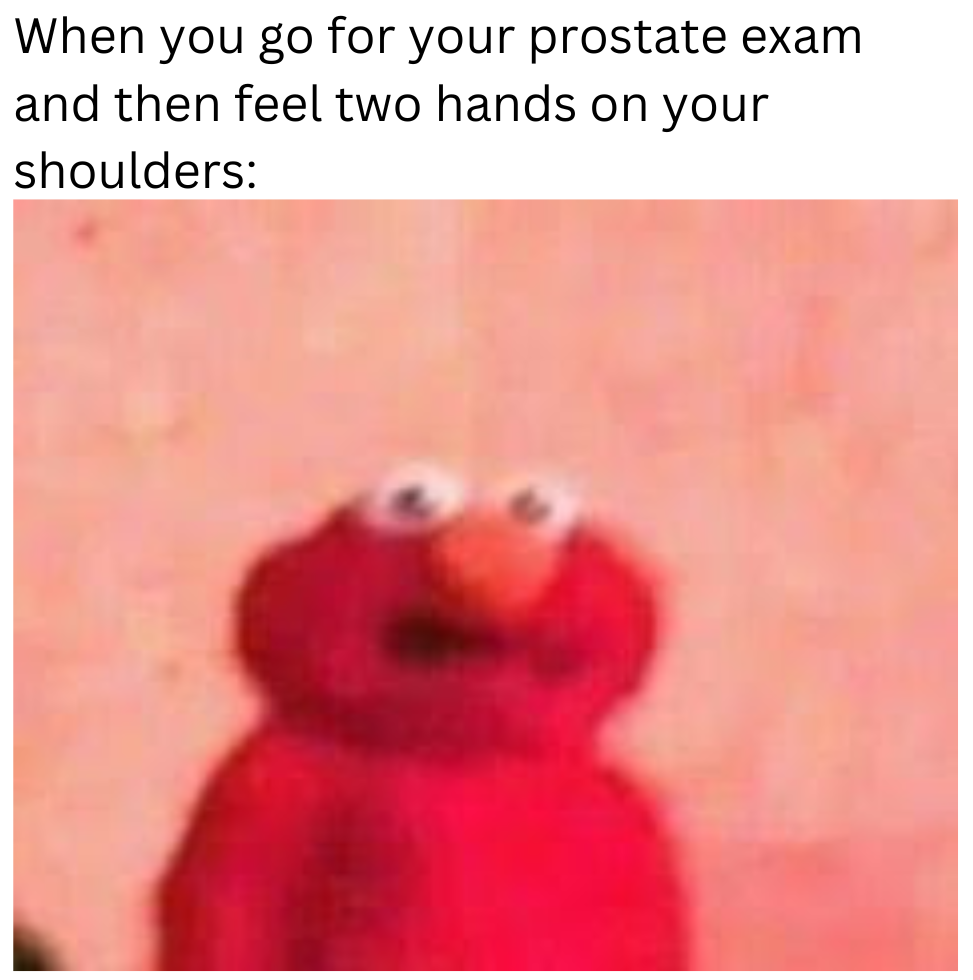

---

## 27. Predicted label: **Neutral**

- **Title:** I seriously have no clue at this point
- **Meme caption:** Meme poster is trying to convey that What the heck "Rizz" is supposed to mean in this day and age
- **Raw model response:** `Neutral`
- **Manual judgment:** 
- **Human label if different:** 
- **Notes:** 

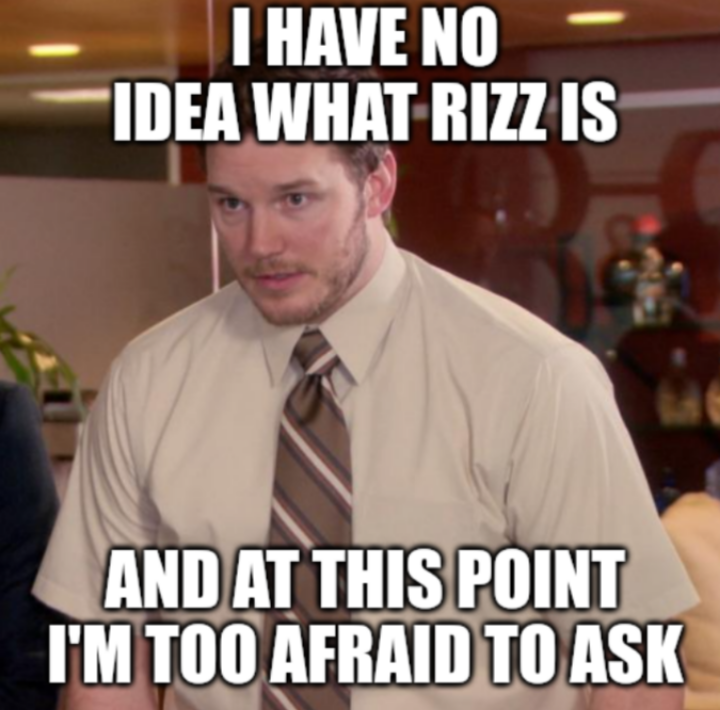

---

## 28. Predicted label: **Neutral**

- **Title:** I need answers, yet there are none for me to get.
- **Meme caption:** Meme poster is trying to explain to the mods where their pod should be kept up.
- **Raw model response:** `Neutral.`
- **Manual judgment:** 
- **Human label if different:** 
- **Notes:** 

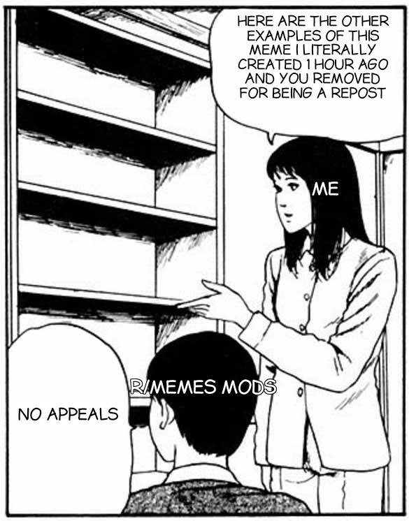

---

## 29. Predicted label: **Neutral**

- **Title:** When you multiply a negative with a negative.
- **Meme caption:** Meme poster is trying to convey that some unwanted things to be included in our daily list.
- **Raw model response:** `Neutral.`
- **Manual judgment:** 
- **Human label if different:** 
- **Notes:** 

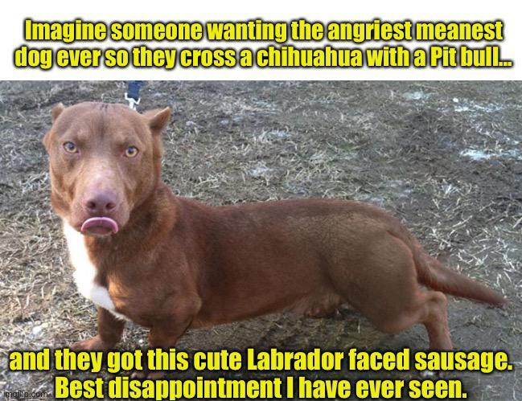

---

## 30. Predicted label: **Neutral**

- **Title:** They what???
- **Meme caption:** Meme poster thinks the reason of the girl being upset doesn't make sense.
- **Raw model response:** `Neutral.`
- **Manual judgment:** 
- **Human label if different:** 
- **Notes:** 

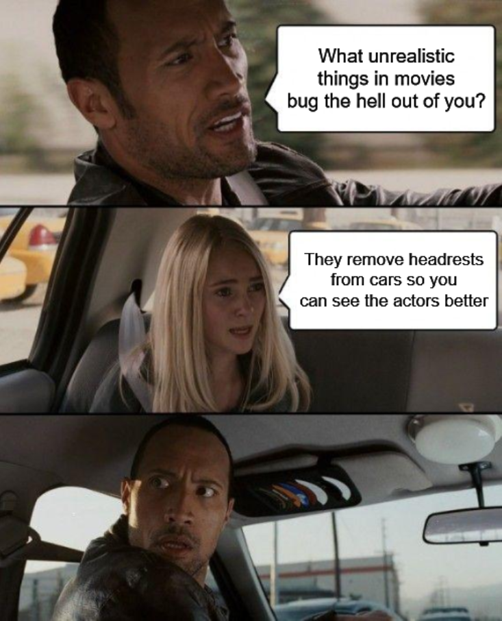

---

