# Qwen-VL Manual Quality Check - caption_only

Use this file to inspect silver-label noise.

Suggested manual fields:
- Correct? yes/no/ambiguous
- Human label
- Notes

---

## 1. Predicted label: **Anger**

- **Title:** Guess where this is from
- **Meme caption:** People lie to the meme poster about being good at minecraft to try to make themselves look cool.
- **Raw model response:** `Anger.`
- **Manual judgment:** 
- **Human label if different:** 
- **Notes:** 

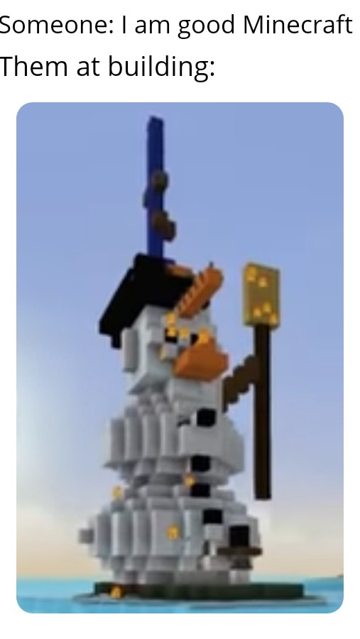

---

## 2. Predicted label: **Anger**

- **Title:** Kanye west doing his Kanye best
- **Meme caption:** Poster think Kanye too exreme even for the Galactic Empire.
- **Raw model response:** `Anger.`
- **Manual judgment:** 
- **Human label if different:** 
- **Notes:** 

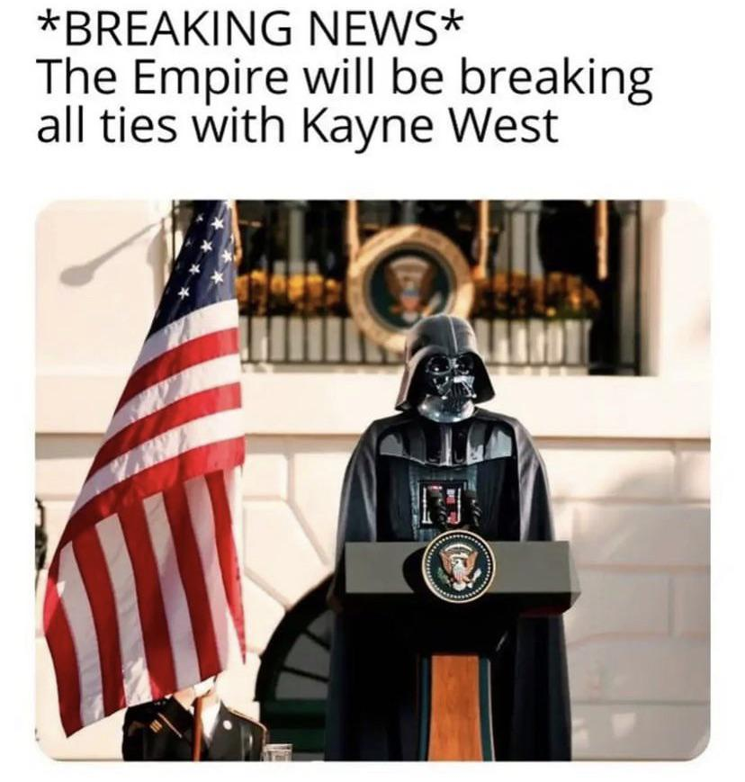

---

## 3. Predicted label: **Anger**

- **Title:** Its usually how they end up breaking
- **Meme caption:** Meme poster is trying to convey that there is big temptation for the man to remove the battery cover from the remote.
- **Raw model response:** `The dominant emotion expressed by the meme caption is "anger".`
- **Manual judgment:** 
- **Human label if different:** 
- **Notes:** 

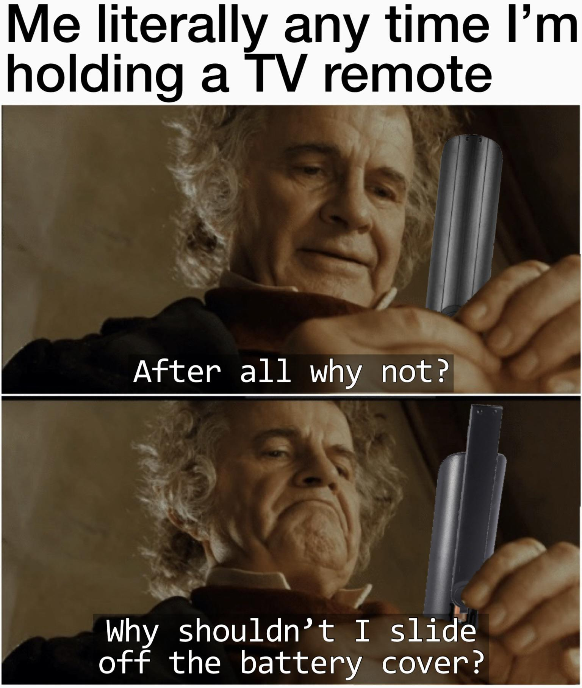

---

## 4. Predicted label: **Anger**

- **Title:** 104 Fahrenheit
- **Meme caption:** Meme poster is trying to convey that they're aggravated with people who ignore and deny climate change.
- **Raw model response:** `Anger.`
- **Manual judgment:** 
- **Human label if different:** 
- **Notes:** 

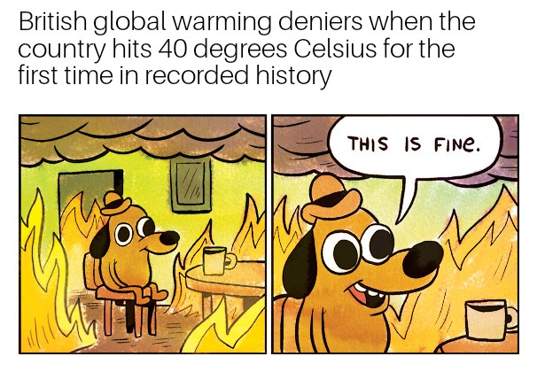

---

## 5. Predicted label: **Anger**

- **Title:** I love MWII
- **Meme caption:** Meme poster is trying to convey that opponents make racist remarks to express anger when they lose
- **Raw model response:** `Anger.`
- **Manual judgment:** 
- **Human label if different:** 
- **Notes:** 

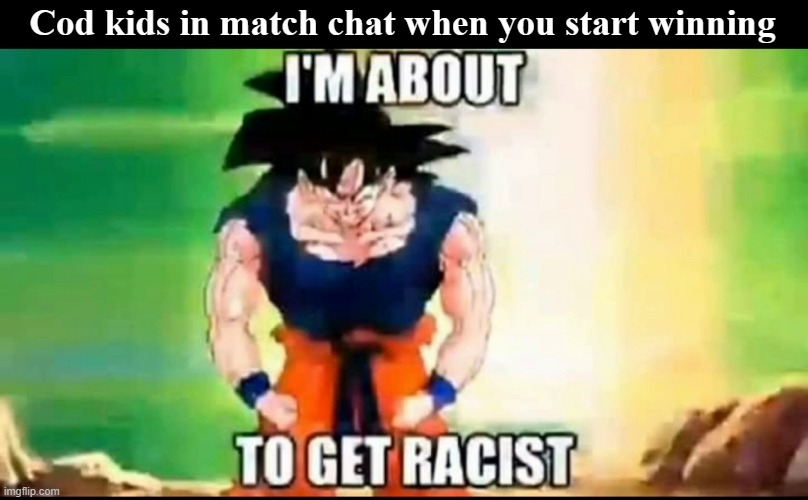

---

## 6. Predicted label: **Anger**

- **Title:** Im Afraid Mr. Griffin is Right
- **Meme caption:** meme poster is convey most worst mistake in life of women fell men
- **Raw model response:** `Anger`
- **Manual judgment:** 
- **Human label if different:** 
- **Notes:** 

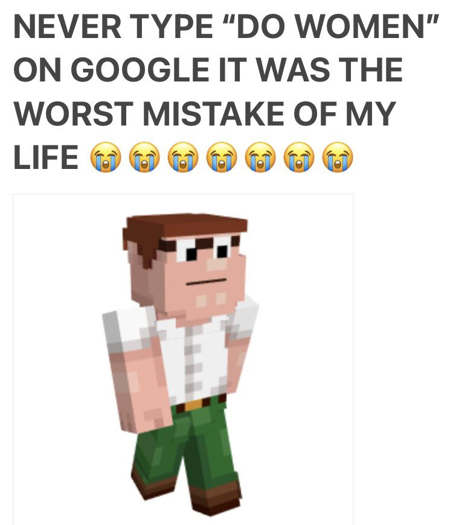

---

## 7. Predicted label: **Anger**

- **Title:** made in West Taiwan
- **Meme caption:** Meme poster doesn't like anything made in China but accepts West Taiwan.
- **Raw model response:** `Anger`
- **Manual judgment:** 
- **Human label if different:** 
- **Notes:** 

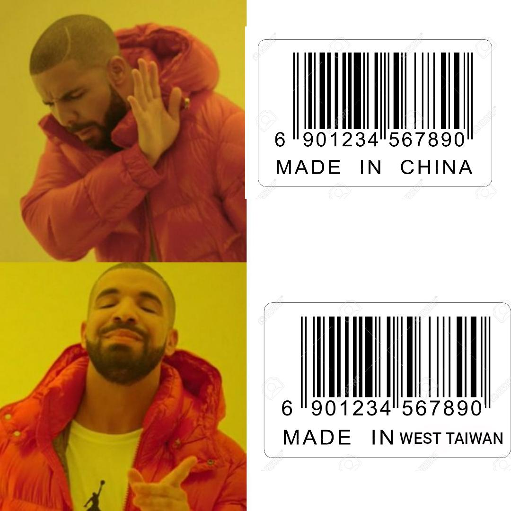

---

## 8. Predicted label: **Anger**

- **Title:** sorry for format
- **Meme caption:** Meme poster gets mad to see the news.
- **Raw model response:** `Anger.`
- **Manual judgment:** 
- **Human label if different:** 
- **Notes:** 

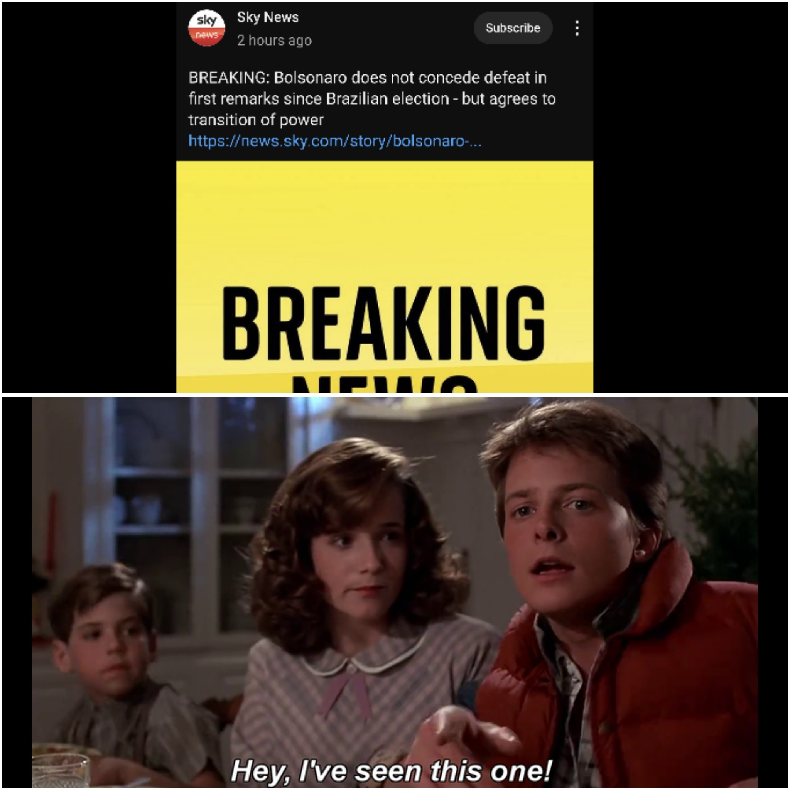

---

## 9. Predicted label: **Anger**

- **Title:** Simpsons predicted it yet again
- **Meme caption:** The Simpsons was correct about it's use of Trump and Greta Thurnberg.
- **Raw model response:** `Anger.`
- **Manual judgment:** 
- **Human label if different:** 
- **Notes:** 

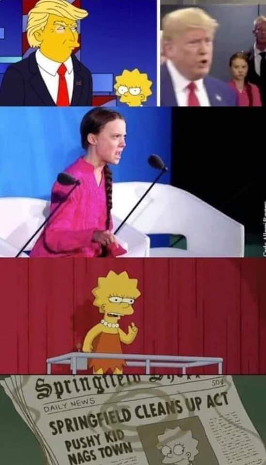

---

## 10. Predicted label: **Anger**

- **Title:** Yay, nice graphics
- **Meme caption:** Meme poster is trying to convey that YouTube executives have different ideas to improve their product that the users of the site.
- **Raw model response:** `The dominant emotion expressed by the meme caption is "anger".`
- **Manual judgment:** 
- **Human label if different:** 
- **Notes:** 

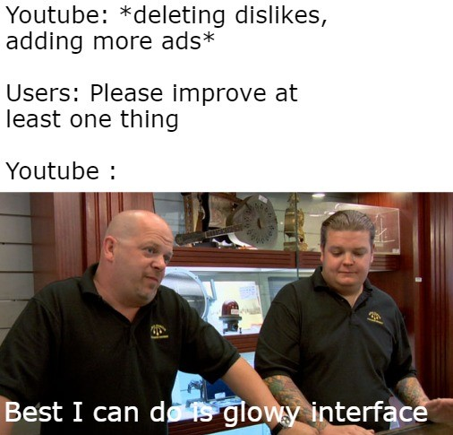

---

## 11. Predicted label: **Disgust**

- **Title:** only me?
- **Meme caption:** Meme poster likes noodles without sauce, even if other people think it's disgusting.
- **Raw model response:** `Disgust.`
- **Manual judgment:** 
- **Human label if different:** 
- **Notes:** 

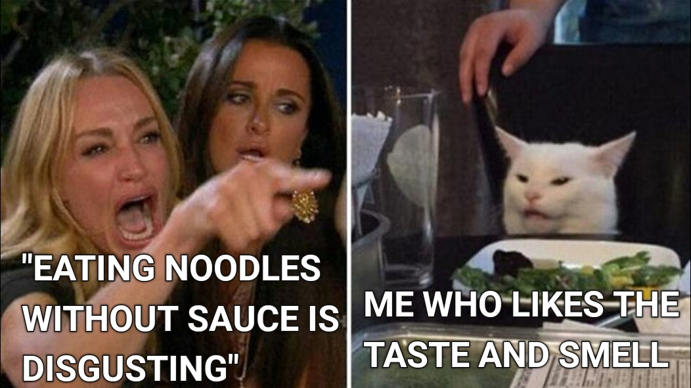

---

## 12. Predicted label: **Disgust**

- **Title:** idk doesnt sound right to me
- **Meme caption:** Meme poster is trying to convey that they don't believe the study about cannabis.
- **Raw model response:** `The dominant emotion expressed by the meme caption is "disgust".`
- **Manual judgment:** 
- **Human label if different:** 
- **Notes:** 

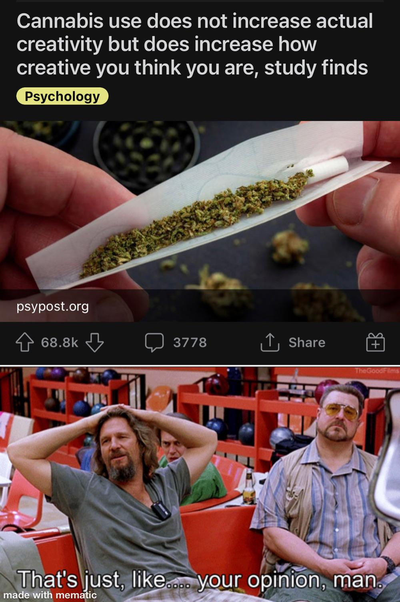

---

## 13. Predicted label: **Disgust**

- **Title:** The jokes dont hit the same anymore
- **Meme caption:** Meme poster express his reaction about the past World cup.
- **Raw model response:** `The dominant emotion expressed by the meme caption is "disgust".`
- **Manual judgment:** 
- **Human label if different:** 
- **Notes:** 

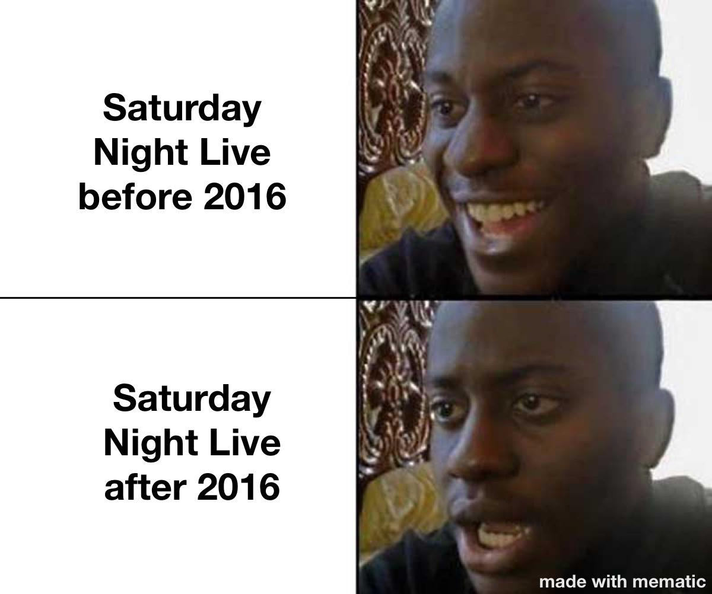

---

## 14. Predicted label: **Disgust**

- **Title:** Did you know
- **Meme caption:** Meme poster is choosing between unconditional love and love with terms attached.
- **Raw model response:** `The dominant emotion expressed by the meme caption is "disgust".`
- **Manual judgment:** 
- **Human label if different:** 
- **Notes:** 

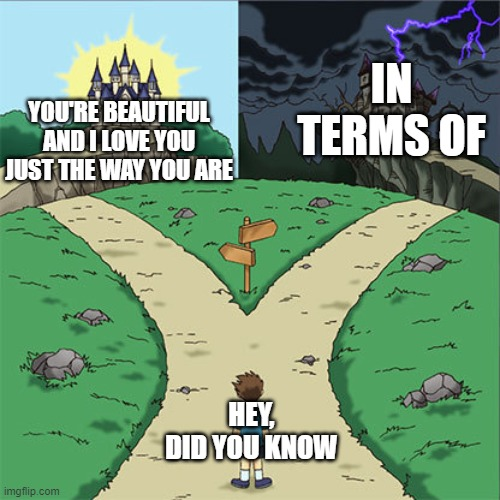

---

## 15. Predicted label: **Disgust**

- **Title:** Where do they disappear?
- **Meme caption:** The poster seems to think that people come forward to defend others or solve problems only when there is an opportunity to shine or else disregard the other common issues.
- **Raw model response:** `Disgust.`
- **Manual judgment:** 
- **Human label if different:** 
- **Notes:** 

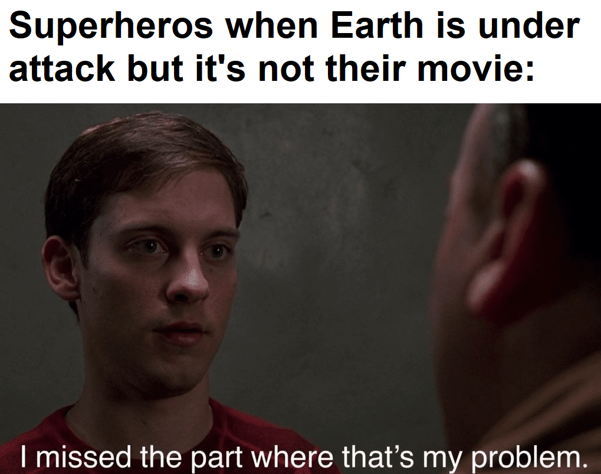

---

## 16. Predicted label: **Disgust**

- **Title:** If you could stop blasting me with ads that would be great.
- **Meme caption:** Meme user is disgusted Samsung keeps trying to make foldable phones happen.
- **Raw model response:** `Disgust.`
- **Manual judgment:** 
- **Human label if different:** 
- **Notes:** 

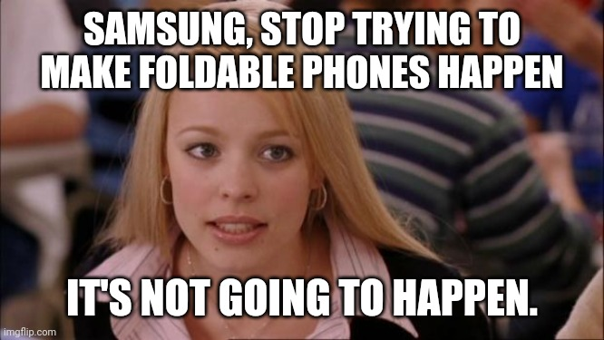

---

## 17. Predicted label: **Disgust**

- **Title:** this is not even a meme, that's literally the ad booking.com showed me. anyone down for a nice weekend trip?
- **Meme caption:** Meme poster was offered a discount to stay in this building and wants to know whether it'd be a good vacation.
- **Raw model response:** `The dominant emotion expressed by the meme caption is "disgust".`
- **Manual judgment:** 
- **Human label if different:** 
- **Notes:** 

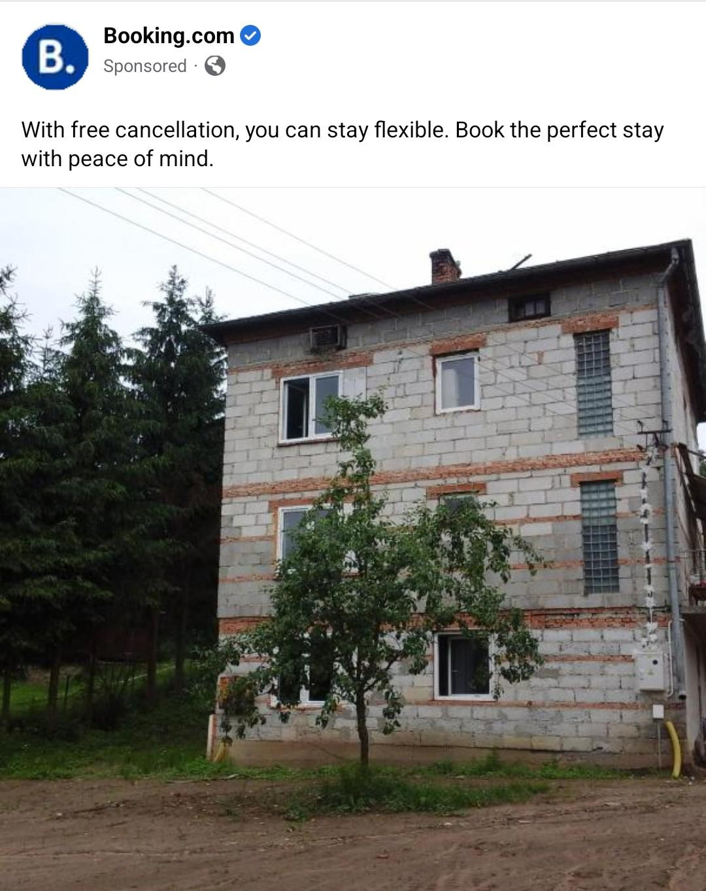

---

## 18. Predicted label: **Disgust**

- **Title:** same goes for Spyro 3
- **Meme caption:** Meme poster is trying to convey that the video game soundtrack goes to hard for what is needed.
- **Raw model response:** `The dominant emotion expressed by the meme caption is "disgust".`
- **Manual judgment:** 
- **Human label if different:** 
- **Notes:** 

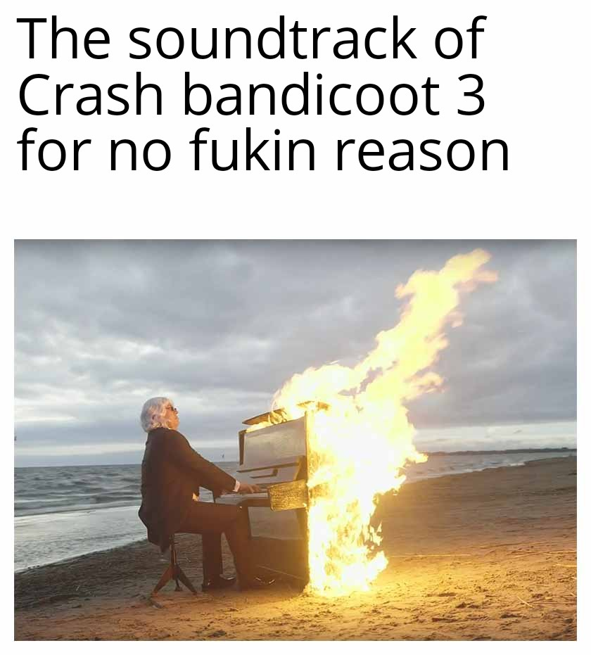

---

## 19. Predicted label: **Disgust**

- **Title:** that's how we play Donkey Kong right?
- **Meme caption:** Meme poster likes Cranky's Cabin more than the Donkey song.
- **Raw model response:** `The dominant emotion expressed by the meme caption is "disgust".`
- **Manual judgment:** 
- **Human label if different:** 
- **Notes:** 

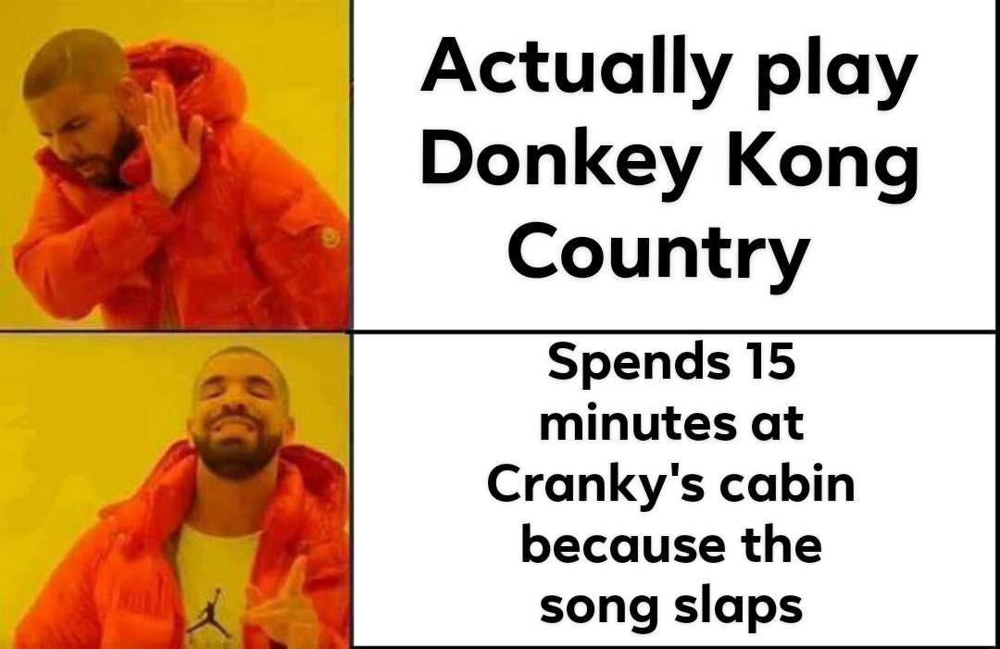

---

## 20. Predicted label: **Disgust**

- **Title:** Mama Come Knock me out I can't take it
- **Meme caption:** Meme poster implies that Taco bell makes him have to use the restroom.
- **Raw model response:** `The dominant emotion expressed by the meme caption is "disgust".`
- **Manual judgment:** 
- **Human label if different:** 
- **Notes:** 

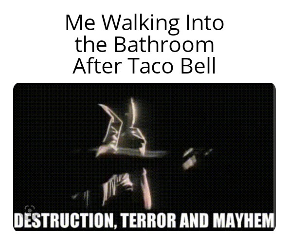

---

## 21. Predicted label: **Fear**

- **Title:** She said she was 12
- **Meme caption:** Meme poster is trying to convey that discords mods want to punish cats who lie about being 18 while actually being 12.
- **Raw model response:** `Fear.`
- **Manual judgment:** 
- **Human label if different:** 
- **Notes:** 

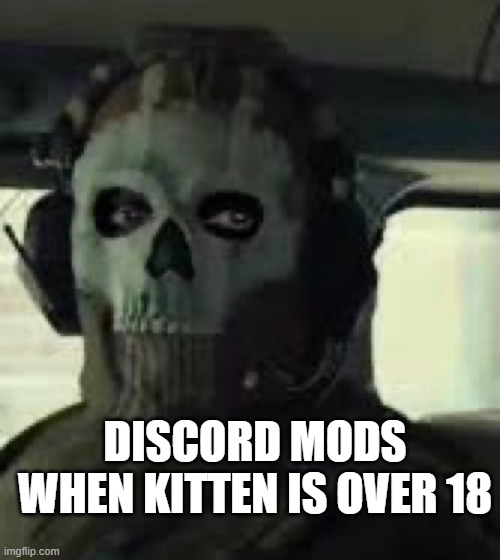

---

## 22. Predicted label: **Fear**

- **Title:** Hehe, I'm in danger
- **Meme caption:** Meme poster is trying to convey that WW 2 is all fun and games until it happens to you
- **Raw model response:** `Fear.`
- **Manual judgment:** 
- **Human label if different:** 
- **Notes:** 

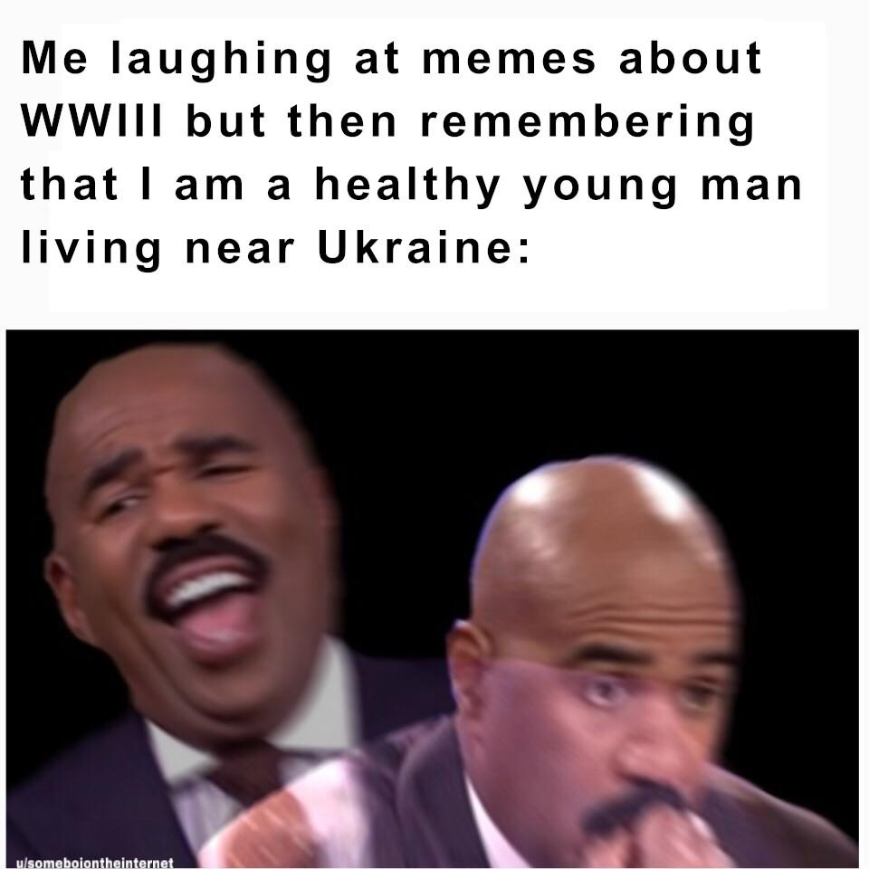

---

## 23. Predicted label: **Fear**

- **Title:** Im not the messiah
- **Meme caption:** Meme poster is trying to convey that how people can easily fall for fake things
- **Raw model response:** `Fear.`
- **Manual judgment:** 
- **Human label if different:** 
- **Notes:** 

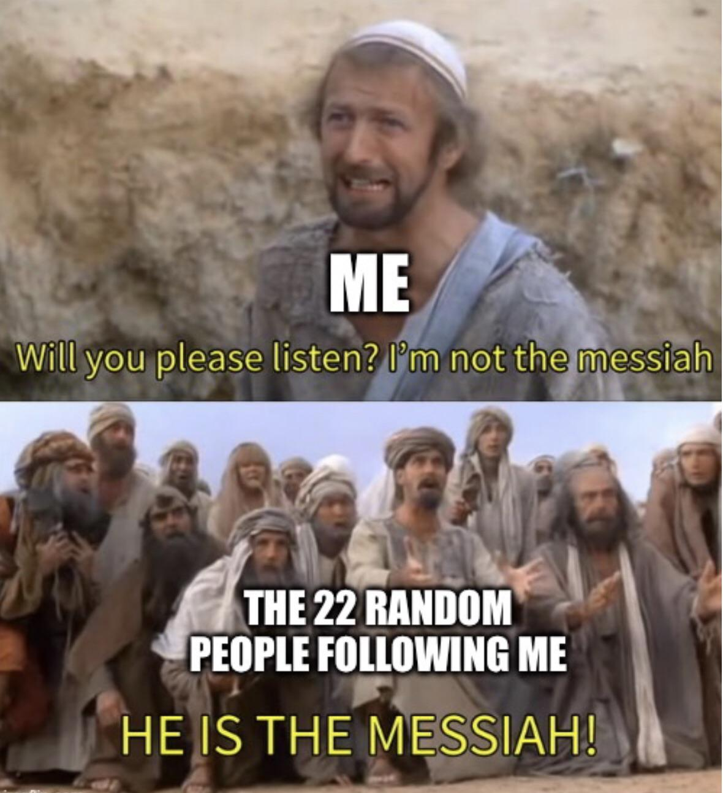

---

## 24. Predicted label: **Fear**

- **Title:** thought of that meme while listening to the song
- **Meme caption:** Meme poster is trying to figure out whether cigarettes will kill them.
- **Raw model response:** `Fear.`
- **Manual judgment:** 
- **Human label if different:** 
- **Notes:** 

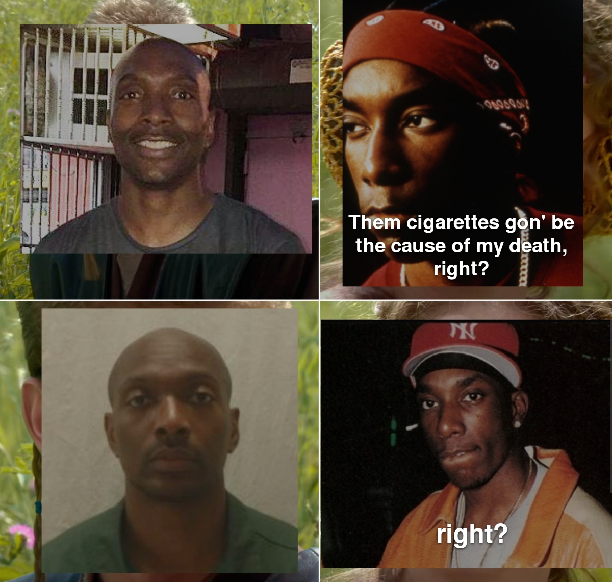

---

## 25. Predicted label: **Fear**

- **Title:** Charisma on command
- **Meme caption:** The meme poster fees bad for being isolated even after he get trained.
- **Raw model response:** `Fear.`
- **Manual judgment:** 
- **Human label if different:** 
- **Notes:** 

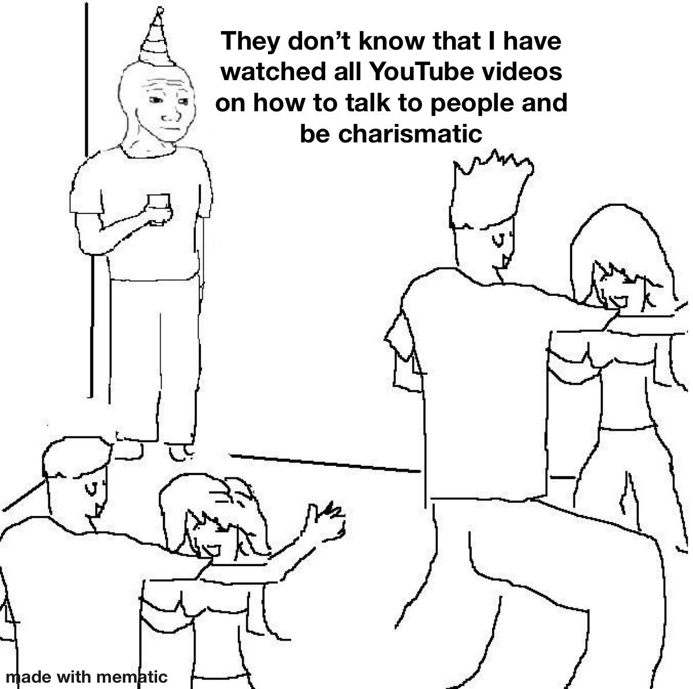

---

## 26. Predicted label: **Fear**

- **Title:** I dont feel so good
- **Meme caption:** Meme poster drank their coworkers science project and now doesn't feel good.
- **Raw model response:** `Fear.`
- **Manual judgment:** 
- **Human label if different:** 
- **Notes:** 

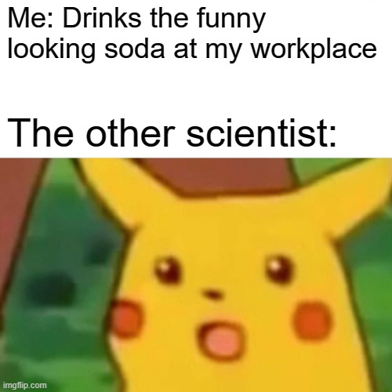

---

## 27. Predicted label: **Fear**

- **Title:** He probably thought we had forgotten about this
- **Meme caption:** Meme poster is trying to convey that CEO of Nestle gets stressed and resentful when they're denied water at a time when they're parched.
- **Raw model response:** `Fear.`
- **Manual judgment:** 
- **Human label if different:** 
- **Notes:** 

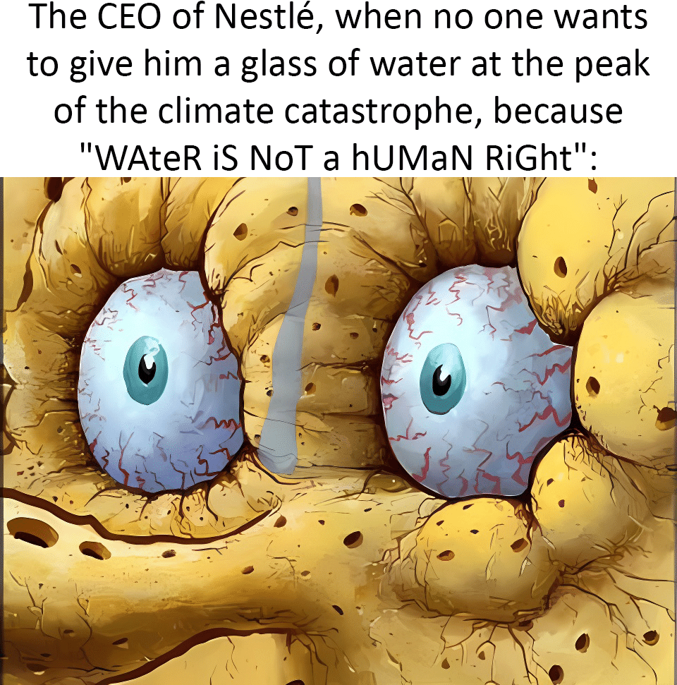

---

## 28. Predicted label: **Fear**

- **Title:** Flashbeng
- **Meme caption:** Meme poster is trying to convey that Mom's cell phone brightness are always way brighter than everything around them.
- **Raw model response:** `Fear.`
- **Manual judgment:** 
- **Human label if different:** 
- **Notes:** 

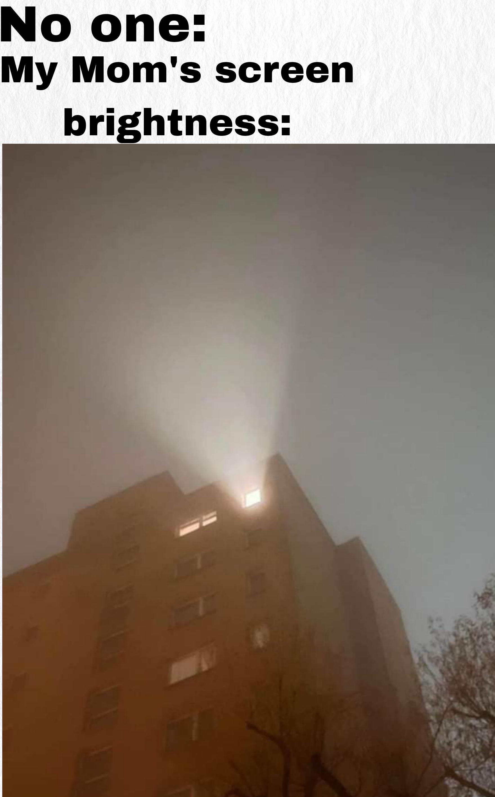

---

## 29. Predicted label: **Fear**

- **Title:** it's finally happened
- **Meme caption:** Meme poster is trying to convey that employers want to only hire people with lots of experience but applicants are so young to get that experience they need.
- **Raw model response:** `Fear.`
- **Manual judgment:** 
- **Human label if different:** 
- **Notes:** 

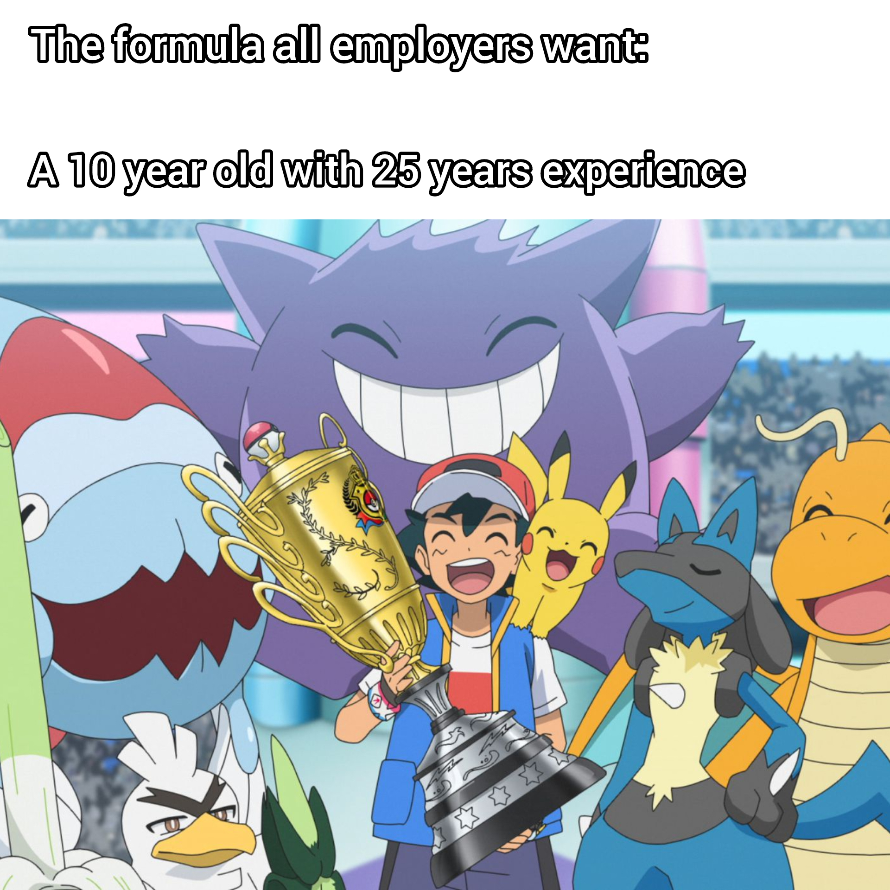

---

## 30. Predicted label: **Fear**

- **Title:** when you find out about inspect element
- **Meme caption:** Meme poster feels that they can alter their grades when using inspect element and editing a website with grades on it.
- **Raw model response:** `Fear.`
- **Manual judgment:** 
- **Human label if different:** 
- **Notes:** 

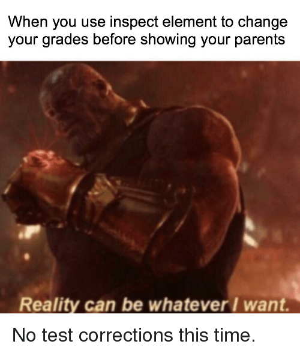

---

## 31. Predicted label: **Joy**

- **Title:** I'm looking at you gta
- **Meme caption:** Meme poster is amused because their family can't use the wifi when they're downloading a large file.
- **Raw model response:** `Joy.`
- **Manual judgment:** 
- **Human label if different:** 
- **Notes:** 

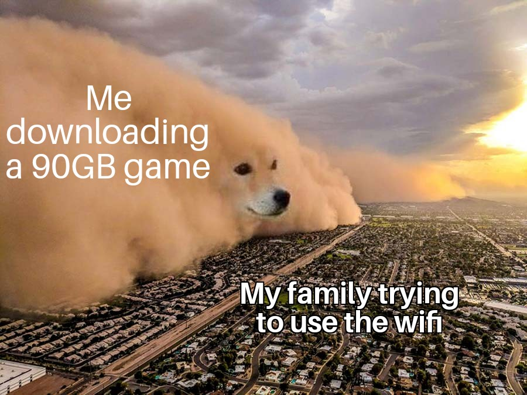

---

## 32. Predicted label: **Joy**

- **Title:** What they doin ova dere
- **Meme caption:** Meme poster is trying to convey that when people like to logged in reddit  seems busy
- **Raw model response:** `Joy.`
- **Manual judgment:** 
- **Human label if different:** 
- **Notes:** 

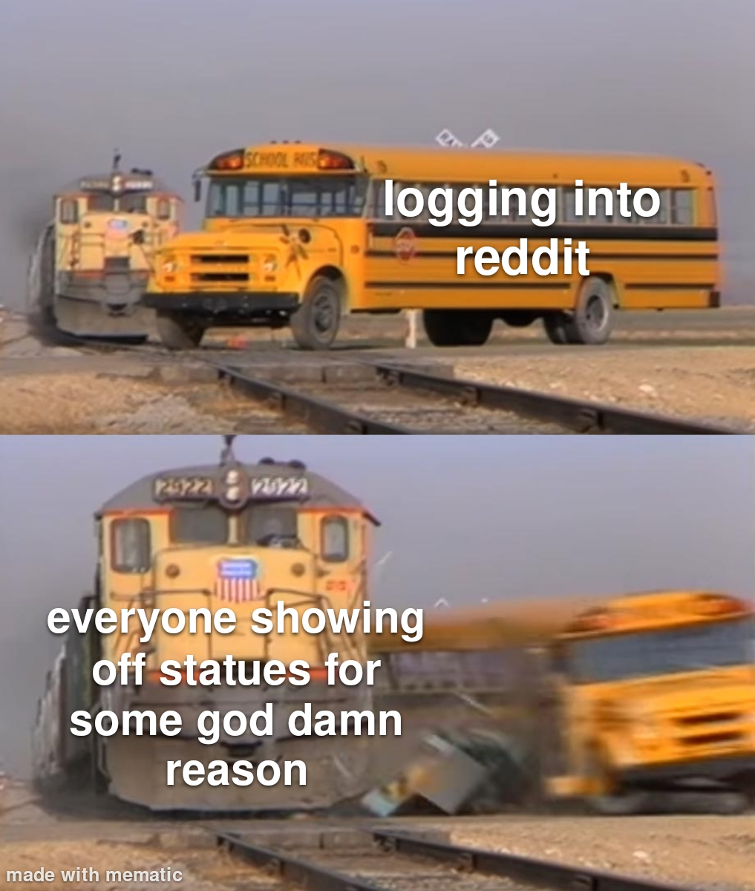

---

## 33. Predicted label: **Joy**

- **Title:** I'm going to laugh at you
- **Meme caption:** Meme poster loves themselves, so they don't care when people insult them.
- **Raw model response:** `Joy.`
- **Manual judgment:** 
- **Human label if different:** 
- **Notes:** 

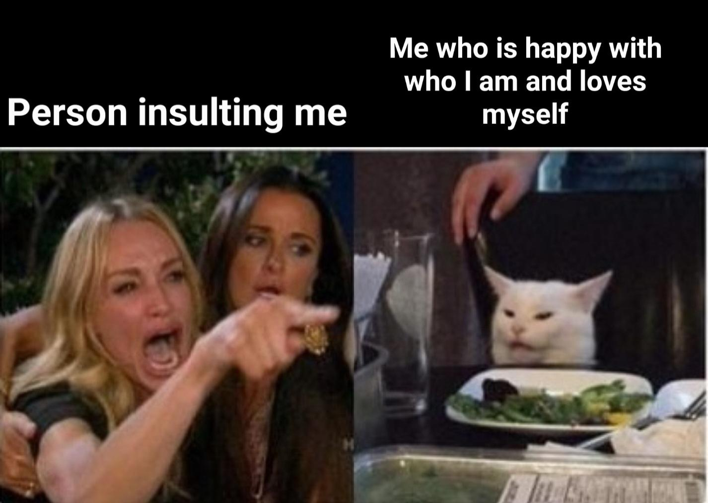

---

## 34. Predicted label: **Joy**

- **Title:** gentlemen, here's to the grind 
- **Meme caption:** The meme poster shows the strength of unity between people of different races.
- **Raw model response:** `Joy.`
- **Manual judgment:** 
- **Human label if different:** 
- **Notes:** 

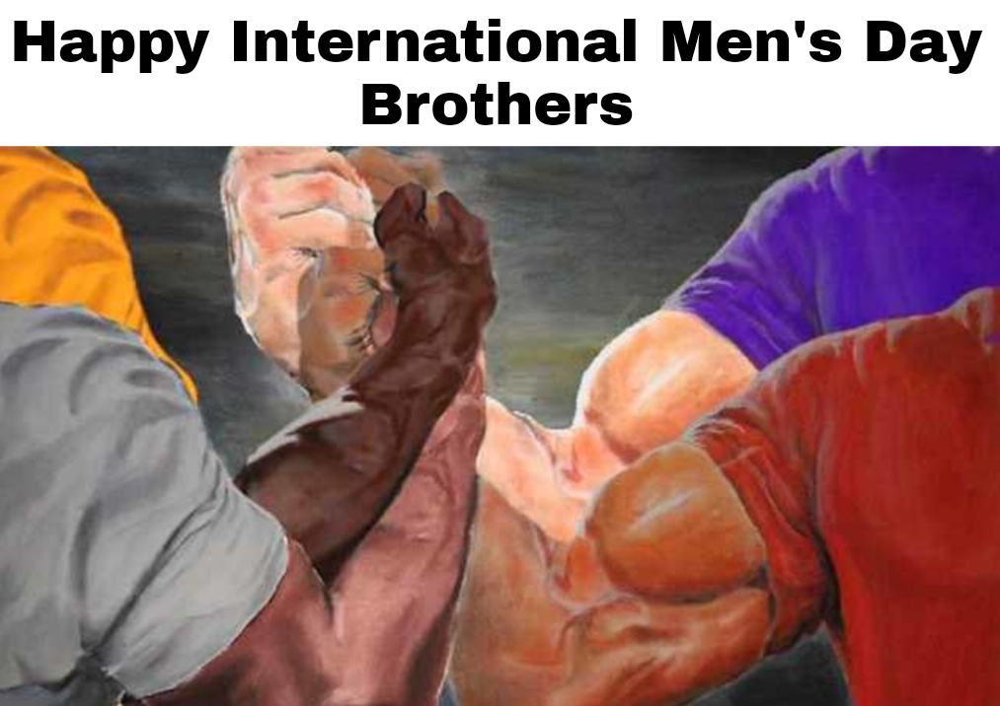

---

## 35. Predicted label: **Joy**

- **Title:** Still can't wrap my head around the fact that bottle flipping was 6 years ago
- **Meme caption:** The meme poster realizes that 2017 was five years ago, and the time flies by.
- **Raw model response:** `Joy.`
- **Manual judgment:** 
- **Human label if different:** 
- **Notes:** 

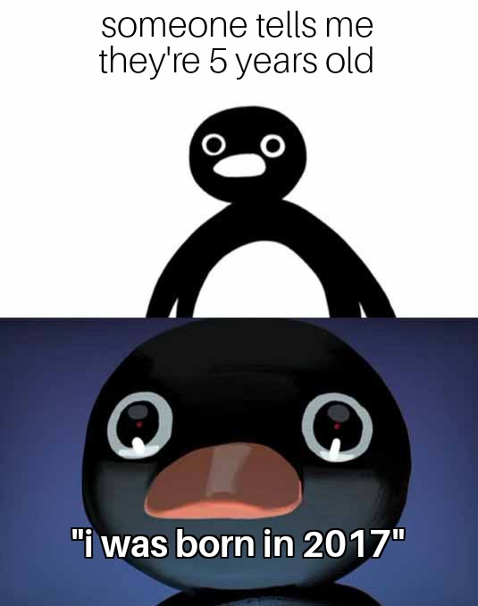

---

## 36. Predicted label: **Joy**

- **Title:** Confidential noises...
- **Meme caption:** Meme poster is trying to convey that the opposite of nervous is confident and that there is a bit of wordplay here
- **Raw model response:** `Joy.`
- **Manual judgment:** 
- **Human label if different:** 
- **Notes:** 

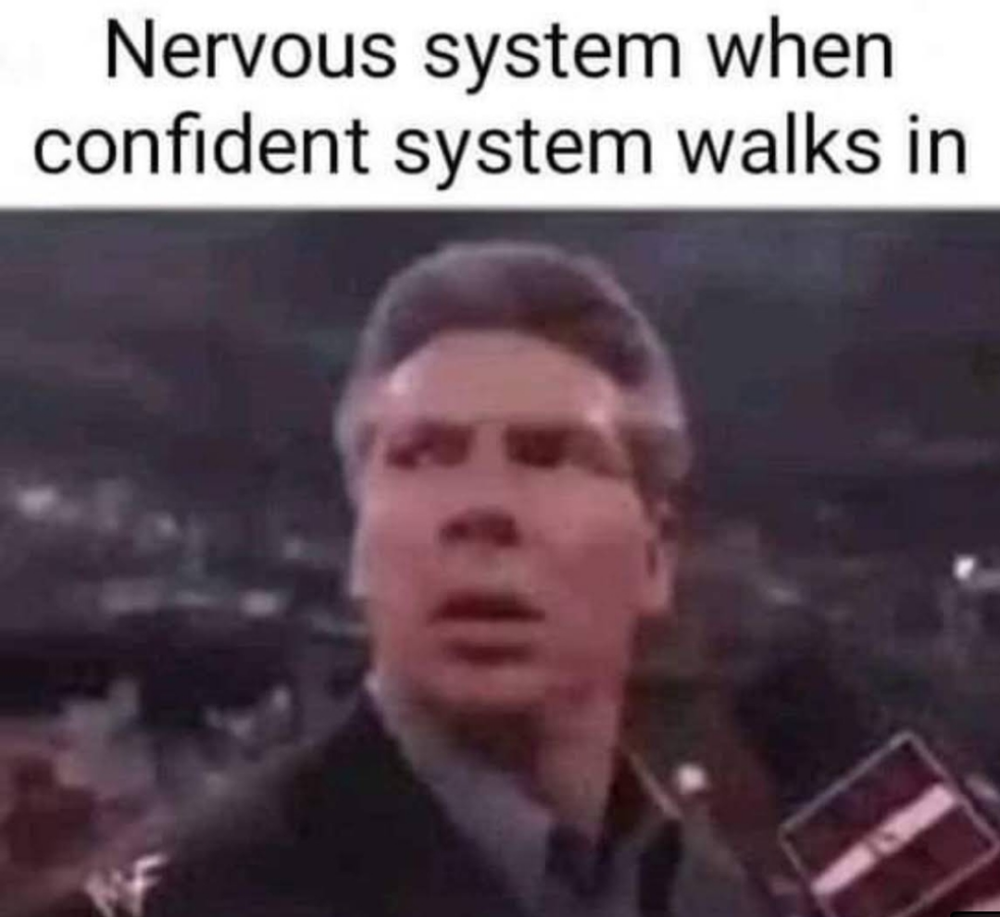

---

## 37. Predicted label: **Joy**

- **Title:** it always tears in half and stays attached
- **Meme caption:** Meme poster is trying to convey that tape always seems to break when torn off left to right versus right to left.
- **Raw model response:** `Joy`
- **Manual judgment:** 
- **Human label if different:** 
- **Notes:** 

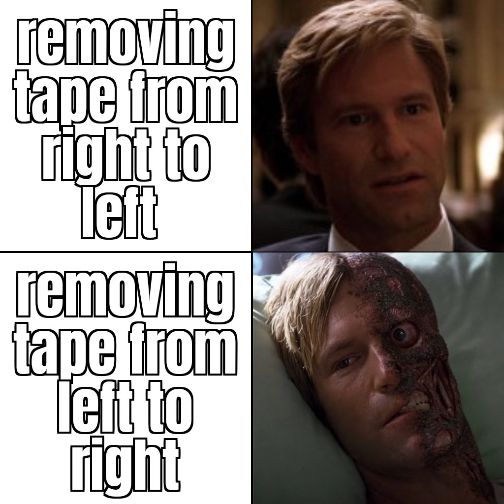

---

## 38. Predicted label: **Joy**

- **Title:** the cycle continues
- **Meme caption:** The meme poster likes this meme format. a lot.
- **Raw model response:** `The dominant emotion expressed by the meme caption is "joy."`
- **Manual judgment:** 
- **Human label if different:** 
- **Notes:** 

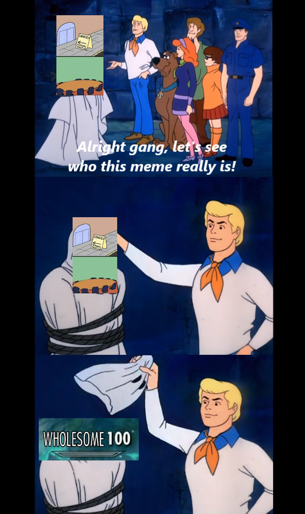

---

## 39. Predicted label: **Joy**

- **Title:** Probably a good thing they don't, it could hurt someone.
- **Meme caption:** Meme poster is trying to convey the nostalgia for a politician reading a speech from a piece of paper instead of going off the cuff.
- **Raw model response:** `Joy`
- **Manual judgment:** 
- **Human label if different:** 
- **Notes:** 

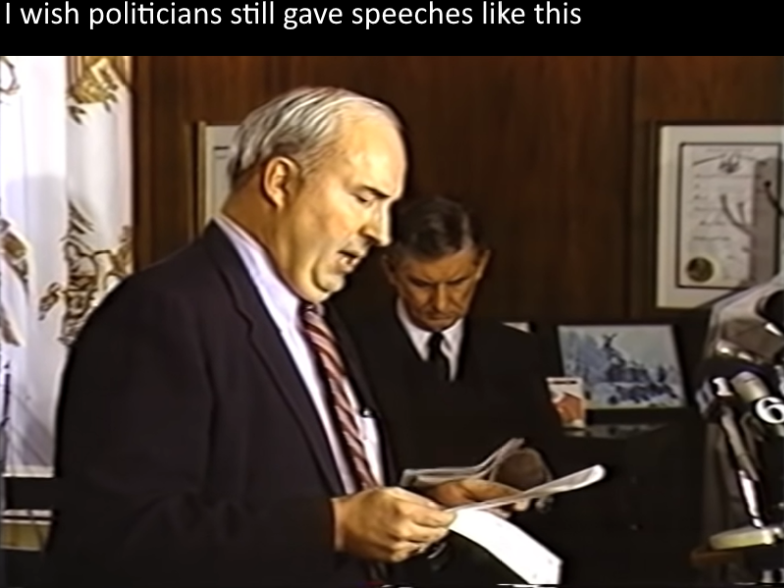

---

## 40. Predicted label: **Joy**

- **Title:** Found a format.
- **Meme caption:** Meme poster is trying to convey that While regular users where complaining about previous meme formats, the meme poster was just waiting for the right moment for their time to shine.
- **Raw model response:** `Joy.`
- **Manual judgment:** 
- **Human label if different:** 
- **Notes:** 

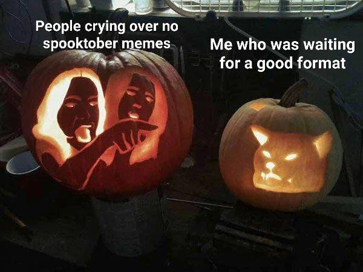

---

## 41. Predicted label: **Neutral**

- **Title:** Its a bittersweet, symphony, thats life
- **Meme caption:** The meme poster feels like life is boring, repetitive, and even depressing.
- **Raw model response:** `Neutral.`
- **Manual judgment:** 
- **Human label if different:** 
- **Notes:** 

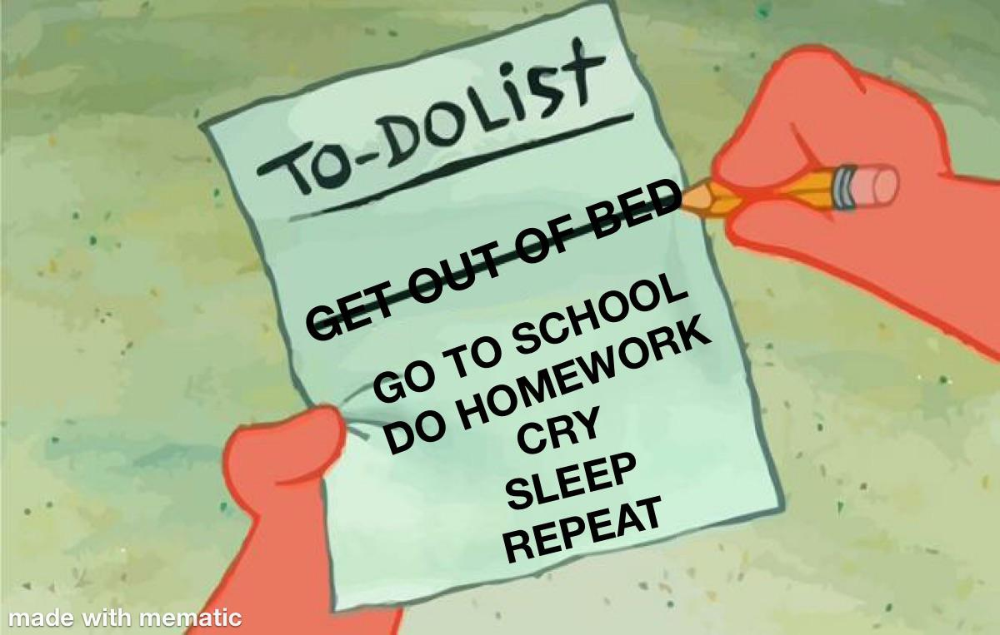

---

## 42. Predicted label: **Neutral**

- **Title:** what about TEENS:
- **Meme caption:** Meme poster is trying to convey that everyone has different thoughts.
- **Raw model response:** `Neutral.`
- **Manual judgment:** 
- **Human label if different:** 
- **Notes:** 

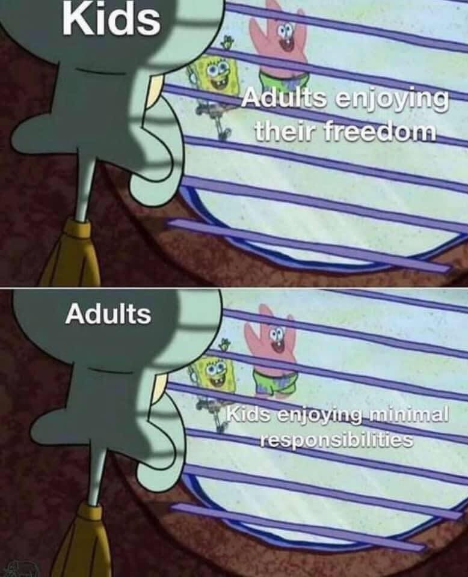

---

## 43. Predicted label: **Neutral**

- **Title:** Common Mee6 L
- **Meme caption:** Meme poster is trying to convey that individual is going to give some advice to poster who wrote long post.
- **Raw model response:** `Neutral.`
- **Manual judgment:** 
- **Human label if different:** 
- **Notes:** 

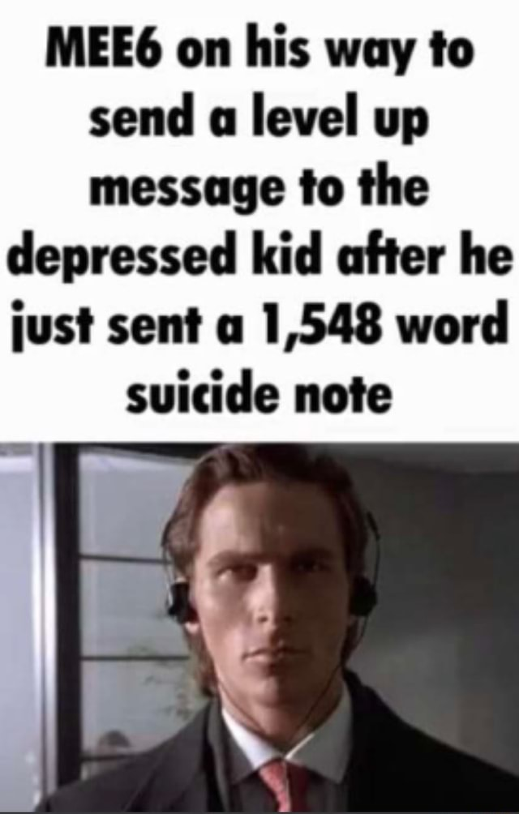

---

## 44. Predicted label: **Neutral**

- **Title:** East European names are a hassle sometimes go pronounce
- **Meme caption:** Meme poster is trying to convey that Polish names can be hard to pronounce for those of a different linguistic background.
- **Raw model response:** `Neutral.`
- **Manual judgment:** 
- **Human label if different:** 
- **Notes:** 

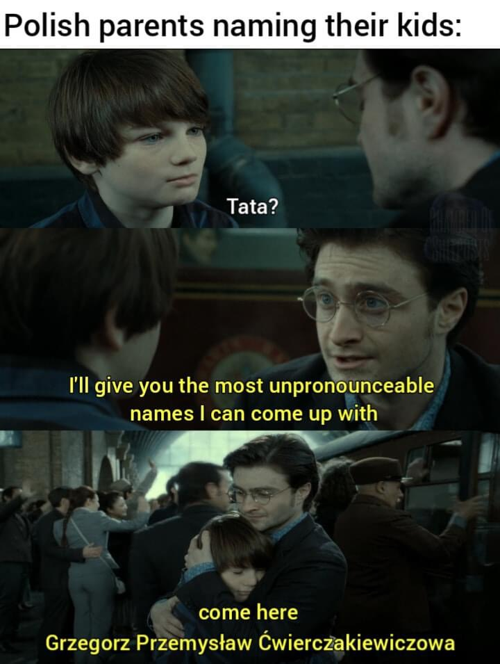

---

## 45. Predicted label: **Neutral**

- **Title:** Where my Canadian brothers at
- **Meme caption:** Canadians are looking over the border and trying to figure out what is going on in Ohio.
- **Raw model response:** `Neutral.`
- **Manual judgment:** 
- **Human label if different:** 
- **Notes:** 

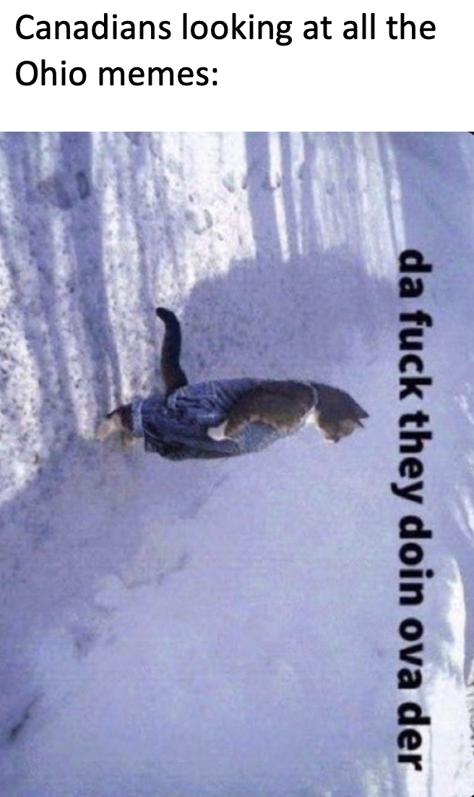

---

## 46. Predicted label: **Neutral**

- **Title:** Movies vs Real life
- **Meme caption:** Meme poster is trying to convey that real life is NOT a movie.
- **Raw model response:** `Neutral.`
- **Manual judgment:** 
- **Human label if different:** 
- **Notes:** 

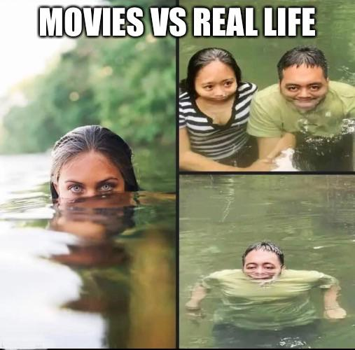

---

## 47. Predicted label: **Neutral**

- **Title:** So long, partner :'(
- **Meme caption:** Meme poster doesn't realize how much free time is worth when your friend has a full time job.
- **Raw model response:** `Neutral.`
- **Manual judgment:** 
- **Human label if different:** 
- **Notes:** 

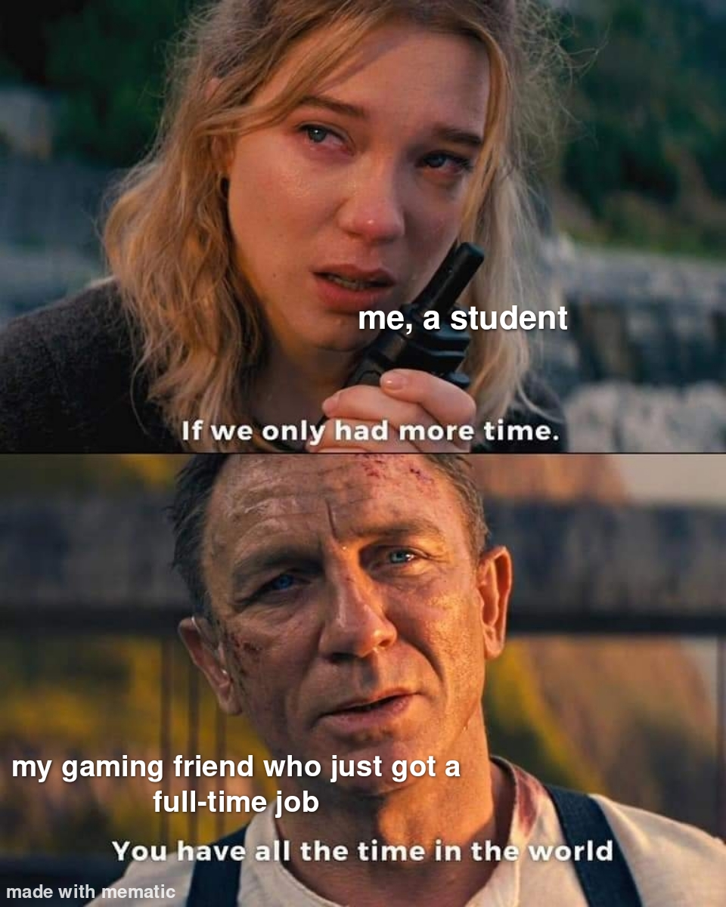

---

## 48. Predicted label: **Neutral**

- **Title:** From my old meme folder
- **Meme caption:** The meme poster prefer FapNap over wet dreams.
- **Raw model response:** `The dominant emotion expressed by the meme caption "The meme poster prefer FapNap over wet dreams" is neutral.`
- **Manual judgment:** 
- **Human label if different:** 
- **Notes:** 

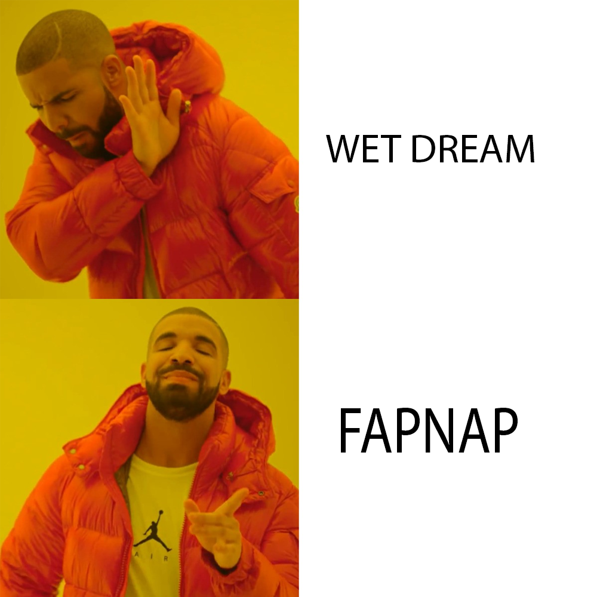

---

## 49. Predicted label: **Neutral**

- **Title:** Or sometimes both
- **Meme caption:** The meme poster is ready to decide whether to be a soft or rude character in the vampire movies.
- **Raw model response:** `Neutral.`
- **Manual judgment:** 
- **Human label if different:** 
- **Notes:** 

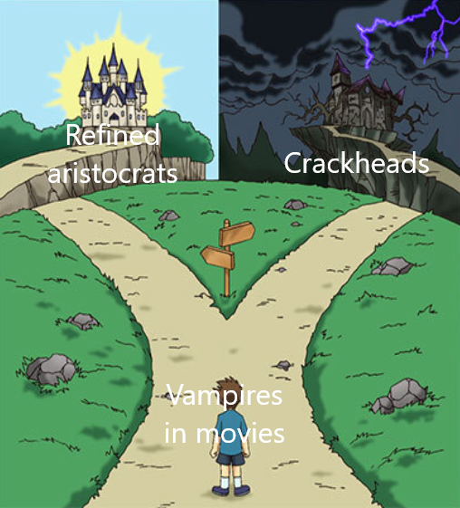

---

## 50. Predicted label: **Neutral**

- **Title:** Every. Morning.
- **Meme caption:** Meme poster's brain doesn't want them to remember the dream they just had.
- **Raw model response:** `Neutral.`
- **Manual judgment:** 
- **Human label if different:** 
- **Notes:** 

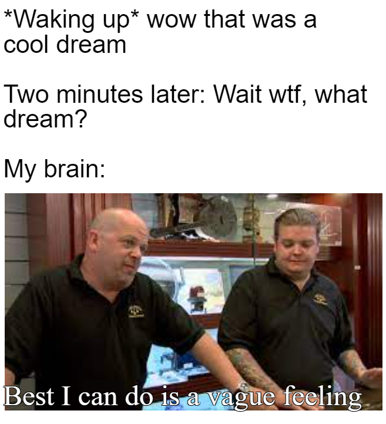

---

## 51. Predicted label: **Sadness**

- **Title:** Look at how they massacred my boy
- **Meme caption:** Meme poster is trying to convey that How bad they feel when their favorite tupperware gets stained
- **Raw model response:** `Sadness.`
- **Manual judgment:** 
- **Human label if different:** 
- **Notes:** 

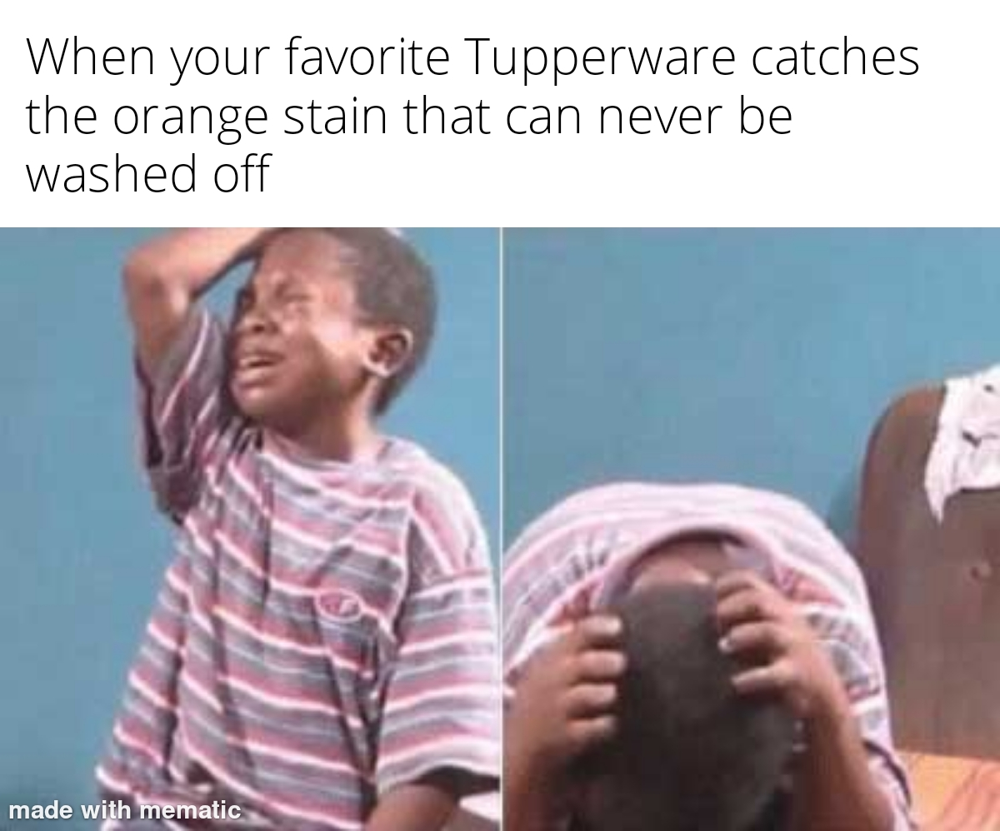

---

## 52. Predicted label: **Sadness**

- **Title:** Very sad.
- **Meme caption:** Meme poster is sad watching a competition they think they can win.
- **Raw model response:** `Sadness.`
- **Manual judgment:** 
- **Human label if different:** 
- **Notes:** 

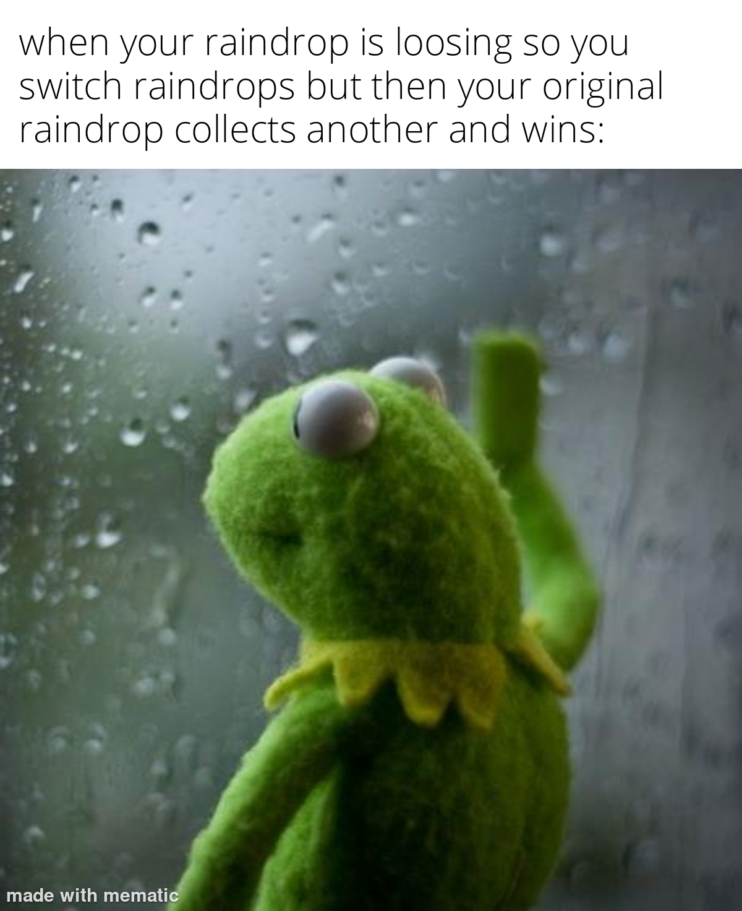

---

## 53. Predicted label: **Sadness**

- **Title:** Such sad
- **Meme caption:** Meme poster is feeling sad because the only person that commented on your post is the moderator so you know you are not popular.
- **Raw model response:** `Sadness.`
- **Manual judgment:** 
- **Human label if different:** 
- **Notes:** 

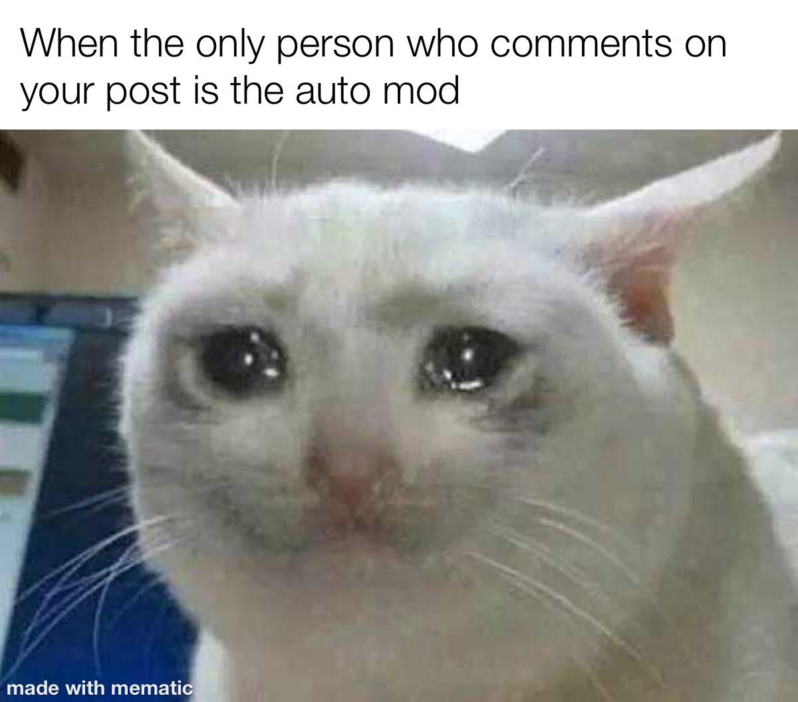

---

## 54. Predicted label: **Sadness**

- **Title:** I check every morning
- **Meme caption:** Meme poster is trying to convey that they feel blue/depressed every day.
- **Raw model response:** `Sadness.`
- **Manual judgment:** 
- **Human label if different:** 
- **Notes:** 

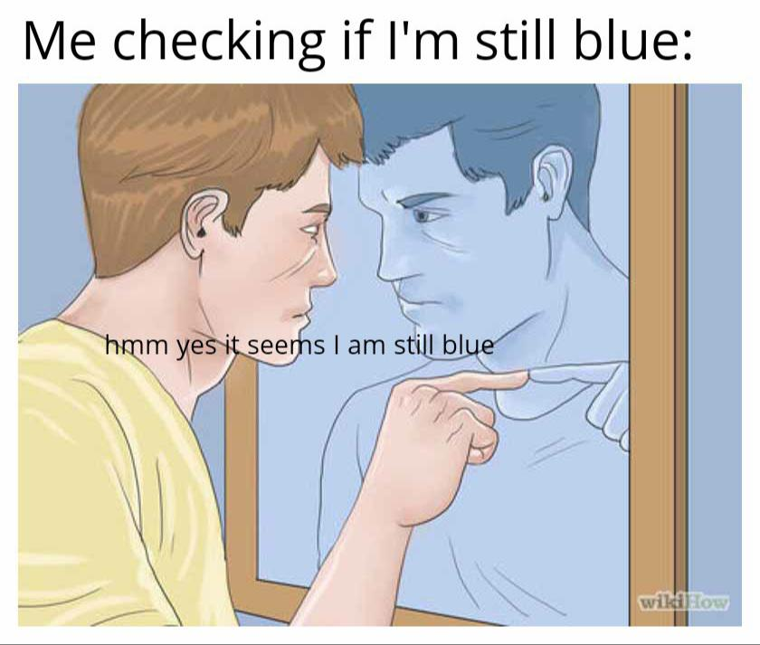

---

## 55. Predicted label: **Sadness**

- **Title:** I shall now cope with memes
- **Meme caption:** Meme poster is trying to convey that they're sad because their girlfriend broke up with them.
- **Raw model response:** `Sadness.`
- **Manual judgment:** 
- **Human label if different:** 
- **Notes:** 

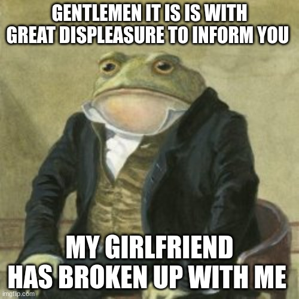

---

## 56. Predicted label: **Sadness**

- **Title:** Core memory unlocked
- **Meme caption:** The meme poster feel sad for missing such a good song.
- **Raw model response:** `Sadness.`
- **Manual judgment:** 
- **Human label if different:** 
- **Notes:** 

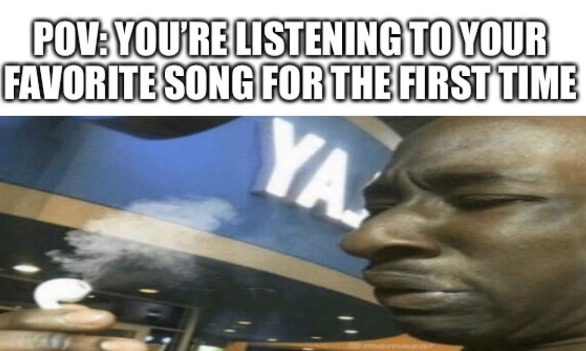

---

## 57. Predicted label: **Sadness**

- **Title:** Uncharacteristic, innit!
- **Meme caption:** Meme poster is disappointed when British accents aren't stereotypical.
- **Raw model response:** `Sadness.`
- **Manual judgment:** 
- **Human label if different:** 
- **Notes:** 

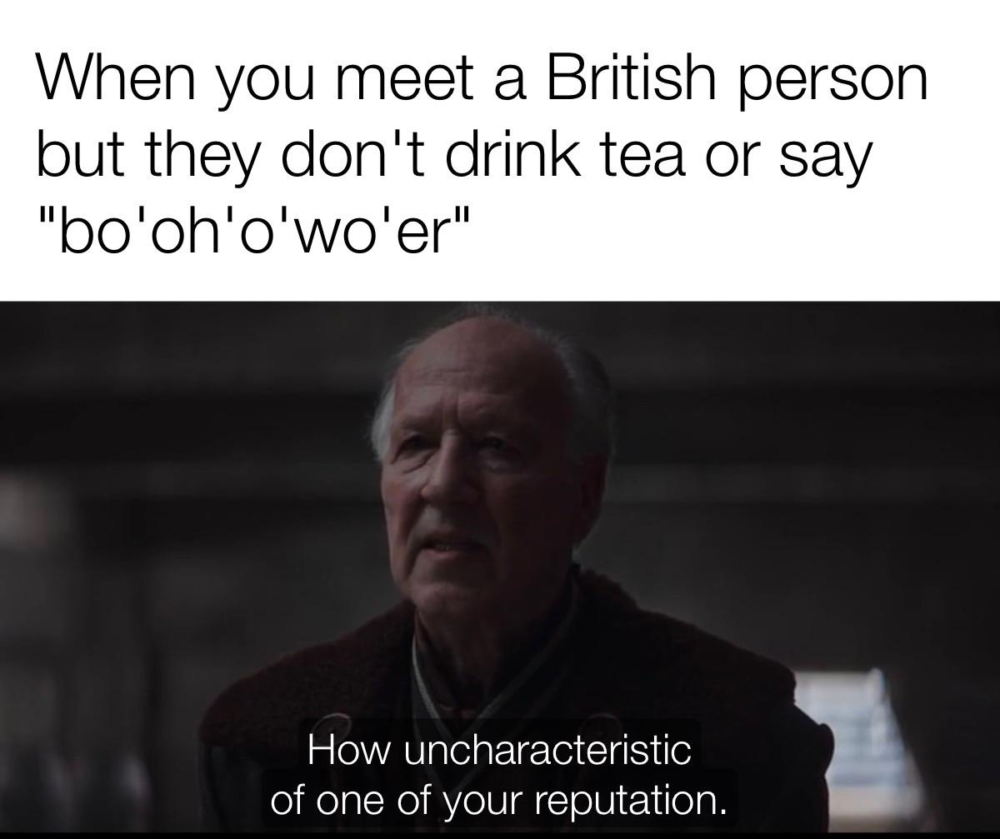

---

## 58. Predicted label: **Sadness**

- **Title:** Daily Nichijou meme #1680
- **Meme caption:** The meme poster feels sad that no one wants him although there are 8 Billion people on the world.
- **Raw model response:** `Sadness.`
- **Manual judgment:** 
- **Human label if different:** 
- **Notes:** 

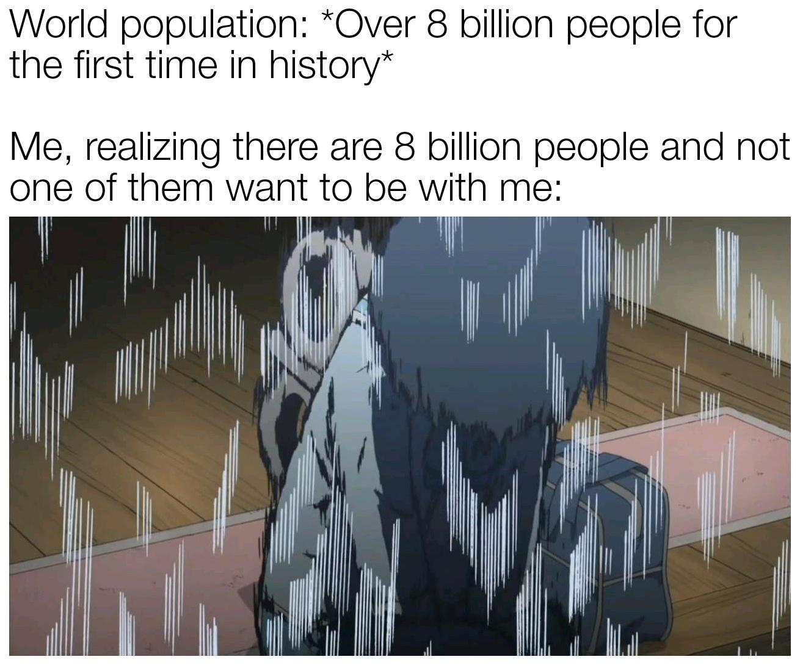

---

## 59. Predicted label: **Sadness**

- **Title:** based on a true story
- **Meme caption:** Meme poster feels defeated when banned from the Reddit no rules subreddit.
- **Raw model response:** `Sadness.`
- **Manual judgment:** 
- **Human label if different:** 
- **Notes:** 

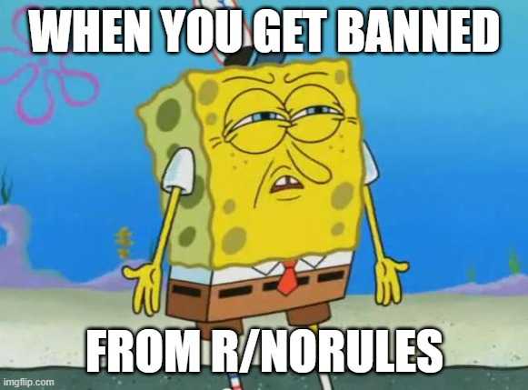

---

## 60. Predicted label: **Sadness**

- **Title:** it's like this every time
- **Meme caption:** Poster is conveying the futility of posting about your birthday when nobody cares.
- **Raw model response:** `Sadness.`
- **Manual judgment:** 
- **Human label if different:** 
- **Notes:** 

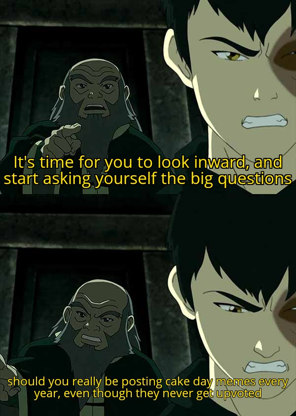

---

## 61. Predicted label: **Surprise**

- **Title:** Google? Never heard of it.
- **Meme caption:** The meme poster thinks people are as confused as Andy Dwyer when they don't know how to use google.
- **Raw model response:** `Surprise.`
- **Manual judgment:** 
- **Human label if different:** 
- **Notes:** 

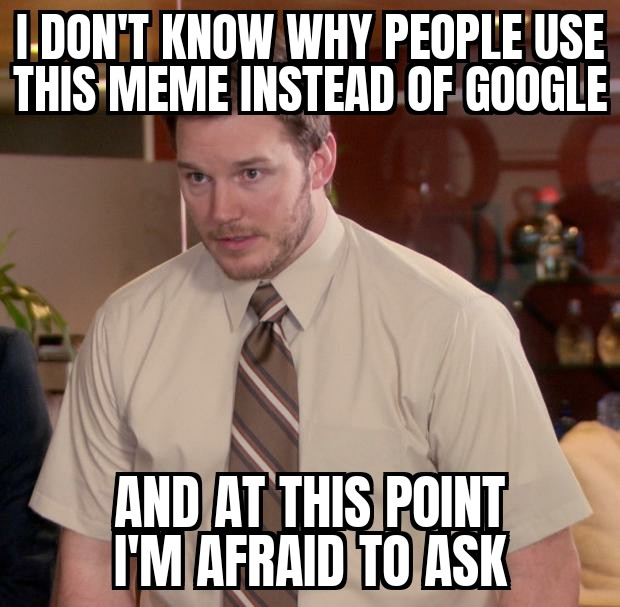

---

## 62. Predicted label: **Surprise**

- **Title:** i n c l u s i v i t y
- **Meme caption:** Meme poster is trying to convey that Scooby Doo characters of the past are confused about the new version especially Shaggy who changed races.
- **Raw model response:** `Surprise.`
- **Manual judgment:** 
- **Human label if different:** 
- **Notes:** 

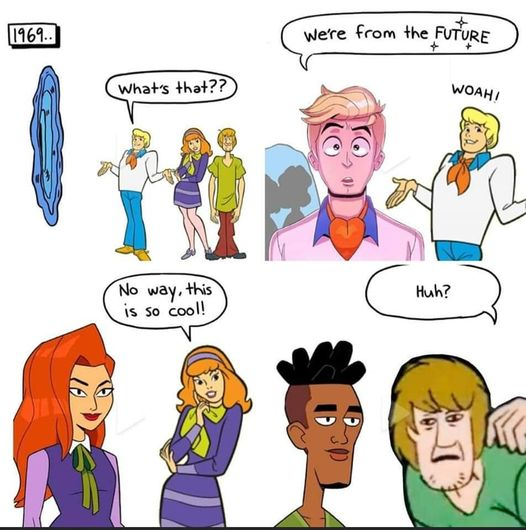

---

## 63. Predicted label: **Surprise**

- **Title:** Siiienss
- **Meme caption:** Meme poster is trying to convey a joke about how Newton likes larger women so made a law of physic to describe it
- **Raw model response:** `The dominant emotion expressed by the meme caption is "surprise".`
- **Manual judgment:** 
- **Human label if different:** 
- **Notes:** 

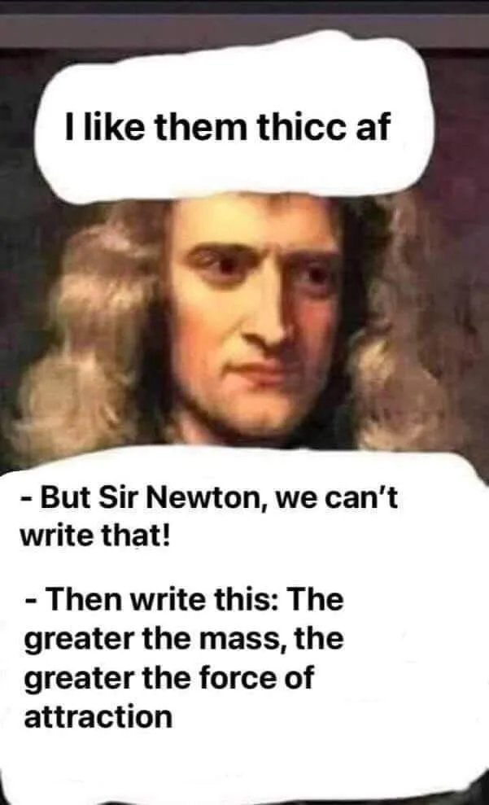

---

## 64. Predicted label: **Surprise**

- **Title:** Some call it fingerpainting...
- **Meme caption:** Meme poster is trying to convey their reality of being a digital artist and what their friends thing of what they actually do
- **Raw model response:** `Surprise.`
- **Manual judgment:** 
- **Human label if different:** 
- **Notes:** 

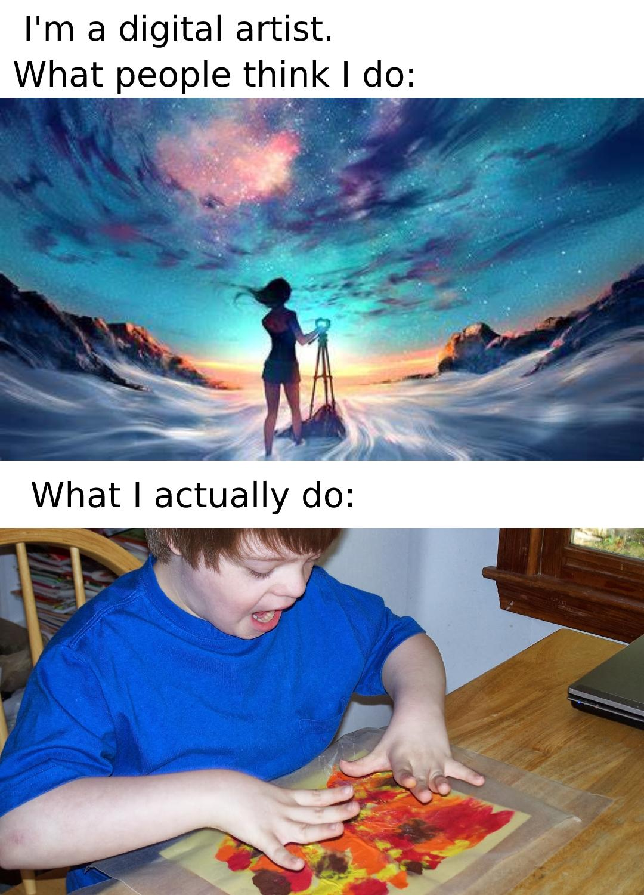

---

## 65. Predicted label: **Surprise**

- **Title:** ,  .
- **Meme caption:** Meme poster is trying to outrun their previous mistake of translating Russian.
- **Raw model response:** `Surprise.`
- **Manual judgment:** 
- **Human label if different:** 
- **Notes:** 

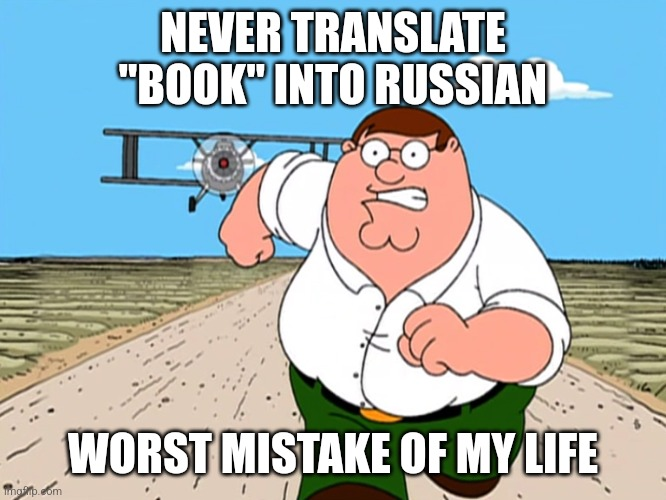

---

## 66. Predicted label: **Surprise**

- **Title:** No tengo ni idea de lo que past en realidad
- **Meme caption:** Meme poster is trying to convey that the white guy or meme poster is going through culture shock right now
- **Raw model response:** `Surprise.`
- **Manual judgment:** 
- **Human label if different:** 
- **Notes:** 

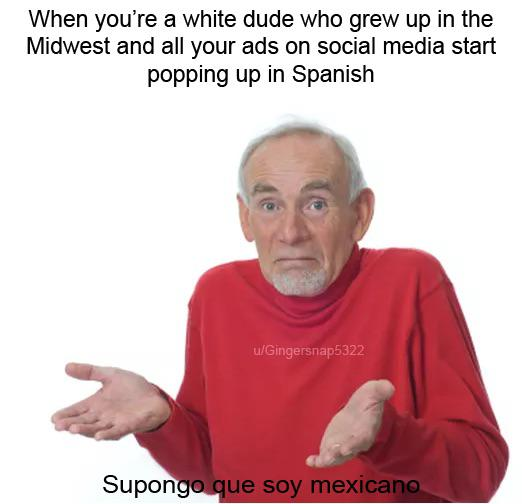

---

## 67. Predicted label: **Surprise**

- **Title:** I apologize.
- **Meme caption:** The poster knows they made a bad meme, but they don't care.
- **Raw model response:** `Surprise.`
- **Manual judgment:** 
- **Human label if different:** 
- **Notes:** 

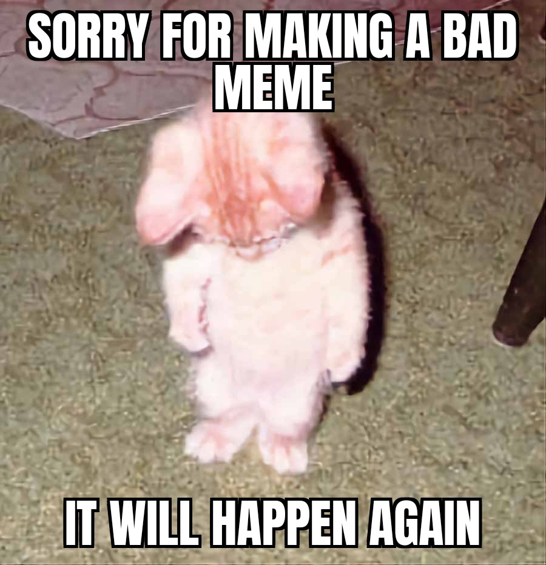

---

## 68. Predicted label: **Surprise**

- **Title:** I have a problem
- **Meme caption:** Meme poster is trying to convey that people have a hard time remembering new details when thinking about something of personal interest.
- **Raw model response:** `Surprise.`
- **Manual judgment:** 
- **Human label if different:** 
- **Notes:** 

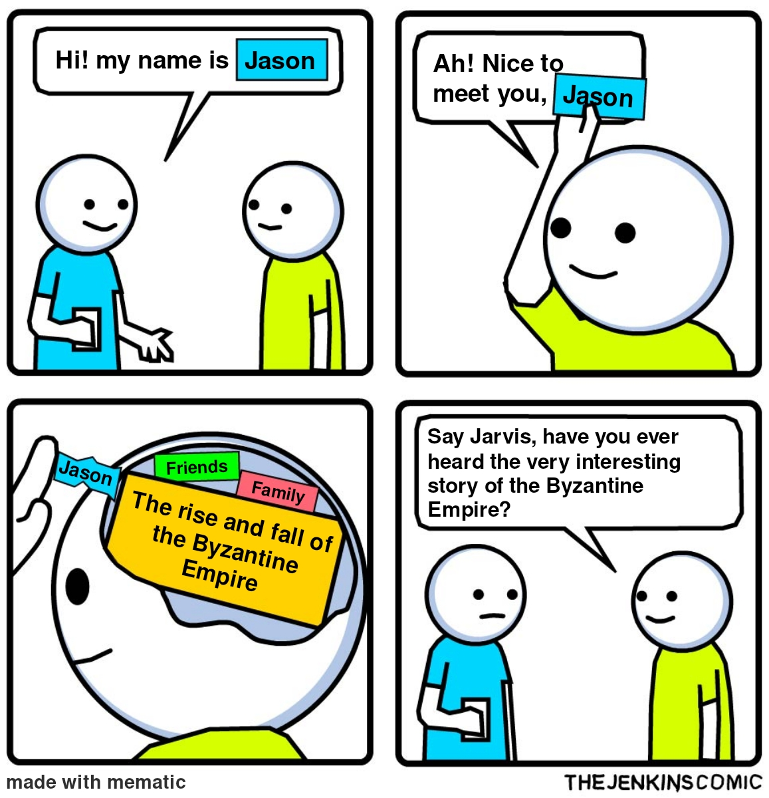

---

## 69. Predicted label: **Surprise**

- **Title:** Theyre making movies based on facial expressions now
- **Meme caption:** Meme poster is trying to convey that the movie studio created frown as a sequel to smile.
- **Raw model response:** `Surprise.`
- **Manual judgment:** 
- **Human label if different:** 
- **Notes:** 

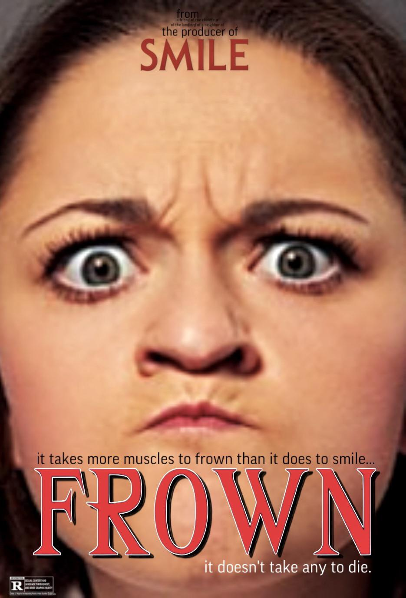

---

## 70. Predicted label: **Surprise**

- **Title:** their grain
- **Meme caption:** Meme poster is trying to convey that A pun using migraine to mean "my grain" is showing the different between ownership in a free society versus a communist society.
- **Raw model response:** `The dominant emotion expressed by the meme caption is "surprise".`
- **Manual judgment:** 
- **Human label if different:** 
- **Notes:** 

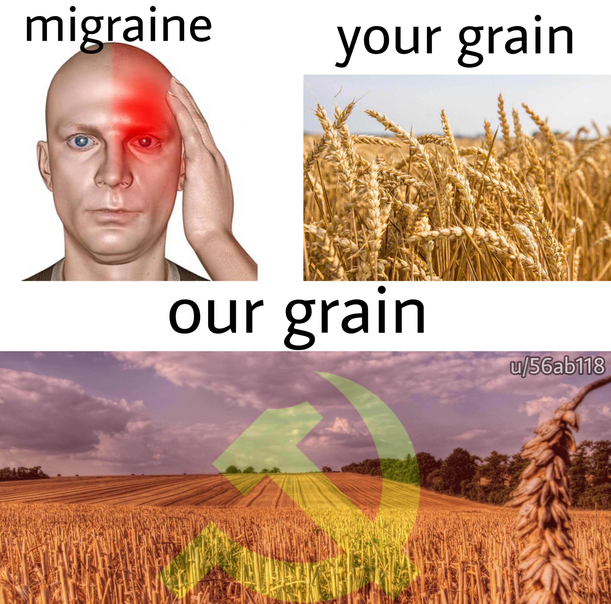

---

## 71. Predicted label: **INVALID**

- **Title:** Interesting bout would occur here.
- **Meme caption:** Meme poster is curious about who would win between storm toopers and red shirt crew members from Star Trek
- **Raw model response:** `neutrality`
- **Manual judgment:** 
- **Human label if different:** 
- **Notes:** 

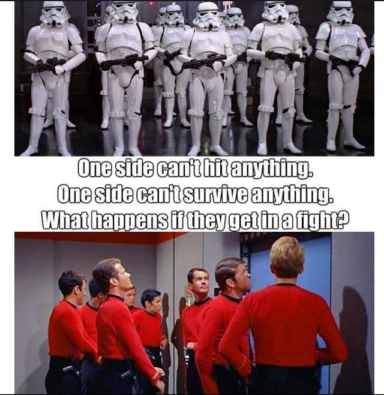

---

