# Qwen-VL Sentiment Label Manual Quality Check

Use this file to manually inspect silver-label noise.

Suggested manual columns to add while reviewing:

- Correct? yes/no/ambiguous
- Human label
- Notes

---

## 1. Predicted label: **Anger**

- **Title:** Just a casual observation
- **Meme caption:** Meme poster is confused about UK artists refusing to change lyrics of slurs for the us when the us does for them.
- **Literal image caption:** Scarlet Witch from the top starts making funny expressions towards Dr Strange
- **Raw model response:** `Anger`
- **Manual judgment:** 
- **Human label if different:** 
- **Notes:** 

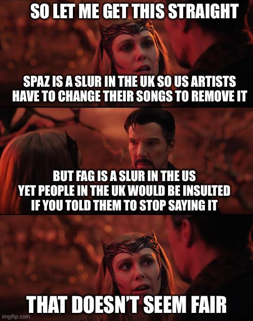

---

## 2. Predicted label: **Anger**

- **Title:** How high can you count?
- **Meme caption:** They will annoy people around them by continously counting until other people yell at them to stop
- **Literal image caption:** People join another person in bed.
- **Raw model response:** `Anger`
- **Manual judgment:** 
- **Human label if different:** 
- **Notes:** 

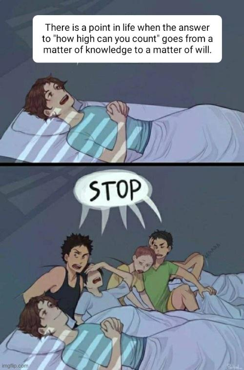

---

## 3. Predicted label: **Anger**

- **Title:** who would win?
- **Meme caption:** Meme poster wants the annoying blonde and brunette boy to fight each other.
- **Literal image caption:** A blonde boy is so scared he's pooping while the brunette one has a snot rocket.
- **Raw model response:** `Anger`
- **Manual judgment:** 
- **Human label if different:** 
- **Notes:** 

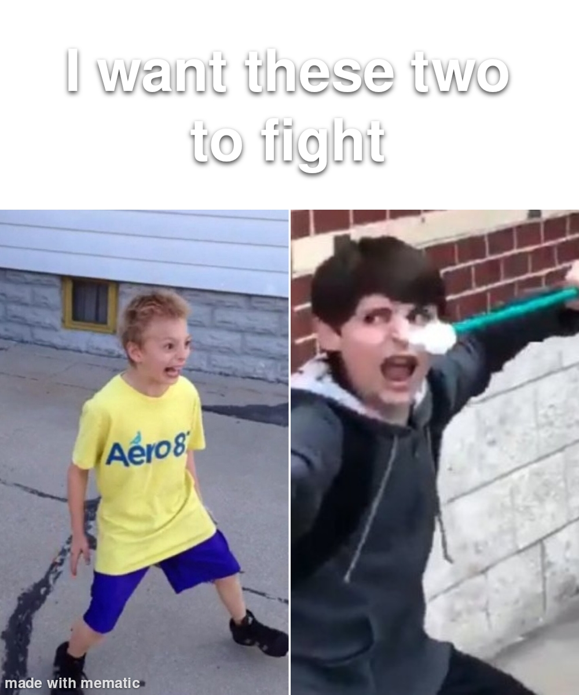

---

## 4. Predicted label: **Anger**

- **Title:** Twitter much(sk)
- **Meme caption:** Meme poster is trying to convey that Elon Musk is driving himself crazy with Twitter like Roadrunner and the coyote.
- **Literal image caption:** A man has twitter logos around his head like Wile E Coyote and the roadrunner.
- **Raw model response:** `Anger`
- **Manual judgment:** 
- **Human label if different:** 
- **Notes:** 

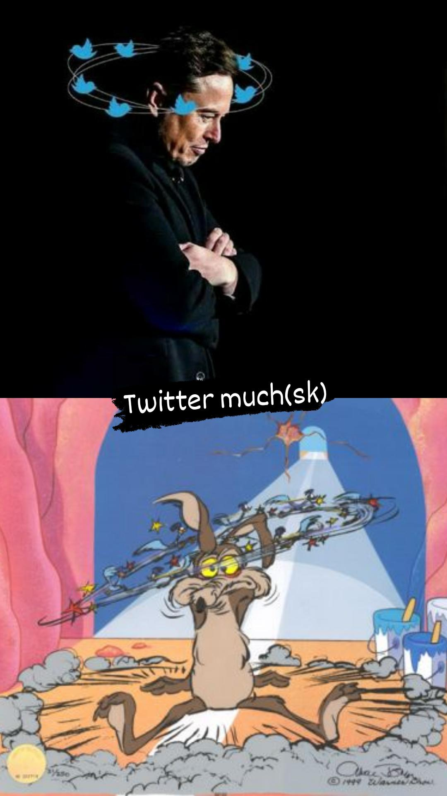

---

## 5. Predicted label: **Anger**

- **Title:** I ain't god
- **Meme caption:** Meme poster is angry the person they helped is thanking god instead of them.
- **Literal image caption:** A child looks annoyed at the camera.
- **Raw model response:** `Anger`
- **Manual judgment:** 
- **Human label if different:** 
- **Notes:** 

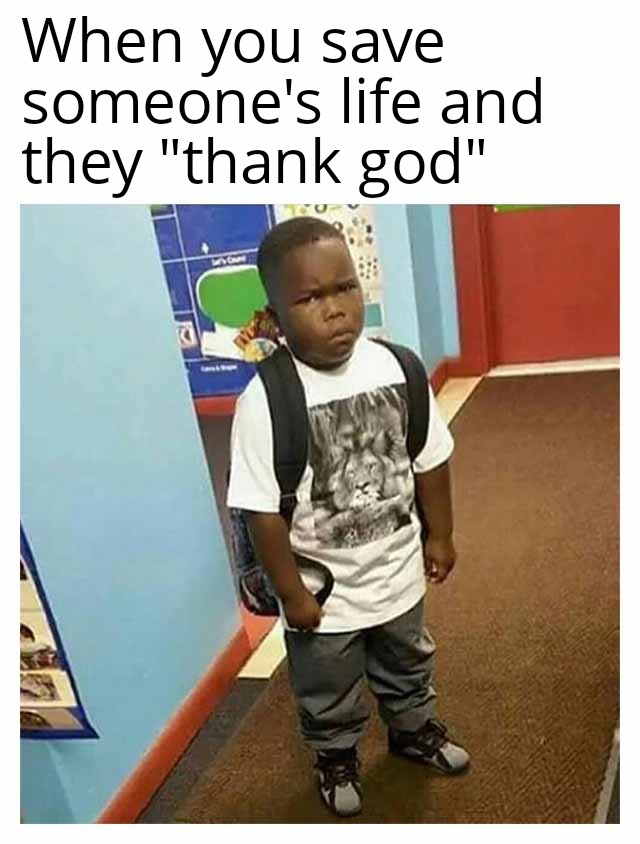

---

## 6. Predicted label: **Anger**

- **Title:** I AM THE CEO OF OFFENDED
- **Meme caption:** Meme poster is trying to convey that Boss Baby is trying to use every political group to offend everyone.
- **Literal image caption:** Boss Baby is planning things with different political logos around his head.
- **Raw model response:** `The dominant intended emotion of the internet meme is "anger".`
- **Manual judgment:** 
- **Human label if different:** 
- **Notes:** 

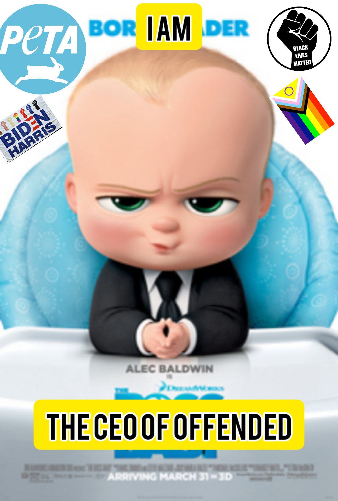

---

## 7. Predicted label: **Anger**

- **Title:** Everyday for me in high school
- **Meme caption:** Meme poster is trying to convey that Teachers are mad when they shouldn't be and care about the wrong things.
- **Literal image caption:** a picture of a angry flower at the top and a happy flower in the down part
- **Raw model response:** `Anger`
- **Manual judgment:** 
- **Human label if different:** 
- **Notes:** 

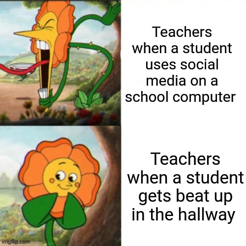

---

## 8. Predicted label: **Anger**

- **Title:** sorry for format
- **Meme caption:** Meme poster gets mad to see the news.
- **Literal image caption:** A yellow square on top and a young woman sitting between a teenage boy and a younger boy on the bottom
- **Raw model response:** `Anger`
- **Manual judgment:** 
- **Human label if different:** 
- **Notes:** 

---

## 9. Predicted label: **Anger**

- **Title:** It's cannibalism.
- **Meme caption:** Meme poster is trying to convey that the government puts out answers to homelessness and world hunger that they know won't work but shut down any discussion of the actual solution.
- **Literal image caption:** A cat looks angry while in a cage.
- **Raw model response:** `The single best label for this internet meme is "Anger". The text suggests that the meme poster is frustrated with the government's approach to addressing homelessness and world hunger, and feels that the government is not taking meaningful action to address the issue. The use of the word "outrage" implies a strong feeling of anger or annoyance towards the government's actions.`
- **Manual judgment:** 
- **Human label if different:** 
- **Notes:** 

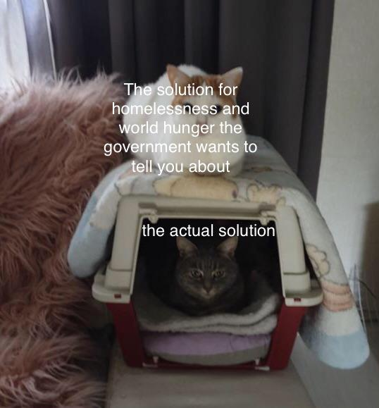

---

## 10. Predicted label: **Anger**

- **Title:** To everyone making memes over the fake article
- **Meme caption:** Meme poster thinks normal people refuse to believe young people are cancelling a emoji despite website scare articles.
- **Literal image caption:** A blonde man is talking to a bald guy and alarming him.
- **Raw model response:** `Anger`
- **Manual judgment:** 
- **Human label if different:** 
- **Notes:** 

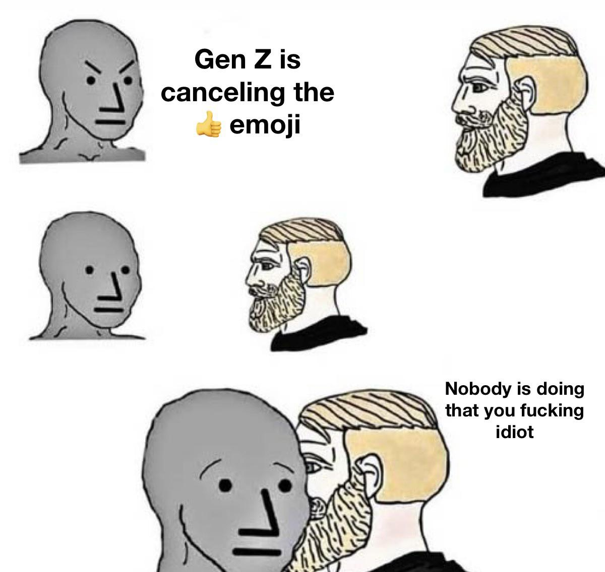

---

## 11. Predicted label: **Disgust**

- **Title:** If you could stop blasting me with ads that would be great.
- **Meme caption:** Meme user is disgusted Samsung keeps trying to make foldable phones happen.
- **Literal image caption:** A woman is looking at you in disgust.
- **Raw model response:** `Disgust`
- **Manual judgment:** 
- **Human label if different:** 
- **Notes:** 

---

## 12. Predicted label: **Disgust**

- **Title:** YOU WHAT
- **Meme caption:** Meme poster is trying to convey that Janitor is disturbed by kid's eating habits. 
- **Literal image caption:** The fish from Spongebob looks shocked and is ready to say "you WHAT??"
- **Raw model response:** `Disgust`
- **Manual judgment:** 
- **Human label if different:** 
- **Notes:** 

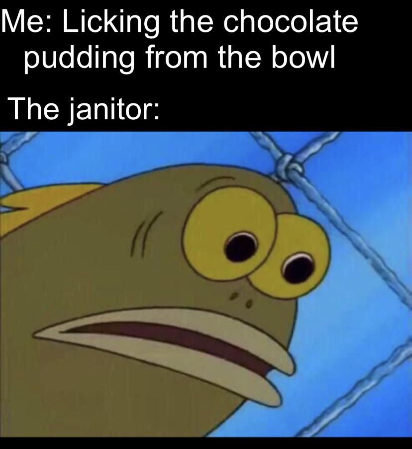

---

## 13. Predicted label: **Disgust**

- **Title:** This stuff is unnecessarily greasy
- **Meme caption:** Meme poster is trying to convey that the cheese bologna is rather gross and greasy
- **Literal image caption:** A packages of lunchmeat is above a man looking happy and one that looks scared.
- **Raw model response:** `Disgust`
- **Manual judgment:** 
- **Human label if different:** 
- **Notes:** 

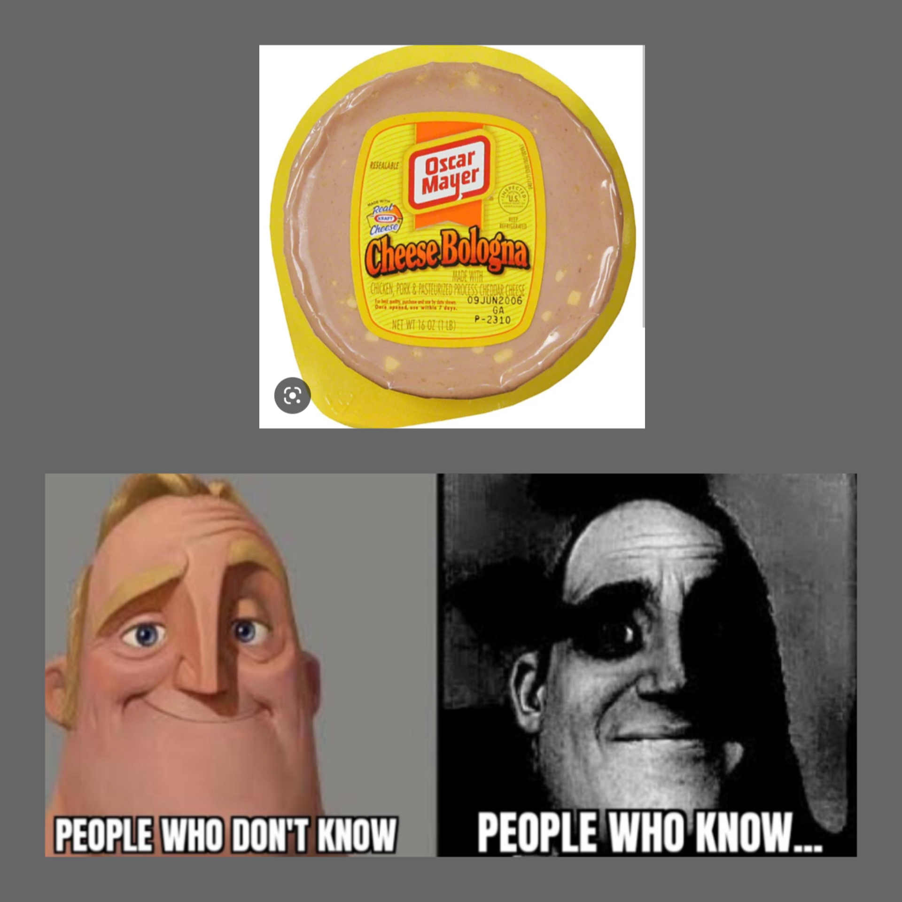

---

## 14. Predicted label: **Disgust**

- **Title:** my cat is getting really fat
- **Meme caption:** The meme poster is mad at itself for being fat and is presenting its fat as a gift for this Christmas.
- **Literal image caption:** A white cat is looking unimpressed.
- **Raw model response:** `The dominant intended emotion of the internet meme is "disgust".`
- **Manual judgment:** 
- **Human label if different:** 
- **Notes:** 

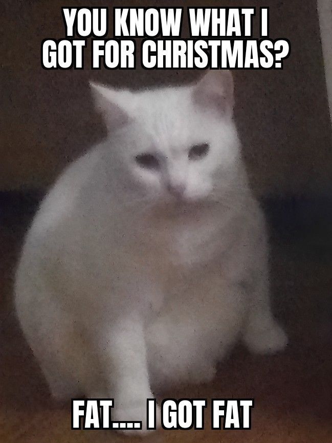

---

## 15. Predicted label: **Disgust**

- **Title:** Yeah ok
- **Meme caption:** Meme poster is trying to convey that kindergarten teachers are disgusted with the names of their students.
- **Literal image caption:** The girl is looking at the disgusting.
- **Raw model response:** `Disgust`
- **Manual judgment:** 
- **Human label if different:** 
- **Notes:** 

---

## 16. Predicted label: **Disgust**

- **Title:** It didn't really work, did it?
- **Meme caption:** Meme poster is trying to convey that YouTube removing the dislike button didn't work to remove negative sentiment about videos.
- **Literal image caption:** a comic of moe  kicking out Barney from bar but last strip he is seen behind moe
- **Raw model response:** `Disgust`
- **Manual judgment:** 
- **Human label if different:** 
- **Notes:** 

---

## 17. Predicted label: **Disgust**

- **Title:** What the hell is wrong with people
- **Meme caption:** Meme poster feels gross about how Disney market use their characters when seeing an ad for baby yoda toothpaste cap.
- **Literal image caption:** a hand holding a toothpaste bedside toothbrush and an old man
- **Raw model response:** `Disgust.`
- **Manual judgment:** 
- **Human label if different:** 
- **Notes:** 

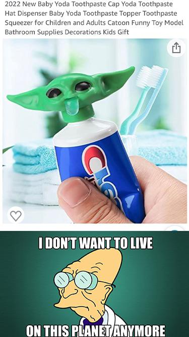

---

## 18. Predicted label: **Disgust**

- **Title:** based on real events
- **Meme caption:** Meme poster is trying to convey how painful it is when they bump their elbow.
- **Literal image caption:** A man is looking scared all black and high contrast.
- **Raw model response:** `The dominant intended emotion of the internet meme is "disgust".`
- **Manual judgment:** 
- **Human label if different:** 
- **Notes:** 

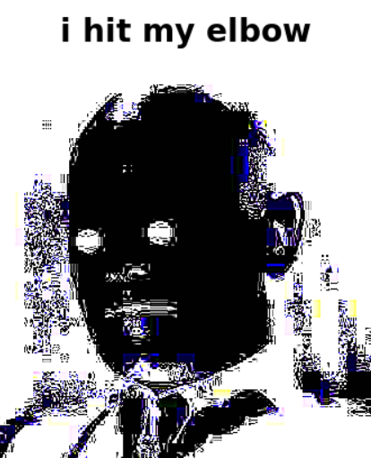

---

## 19. Predicted label: **Disgust**

- **Title:** Bonus for not missing it.
- **Meme caption:** Meme poster has decided to celebrate their reddit anniversary by eating really gross pizza dipped in milk.
- **Literal image caption:** A person dips pizza into a coffee mug with white liquid.
- **Raw model response:** `Disgust`
- **Manual judgment:** 
- **Human label if different:** 
- **Notes:** 

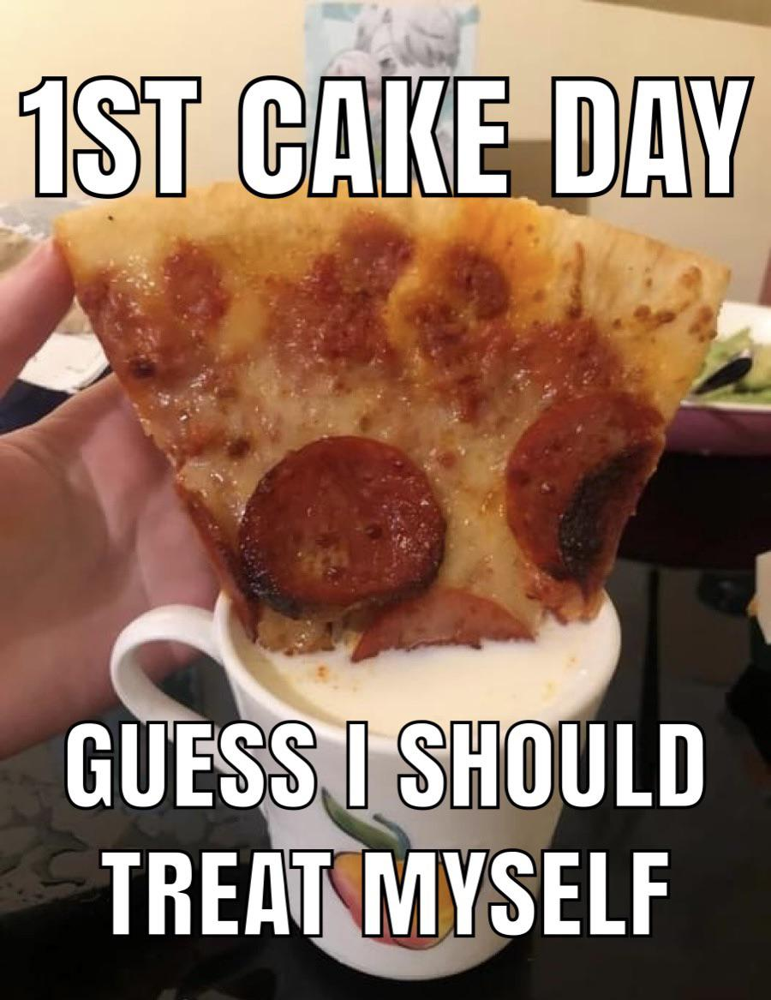

---

## 20. Predicted label: **Disgust**

- **Title:** This calls for reviving an ancient form of meme
- **Meme caption:** Meme poster is trying to convey that Elon tweets photo of him trying to look cool with booze and handguns so the meme poster tries to say they are no threat to him.
- **Literal image caption:** Elon posted a photo of a desk covered with booze and a handgun above a man holding up his hands.
- **Raw model response:** `The dominant intended emotion of the internet meme is "disgust". The meme poster is expressing their strong disapproval or revulsion towards the photo of Elon Musk with booze and handguns, and is attempting to convey that they do not see him as a threat.`
- **Manual judgment:** 
- **Human label if different:** 
- **Notes:** 

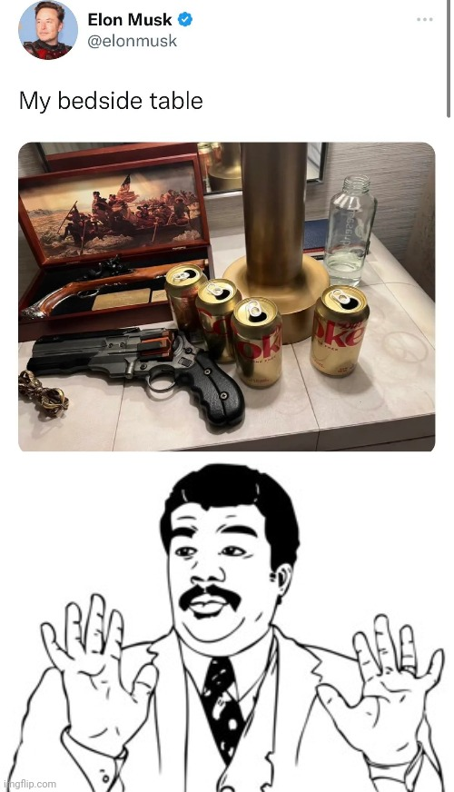

---

## 21. Predicted label: **Fear**

- **Title:** I wonder if they could have spent more time considering the implications...
- **Meme caption:** Meme poster is trying to convey that as soon as Twitter allows the blue checkmark, they run the other way.
- **Literal image caption:** as soon as one opens the door, the horse gallops away.
- **Raw model response:** `Fear`
- **Manual judgment:** 
- **Human label if different:** 
- **Notes:** 

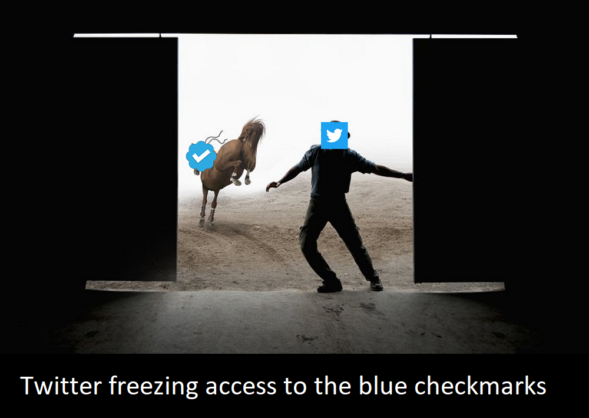

---

## 22. Predicted label: **Fear**

- **Title:** Based Theoden
- **Meme caption:** Meme poster is trying to convey that Theoden decides to leave Gondor to Mordor.
- **Literal image caption:** Theoden looks concerned then starts to speak.
- **Raw model response:** `Fear`
- **Manual judgment:** 
- **Human label if different:** 
- **Notes:** 

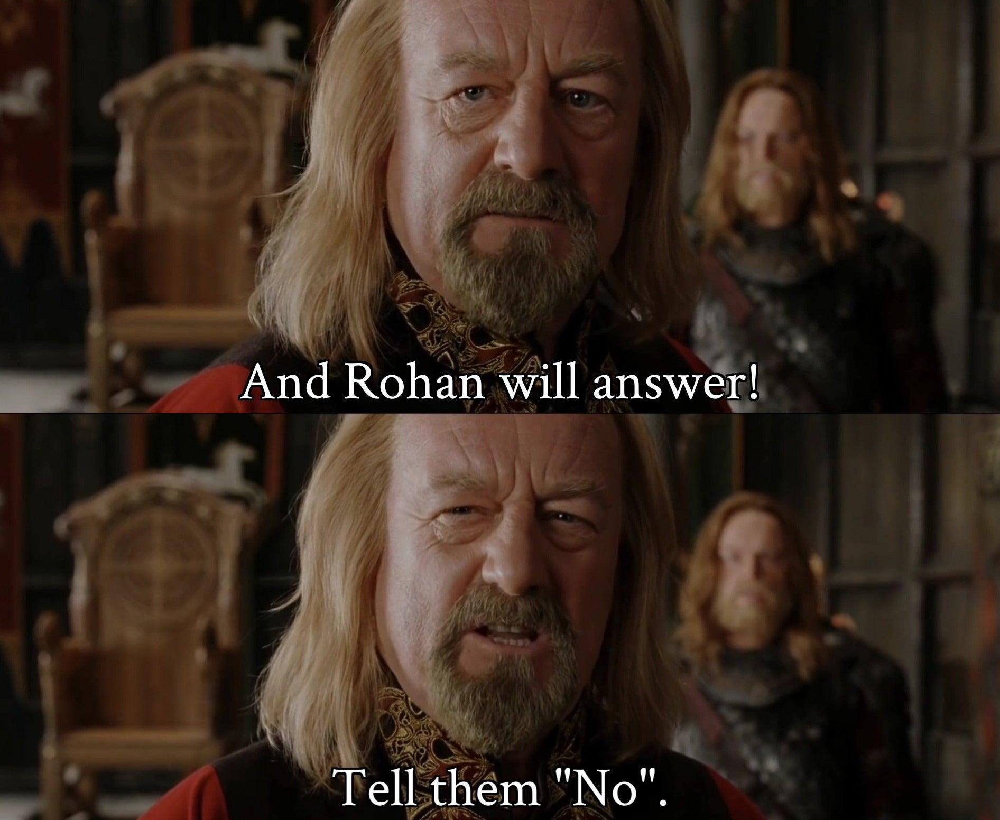

---

## 23. Predicted label: **Fear**

- **Title:** Pronouns
- **Meme caption:** The meme poster realizes that, they have been laid off by Twitter.
- **Literal image caption:** a bunch of images of Elon Musk laughing
- **Raw model response:** `Fear`
- **Manual judgment:** 
- **Human label if different:** 
- **Notes:** 

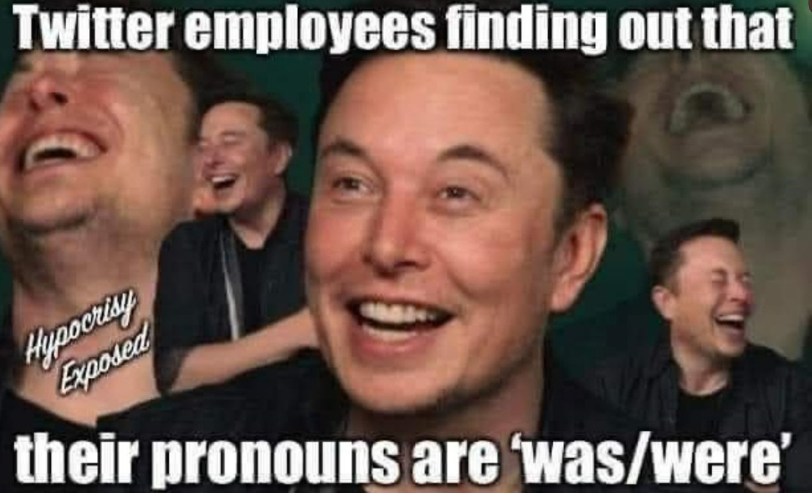

---

## 24. Predicted label: **Fear**

- **Title:** A lot of things going on this year
- **Meme caption:** Meme poster trying to convey that reaction of disaster of 2020.
- **Literal image caption:** A skeleton is glowing bright green.
- **Raw model response:** `Fear`
- **Manual judgment:** 
- **Human label if different:** 
- **Notes:** 

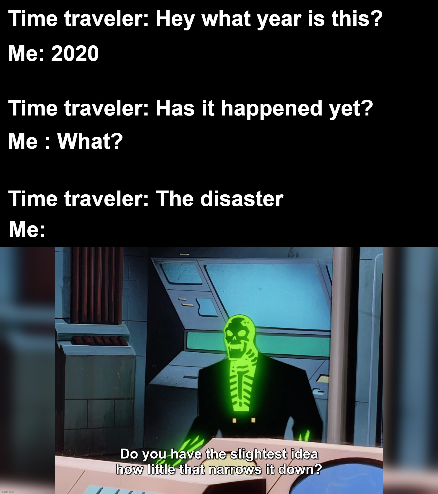

---

## 25. Predicted label: **Fear**

- **Title:** Yes it is
- **Meme caption:** Meme poster believes eating bacon is worth pigs death.
- **Literal image caption:** On the left a group of pigs are in the dirt and the right is bacon in a skillet.
- **Raw model response:** `Fear`
- **Manual judgment:** 
- **Human label if different:** 
- **Notes:** 

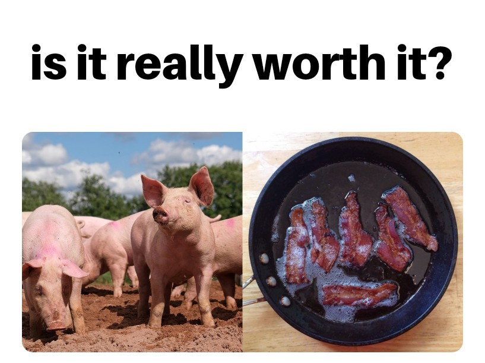

---

## 26. Predicted label: **Fear**

- **Title:** Heard the intermission comes after 22.5 years
- **Meme caption:** Meme poster is trying to convey that Japan fears Christopher Nolan will release the atomic bomb on them for realism.
- **Literal image caption:** The monkey  toy gives surprise expression
- **Raw model response:** `Fear`
- **Manual judgment:** 
- **Human label if different:** 
- **Notes:** 

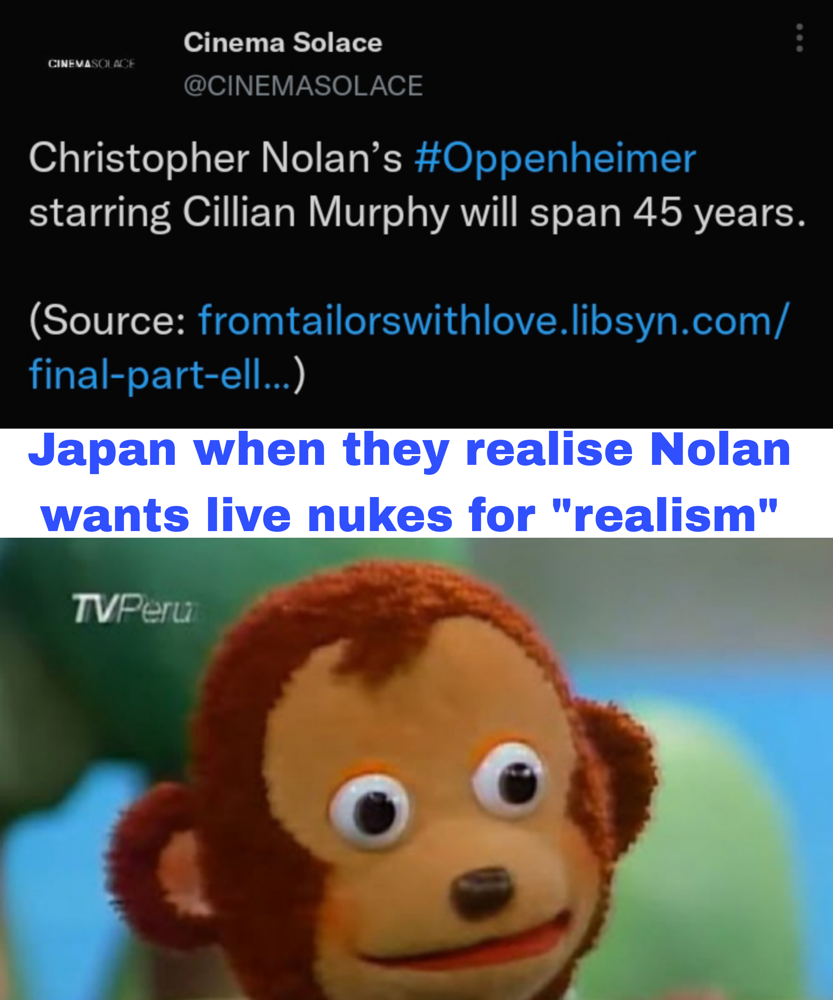

---

## 27. Predicted label: **Fear**

- **Title:** hey at least it saves me
- **Meme caption:** Meme poster is trying to convey that it's better to walk instead of using gas power cars.
- **Literal image caption:** The Flintstones car is completely empty.
- **Raw model response:** `Fear`
- **Manual judgment:** 
- **Human label if different:** 
- **Notes:** 

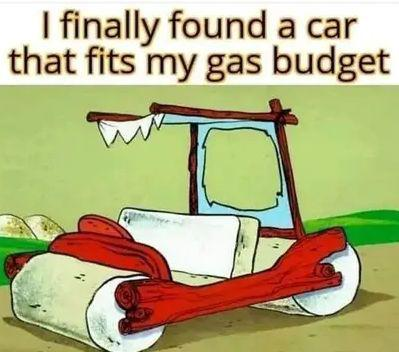

---

## 28. Predicted label: **Fear**

- **Title:** This was the Pandemic
- **Meme caption:** Meme poster says that the cultural phenomennon Tiger King about Joe Exotic and his tigers embodies his COVID-19 pandemic experience.
- **Literal image caption:** A flamboyant man is between two pictures of tigers.
- **Raw model response:** `Fear`
- **Manual judgment:** 
- **Human label if different:** 
- **Notes:** 

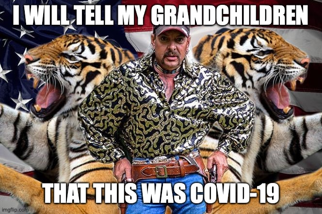

---

## 29. Predicted label: **Fear**

- **Title:** Stop spoiling it
- **Meme caption:** Meme sees the new God of War video game whereever he goes and would like it not to be spoiled for him.
- **Literal image caption:** Spider-Man watching a movie projected on a brick wall on top of a building overlooking a city.
- **Raw model response:** `Fear`
- **Manual judgment:** 
- **Human label if different:** 
- **Notes:** 

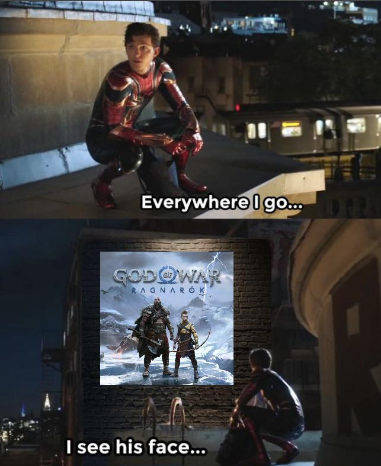

---

## 30. Predicted label: **Fear**

- **Title:** Twitter, Before & After
- **Meme caption:** The meme poster conveys the situation of Twitter after Elon buys it.
- **Literal image caption:** an image of what appears to be a brain scan
- **Raw model response:** `Fear`
- **Manual judgment:** 
- **Human label if different:** 
- **Notes:** 

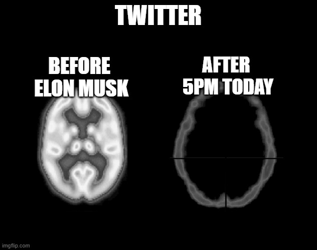

---

## 31. Predicted label: **Joy**

- **Title:** where ak 74m option
- **Meme caption:** Meme poster is trying to convey that A cheeky emoji response to the meme poster doing overkill on a normal grooming task.
- **Literal image caption:** Emoji's are under guns, chainsaws, scissors, sickles, box cutters, and another tool.
- **Raw model response:** `Joy`
- **Manual judgment:** 
- **Human label if different:** 
- **Notes:** 

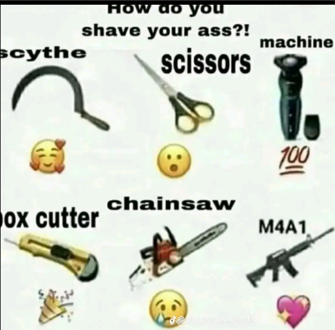

---

## 32. Predicted label: **Joy**

- **Title:** maybe accurate
- **Meme caption:** Meme poster makes creative mind.
- **Literal image caption:** Its describing the school level with the ratio of paper to desk.
- **Raw model response:** `Joy`
- **Manual judgment:** 
- **Human label if different:** 
- **Notes:** 

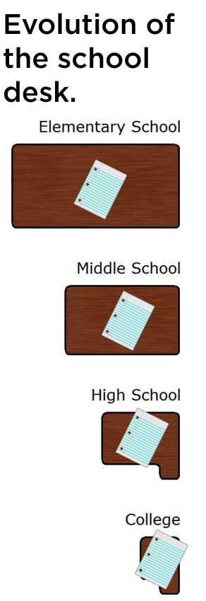

---

## 33. Predicted label: **Joy**

- **Title:** If you know you know
- **Meme caption:** Meme poster is trying to convey that deer spinning in circles is a pleasant thing to look at, unlike ants running around in circles, which looks more uncomfortable
- **Literal image caption:** Different black dot swirls are above a man having the same face in color then black and white.
- **Raw model response:** `Joy`
- **Manual judgment:** 
- **Human label if different:** 
- **Notes:** 

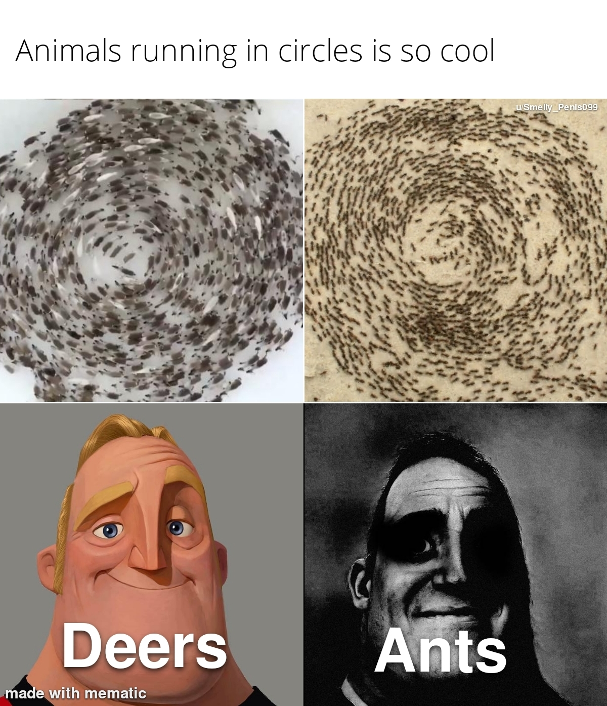

---

## 34. Predicted label: **Joy**

- **Title:** Just a fun kids show
- **Meme caption:** Meme poster is trying to convey that the late night kid's shows are the same as the ones in the morning.
- **Literal image caption:** Cartoon kids are on top of muppet kids.
- **Raw model response:** `Joy`
- **Manual judgment:** 
- **Human label if different:** 
- **Notes:** 

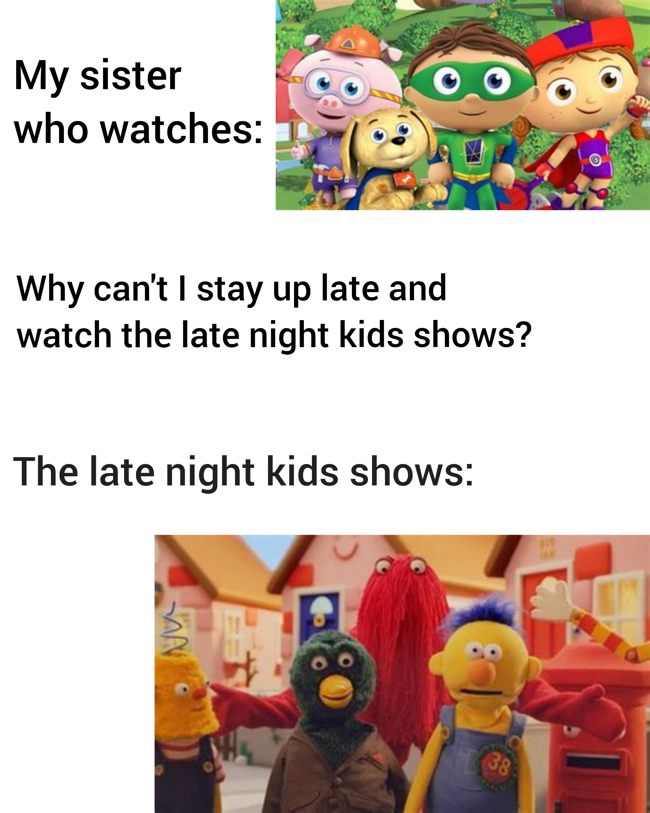

---

## 35. Predicted label: **Joy**

- **Title:** Wake up babe, new template just dropped
- **Meme caption:** Meme poster is trying to convey that Moms always know when people aren't supposed to know a joke.
- **Literal image caption:** Namor is standing threateningly over Ramona.
- **Raw model response:** `Joy`
- **Manual judgment:** 
- **Human label if different:** 
- **Notes:** 

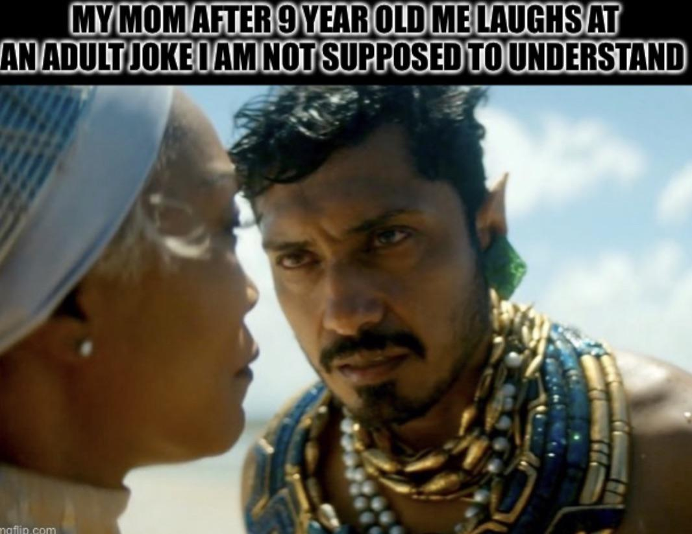

---

## 36. Predicted label: **Joy**

- **Title:** why is the sun suddenly rising again at 10pm?
- **Meme caption:** Meme poster is sick of seeing memes about war and would rather look at cats. 
- **Literal image caption:** the cat is looking at you casually
- **Raw model response:** `Joy`
- **Manual judgment:** 
- **Human label if different:** 
- **Notes:** 

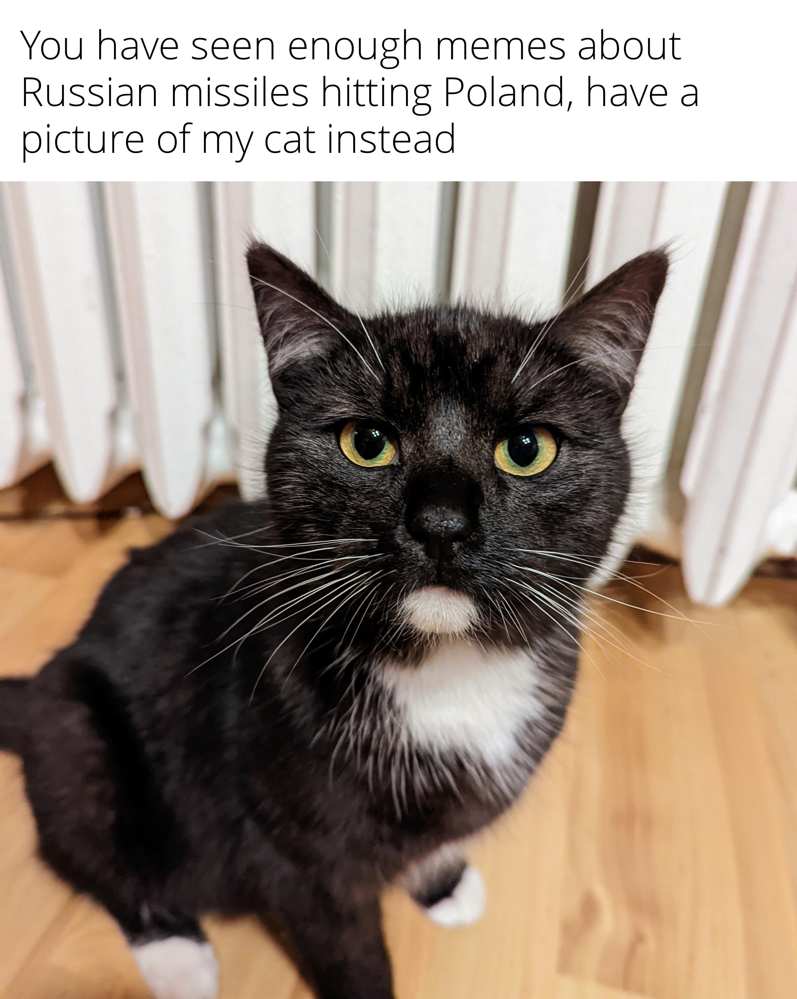

---

## 37. Predicted label: **Joy**

- **Title:** only me?
- **Meme caption:** Meme poster likes noodles without sauce, even if other people think it's disgusting.
- **Literal image caption:** a woman and pointing and screaming while another woman holds her back and a second image is a cat sitting on a table
- **Raw model response:** `Joy`
- **Manual judgment:** 
- **Human label if different:** 
- **Notes:** 

---

## 38. Predicted label: **Joy**

- **Title:** red trainstation
- **Meme caption:** Meme poster is trying to convey that their generation is full of redditors with no social lives.
- **Literal image caption:** Neo is looking blankly while wearing sunglasses.
- **Raw model response:** `Joy`
- **Manual judgment:** 
- **Human label if different:** 
- **Notes:** 

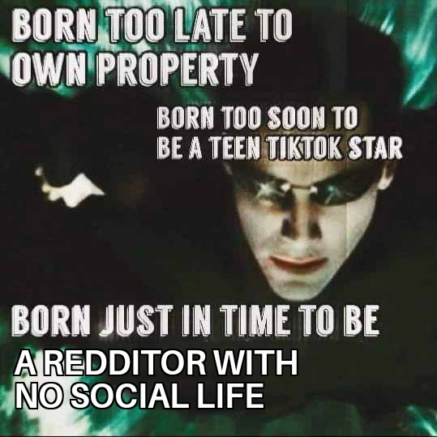

---

## 39. Predicted label: **Joy**

- **Title:** Im on diet and its not fair
- **Meme caption:** Meme poster is trying to convey that a mcdonalds has all the ingredients to make it look "healthy" but it isn't
- **Literal image caption:** The scarlett witch is arguing with doctor strange about burger toppings.
- **Raw model response:** `Joy`
- **Manual judgment:** 
- **Human label if different:** 
- **Notes:** 

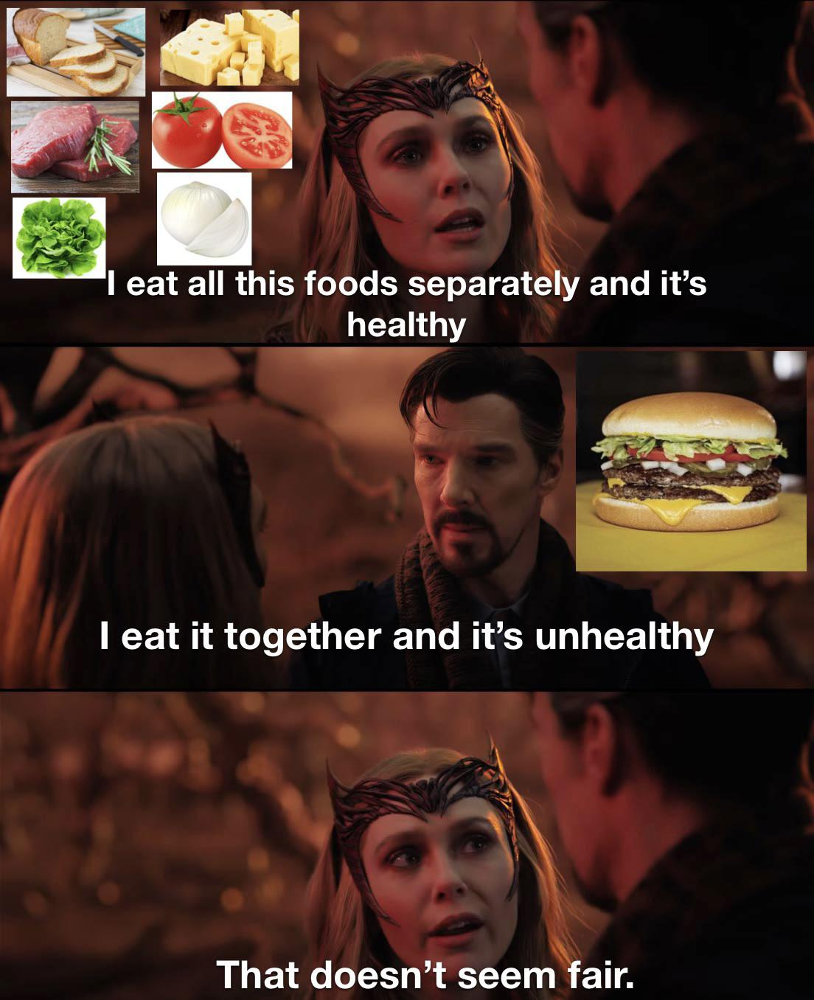

---

## 40. Predicted label: **Joy**

- **Title:** Campers are so frickin annoying
- **Meme caption:** The meme poster is happy to find a good server until he learns who plays on it.
- **Literal image caption:** a blond male with square block head, blond hair, second is same image but in black and white 
- **Raw model response:** `Joy`
- **Manual judgment:** 
- **Human label if different:** 
- **Notes:** 

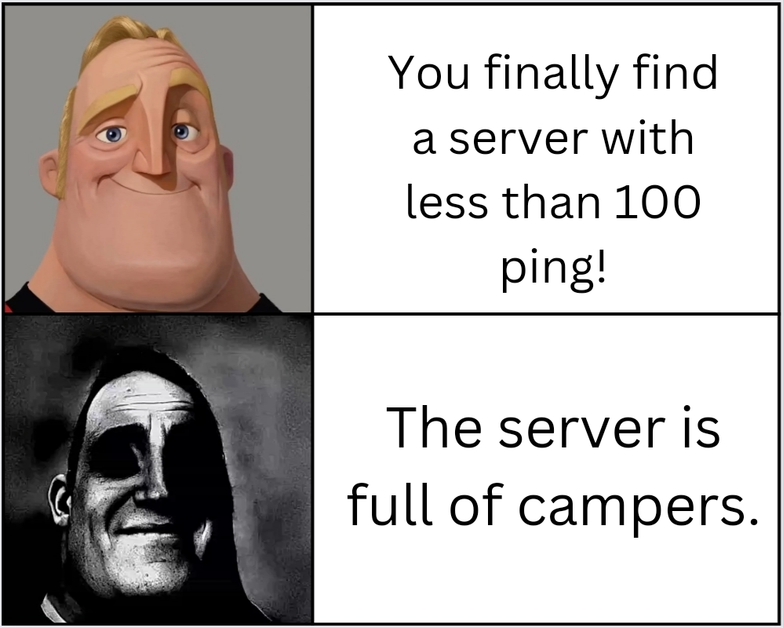

---

## 41. Predicted label: **Neutral**

- **Title:** How do they even sleep?
- **Meme caption:** Meme poster is trying to convey that German kids when told the history of their country and some of the acts committed by their people in the past are still able to easily sleep with no regret on their conscience. 
- **Literal image caption:** Homer is sleeping comfortably in bed.
- **Raw model response:** `Neutral`
- **Manual judgment:** 
- **Human label if different:** 
- **Notes:** 

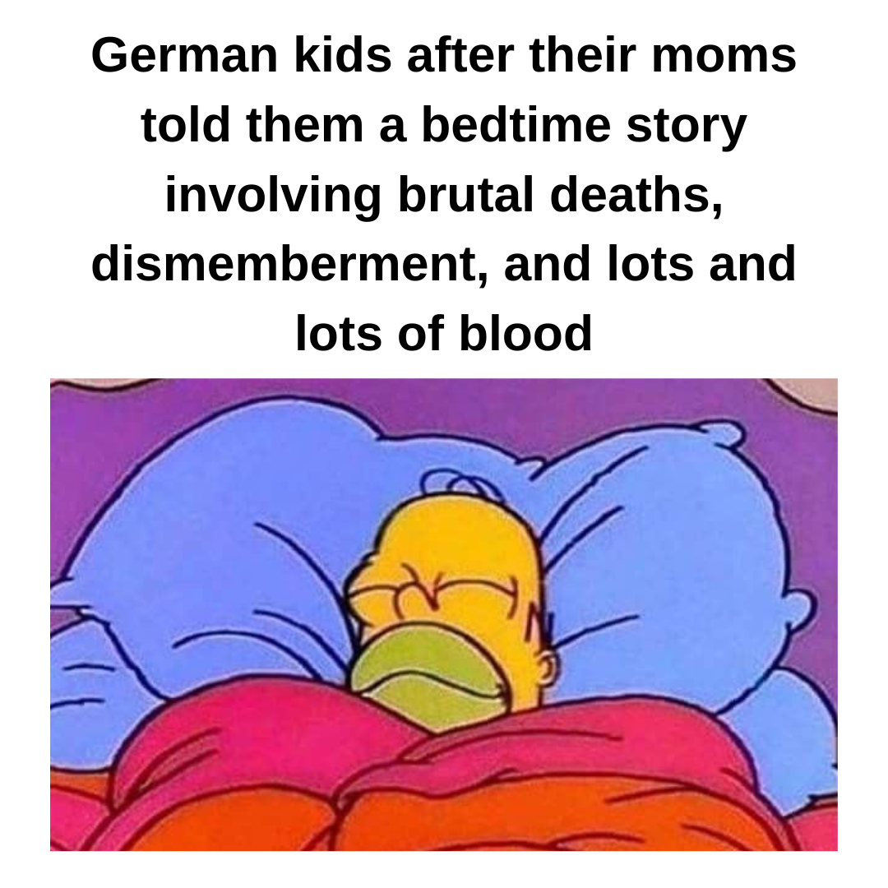

---

## 42. Predicted label: **Neutral**

- **Title:** Hes lost it already
- **Meme caption:** Meme poster is trying to convey that without power, Elon is going mad and boring.
- **Literal image caption:** A man holding a clip board tries to talk to a scared man.
- **Raw model response:** `Neutral.`
- **Manual judgment:** 
- **Human label if different:** 
- **Notes:** 

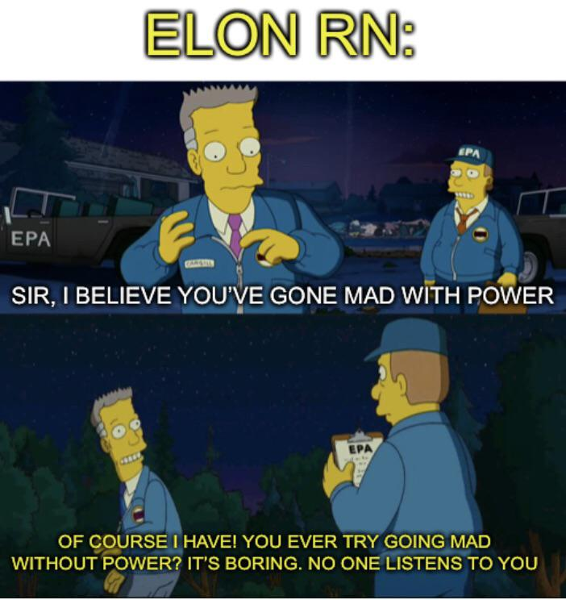

---

## 43. Predicted label: **Neutral**

- **Title:** Mistakes were made.
- **Meme caption:** Meme poster is trying to convey that the wrong choices we have made in life.
- **Literal image caption:** A woman is eating a small meal across from someone eating a lot of bbq.
- **Raw model response:** `Neutral`
- **Manual judgment:** 
- **Human label if different:** 
- **Notes:** 

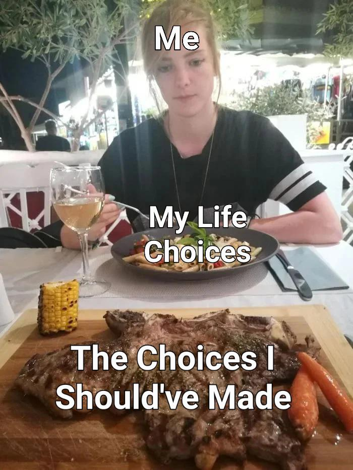

---

## 44. Predicted label: **Neutral**

- **Title:** Checkmate 100
- **Meme caption:** Meme poster is in the playing mode of the game named as truth or dare and she locked with some typical questions.
- **Literal image caption:** A anime girl is looking straight ahead.
- **Raw model response:** `Neutral.`
- **Manual judgment:** 
- **Human label if different:** 
- **Notes:** 

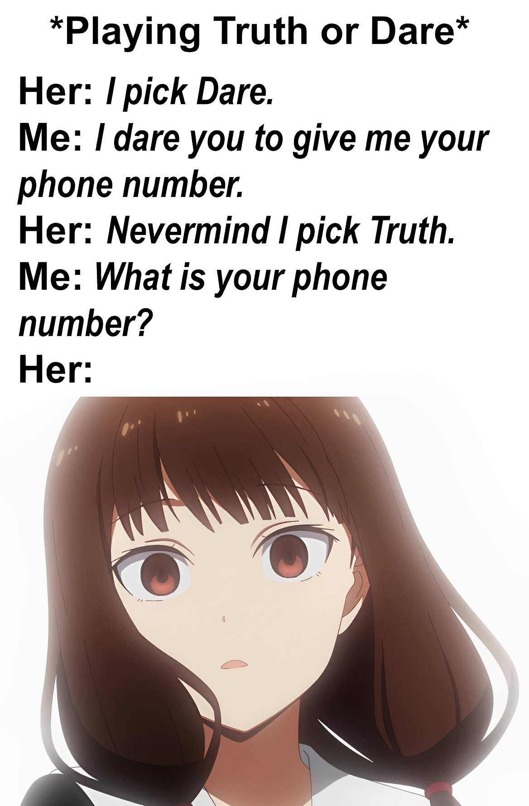

---

## 45. Predicted label: **Neutral**

- **Title:** Ahaha totally
- **Meme caption:** Meme poster is trying to convey that they don't understand all of the Ohio memes as a European.
- **Literal image caption:** Two men one is saying he loves inside jokes and what's to be a part of one someday and the other guy with the glasses is looking at him stupidly.
- **Raw model response:** `Neutral`
- **Manual judgment:** 
- **Human label if different:** 
- **Notes:** 

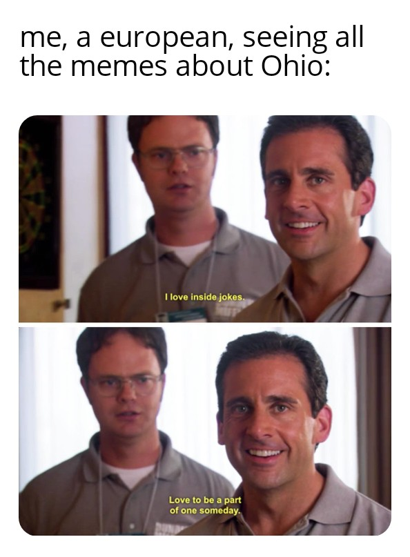

---

## 46. Predicted label: **Neutral**

- **Title:** It's my own fault
- **Meme caption:** Meme poster is trying to convey that An extra hour of sleep from daylight savings time isn't that great when your sleep schedule is already bad.
- **Literal image caption:** Hands hold a piece of paper and in the bottom image a boy looks at the paper with excitement.
- **Raw model response:** `Neutral`
- **Manual judgment:** 
- **Human label if different:** 
- **Notes:** 

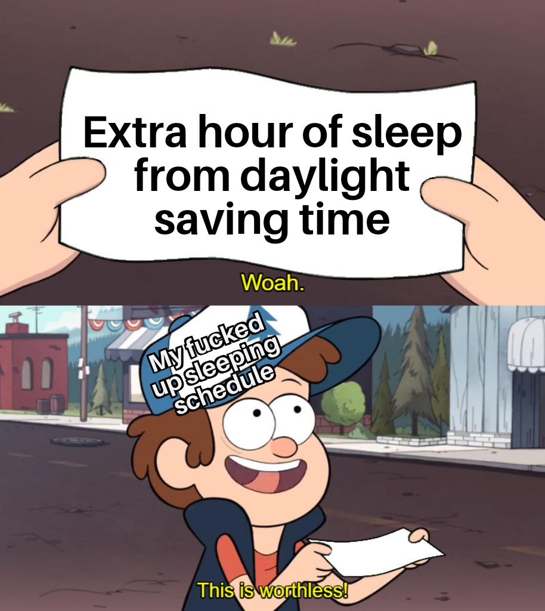

---

## 47. Predicted label: **Neutral**

- **Title:** Understandable. Have a nice day!
- **Meme caption:** Meme poster is trying to convey that the teacher appreciates the meme poster for sharing his feelings, but after listening to his words, the teacher makes him get away.
- **Literal image caption:** a shirtless soccer player receiving a  yellow car from referree
- **Raw model response:** `Neutral`
- **Manual judgment:** 
- **Human label if different:** 
- **Notes:** 

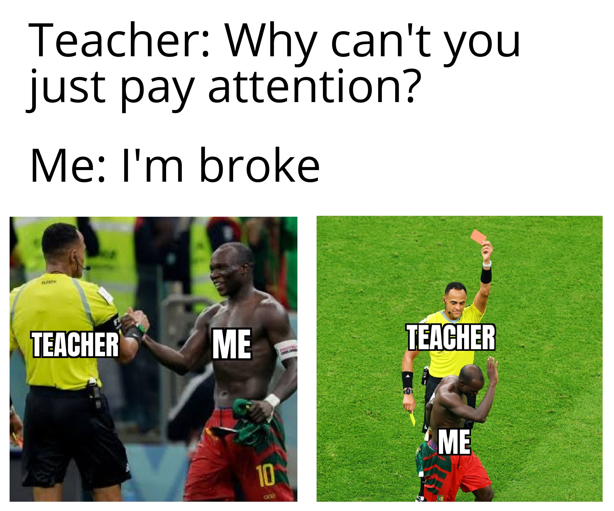

---

## 48. Predicted label: **Neutral**

- **Title:** Low effort but happy post
- **Meme caption:** Meme poster is unimpressed with the teams Argentina beat to win the World Cup.
- **Literal image caption:** A teacher is about to scold three kids.
- **Raw model response:** `Neutral`
- **Manual judgment:** 
- **Human label if different:** 
- **Notes:** 

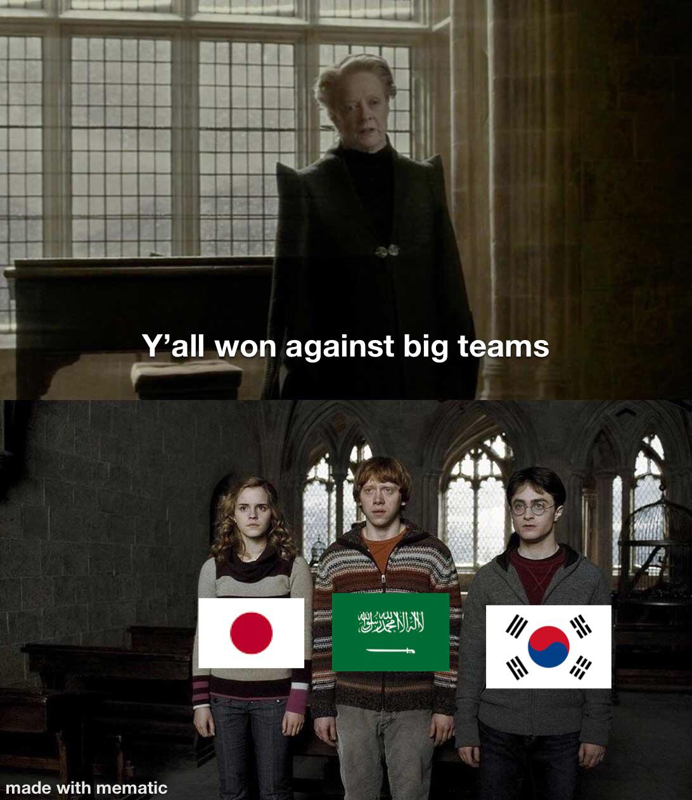

---

## 49. Predicted label: **Neutral**

- **Title:** always playing safe just incase
- **Meme caption:** The meme poster smartly escapes from the consequences that happened by his advises to people.
- **Literal image caption:** A man stands staring in a dark room.
- **Raw model response:** `Neutral.`
- **Manual judgment:** 
- **Human label if different:** 
- **Notes:** 

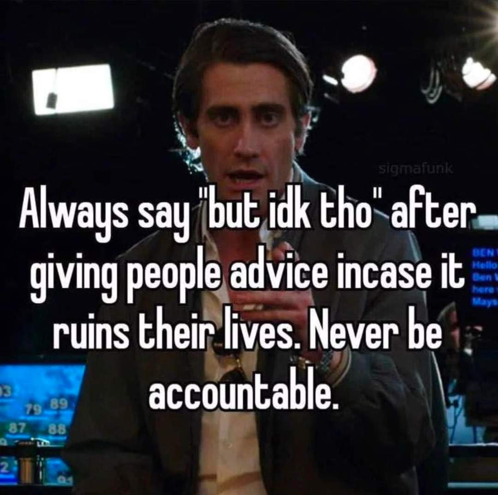

---

## 50. Predicted label: **Neutral**

- **Title:** brain working in all the right places
- **Meme caption:** Meme poster is trying to convey that they are incapable of winging an exam like they do sending memes to people he knows well
- **Literal image caption:** Tom looks anxious then confused at the math problems.
- **Raw model response:** `Neutral`
- **Manual judgment:** 
- **Human label if different:** 
- **Notes:** 

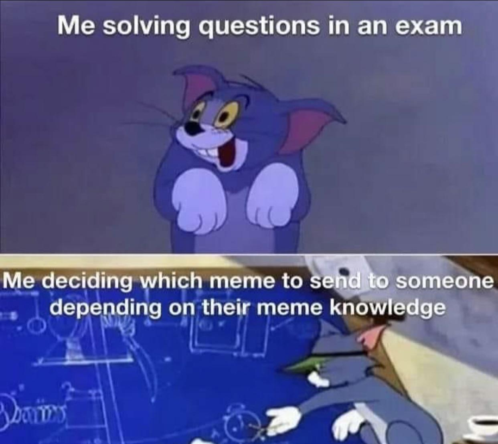

---

## 51. Predicted label: **Sadness**

- **Title:** why did they even make shorts
- **Meme caption:** Meme poster is trying to convey that their favorite Youtuber is no longer entertaining to him so he feels quite sad
- **Literal image caption:** A black man wearing a suit and hat is crying and pointing a gun.
- **Raw model response:** `Sadness`
- **Manual judgment:** 
- **Human label if different:** 
- **Notes:** 

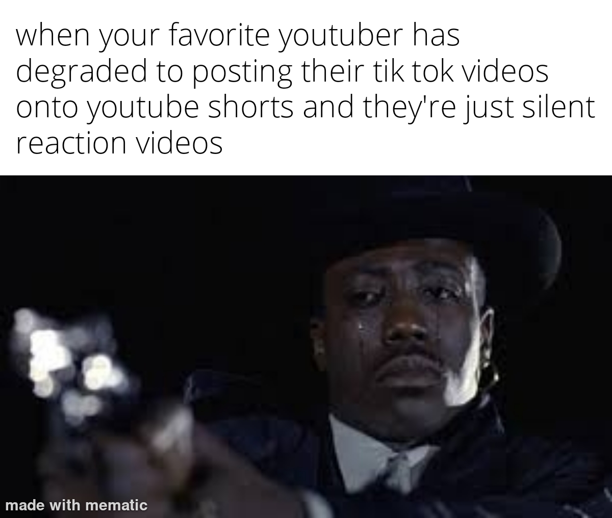

---

## 52. Predicted label: **Sadness**

- **Title:** not going strong still no gf found
- **Meme caption:** Meme poster is trying to convey that He hasn't found a girlfriend despite waiting for that long
- **Literal image caption:** The cat was crying
- **Raw model response:** `Sadness`
- **Manual judgment:** 
- **Human label if different:** 
- **Notes:** 

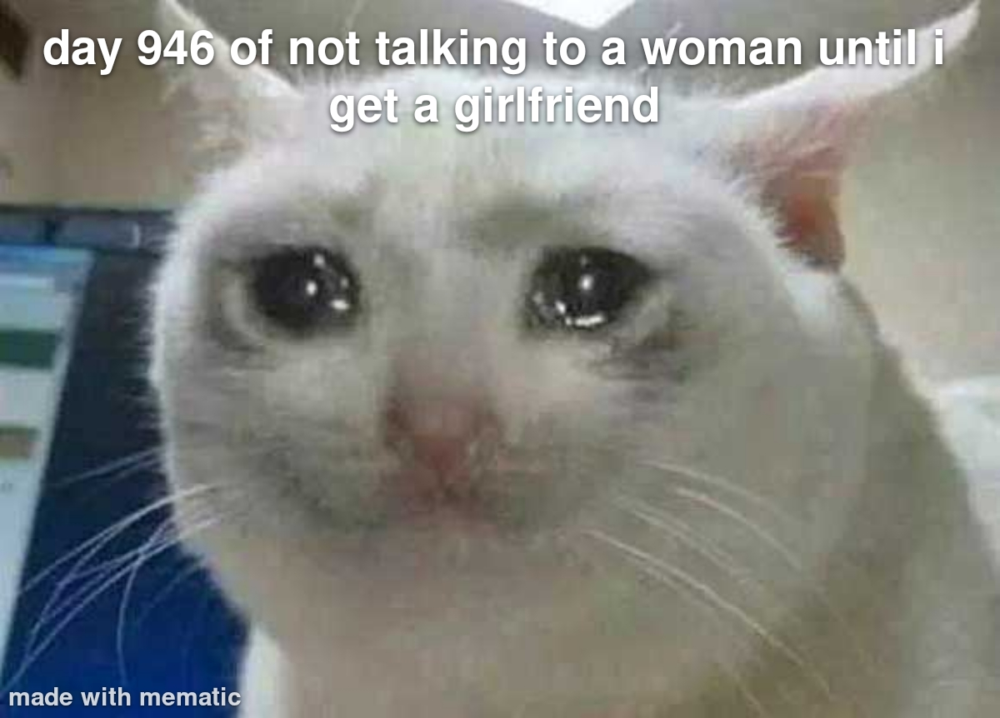

---

## 53. Predicted label: **Sadness**

- **Title:** Whilst everyone enjoys going to some scary maze meanwhile:
- **Meme caption:** Meme poster is trying to convey that lots of sorrow behind the man's smiling
- **Literal image caption:** old man was smiling
- **Raw model response:** `Sadness`
- **Manual judgment:** 
- **Human label if different:** 
- **Notes:** 

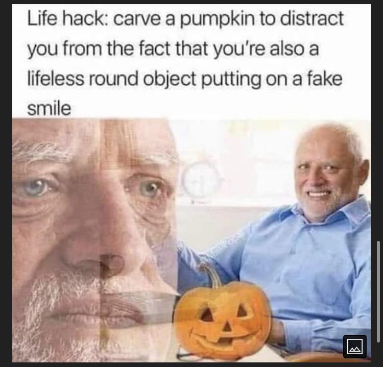

---

## 54. Predicted label: **Sadness**

- **Title:** I shall now cope with memes
- **Meme caption:** Meme poster is trying to convey that they're sad because their girlfriend broke up with them.
- **Literal image caption:** A frog is wearing a fancy suit.
- **Raw model response:** `Sadness`
- **Manual judgment:** 
- **Human label if different:** 
- **Notes:** 

---

## 55. Predicted label: **Sadness**

- **Title:** I wish i had more Reeses bats :(
- **Meme caption:** Meme poster is trying convey that they are sick and tired of holidays and are getting restless about it 
- **Literal image caption:** Sqiudward is sleeping comfortably then opens his eyes in shock.
- **Raw model response:** `Sadness.`
- **Manual judgment:** 
- **Human label if different:** 
- **Notes:** 

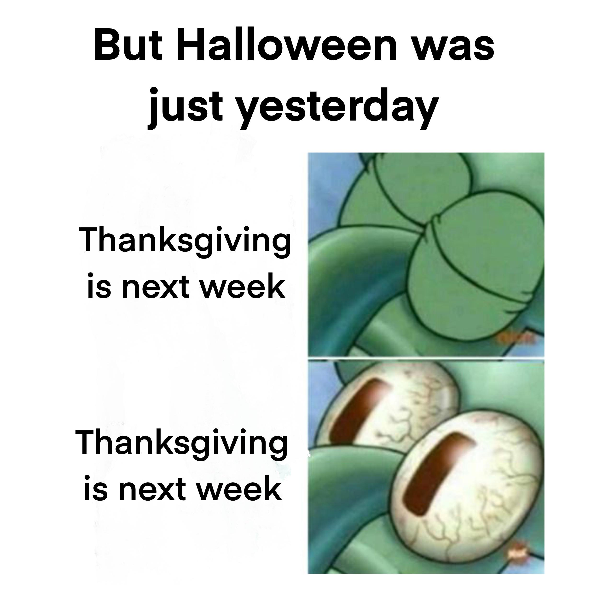

---

## 56. Predicted label: **Sadness**

- **Title:** It will only decrease in quality even more, won't it?
- **Meme caption:** Meme poster is trying to convey that they Lost all hopes after seeing Liam Hemsworth replacing Henry Cavill for the show.
- **Literal image caption:** the upper picture shows two men while the lower picture shows an avatar
- **Raw model response:** `Sadness`
- **Manual judgment:** 
- **Human label if different:** 
- **Notes:** 

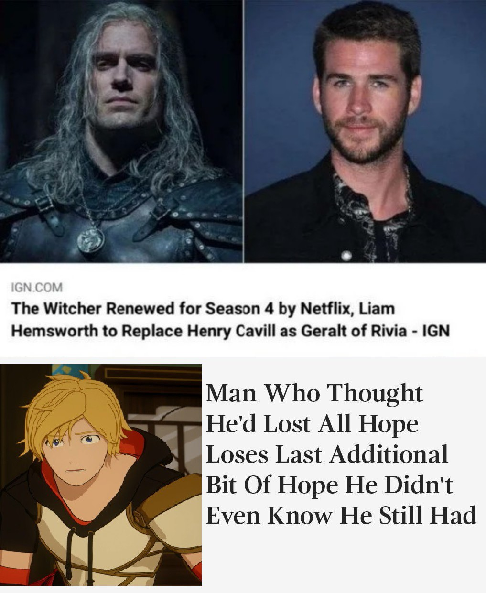

---

## 57. Predicted label: **Sadness**

- **Title:** Wrong guy
- **Meme caption:** Meme poster is trying to convey that they are hurt by their wife cheating on them.
- **Literal image caption:** Tobey Maguire looking down with his teeth showing
- **Raw model response:** `Sadness`
- **Manual judgment:** 
- **Human label if different:** 
- **Notes:** 

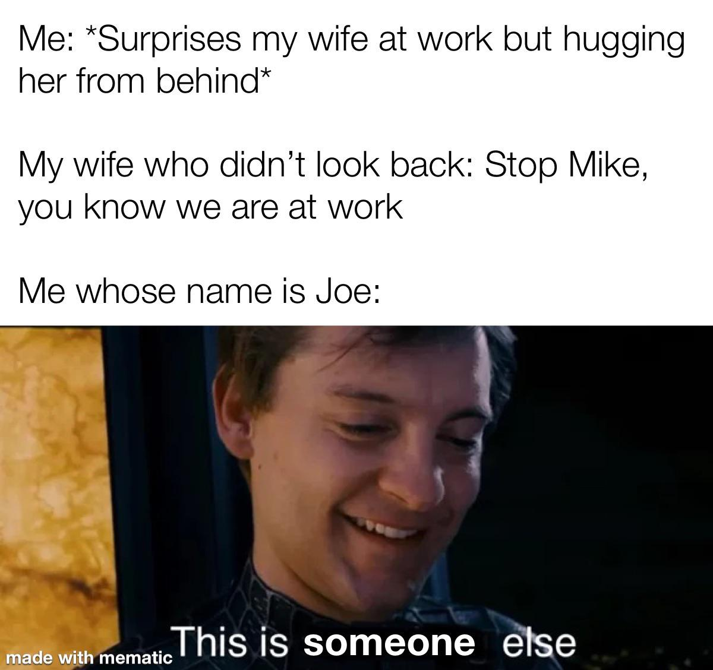

---

## 58. Predicted label: **Sadness**

- **Title:** This'll do
- **Meme caption:** Meme poster is trying to convey that they're so lonely, they'll seek affection from a tree.
- **Literal image caption:** Three pairs of kids are hugging, the boy in the middle hugs a tree.
- **Raw model response:** `Sadness`
- **Manual judgment:** 
- **Human label if different:** 
- **Notes:** 

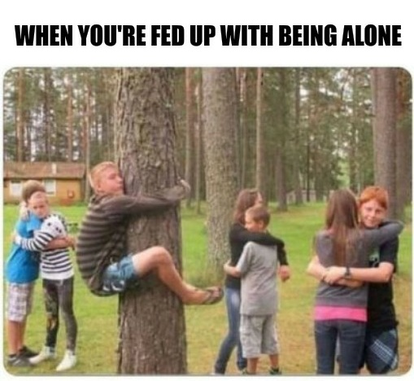

---

## 59. Predicted label: **Sadness**

- **Title:** Who needs to feel happy anyways
- **Meme caption:** Meme poster is trying to convey that all the television shows the meme poster watches make them sad.
- **Literal image caption:** Four blurry objects in an image one looks like a man could be on his knees one looks like a stuffed animal and I don't know what the other two are.
- **Raw model response:** `Sadness`
- **Manual judgment:** 
- **Human label if different:** 
- **Notes:** 

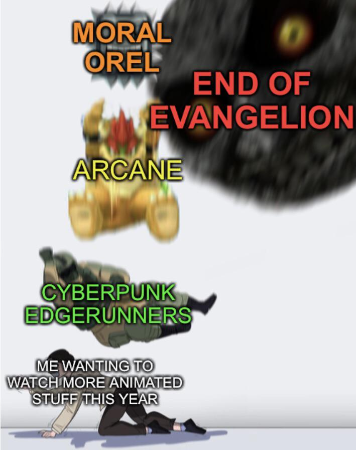

---

## 60. Predicted label: **Sadness**

- **Title:** They do it on purpose
- **Meme caption:** Meme poster is trying to convey that they are tired of seeing happy couples because he can not find happiness himself
- **Literal image caption:** A red station wagon that has wrecked into a tree.
- **Raw model response:** `Sadness`
- **Manual judgment:** 
- **Human label if different:** 
- **Notes:** 

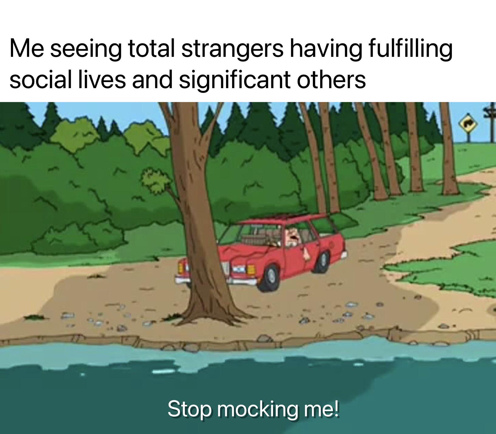

---

## 61. Predicted label: **Surprise**

- **Title:** Cursed Smurf toy
- **Meme caption:** Meme poster is trying to convey that this weird looking item is getting attention much to the meme poster's susprise
- **Literal image caption:** A person is holding a smurf key chain.
- **Raw model response:** `Surprise.`
- **Manual judgment:** 
- **Human label if different:** 
- **Notes:** 

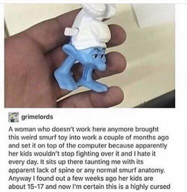

---

## 62. Predicted label: **Surprise**

- **Title:** Spotify Violating Me For No Reason
- **Meme caption:** Meme poster is surprised by the music she listened to in 2022.
- **Literal image caption:** two images of transparent black woman
- **Raw model response:** `Surprise.`
- **Manual judgment:** 
- **Human label if different:** 
- **Notes:** 

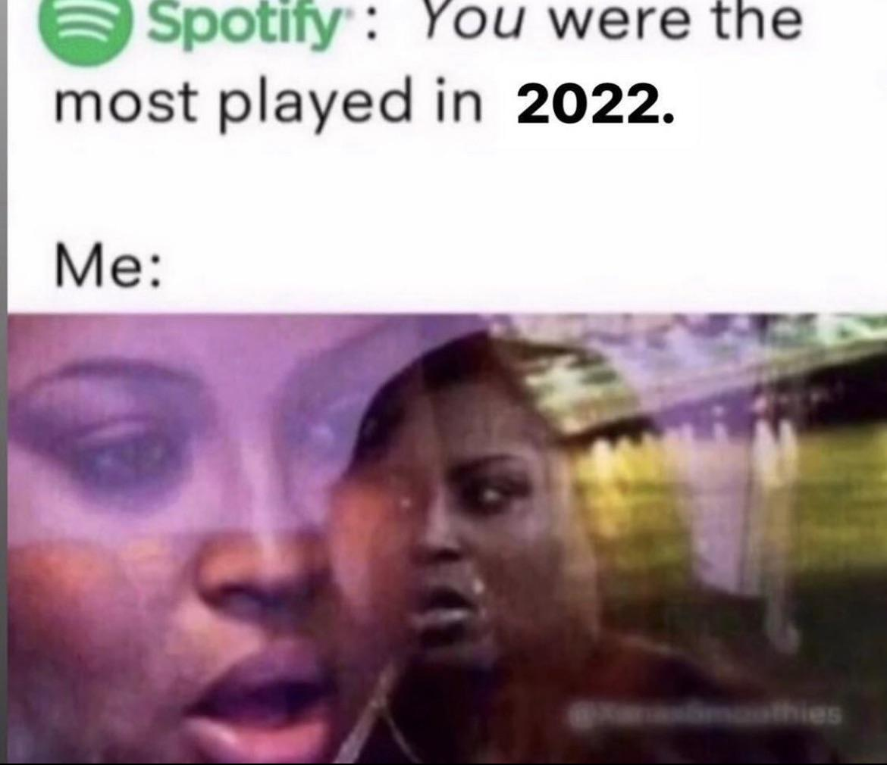

---

## 63. Predicted label: **Surprise**

- **Title:** Still can't wrap my head around the fact that bottle flipping was 6 years ago
- **Meme caption:** The meme poster realizes that 2017 was five years ago, and the time flies by.
- **Literal image caption:** A stick figure man is shocked and can't figure out what to say.
- **Raw model response:** `The dominant intended emotion of the internet meme is "surprise".`
- **Manual judgment:** 
- **Human label if different:** 
- **Notes:** 

---

## 64. Predicted label: **Surprise**

- **Title:** When Stable Diffusion generates Bob Norris....
- **Meme caption:** Meme poster is trying to convey that A combination of two famous peoples characteristics can generate a surpising outcome. 
- **Literal image caption:** the man look very nice and he smiling in that photo
- **Raw model response:** `The dominant intended emotion of the internet meme is surprise.`
- **Manual judgment:** 
- **Human label if different:** 
- **Notes:** 

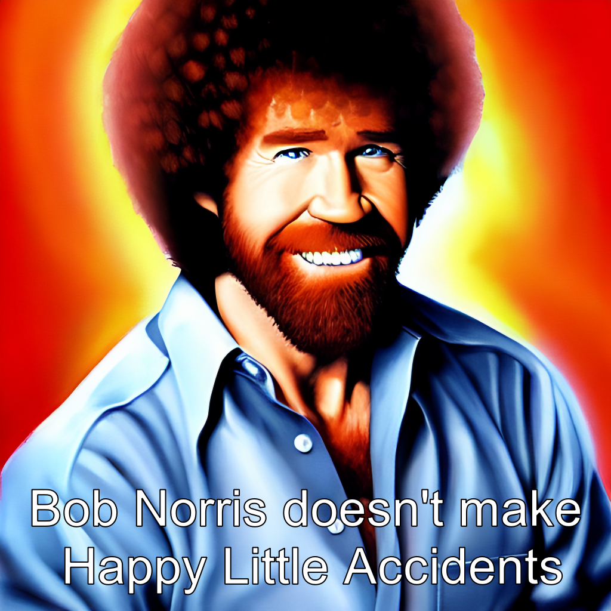

---

## 65. Predicted label: **Surprise**

- **Title:** Twist 100
- **Meme caption:** The meme poster is shocked that, the meme poster's Dad was the killer.
- **Literal image caption:** The Dad looks shiftily around while the son tilts his head to the side in puzzlement.
- **Raw model response:** `Surprise`
- **Manual judgment:** 
- **Human label if different:** 
- **Notes:** 

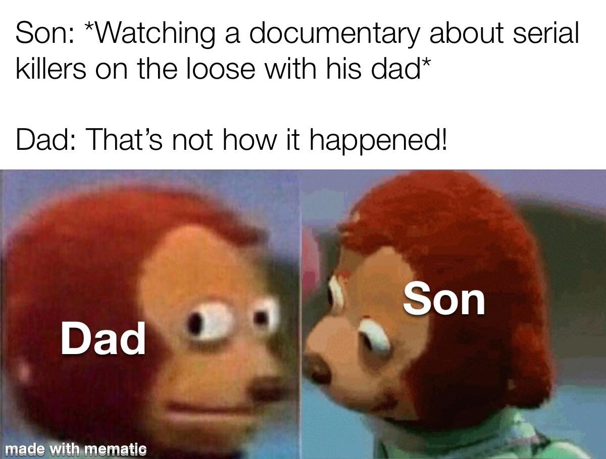

---

## 66. Predicted label: **Surprise**

- **Title:** The company behind this software should be dead by now
- **Meme caption:** The meme poster is surprised that WinRar's company is still surviving.
- **Literal image caption:** a man with thumbs up driver side window, then second image of flush toy sonic the hedgehog standing on road with arms spread out 
- **Raw model response:** `Surprise`
- **Manual judgment:** 
- **Human label if different:** 
- **Notes:** 

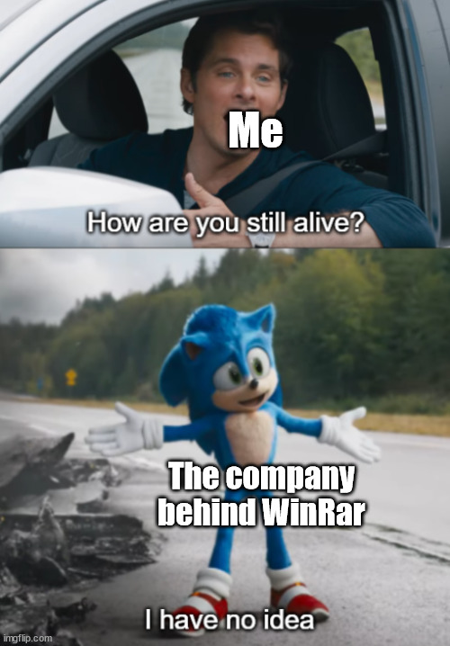

---

## 67. Predicted label: **Surprise**

- **Title:** Oh lawd he cumming ;-;
- **Meme caption:** Meme poster is trying to convey that Curved razors are different that straight razors. 
- **Literal image caption:** The sportscaster within the roped fighting ring in holding a microphone and looking at the face of a man on a large screen.
- **Raw model response:** `The dominant intended emotion of the internet meme is "surprise".`
- **Manual judgment:** 
- **Human label if different:** 
- **Notes:** 

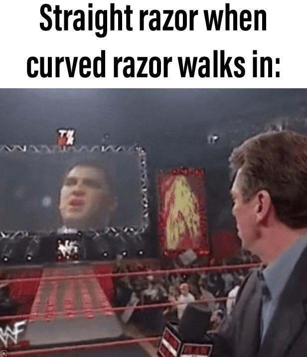

---

## 68. Predicted label: **Surprise**

- **Title:** What in the actual fuck i think that sus now
- **Meme caption:** Meme poster is shocked to learn a old cartoon had a scene where a fish released sperm on unsuspecting kids.
- **Literal image caption:** A fish is dropping a fog and a man in the bubble is below it and in the bottom image the man says hold up.
- **Raw model response:** `Surprise`
- **Manual judgment:** 
- **Human label if different:** 
- **Notes:** 

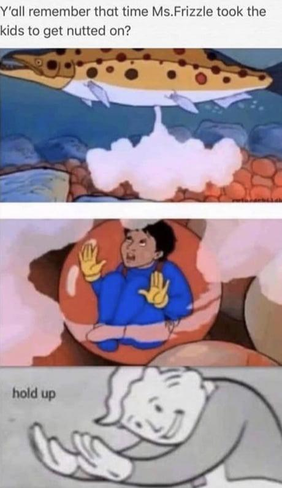

---

## 69. Predicted label: **Surprise**

- **Title:** Who are you?
- **Meme caption:** Meme poster is trying to convey that Iphone security is acting like a bouncer becase my touchid doesn't work with my greasy chip fingers.
- **Literal image caption:** A man is looking stiff and wearing black sunglasses.
- **Raw model response:** `Surprise`
- **Manual judgment:** 
- **Human label if different:** 
- **Notes:** 

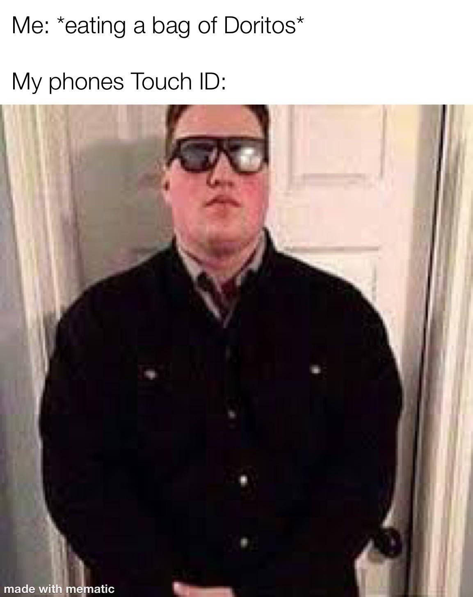

---

## 70. Predicted label: **Surprise**

- **Title:** There is another...
- **Meme caption:** Poster is surprised and confused by the spelling of a word
- **Literal image caption:** John Cena looks in disbelief at what he is seeing.
- **Raw model response:** `Surprise.`
- **Manual judgment:** 
- **Human label if different:** 
- **Notes:** 

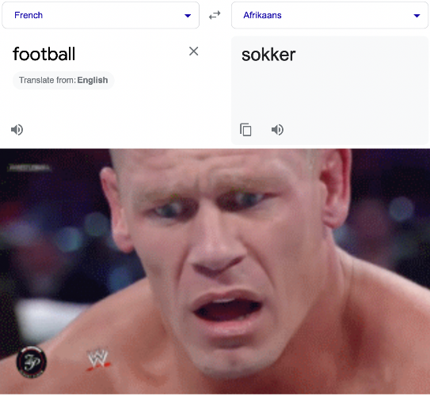

---

## 71. Predicted label: **INVALID**

- **Title:** Fresh caught meme
- **Meme caption:** The meme poster is trying to convey how embarrassed they look when they are caught eating in the middle of the night.
- **Literal image caption:** A dead fish is laying on a boat.
- **Raw model response:** `Embarrassment`
- **Manual judgment:** 
- **Human label if different:** 
- **Notes:** 

---

## 72. Predicted label: **INVALID**

- **Title:** I cant believe you
- **Meme caption:** The meme poster says that, he isn't mad but just disappointed.
- **Literal image caption:** A man is holding onto a fish tightly in his fist
- **Raw model response:** `Disappointment`
- **Manual judgment:** 
- **Human label if different:** 
- **Notes:** 

---

## 73. Predicted label: **INVALID**

- **Title:** still don't understand the difference
- **Meme caption:** Meme poster is trying to convey that he looks confused about how r/meme and r/memes are different from each other
- **Literal image caption:** A man wearing a shirt and tie is standing looking at something, he looks a little surprised. 
- **Raw model response:** `Confusion`
- **Manual judgment:** 
- **Human label if different:** 
- **Notes:** 

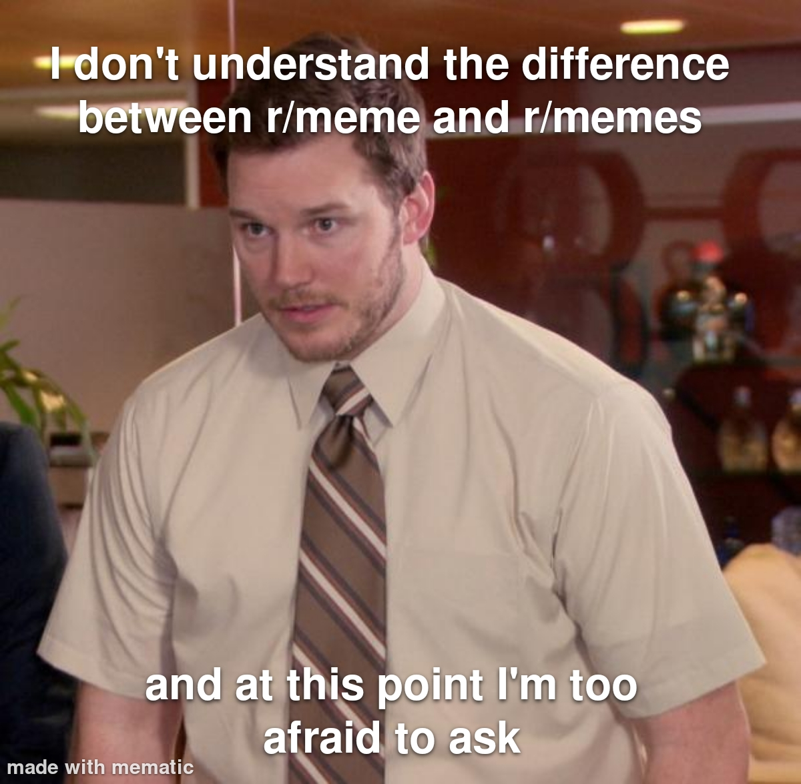

---

## 74. Predicted label: **INVALID**

- **Title:** We all know this feeling
- **Meme caption:** Meme poster is trying to convey that he feels really guilty for making his mom cry
- **Literal image caption:** A transformer is standing tall above the ground.
- **Raw model response:** `Guilt`
- **Manual judgment:** 
- **Human label if different:** 
- **Notes:** 

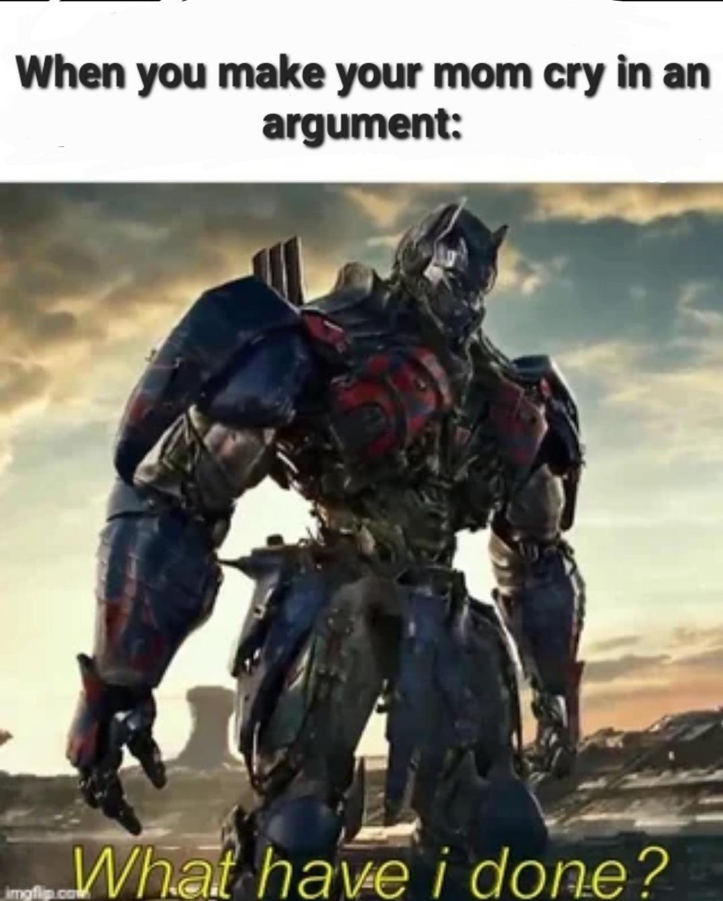

---

## 75. Predicted label: **INVALID**

- **Title:** Hello, old friends
- **Meme caption:** Meme poster is trying to convey that every weekend meme poster is always accompanied by his anxiety and depression.
- **Literal image caption:** A cat lying and sleeping on the body of a man
- **Raw model response:** `Anxiety`
- **Manual judgment:** 
- **Human label if different:** 
- **Notes:** 

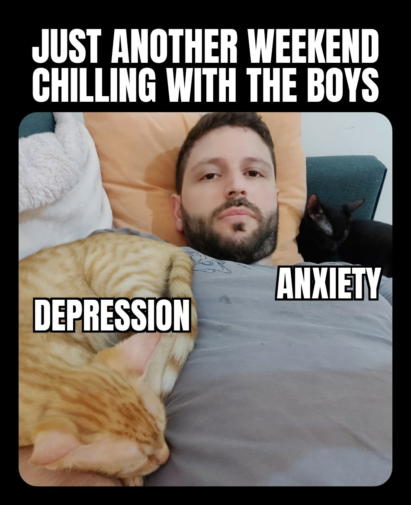

---

## 76. Predicted label: **INVALID**

- **Title:** This is a meme i made about a relatives dog.
- **Meme caption:** Meme poster ate all their snacks but they are still hungry.
- **Literal image caption:** a dark image of what appears to be a dog
- **Raw model response:** `Hunger`
- **Manual judgment:** 
- **Human label if different:** 
- **Notes:** 

---

## 77. Predicted label: **INVALID**

- **Title:** simply couldn't resist
- **Meme caption:** The meme poster feels guilt for not being able to help the poor.
- **Literal image caption:** an image of a man selling plastic turtles, second is nuclear bomb exploding over a city 
- **Raw model response:** `Guilt`
- **Manual judgment:** 
- **Human label if different:** 
- **Notes:** 

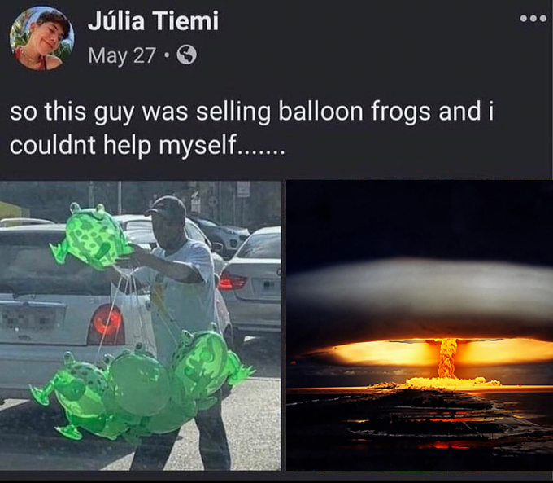

---

## 78. Predicted label: **INVALID**

- **Title:** I'm sorry if this meme is not funny
- **Meme caption:** Meme poster is trying to convey that Canadians know they apologize too much but know they will do it again.
- **Literal image caption:** A cat is standing up and looking down at the ground.
- **Raw model response:** `Apology`
- **Manual judgment:** 
- **Human label if different:** 
- **Notes:** 

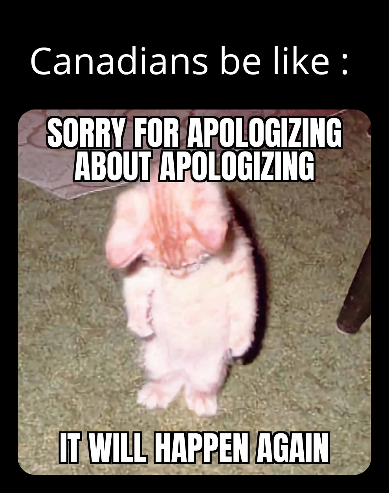

---

## 79. Predicted label: **INVALID**

- **Title:** Even more Greek Mythology meme!
- **Meme caption:** This meme poster explains it as mocking the sea god
- **Literal image caption:** A person is interviewing the boy
- **Raw model response:** `Mocking`
- **Manual judgment:** 
- **Human label if different:** 
- **Notes:** 

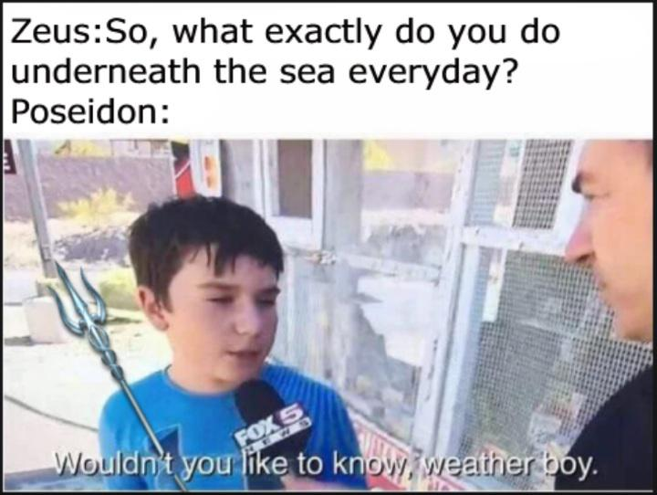

---

## 80. Predicted label: **INVALID**

- **Title:** I happen to be (insert whatever)...sounded better in my head
- **Meme caption:** Meme poster is trying to convey that you should always doubt the recollection of someone who was there when the meme got made.
- **Literal image caption:** A man is wearing a old fashioned suit and wondering whether to doubt something.
- **Raw model response:** `Doubt`
- **Manual judgment:** 
- **Human label if different:** 
- **Notes:** 

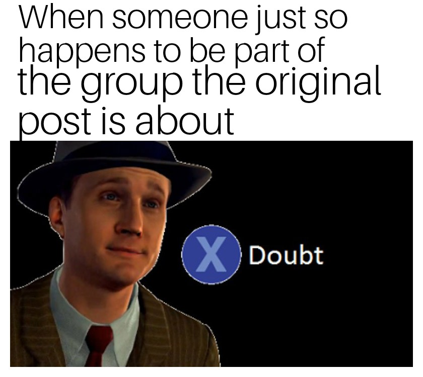

---

