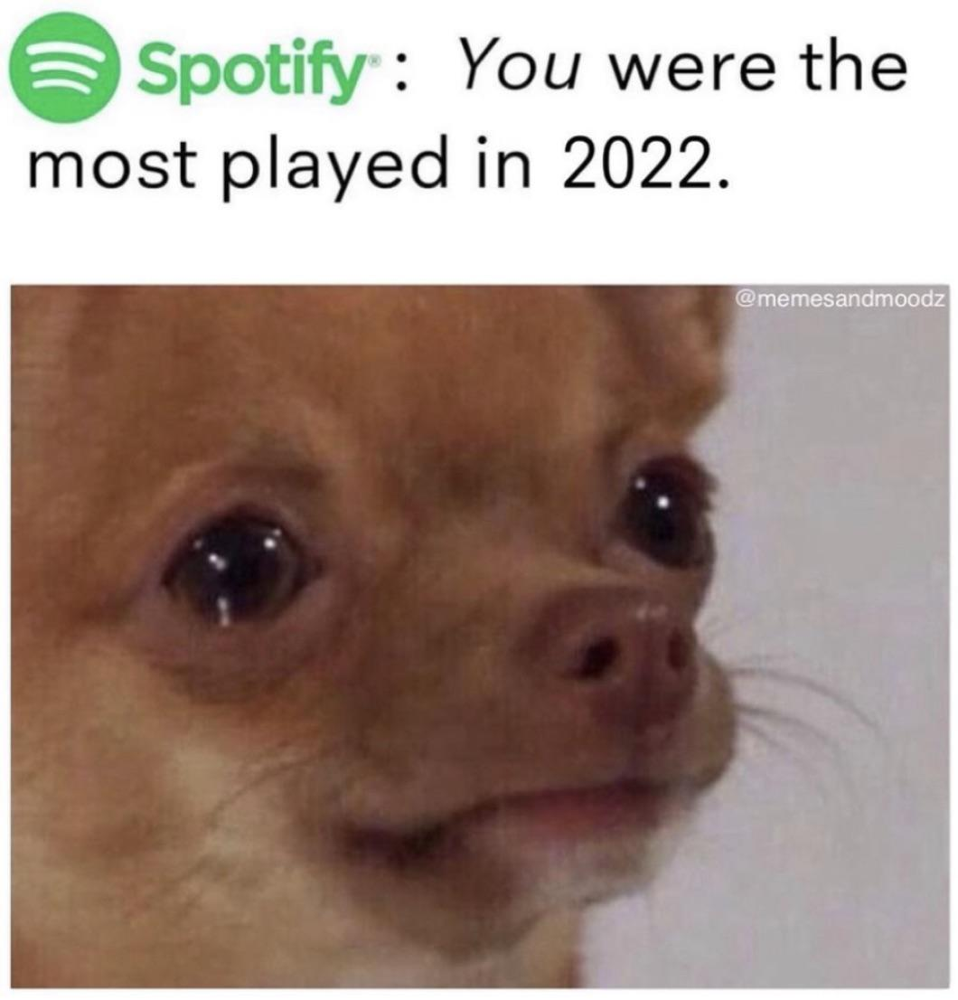
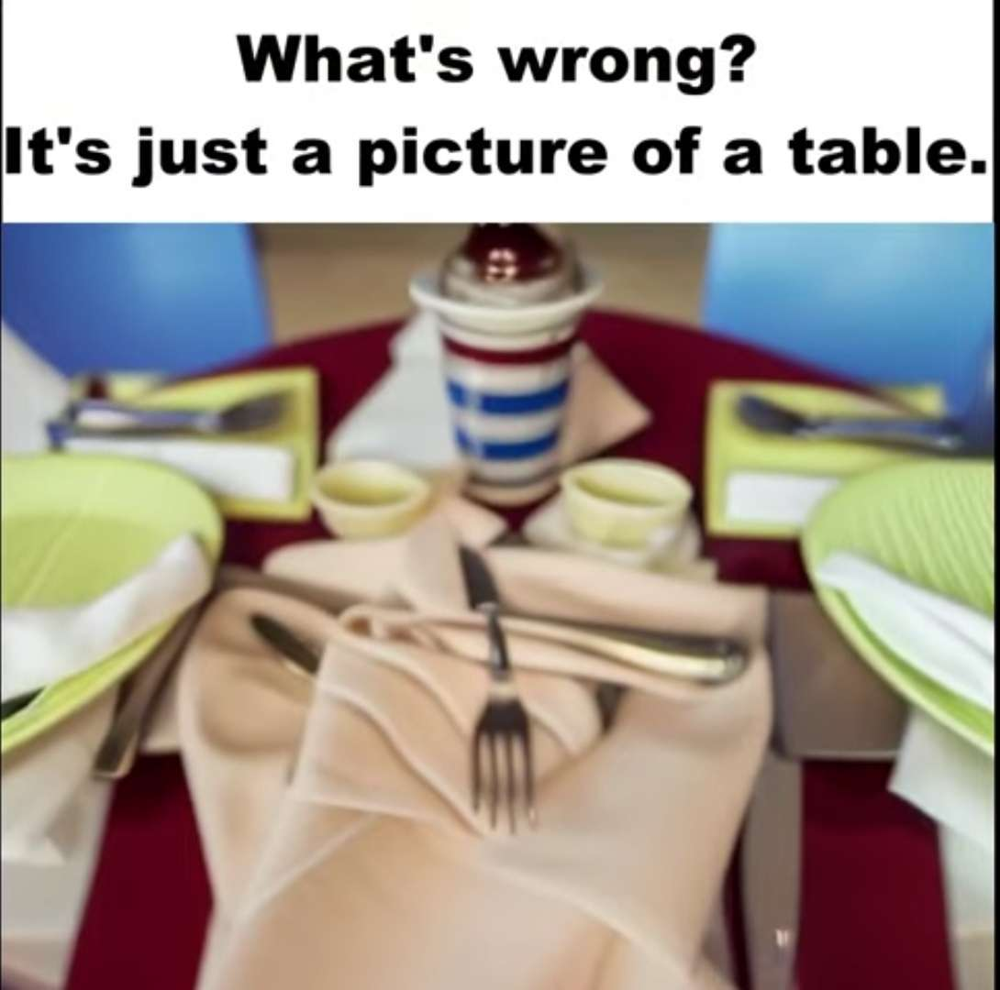
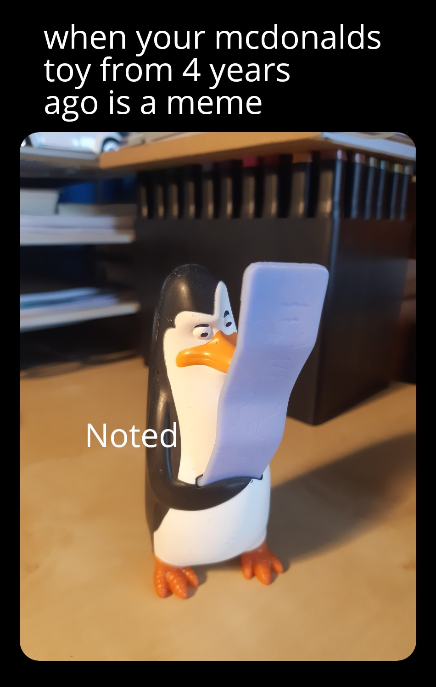
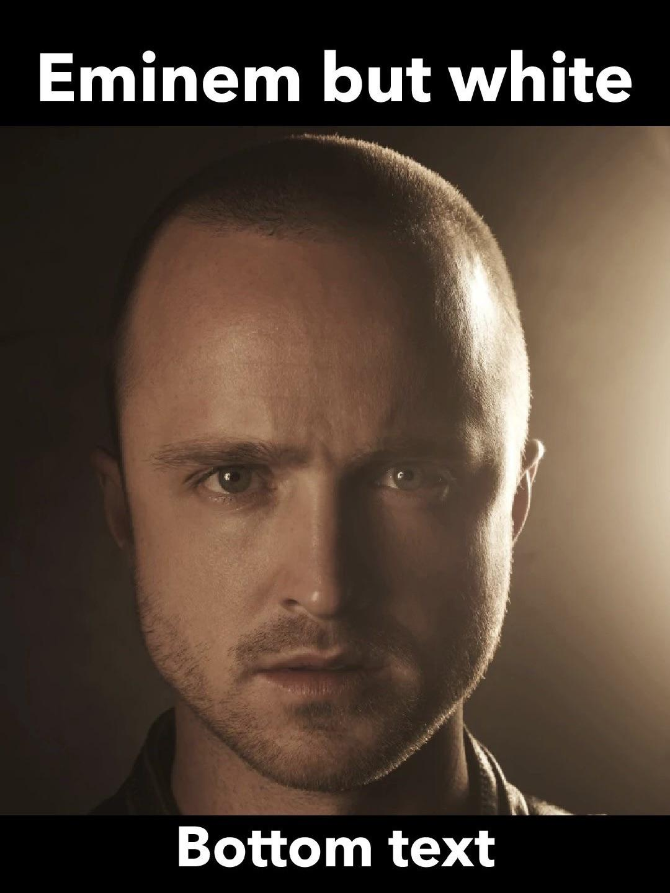
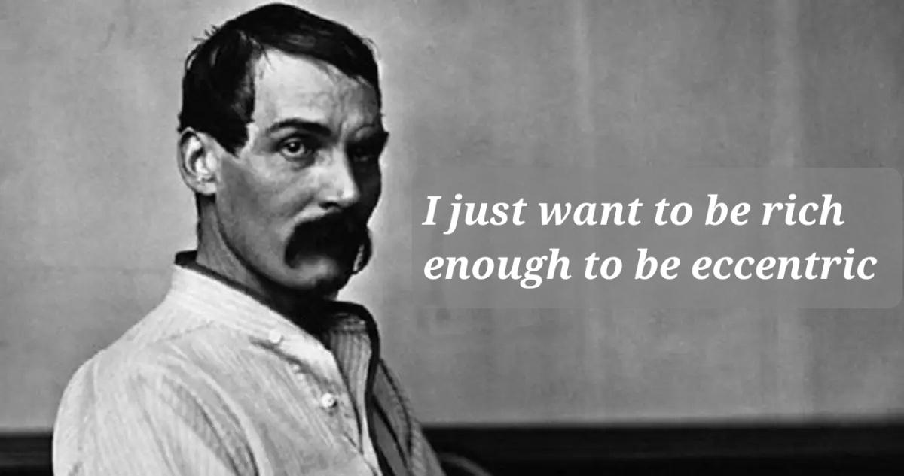
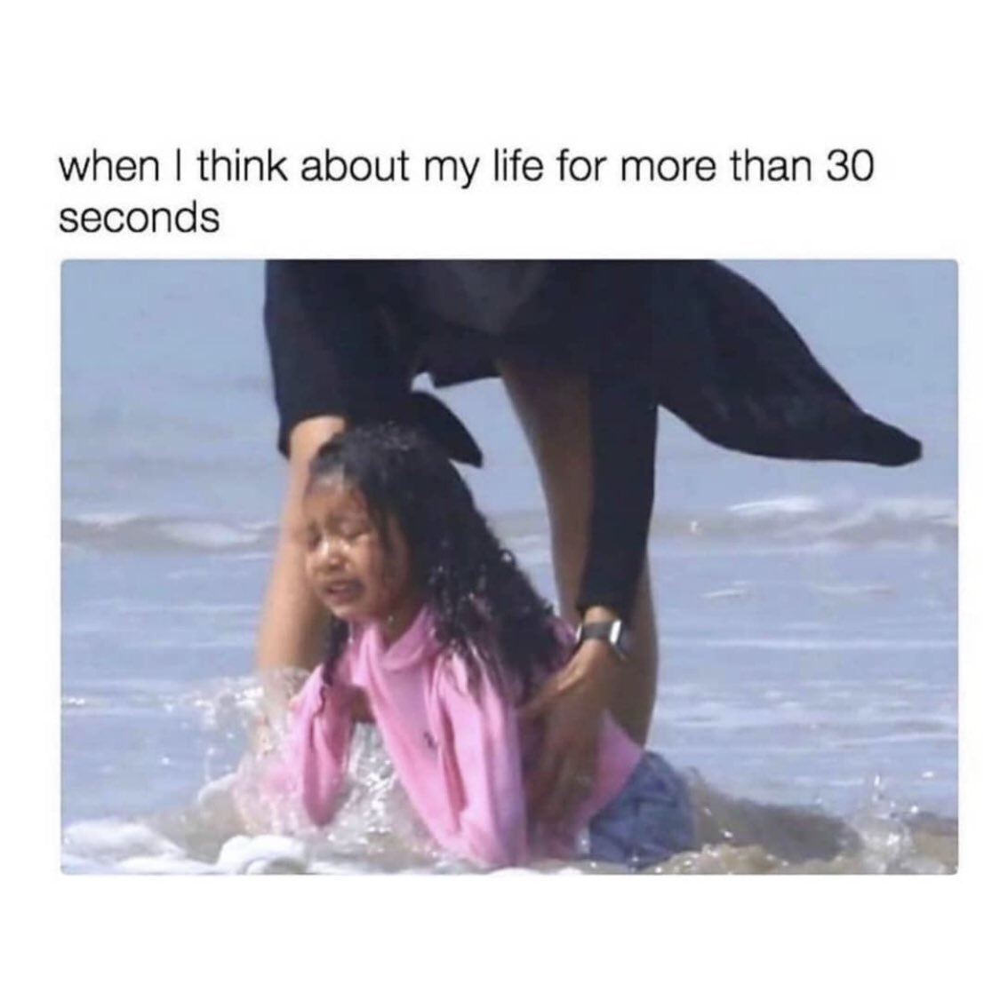
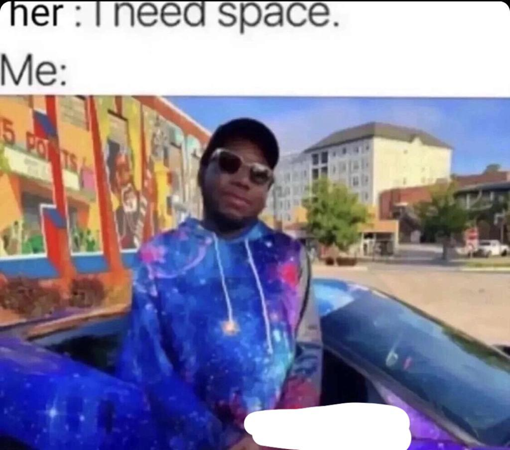
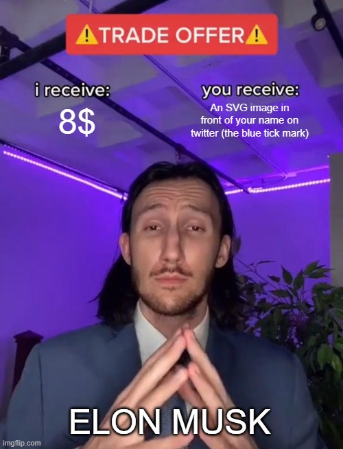
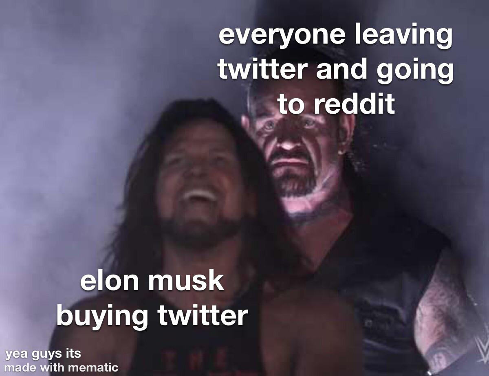
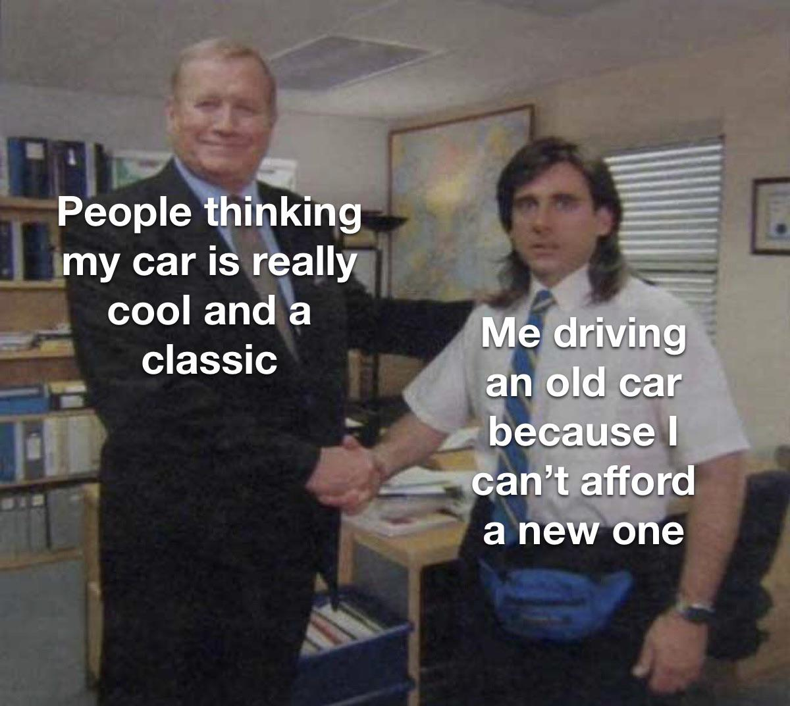

# Qwen-VL Manual Quality Check - image_caption

Use this file to inspect silver-label noise.

Suggested manual fields:
- Correct? yes/no/ambiguous
- Human label
- Notes

---

## 1. Predicted label: **INVALID**

- **Title:** Well then..
- **Meme caption:** Meme poster is trying to convey that meme poster got played more than the music on Spotify.
- **Raw model response:** `ERROR: NameError("name 'make_query' is not defined")`
- **Manual judgment:** 
- **Human label if different:** 
- **Notes:** 

---

## 2. Predicted label: **INVALID**

- **Title:** THE ONE PIECE... THE ONE PIECE IS REAL!
- **Meme caption:** Meme poster thinks if we add something to the picture of table with plates and spoons, then it will be changed to something cooler.
- **Raw model response:** `ERROR: NameError("name 'make_query' is not defined")`
- **Manual judgment:** 
- **Human label if different:** 
- **Notes:** 

---

## 3. Predicted label: **INVALID**

- **Title:** A bit late tho
- **Meme caption:** Meme poster feels old because their McDonald's toy from four years ago is now a meme.
- **Raw model response:** `ERROR: NameError("name 'make_query' is not defined")`
- **Manual judgment:** 
- **Human label if different:** 
- **Notes:** 

---

## 4. Predicted label: **INVALID**

- **Title:** Imagine
- **Meme caption:** Meme poster is trying to convey that Eminem is not being himself.
- **Raw model response:** `ERROR: NameError("name 'make_query' is not defined")`
- **Manual judgment:** 
- **Human label if different:** 
- **Notes:** 

---

## 5. Predicted label: **INVALID**

- **Title:** Is that too much to ask?
- **Meme caption:** Meme poster is trying to convey that they want to be wealthy enough to not care what people think of their eccentricities.
- **Raw model response:** `ERROR: NameError("name 'make_query' is not defined")`
- **Manual judgment:** 
- **Human label if different:** 
- **Notes:** 

---

## 6. Predicted label: **INVALID**

- **Title:** Help me, will you?
- **Meme caption:** Meme poster gets sad due to thinking of his life.
- **Raw model response:** `ERROR: NameError("name 'make_query' is not defined")`
- **Manual judgment:** 
- **Human label if different:** 
- **Notes:** 

---

## 7. Predicted label: **INVALID**

- **Title:** Homie's a genius...
- **Meme caption:** Meme poster laughing complements towards that person.
- **Raw model response:** `ERROR: NameError("name 'make_query' is not defined")`
- **Manual judgment:** 
- **Human label if different:** 
- **Notes:** 

---

## 8. Predicted label: **INVALID**

- **Title:** 8$ to feel validated on twitter ~
- **Meme caption:** Meme poster is trying to convey that Elon Musk is trying to convince people to pay for Twitter Blue even though on paper it is not a good deal.
- **Raw model response:** `ERROR: NameError("name 'make_query' is not defined")`
- **Manual judgment:** 
- **Human label if different:** 
- **Notes:** 

---

## 9. Predicted label: **INVALID**

- **Title:** twitter moment
- **Meme caption:** Meme poster thinks that Elon Musk is happy to have bought Twitter but he has ruined the experience of users of the platform.
- **Raw model response:** `ERROR: NameError("name 'make_query' is not defined")`
- **Manual judgment:** 
- **Human label if different:** 
- **Notes:** 

---

## 10. Predicted label: **INVALID**

- **Title:** When your car is older than you
- **Meme caption:** Meme poster is trying to convey that their car is not really a classic, but people think it is.
- **Raw model response:** `ERROR: NameError("name 'make_query' is not defined")`
- **Manual judgment:** 
- **Human label if different:** 
- **Notes:** 

---

