# Qwen-VL Manual Quality Check - image_caption

Use this file to inspect silver-label noise.

Suggested manual fields:
- Correct? yes/no/ambiguous
- Human label
- Notes

---

## 1. Predicted label: **Anger**

- **Title:** He did tell him...
- **Meme caption:** Meme poster is trying to convey that Kanye West has gone insane and he needs another person like Pete Davidson to watch him.
- **Raw model response:** `Anger`
- **Manual judgment:** 
- **Human label if different:** 
- **Notes:** 

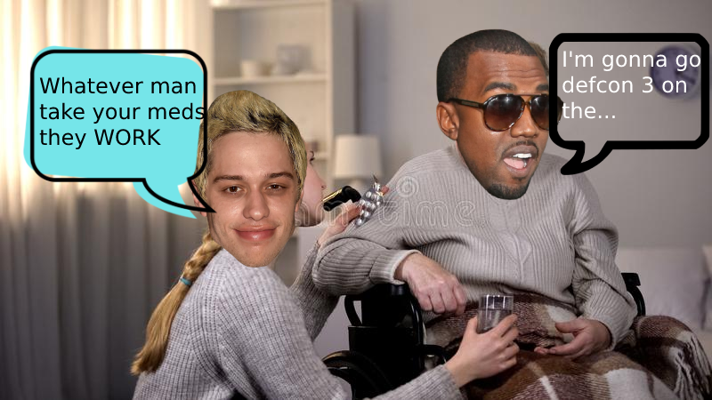

---

## 2. Predicted label: **Anger**

- **Title:** College student problems
- **Meme caption:** The poster gets angry that another college student who shares things with him has damaged his non-stick pan.
- **Raw model response:** `Anger`
- **Manual judgment:** 
- **Human label if different:** 
- **Notes:** 

---

## 3. Predicted label: **Anger**

- **Title:** Big brain
- **Meme caption:** Meme poster is annoyed with anti-vaxxer logic.
- **Raw model response:** `Anger`
- **Manual judgment:** 
- **Human label if different:** 
- **Notes:** 

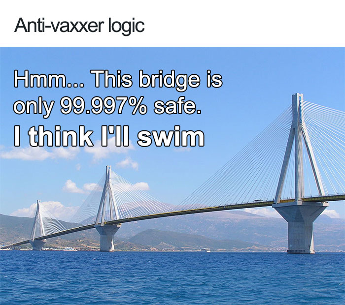

---

## 4. Predicted label: **Anger**

- **Title:** Made me chuckle
- **Meme caption:** Meme poster is trying to convey their dislike for Greta Thunberg.
- **Raw model response:** `Anger`
- **Manual judgment:** 
- **Human label if different:** 
- **Notes:** 

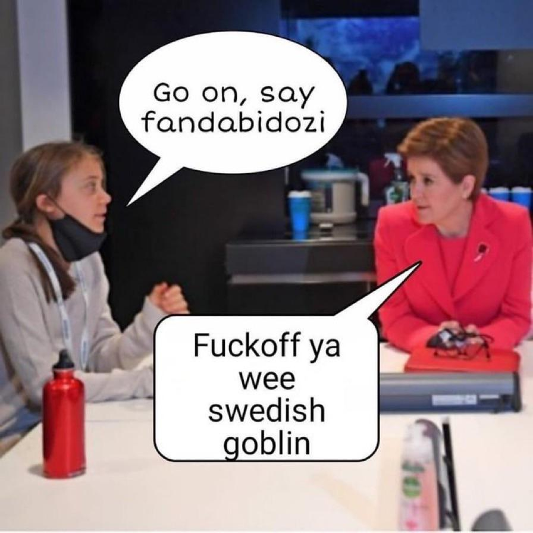

---

## 5. Predicted label: **Anger**

- **Title:** Every single year
- **Meme caption:** Meme poster is trying to convey that retail workers are angry at all the Christmas songs they listen to during the holiday season.
- **Raw model response:** `Anger`
- **Manual judgment:** 
- **Human label if different:** 
- **Notes:** 

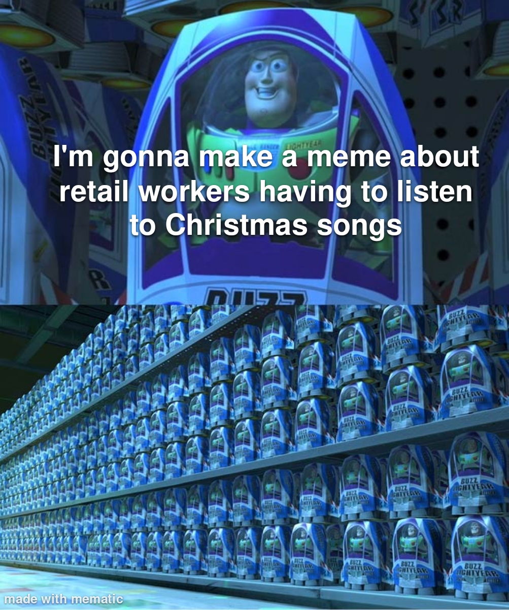

---

## 6. Predicted label: **Anger**

- **Title:** Longevity
- **Meme caption:** Meme poster thinks that Kanye has turned into the Gimp from Pulp Fiction.
- **Raw model response:** `Anger`
- **Manual judgment:** 
- **Human label if different:** 
- **Notes:** 

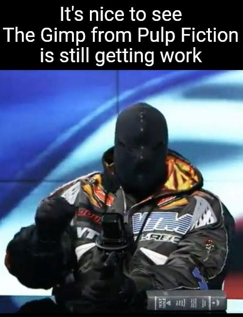

---

## 7. Predicted label: **Anger**

- **Title:** Im a little late to the game, but i made one.
- **Meme caption:** Poster thinks being a business woman means sexual harassment with lower pay.
- **Raw model response:** `Anger`
- **Manual judgment:** 
- **Human label if different:** 
- **Notes:** 

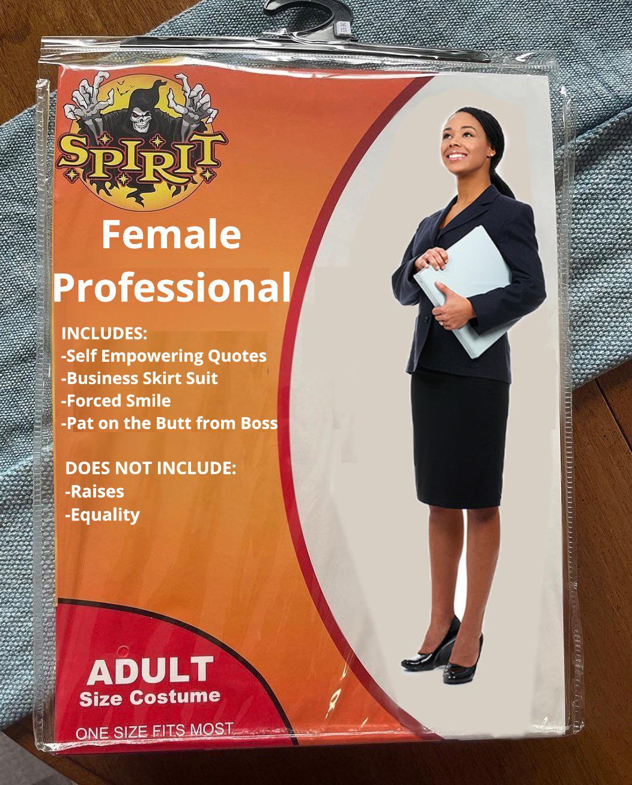

---

## 8. Predicted label: **Anger**

- **Title:** I don't stand a chance.
- **Meme caption:** Meme poser thinks Kanye West is self destructing in front of our eyes.
- **Raw model response:** `Anger`
- **Manual judgment:** 
- **Human label if different:** 
- **Notes:** 

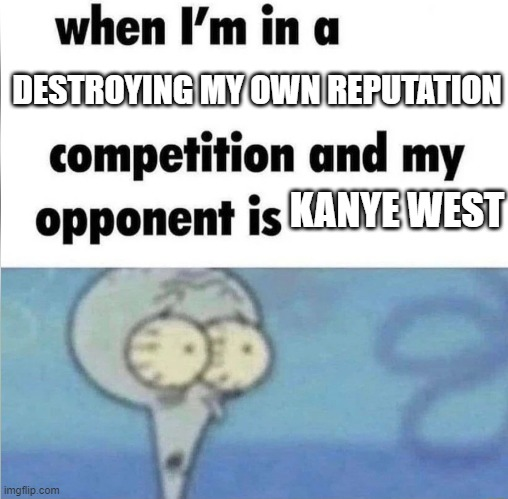

---

## 9. Predicted label: **Anger**

- **Title:** 104 Fahrenheit
- **Meme caption:** Meme poster is trying to convey that they're aggravated with people who ignore and deny climate change.
- **Raw model response:** `Anger`
- **Manual judgment:** 
- **Human label if different:** 
- **Notes:** 

---

## 10. Predicted label: **Anger**

- **Title:** So sad but so true
- **Meme caption:** Meme poster has to select where they want to pee but society makes it so it can only be the toilet.
- **Raw model response:** `Anger`
- **Manual judgment:** 
- **Human label if different:** 
- **Notes:** 

---

## 11. Predicted label: **Disgust**

- **Title:** Happened to everybody
- **Meme caption:** Meme poster felt alone and uncomfortable as a child whenever they lost their mother while at the store.
- **Raw model response:** `Disgust`
- **Manual judgment:** 
- **Human label if different:** 
- **Notes:** 

---

## 12. Predicted label: **Disgust**

- **Title:** Times have changed
- **Meme caption:** Meme poster is trying to convey that chivalry is dead and the way that men hit on women nowadays is disgusting.
- **Raw model response:** `Disgust`
- **Manual judgment:** 
- **Human label if different:** 
- **Notes:** 

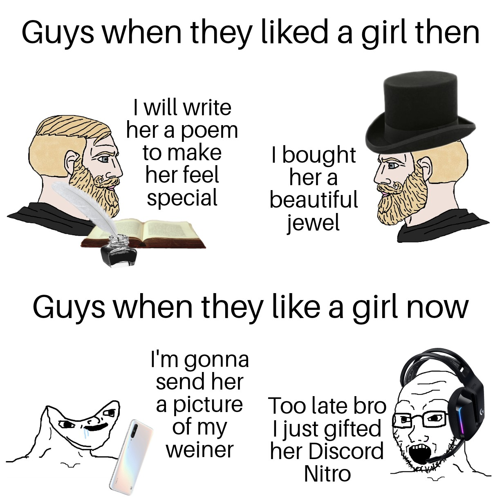

---

## 13. Predicted label: **Disgust**

- **Title:** just get on with it
- **Meme caption:** The meme poster is disgusted by the activity and receives an apology from his mate.
- **Raw model response:** `Disgust`
- **Manual judgment:** 
- **Human label if different:** 
- **Notes:** 

---

## 14. Predicted label: **Disgust**

- **Title:** No I don't want your cookies
- **Meme caption:** The meme poster doesn't want to buy Girl Scout cookies.
- **Raw model response:** `The dominant emotion expressed by the meme poster is "disgust".`
- **Manual judgment:** 
- **Human label if different:** 
- **Notes:** 

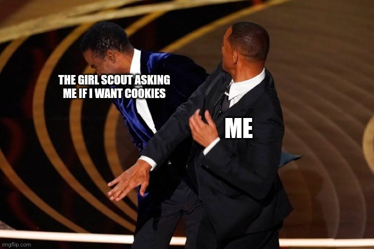

---

## 15. Predicted label: **Disgust**

- **Title:** Once these two words come up, it's recipe for disaster
- **Meme caption:** Customers don't want the products of their youth updated for the modern times.
- **Raw model response:** `The dominant emotion expressed by the meme poster is "disgust".`
- **Manual judgment:** 
- **Human label if different:** 
- **Notes:** 

---

## 16. Predicted label: **Fear**

- **Title:** Watermelonman!!
- **Meme caption:** Meme poster's finances were harmed by inflation.
- **Raw model response:** `Fear`
- **Manual judgment:** 
- **Human label if different:** 
- **Notes:** 

---

## 17. Predicted label: **Fear**

- **Title:** stupid background
- **Meme caption:** Meme poster is terrified of birds and is forced to watch Swan Lake.
- **Raw model response:** `Fear`
- **Manual judgment:** 
- **Human label if different:** 
- **Notes:** 

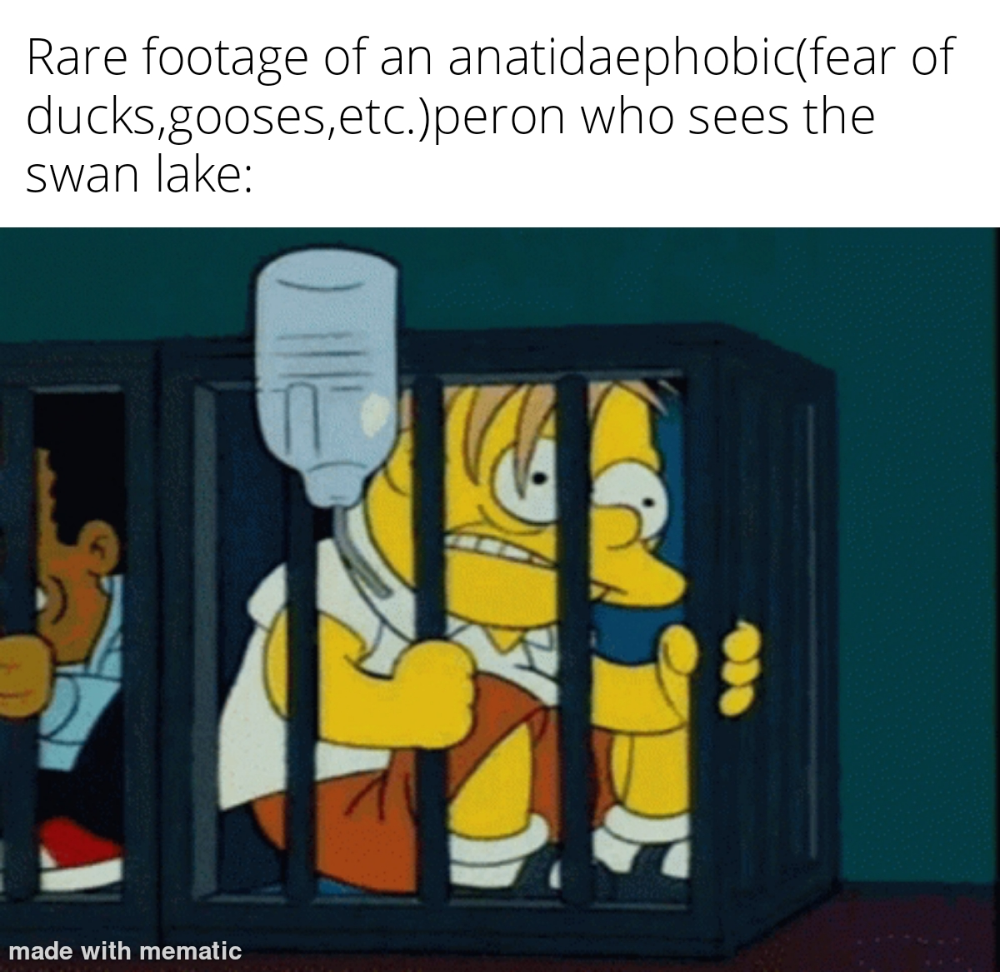

---

## 18. Predicted label: **Joy**

- **Title:** Space Karen
- **Meme caption:** Meme poster is amused because Elon Musk fired a bunch of Twitter employees who had pronouns in their bios.
- **Raw model response:** `Joy`
- **Manual judgment:** 
- **Human label if different:** 
- **Notes:** 

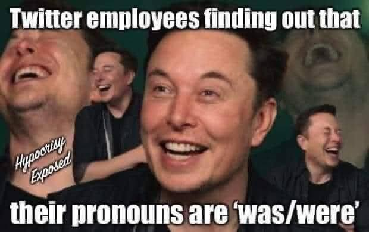

---

## 19. Predicted label: **Joy**

- **Title:** Not Really That Into Them
- **Meme caption:** Meme poster is trying to convey their frustration with monthly bills coming in too fast.
- **Raw model response:** `Joy`
- **Manual judgment:** 
- **Human label if different:** 
- **Notes:** 

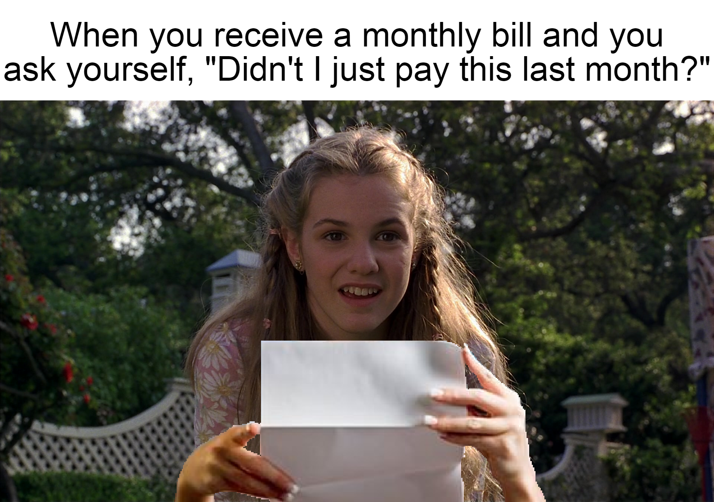

---

## 20. Predicted label: **Joy**

- **Title:** I am annoyed by it to say the least
- **Meme caption:** The meme poster is trying to convey that he hates Republican Red but doesn't hate Democratic Blue.
- **Raw model response:** `Joy`
- **Manual judgment:** 
- **Human label if different:** 
- **Notes:** 

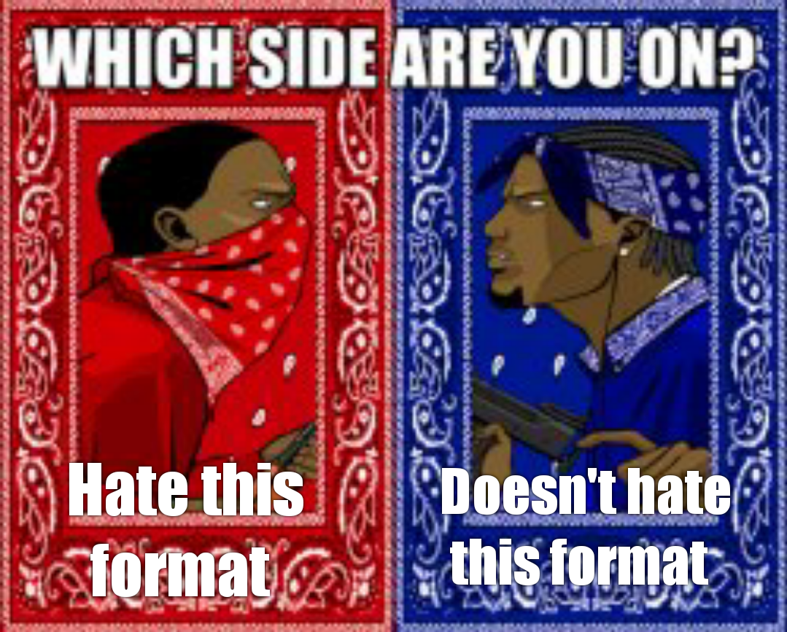

---

## 21. Predicted label: **Joy**

- **Title:** so relatable
- **Meme caption:** Meme poster is trying to act calm when somebody sneezes but is internally freaking out.
- **Raw model response:** `Joy`
- **Manual judgment:** 
- **Human label if different:** 
- **Notes:** 

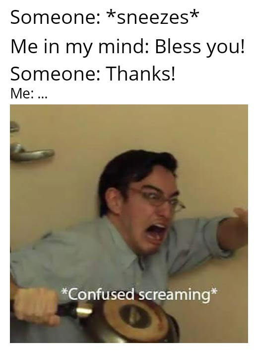

---

## 22. Predicted label: **Joy**

- **Title:** Normal people vs Instagram models
- **Meme caption:** Meme poster thinks Instagram models pop their body parts out sexually to get the likes a lot more than normal people.
- **Raw model response:** `Joy`
- **Manual judgment:** 
- **Human label if different:** 
- **Notes:** 

---

## 23. Predicted label: **Joy**

- **Title:** Want some ketchup?
- **Meme caption:** Meme poster is happy the teacher is throwing a pizza party until he sees the sizes.
- **Raw model response:** `Joy`
- **Manual judgment:** 
- **Human label if different:** 
- **Notes:** 

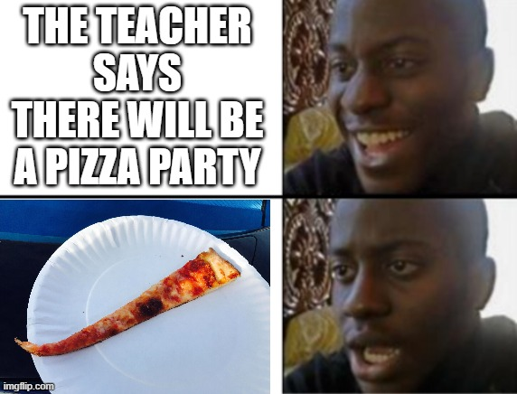

---

## 24. Predicted label: **Joy**

- **Title:** it's 11 o'clock
- **Meme caption:** The meme poster punishes his friend who came late to the party.
- **Raw model response:** `Joy`
- **Manual judgment:** 
- **Human label if different:** 
- **Notes:** 

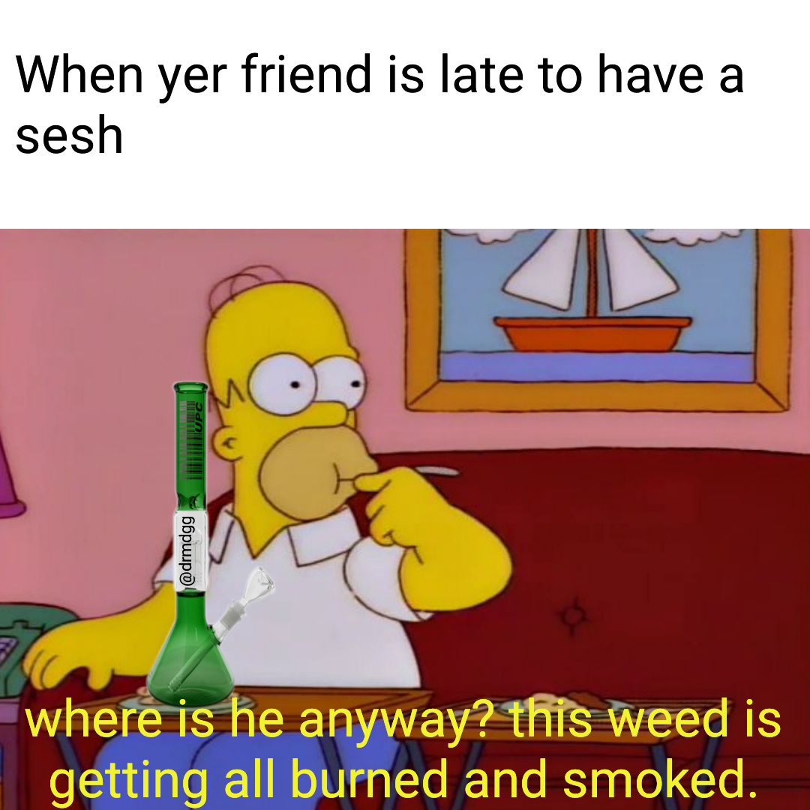

---

## 25. Predicted label: **Joy**

- **Title:** Every time
- **Meme caption:** Meme poster is trying to convey that the dog mistakes the owner for moving their leg in their sleep as getting ready to get up.
- **Raw model response:** `Joy`
- **Manual judgment:** 
- **Human label if different:** 
- **Notes:** 

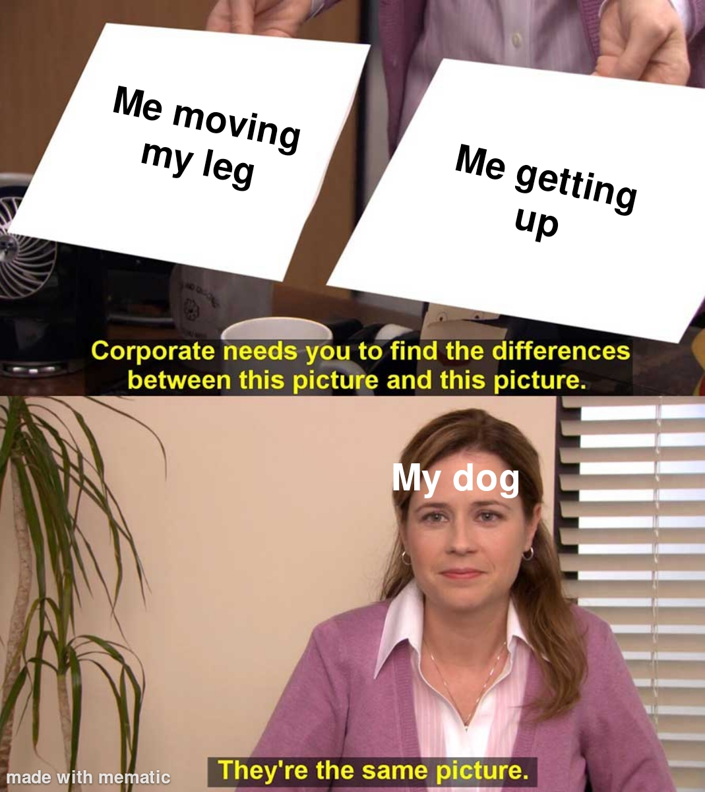

---

## 26. Predicted label: **Joy**

- **Title:** My dad is tryna teach me about tools
- **Meme caption:** Meme poster's dad wants a huge screwdriver to screw in the giant screw.
- **Raw model response:** `Joy`
- **Manual judgment:** 
- **Human label if different:** 
- **Notes:** 

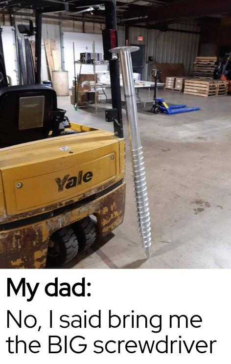

---

## 27. Predicted label: **Joy**

- **Title:** It do be like that
- **Meme caption:** Meme poster feels better paying $25 for a product with no shipping then paying $20 for something and $5 for shipping.
- **Raw model response:** `Joy`
- **Manual judgment:** 
- **Human label if different:** 
- **Notes:** 

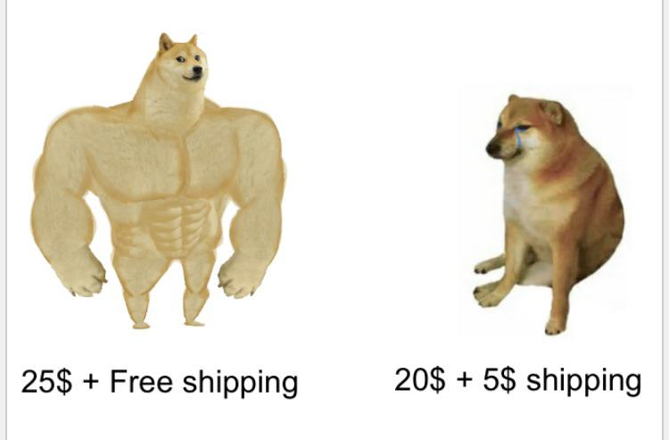

---

## 28. Predicted label: **Neutral**

- **Title:** Why max why :(
- **Meme caption:** Meme poster is trying to convey that they aren't happy about getting banned from a discord server.
- **Raw model response:** `Neutral.`
- **Manual judgment:** 
- **Human label if different:** 
- **Notes:** 

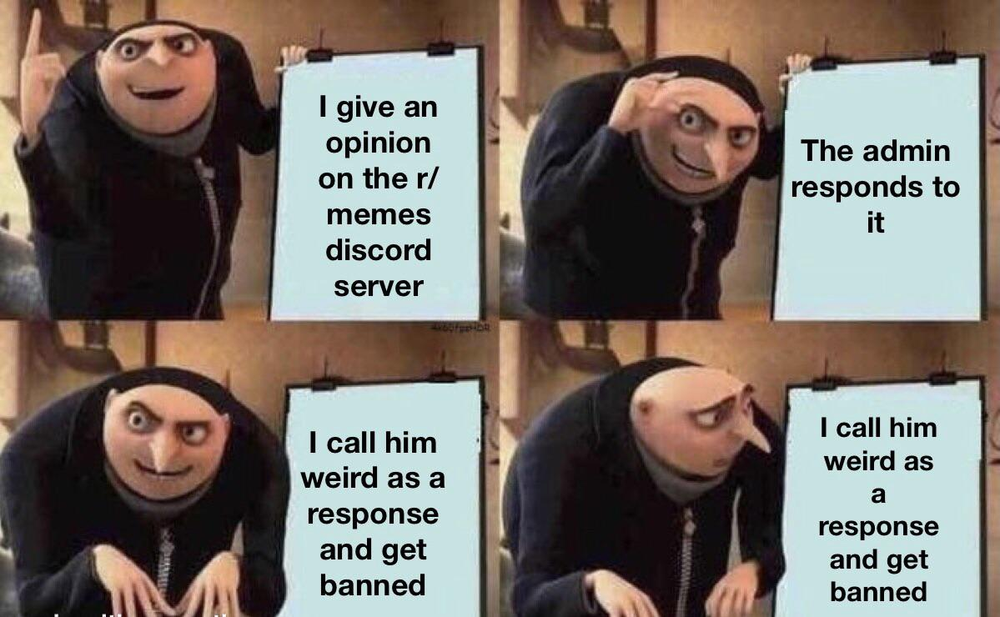

---

## 29. Predicted label: **Neutral**

- **Title:** Forbes be in chaos rn.
- **Meme caption:** Meme poster thinks Forbes is trying to put out the fire of their founder losing a lot of money.
- **Raw model response:** `Neutral`
- **Manual judgment:** 
- **Human label if different:** 
- **Notes:** 

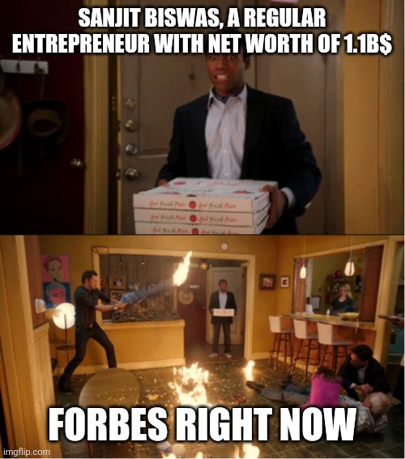

---

## 30. Predicted label: **Neutral**

- **Title:** Based on a true story
- **Meme caption:** Meme poster lied to the magician during a show and both can't do anything.
- **Raw model response:** `Neutral`
- **Manual judgment:** 
- **Human label if different:** 
- **Notes:** 

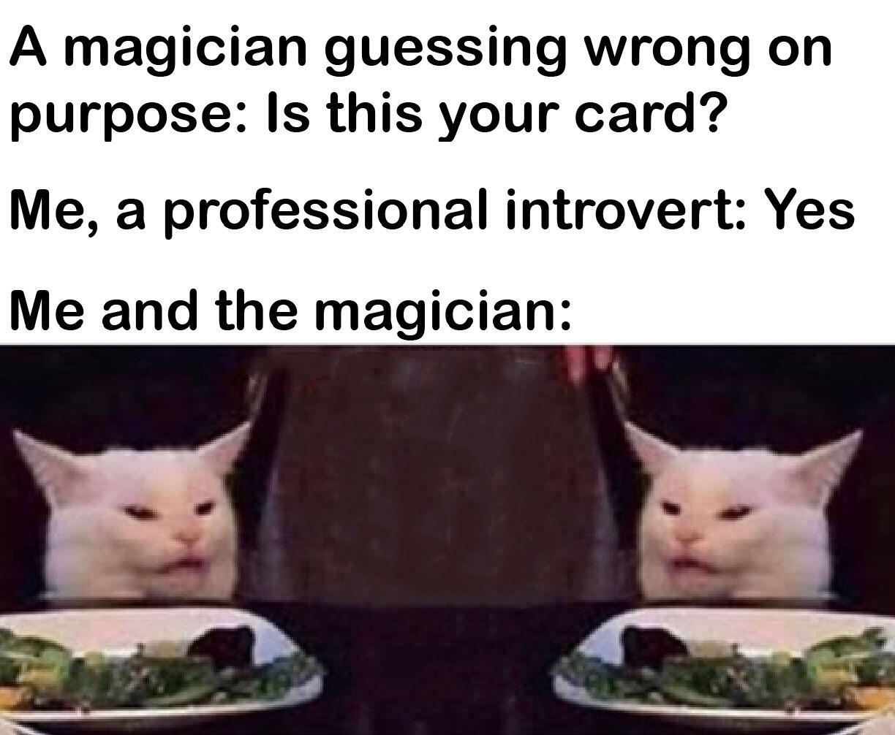

---

## 31. Predicted label: **Neutral**

- **Title:** The Ye Reicht
- **Meme caption:** Meme poster will say Kanye is a klan member from a sketch rather than himself.
- **Raw model response:** `Neutral`
- **Manual judgment:** 
- **Human label if different:** 
- **Notes:** 

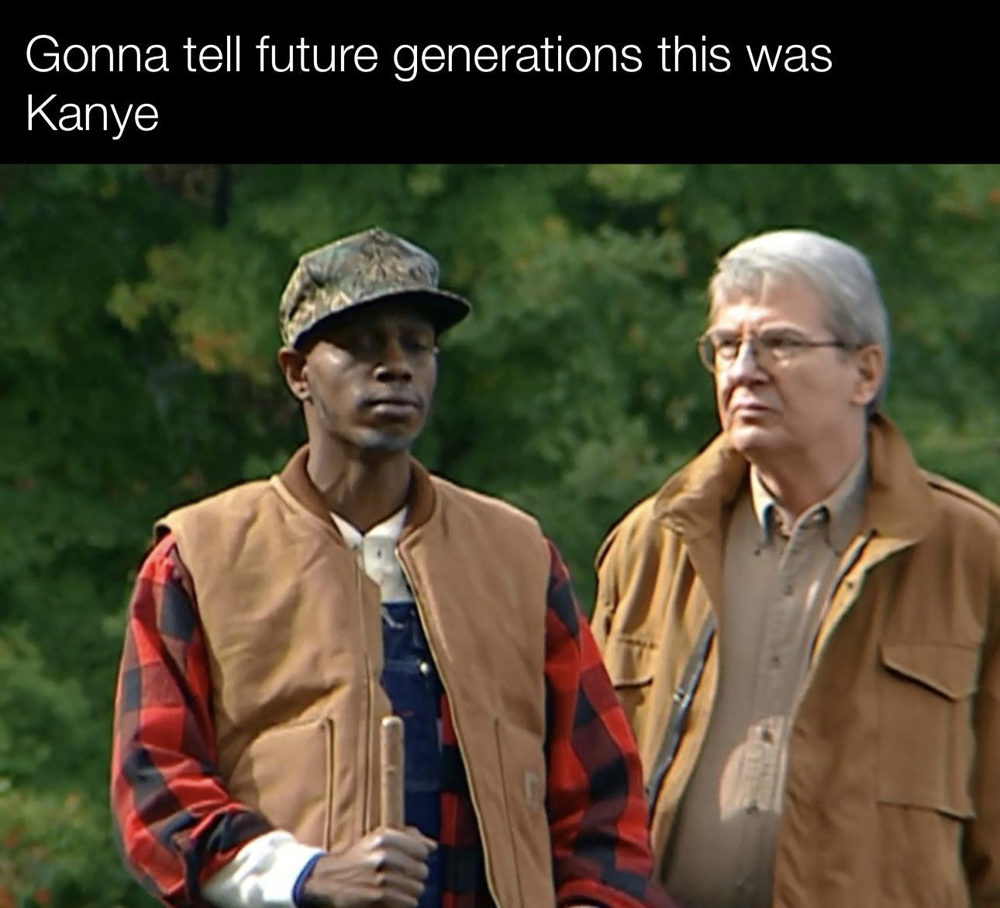

---

## 32. Predicted label: **Neutral**

- **Title:** We just need some little help to stand
- **Meme caption:** Meme poster feels overwhelmed and needs help solving simple and easy problems they can solve themselves.
- **Raw model response:** `Neutral`
- **Manual judgment:** 
- **Human label if different:** 
- **Notes:** 

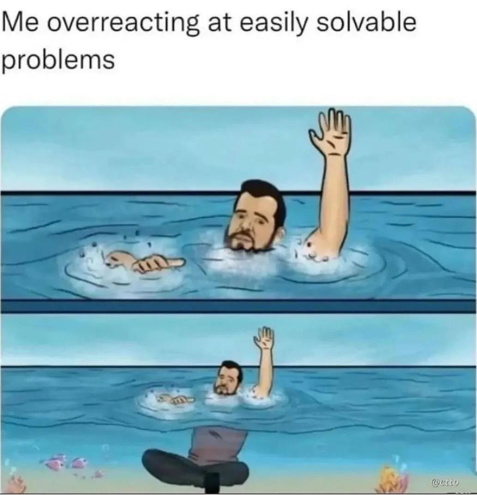

---

## 33. Predicted label: **Neutral**

- **Title:** yeah you're right but I'll sleep on it first
- **Meme caption:** Poster is grimaced at the idea of trying and failing rather than not try at all.
- **Raw model response:** `Neutral`
- **Manual judgment:** 
- **Human label if different:** 
- **Notes:** 

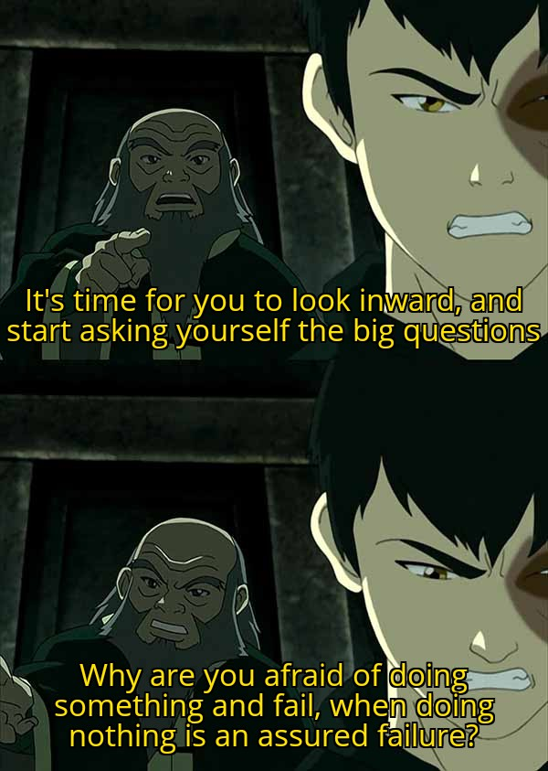

---

## 34. Predicted label: **Neutral**

- **Title:** Don't be the guy who brings politics into everything
- **Meme caption:** Meme poster is trying to convey that listening to people argue about politics gives them a major headache.
- **Raw model response:** `Neutral`
- **Manual judgment:** 
- **Human label if different:** 
- **Notes:** 

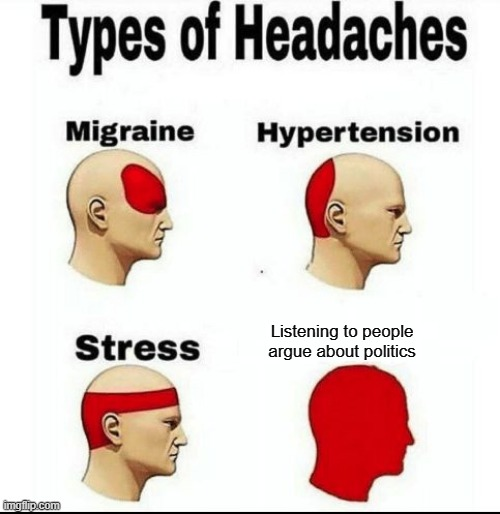

---

## 35. Predicted label: **Neutral**

- **Title:** I cant believe you
- **Meme caption:** The meme poster says that, he isn't mad but just disappointed.
- **Raw model response:** `Neutral`
- **Manual judgment:** 
- **Human label if different:** 
- **Notes:** 

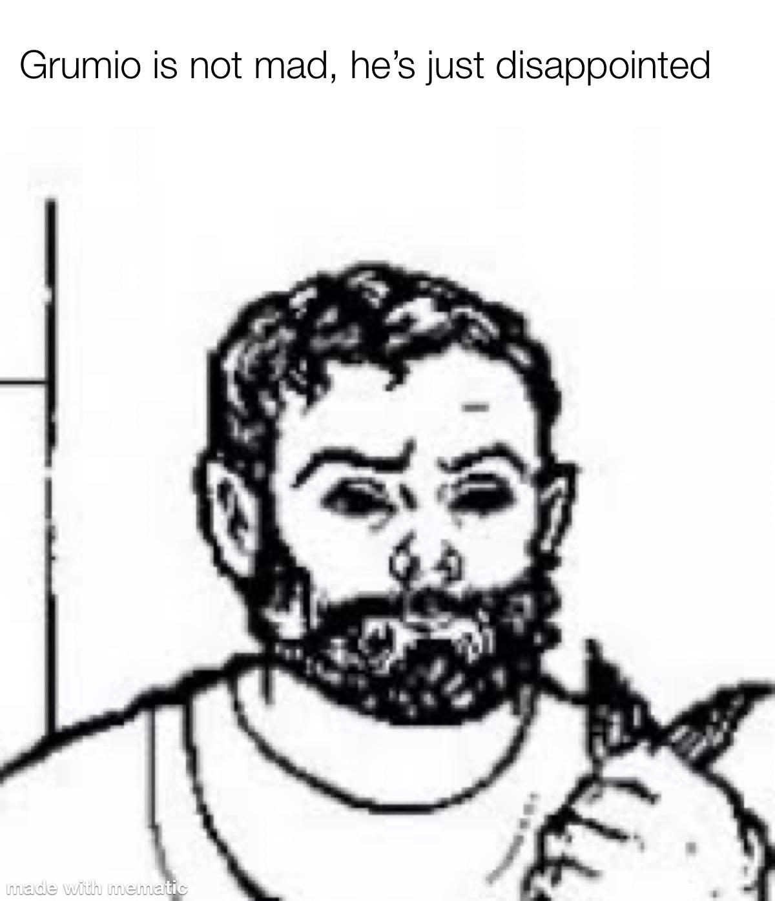

---

## 36. Predicted label: **Neutral**

- **Title:** What the hell is wrong with people
- **Meme caption:** Meme poster feels gross about how Disney market use their characters when seeing an ad for baby yoda toothpaste cap.
- **Raw model response:** `Neutral`
- **Manual judgment:** 
- **Human label if different:** 
- **Notes:** 

---

## 37. Predicted label: **Neutral**

- **Title:** I thought he was just another talk show person
- **Meme caption:** The meme poster agrees that, he can't figure the reason of why people hate James Corden and he doesn't have the courage to ask it.
- **Raw model response:** `Neutral`
- **Manual judgment:** 
- **Human label if different:** 
- **Notes:** 

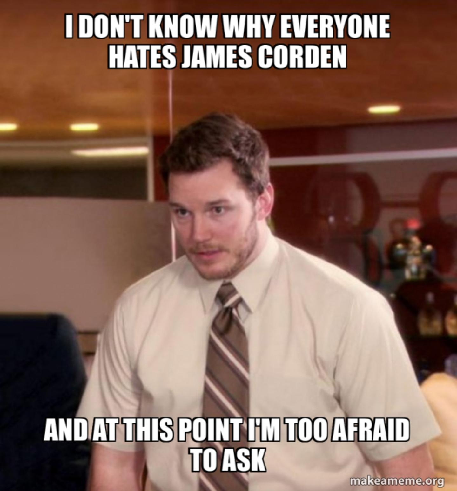

---

## 38. Predicted label: **Sadness**

- **Title:** It be like that
- **Meme caption:** Meme poster is conveying how horrible their childhood was.
- **Raw model response:** `Sadness`
- **Manual judgment:** 
- **Human label if different:** 
- **Notes:** 

---

## 39. Predicted label: **Sadness**

- **Title:** Cry me a river
- **Meme caption:** Meme poster is sad their mom keeps meeting new men.
- **Raw model response:** `Sadness`
- **Manual judgment:** 
- **Human label if different:** 
- **Notes:** 

---

## 40. Predicted label: **Sadness**

- **Title:** Happy day to all of us!!!
- **Meme caption:** Meme poster is sad that they'll be celebrating singles day alone.
- **Raw model response:** `Sadness`
- **Manual judgment:** 
- **Human label if different:** 
- **Notes:** 

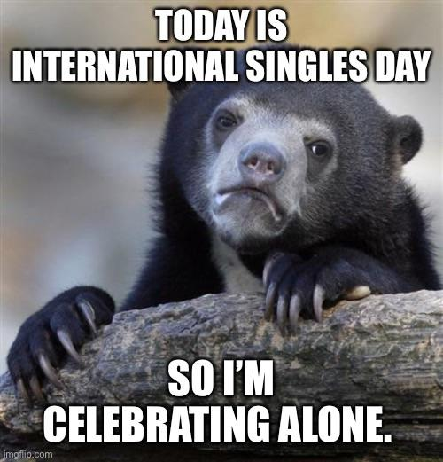

---

## 41. Predicted label: **Sadness**

- **Title:** My Ordinary Life is basically the same concept as Pumped up Kicks somehow
- **Meme caption:** Meme poster is listening to the lyrics of a depressing song and is all in their feels despite the good beat.
- **Raw model response:** `Sadness`
- **Manual judgment:** 
- **Human label if different:** 
- **Notes:** 

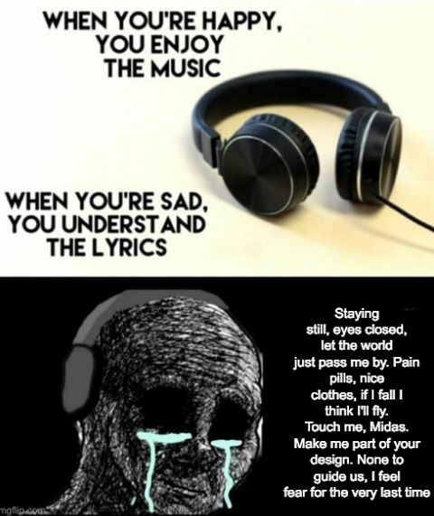

---

## 42. Predicted label: **Sadness**

- **Title:** everyone leaves at the end, but pain stays, pain is my friend
- **Meme caption:** Meme poster is sad when they think about not having friends.
- **Raw model response:** `Sadness`
- **Manual judgment:** 
- **Human label if different:** 
- **Notes:** 

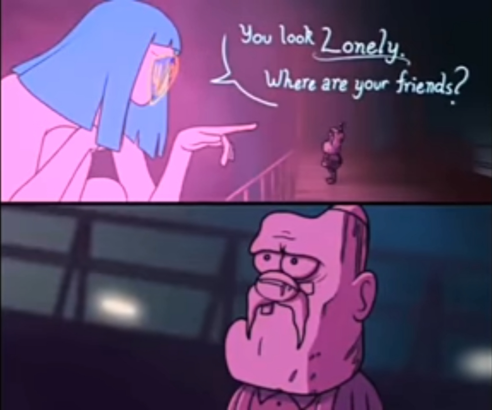

---

## 43. Predicted label: **Sadness**

- **Title:** Outplayed
- **Meme caption:** Meme poster doesn't need to choose between getting married or staying single, they can decide to commit suicide by plane.
- **Raw model response:** `Sadness`
- **Manual judgment:** 
- **Human label if different:** 
- **Notes:** 

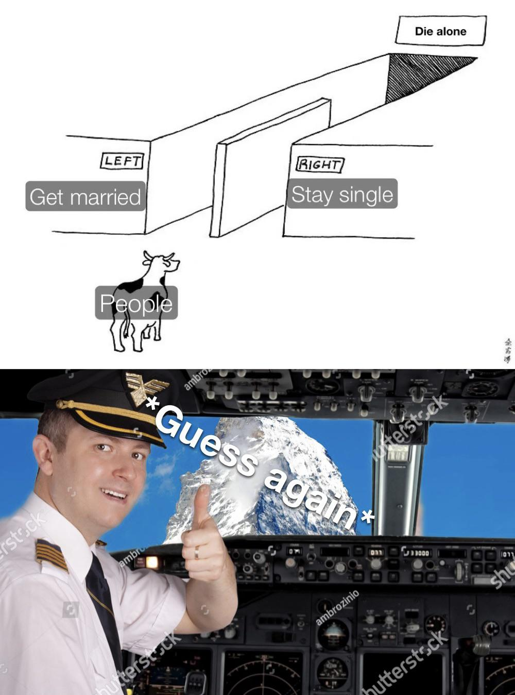

---

## 44. Predicted label: **Surprise**

- **Title:** Simpsons predicted it yet again
- **Meme caption:** The Simpsons was correct about it's use of Trump and Greta Thurnberg.
- **Raw model response:** `The dominant emotion expressed by the meme poster is surprise.`
- **Manual judgment:** 
- **Human label if different:** 
- **Notes:** 

---

## 45. Predicted label: **Surprise**

- **Title:** AI is the future
- **Meme caption:** Meme poster realizes ai memes can hurt them despite what their therapist say.
- **Raw model response:** `The dominant emotion expressed by the meme poster is surprise.`
- **Manual judgment:** 
- **Human label if different:** 
- **Notes:** 

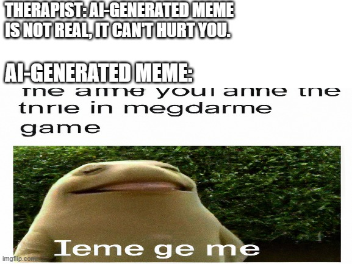

---

## 46. Predicted label: **Surprise**

- **Title:** Happened when i was searching for this meme template
- **Meme caption:** The meme poster gets easily distracted by other images and forgets about the image he came to search for.
- **Raw model response:** `The dominant emotion expressed by the meme poster is surprise.`
- **Manual judgment:** 
- **Human label if different:** 
- **Notes:** 

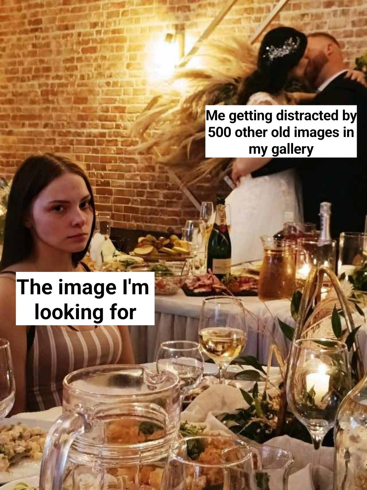

---

## 47. Predicted label: **Surprise**

- **Title:** the first line was made by an ai
- **Meme caption:** Meme poster thinks Elon Musk would choose drawing 25 uno cards instead of staying on the planet.
- **Raw model response:** `The dominant emotion expressed by the meme poster is surprise.`
- **Manual judgment:** 
- **Human label if different:** 
- **Notes:** 

---

## 48. Predicted label: **Surprise**

- **Title:** While we do this, Australians laugh at us for attempting their accent
- **Meme caption:** Everyone becomes more and more shocked when they realize the meme poster was correct about Australian accents.
- **Raw model response:** `Surprise`
- **Manual judgment:** 
- **Human label if different:** 
- **Notes:** 

---

## 49. Predicted label: **Surprise**

- **Title:** It's so bad. So, so bad.
- **Meme caption:** The meme poster degrades The Steam's new product of a Controller configuration tool.
- **Raw model response:** `The dominant intended emotion expressed by the meme poster is " Surprise".`
- **Manual judgment:** 
- **Human label if different:** 
- **Notes:** 

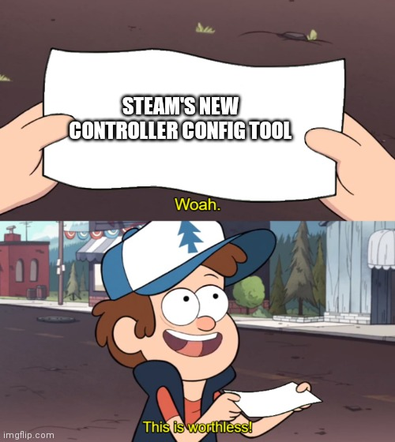

---

