# Qwen-VL Manual Quality Check - image_caption

Use this file to inspect silver-label noise.

Suggested manual fields:
- Correct? yes/no/ambiguous
- Human label
- Notes

---

## 1. Predicted label: **Anger**

- **Title:** in an alternate reality...
- **Meme caption:** The meme poster thinks that ripping from youtube is better than using spotify.
- **Raw model response:** `Anger`
- **Manual judgment:** 
- **Human label if different:** 
- **Notes:** 

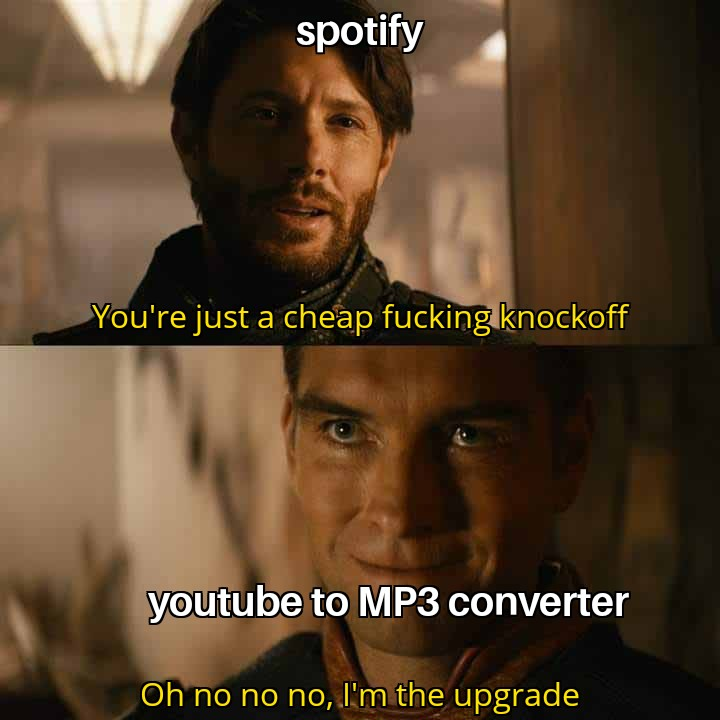

---

## 2. Predicted label: **Anger**

- **Title:** my back its kinda...
- **Meme caption:** Meme poster realizes they are the angry adults they used to make fun of in youth.
- **Raw model response:** `Anger`
- **Manual judgment:** 
- **Human label if different:** 
- **Notes:** 

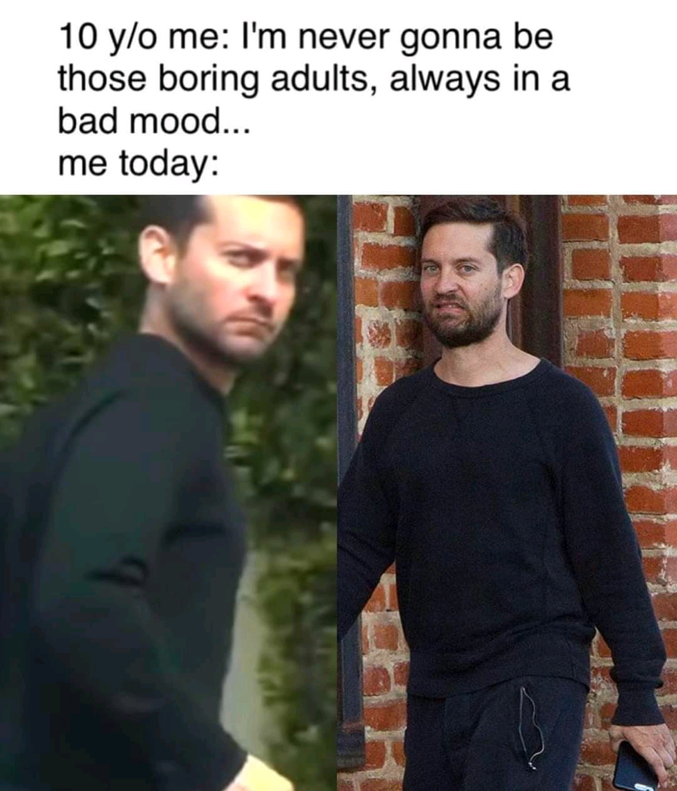

---

## 3. Predicted label: **Anger**

- **Title:** ah thats hot
- **Meme caption:** Meme poster is trying to convey that if women want to be irresistible to men they need to be lego star wars boxes.
- **Raw model response:** `Anger`
- **Manual judgment:** 
- **Human label if different:** 
- **Notes:** 

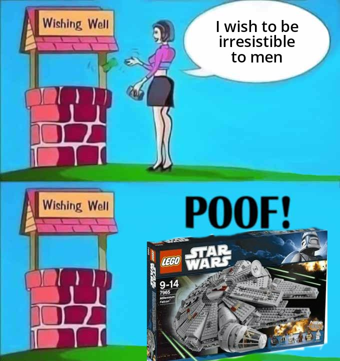

---

## 4. Predicted label: **Anger**

- **Title:** There is always DVDs
- **Meme caption:** Meme poster is trying to convey that they're tired of all the major streaming services removing their favorite movies.
- **Raw model response:** `Anger.`
- **Manual judgment:** 
- **Human label if different:** 
- **Notes:** 

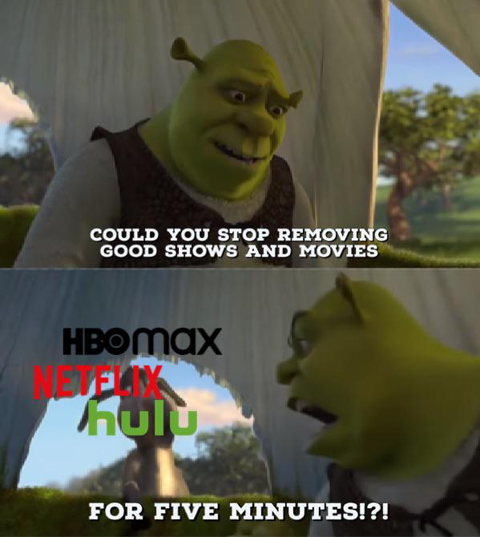

---

## 5. Predicted label: **Anger**

- **Title:** Even claymore roomba doesn't scare me
- **Meme caption:** Meme poster is disappointed that robots are used for vacuuming and not more like destructive machines.
- **Raw model response:** `Anger`
- **Manual judgment:** 
- **Human label if different:** 
- **Notes:** 

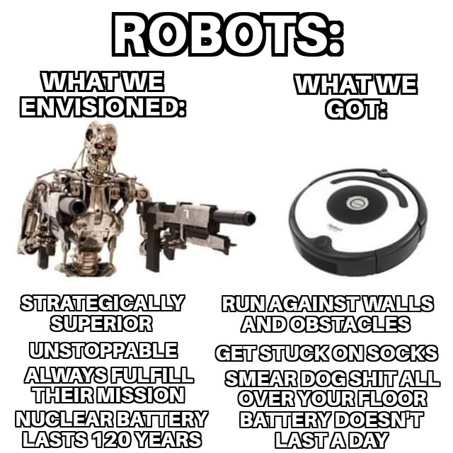

---

## 6. Predicted label: **Anger**

- **Title:** It appears my parents have been brainwashed
- **Meme caption:** Meme poster believes their parents are following the Apple trend rather than buying the windows computer the meme poster wants.
- **Raw model response:** `Anger`
- **Manual judgment:** 
- **Human label if different:** 
- **Notes:** 

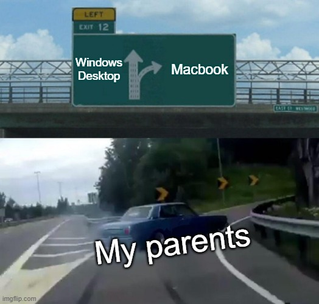

---

## 7. Predicted label: **Anger**

- **Title:** Fuck Around & Find Out
- **Meme caption:** Poster is giving advice about getting in over your head.
- **Raw model response:** `Anger`
- **Manual judgment:** 
- **Human label if different:** 
- **Notes:** 

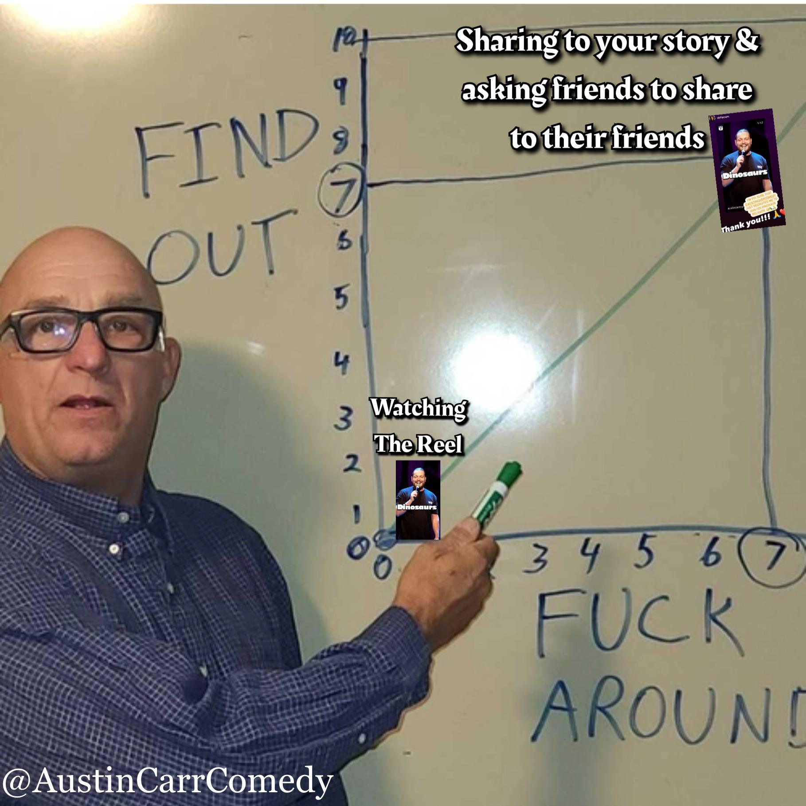

---

## 8. Predicted label: **Anger**

- **Title:** overreaction indeed
- **Meme caption:** The meme poster exposed that he could fight with a child for getting bitten and not have fights with dogs.
- **Raw model response:** `Anger`
- **Manual judgment:** 
- **Human label if different:** 
- **Notes:** 

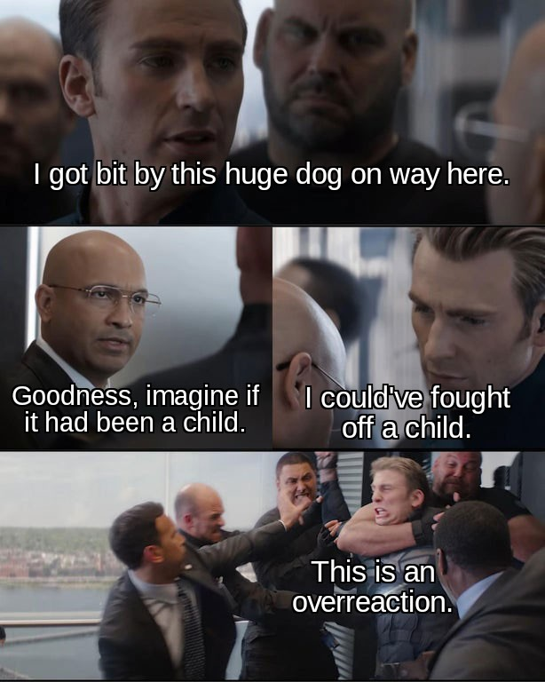

---

## 9. Predicted label: **Anger**

- **Title:** Realization
- **Meme caption:** Meme poster is trying to convey that the addict has a hard time stopping
- **Raw model response:** `Anger`
- **Manual judgment:** 
- **Human label if different:** 
- **Notes:** 

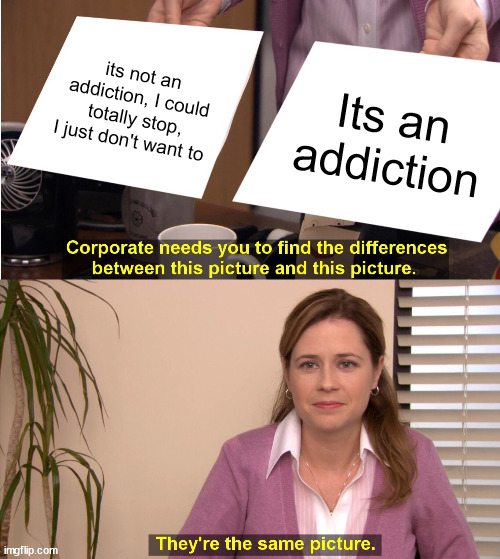

---

## 10. Predicted label: **Anger**

- **Title:** Guess the country
- **Meme caption:** The meme poster dislikes the world cup is being conducted in Qatar despite the fact that this was his country's first world cup.
- **Raw model response:** `Anger`
- **Manual judgment:** 
- **Human label if different:** 
- **Notes:** 

---

## 11. Predicted label: **Disgust**

- **Title:** I couldn't care less.
- **Meme caption:** The meme poster is trying to convince not bothered that alcohol is banned at world cup
- **Raw model response:** `The dominant intended emotion of the internet meme is "disgust".`
- **Manual judgment:** 
- **Human label if different:** 
- **Notes:** 

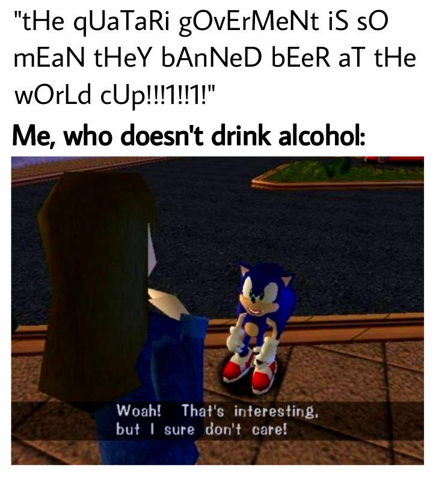

---

## 12. Predicted label: **Disgust**

- **Title:** Riveting stuffs
- **Meme caption:** Meme poster is trying to convey that they dislike the look of metal band logos.
- **Raw model response:** `Disgust.`
- **Manual judgment:** 
- **Human label if different:** 
- **Notes:** 

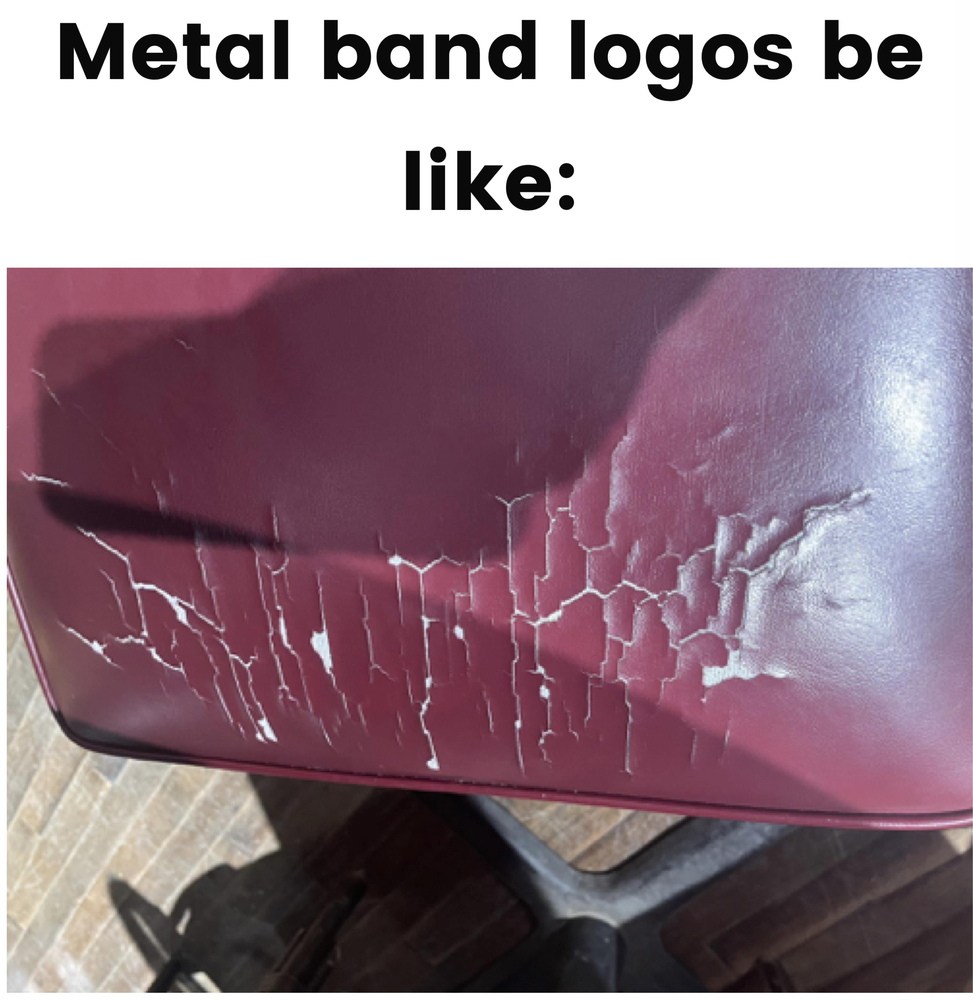

---

## 13. Predicted label: **Disgust**

- **Title:** If you could stop blasting me with ads that would be great.
- **Meme caption:** Meme user is disgusted Samsung keeps trying to make foldable phones happen.
- **Raw model response:** `Disgust`
- **Manual judgment:** 
- **Human label if different:** 
- **Notes:** 

---

## 14. Predicted label: **Disgust**

- **Title:** still can't afford tho
- **Meme caption:** Meme poster is trying to convey that the house is ugly, but they still can't afford it.
- **Raw model response:** `Disgust.`
- **Manual judgment:** 
- **Human label if different:** 
- **Notes:** 

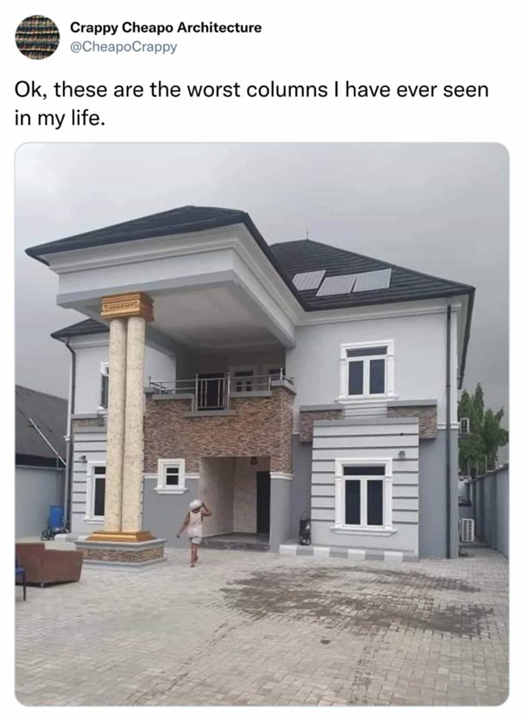

---

## 15. Predicted label: **Disgust**

- **Title:** MAN FACE FOREVER! Never a dead meme ever.
- **Meme caption:** The meme poster isn't satisfied by how he looks so he desires a different face.
- **Raw model response:** `The dominant intended emotion of the internet meme is "Disgust".`
- **Manual judgment:** 
- **Human label if different:** 
- **Notes:** 

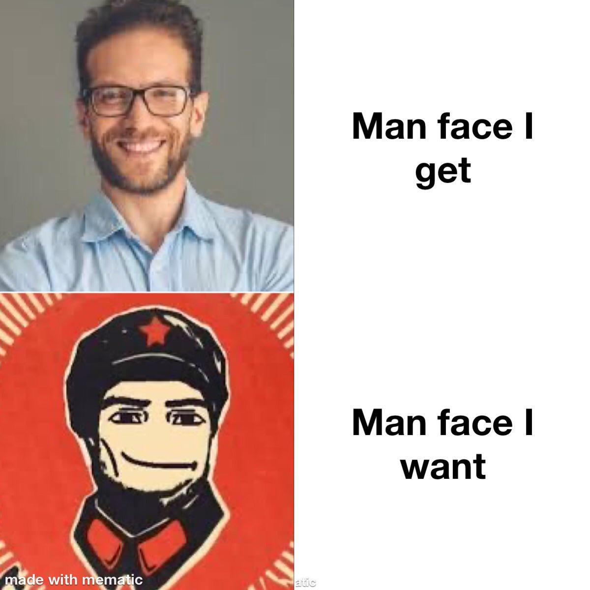

---

## 16. Predicted label: **Disgust**

- **Title:** He's a genius alright!
- **Meme caption:** Meme poster is trying to convey that Elon Musk, in his zest to make Twitter profitable and successful, took the Twitter check mark, which is an assurance a poster is who they claim, and put it up for sale thereby increasing cash but destroying people's faith in what they read.
- **Raw model response:** `Disgust`
- **Manual judgment:** 
- **Human label if different:** 
- **Notes:** 

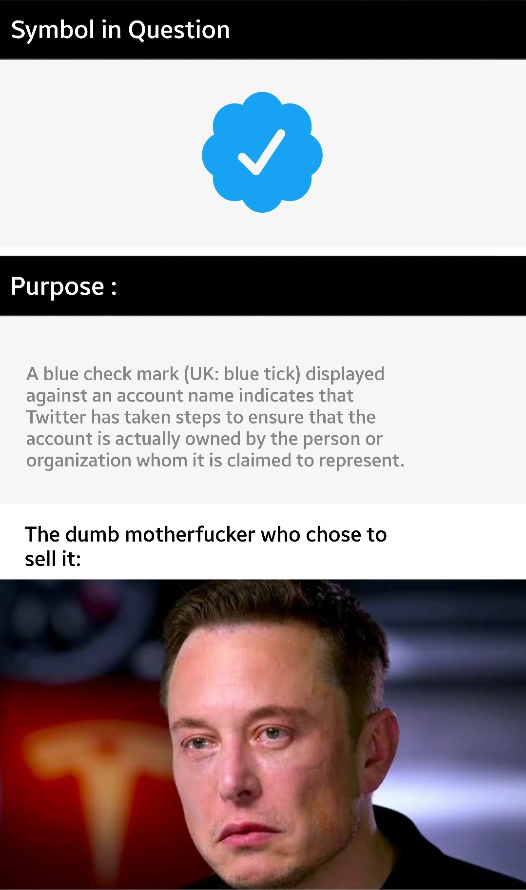

---

## 17. Predicted label: **Disgust**

- **Title:** I hate how they do this
- **Meme caption:** The meme poster wants to express his dissatisfaction on when he puts in a lot of time and effort to create a meme which he thinks is funny and only to be classified as low grade work.
- **Raw model response:** `Disgust.`
- **Manual judgment:** 
- **Human label if different:** 
- **Notes:** 

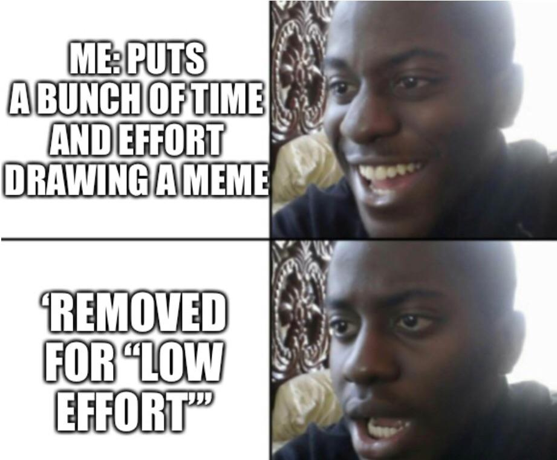

---

## 18. Predicted label: **Disgust**

- **Title:** Yeah ok
- **Meme caption:** Meme poster is trying to convey that kindergarten teachers are disgusted with the names of their students.
- **Raw model response:** `Disgust`
- **Manual judgment:** 
- **Human label if different:** 
- **Notes:** 

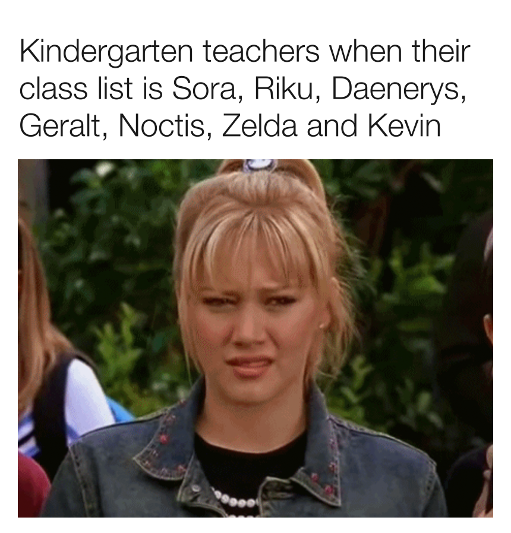

---

## 19. Predicted label: **Disgust**

- **Title:** like shut up
- **Meme caption:** The meme poster feels disgusting while the meme poster saw that the kids are advising their juniors.
- **Raw model response:** `Disgust`
- **Manual judgment:** 
- **Human label if different:** 
- **Notes:** 

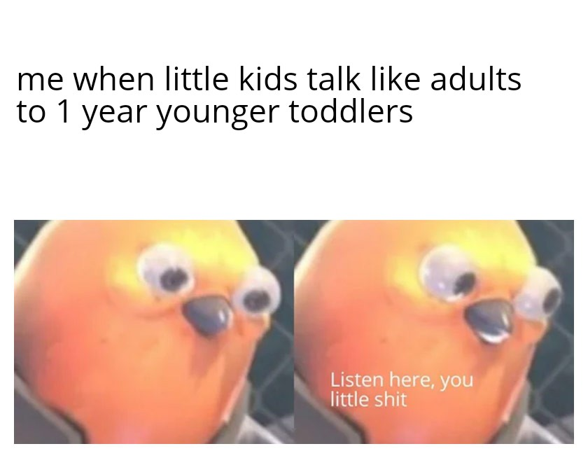

---

## 20. Predicted label: **Disgust**

- **Title:** Spot on...
- **Meme caption:** The meme poster is mocking New England's interior ideas.
- **Raw model response:** `Disgust`
- **Manual judgment:** 
- **Human label if different:** 
- **Notes:** 

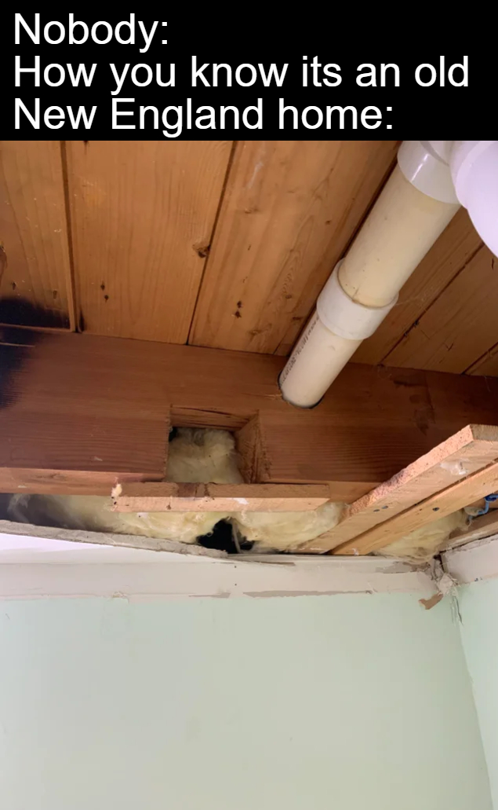

---

## 21. Predicted label: **Fear**

- **Title:** what have I done.
- **Meme caption:** Meme poster is trying to convey that they're traumatized after seeking information about a certain school.
- **Raw model response:** `Fear`
- **Manual judgment:** 
- **Human label if different:** 
- **Notes:** 

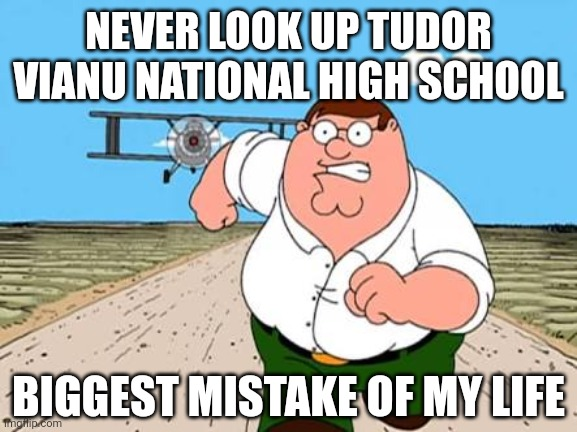

---

## 22. Predicted label: **Fear**

- **Title:** Outplayed
- **Meme caption:** Meme poster doesn't need to choose between getting married or staying single, they can decide to commit suicide by plane.
- **Raw model response:** `Fear`
- **Manual judgment:** 
- **Human label if different:** 
- **Notes:** 

---

## 23. Predicted label: **Fear**

- **Title:** snacc
- **Meme caption:** Meme poster is trying to convey that four different pains that come from the head don't stand up to diping head in dryer.
- **Raw model response:** `Fear`
- **Manual judgment:** 
- **Human label if different:** 
- **Notes:** 

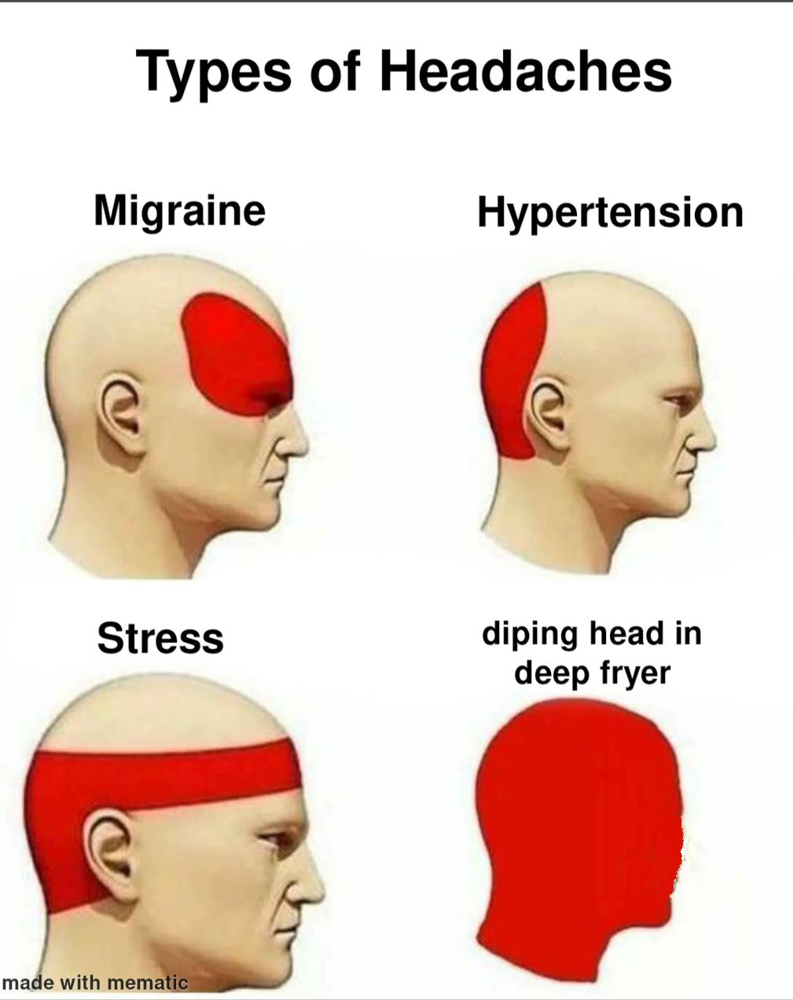

---

## 24. Predicted label: **Fear**

- **Title:** He's seen things
- **Meme caption:** The meme poster is frightened about the memories of Vietnam war.
- **Raw model response:** `Fear`
- **Manual judgment:** 
- **Human label if different:** 
- **Notes:** 

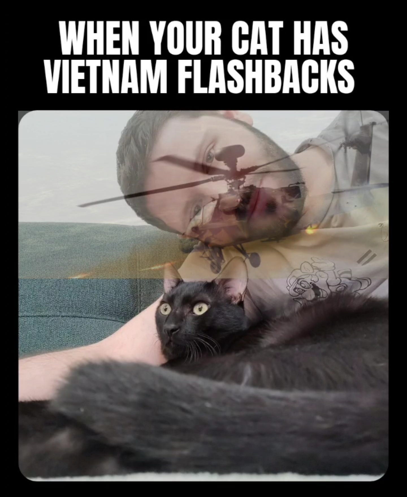

---

## 25. Predicted label: **Fear**

- **Title:** The one on the right is a flashbang.
- **Meme caption:** Meme poster is trying to convey that the sun is blinding when you leave a theatre, compared to how bright it normally is.
- **Raw model response:** `Fear`
- **Manual judgment:** 
- **Human label if different:** 
- **Notes:** 

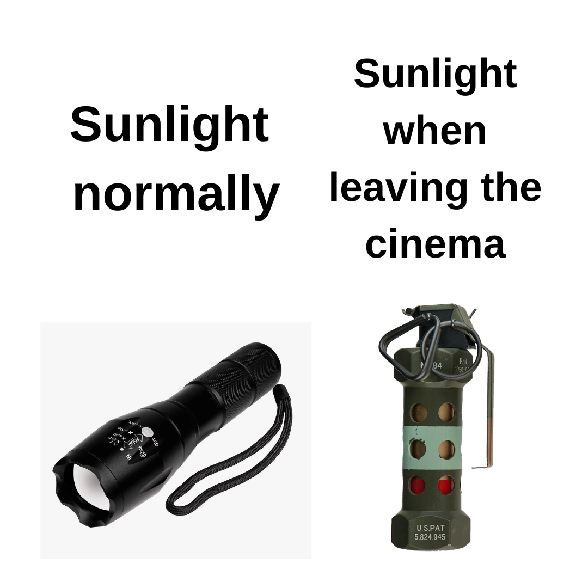

---

## 26. Predicted label: **Fear**

- **Title:** Dizney movie chineze edition
- **Meme caption:** The meme poster states that, the Chinese for not having a single gay person in their country, but the reason is suspicious.
- **Raw model response:** `Fear`
- **Manual judgment:** 
- **Human label if different:** 
- **Notes:** 

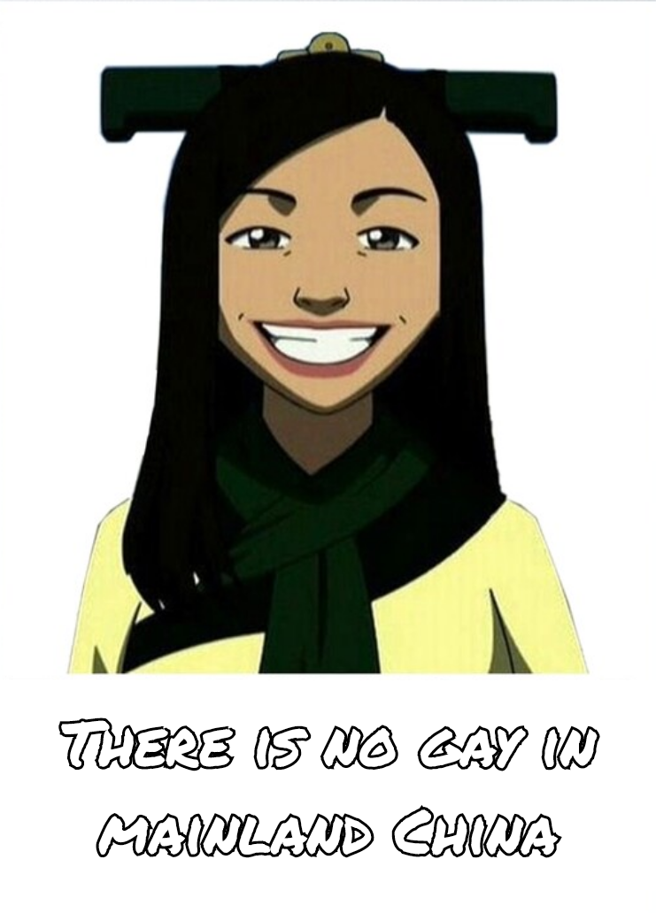

---

## 27. Predicted label: **Fear**

- **Title:** Absolutely horrified.
- **Meme caption:** The meme poster feels like a confused and scared andy dwyer when he has to ask questions.
- **Raw model response:** `Fear`
- **Manual judgment:** 
- **Human label if different:** 
- **Notes:** 

---

## 28. Predicted label: **Fear**

- **Title:** The British as seen by Americans vs as seen by Europeans
- **Meme caption:** The poster is trying to imply that the Americans view the British as being cultured and well behaved while the Europeans see them as troublemakers.
- **Raw model response:** `Fear`
- **Manual judgment:** 
- **Human label if different:** 
- **Notes:** 

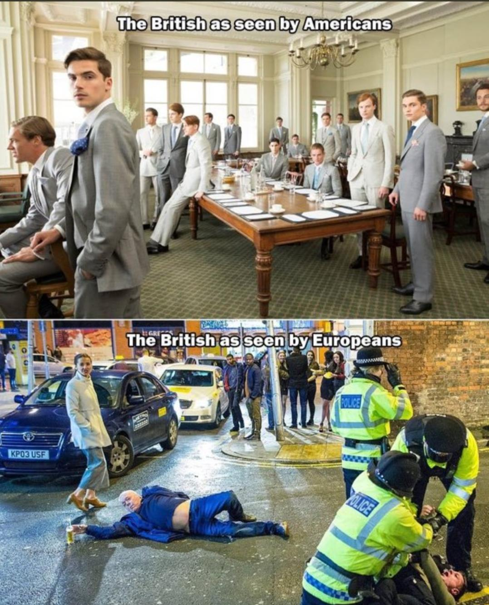

---

## 29. Predicted label: **Fear**

- **Title:** well now i am not doing it
- **Meme caption:** Meme poster is conveying the government has another week of quarantine in store for them and is not planning to following it.
- **Raw model response:** `Fear`
- **Manual judgment:** 
- **Human label if different:** 
- **Notes:** 

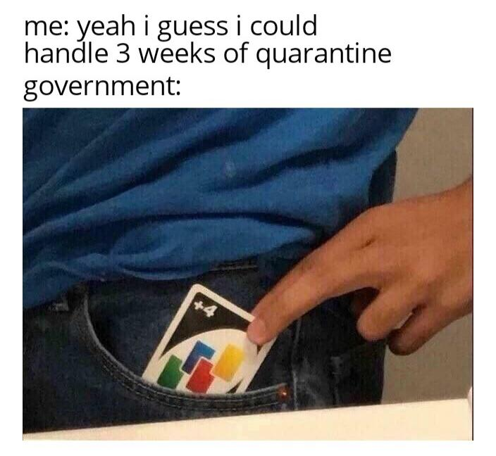

---

## 30. Predicted label: **Fear**

- **Title:** and i am tired of pretending that it's not scary
- **Meme caption:** Meme poster is trying to convey that Person is scared that tall people will see his head.
- **Raw model response:** `Fear`
- **Manual judgment:** 
- **Human label if different:** 
- **Notes:** 

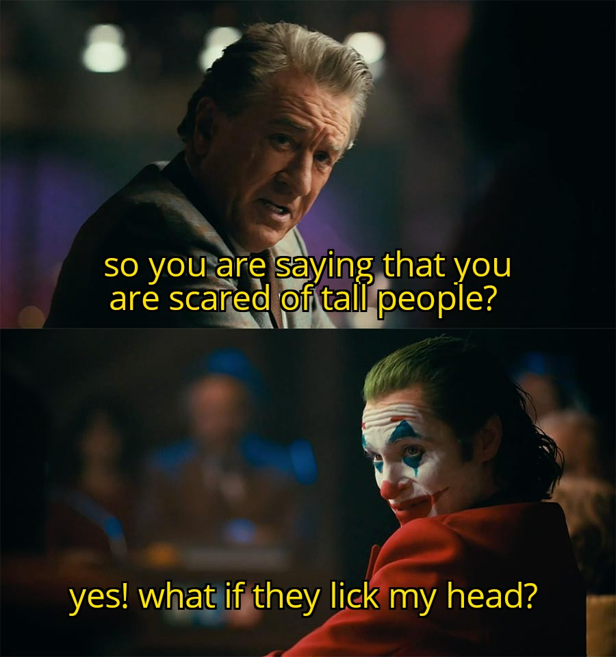

---

## 31. Predicted label: **Joy**

- **Title:** Just Like the '92 Bulls...
- **Meme caption:** Meme poster is trying to convey that sports anime is lasers and not the sports people think of.
- **Raw model response:** `Joy`
- **Manual judgment:** 
- **Human label if different:** 
- **Notes:** 

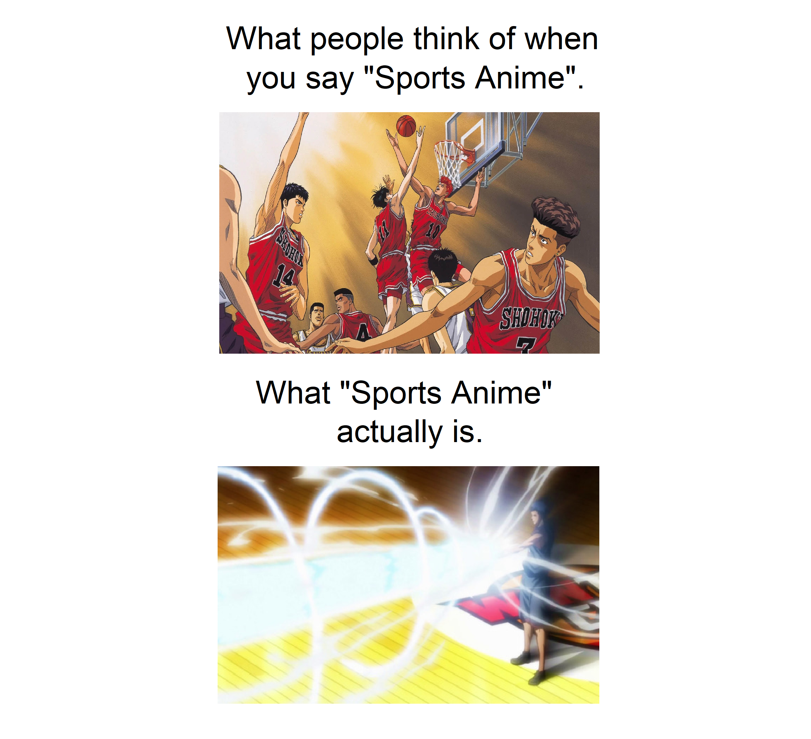

---

## 32. Predicted label: **Joy**

- **Title:** Lasagna
- **Meme caption:** Meme poster is trying to convey that Garfield fans are so obsessed with their favorite character that once they see an orange cat they're happy
- **Raw model response:** `Joy`
- **Manual judgment:** 
- **Human label if different:** 
- **Notes:** 

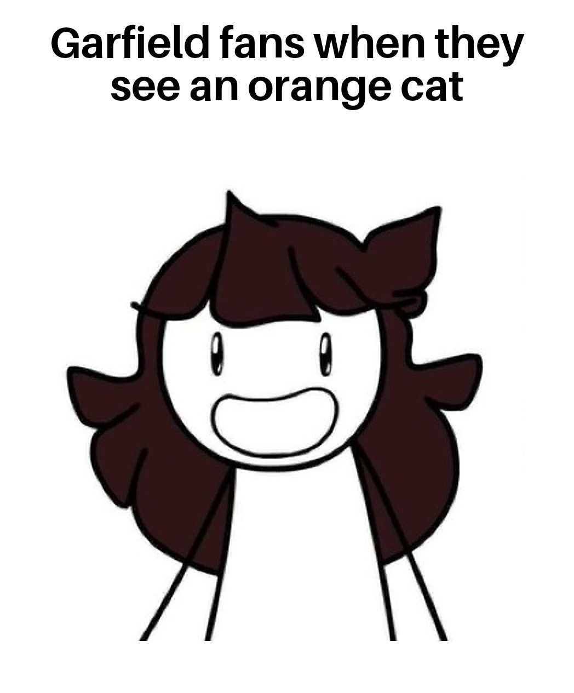

---

## 33. Predicted label: **Joy**

- **Title:** Knuckles spittin' facts
- **Meme caption:** meme poster is implying they are a meathead.
- **Raw model response:** `Joy`
- **Manual judgment:** 
- **Human label if different:** 
- **Notes:** 

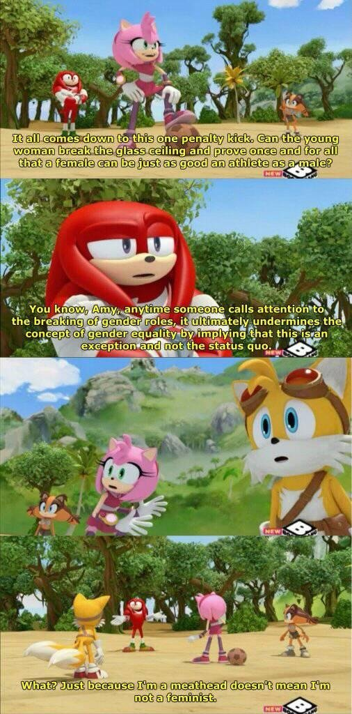

---

## 34. Predicted label: **Joy**

- **Title:** Therapist
- **Meme caption:** Meme poster trying to convey that he is trying to explain some positive things about himself.
- **Raw model response:** `Joy`
- **Manual judgment:** 
- **Human label if different:** 
- **Notes:** 

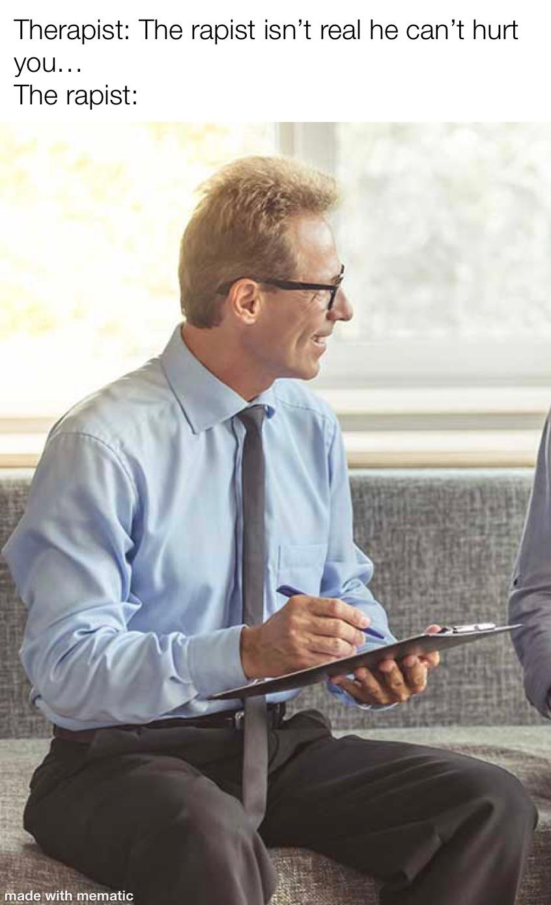

---

## 35. Predicted label: **Joy**

- **Title:** Good man Newton
- **Meme caption:** Meme poster is trying to convey that they prefer curvy women.
- **Raw model response:** `Joy`
- **Manual judgment:** 
- **Human label if different:** 
- **Notes:** 

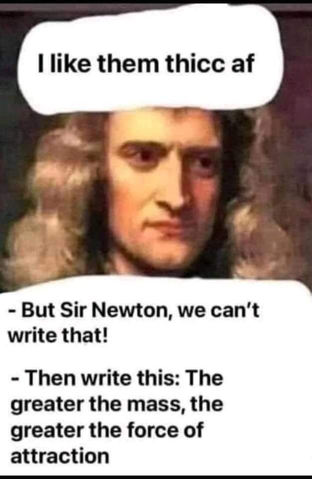

---

## 36. Predicted label: **Joy**

- **Title:** it's all skill
- **Meme caption:** Meme poster is a beginner at the game but is beating their supposedly more skilled friends, which makes them feel great.
- **Raw model response:** `Joy`
- **Manual judgment:** 
- **Human label if different:** 
- **Notes:** 

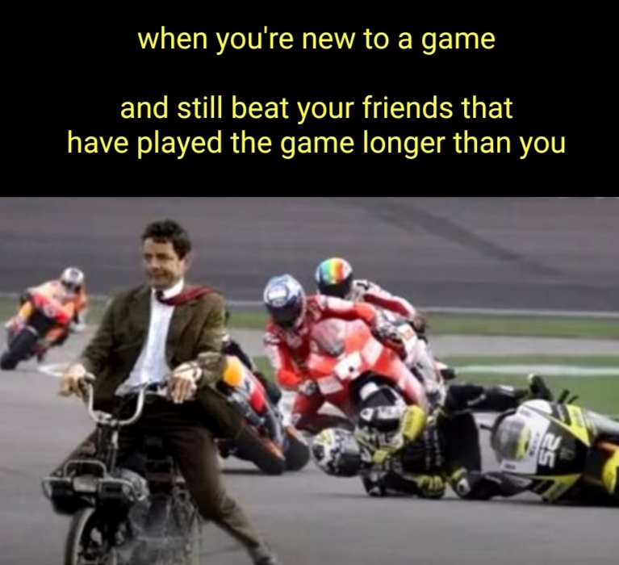

---

## 37. Predicted label: **Joy**

- **Title:** What are these memes about?
- **Meme caption:** Meme poster happy they watched the US and England draw the match.
- **Raw model response:** `Joy`
- **Manual judgment:** 
- **Human label if different:** 
- **Notes:** 

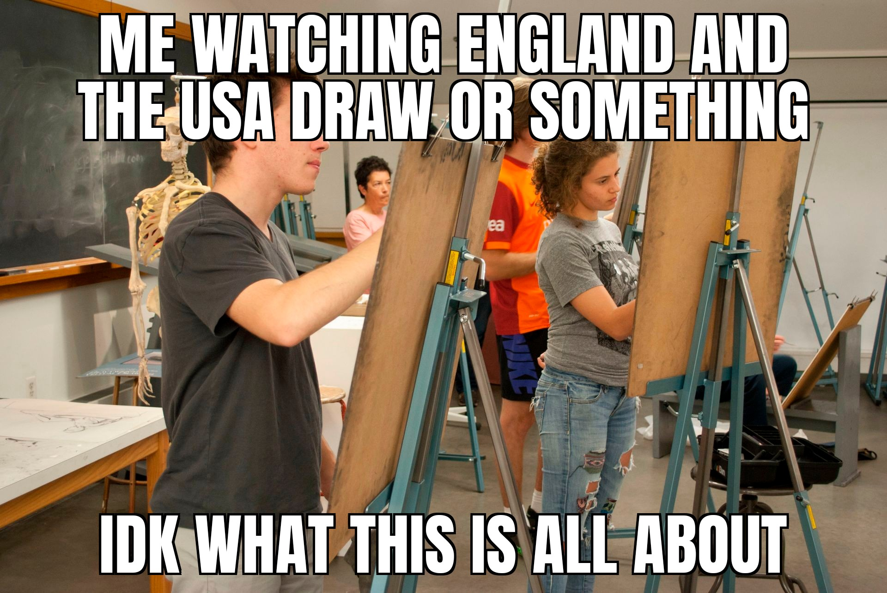

---

## 38. Predicted label: **Joy**

- **Title:** Its Italian
- **Meme caption:** Meme poster is making fun of the Elf on a Shelf meme by making their own with Guy Fieri in spaghetti.
- **Raw model response:** `Joy`
- **Manual judgment:** 
- **Human label if different:** 
- **Notes:** 

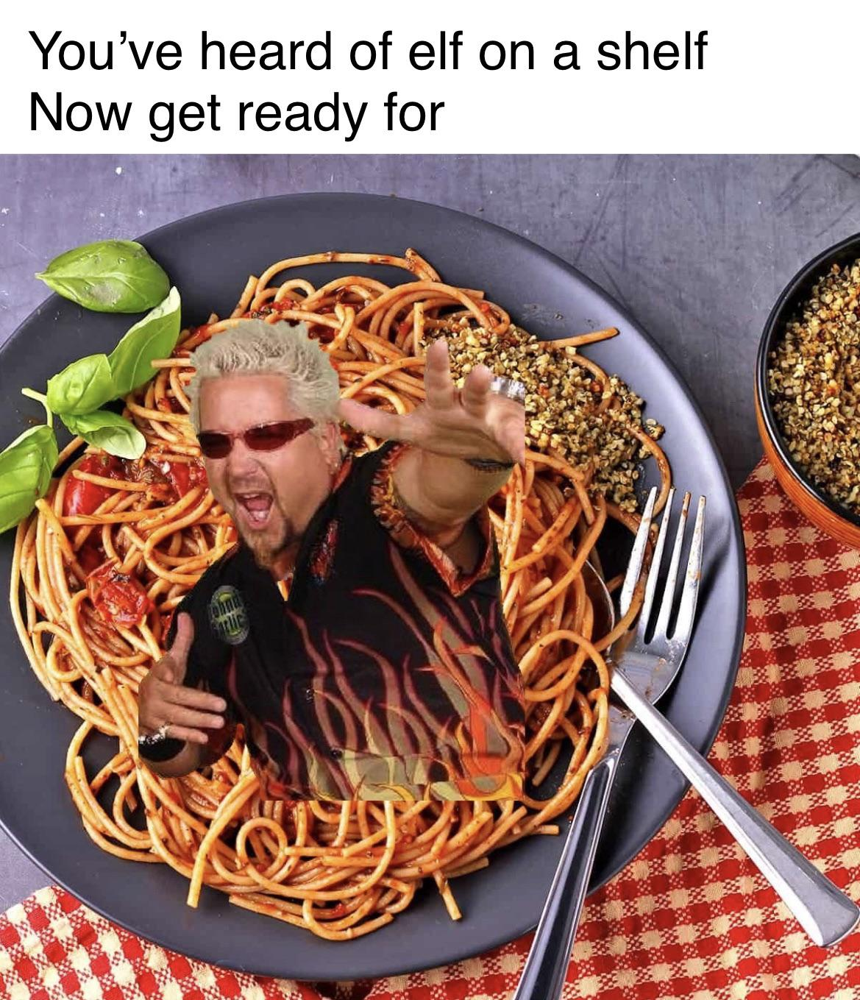

---

## 39. Predicted label: **Joy**

- **Title:** It's spooky Wednesday my dudes
- **Meme caption:** Meme poster is announcing the start of Halloween season.
- **Raw model response:** `Joy`
- **Manual judgment:** 
- **Human label if different:** 
- **Notes:** 

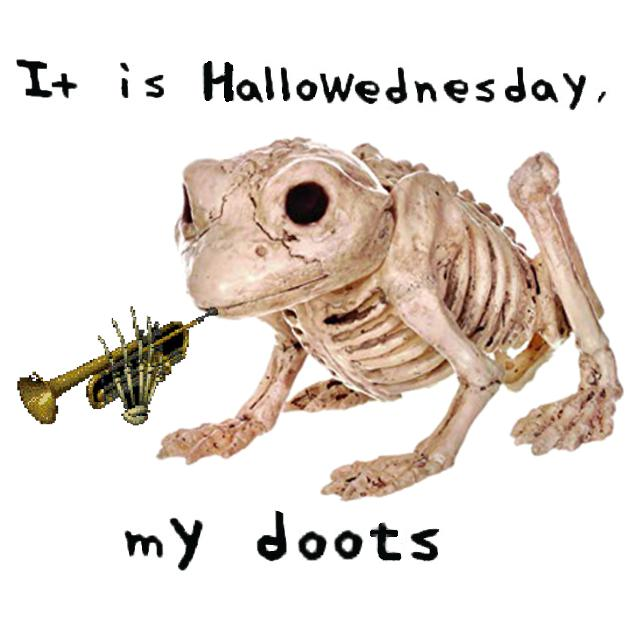

---

## 40. Predicted label: **Joy**

- **Title:** It do be like that tho
- **Meme caption:** Meme poster is trying to convey that they have different moods depending on day.
- **Raw model response:** `Joy`
- **Manual judgment:** 
- **Human label if different:** 
- **Notes:** 

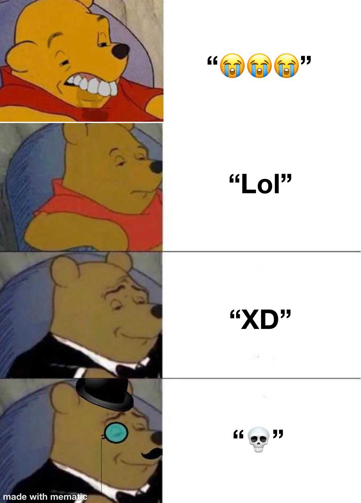

---

## 41. Predicted label: **Neutral**

- **Title:** Hate being a girl online ong
- **Meme caption:** Meme poster is trying to convey that being a woman on the internet requires you to have a high vantage point to avoid danger.
- **Raw model response:** `Neutral`
- **Manual judgment:** 
- **Human label if different:** 
- **Notes:** 

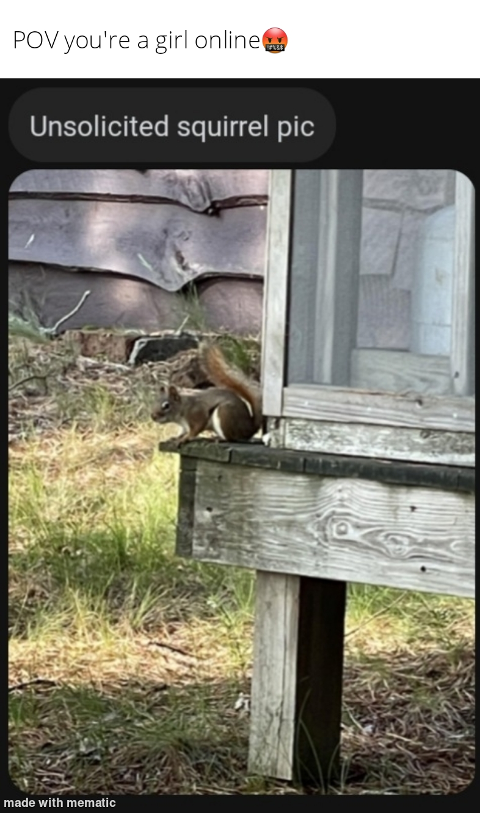

---

## 42. Predicted label: **Neutral**

- **Title:** Times a changing
- **Meme caption:** Meme poster is conveying the irony of how we now engage in behaviour that would make it far easier for stalkers to create a creepy montage about our lives, like a stalker did in a movie he enjoyed.
- **Raw model response:** `Neutral`
- **Manual judgment:** 
- **Human label if different:** 
- **Notes:** 

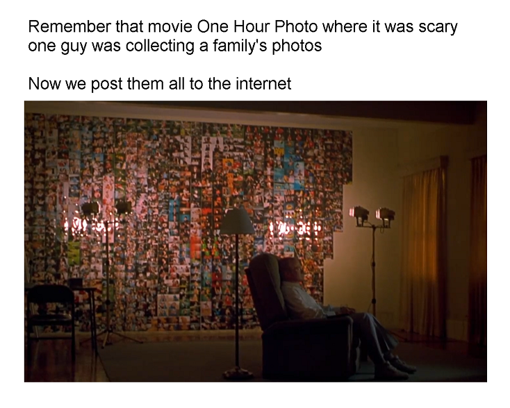

---

## 43. Predicted label: **Neutral**

- **Title:** Why do i keep doing this
- **Meme caption:** The meme poster feels himself as a clown, after thinking of many things and finally concluded to purchase the same game, which he has already been playing for years.
- **Raw model response:** `Neutral`
- **Manual judgment:** 
- **Human label if different:** 
- **Notes:** 

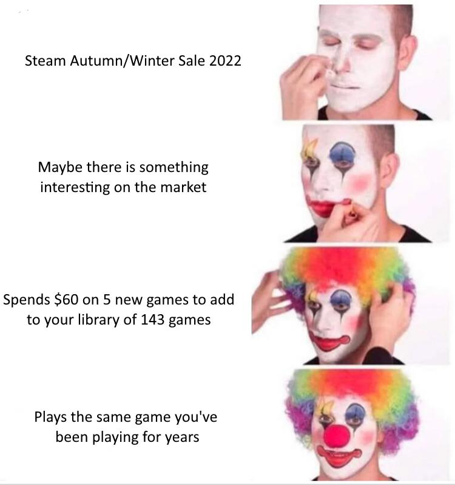

---

## 44. Predicted label: **Neutral**

- **Title:** Had to *ahem* correct it
- **Meme caption:** Meme poster corrects sign above urinal to tell them it's for the the users penis.
- **Raw model response:** `Neutral.`
- **Manual judgment:** 
- **Human label if different:** 
- **Notes:** 

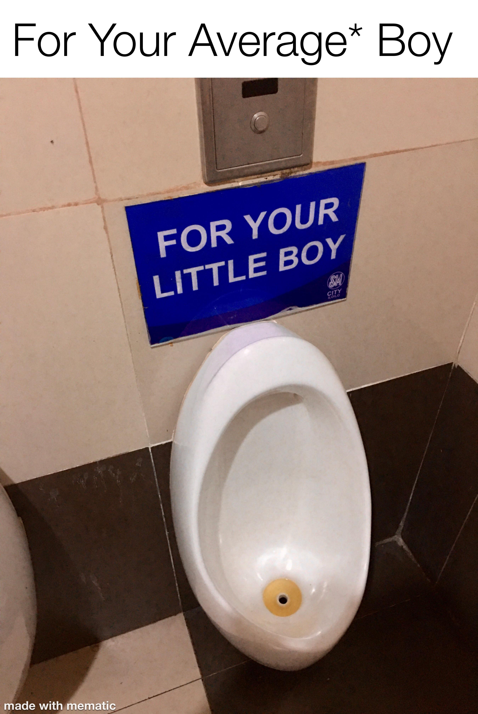

---

## 45. Predicted label: **Neutral**

- **Title:** Custom online store for 60$ Comment for info
- **Meme caption:** Meme poster is trying to convey that Bumblebee anatomy is bum heavy.
- **Raw model response:** `Neutral.`
- **Manual judgment:** 
- **Human label if different:** 
- **Notes:** 

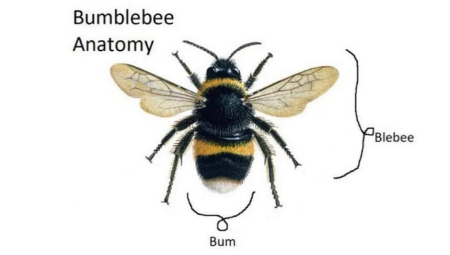

---

## 46. Predicted label: **Neutral**

- **Title:** DMs......
- **Meme caption:** Meme poster is trying to convey that because the poster was unpopular in high school, they watch on amusedly while people they know are bombarded by solicitations from former classmates.
- **Raw model response:** `Neutral`
- **Manual judgment:** 
- **Human label if different:** 
- **Notes:** 

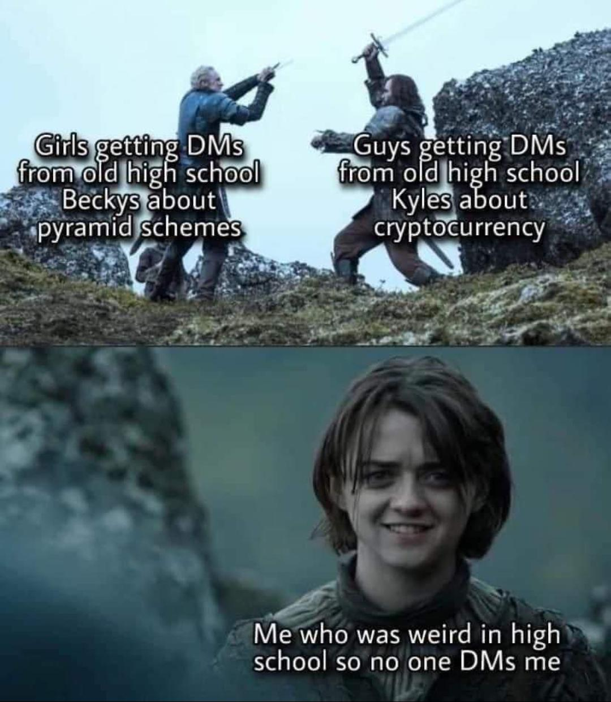

---

## 47. Predicted label: **Neutral**

- **Title:** The new resident evil is going to be lit
- **Meme caption:** The meme poster gets about news that Scientist find a ancient zombie virus
- **Raw model response:** `Neutral`
- **Manual judgment:** 
- **Human label if different:** 
- **Notes:** 

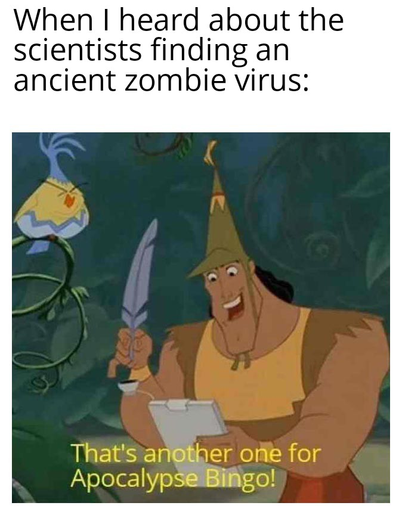

---

## 48. Predicted label: **Neutral**

- **Title:** When u got no friends to defend u
- **Meme caption:** Meme poster is trying to convey that they have no real online friends, only bots who back them up in an online argument.
- **Raw model response:** `Neutral.`
- **Manual judgment:** 
- **Human label if different:** 
- **Notes:** 

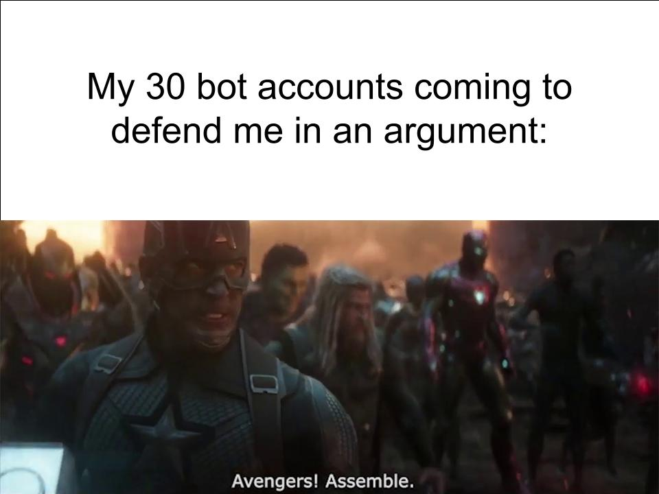

---

## 49. Predicted label: **Neutral**

- **Title:** That's a though one
- **Meme caption:** Meme poster is trying to convey that both characters said the same thing in the question despite the differences in physique.
- **Raw model response:** `Neutral.`
- **Manual judgment:** 
- **Human label if different:** 
- **Notes:** 

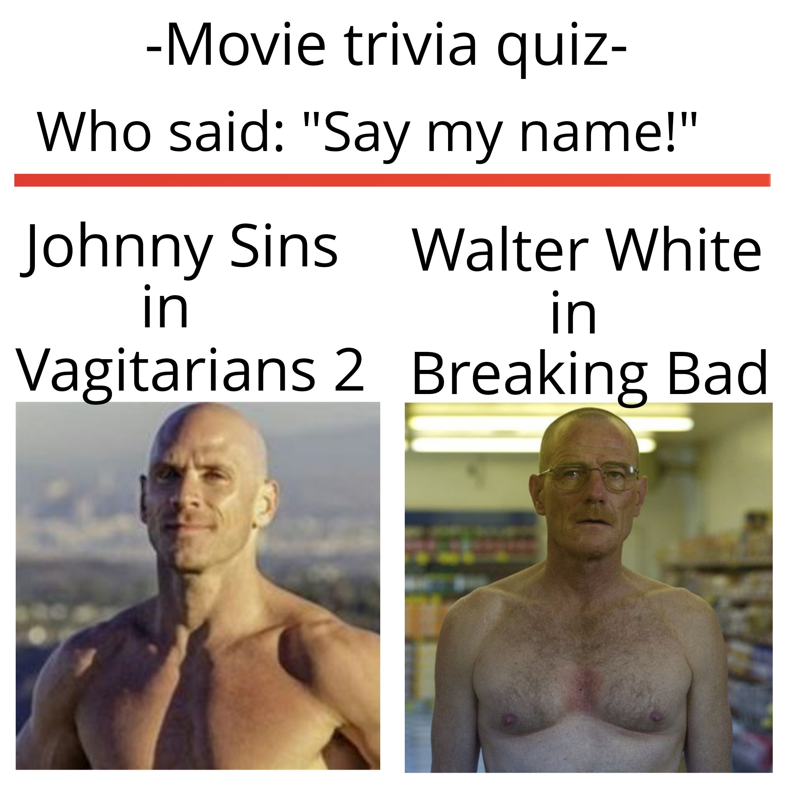

---

## 50. Predicted label: **Neutral**

- **Title:** Also yeehaw
- **Meme caption:** The poster is trying to express his view of how a partner should be , which is purely working together and not being intimate or loving.
- **Raw model response:** `Neutral`
- **Manual judgment:** 
- **Human label if different:** 
- **Notes:** 

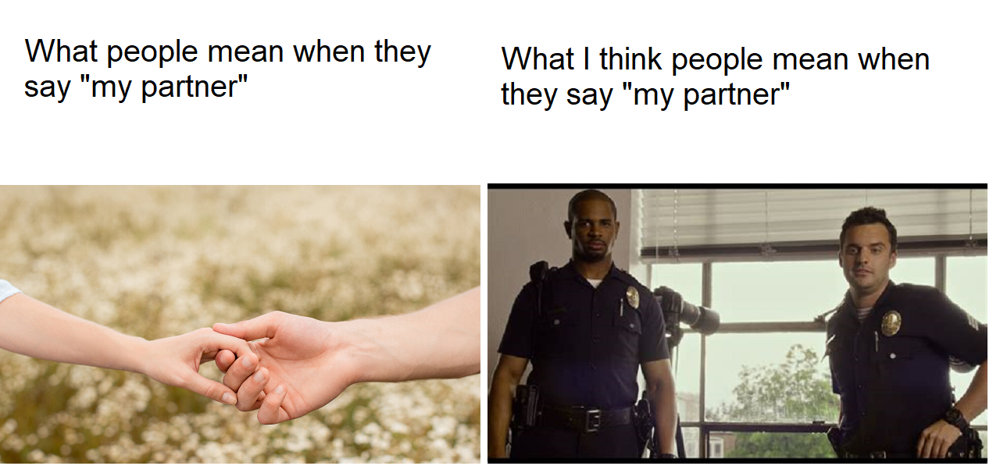

---

## 51. Predicted label: **Sadness**

- **Title:** Bruh, winter got hands
- **Meme caption:** Meme poster is sad his favorite tv show is ending.
- **Raw model response:** `Sadness`
- **Manual judgment:** 
- **Human label if different:** 
- **Notes:** 

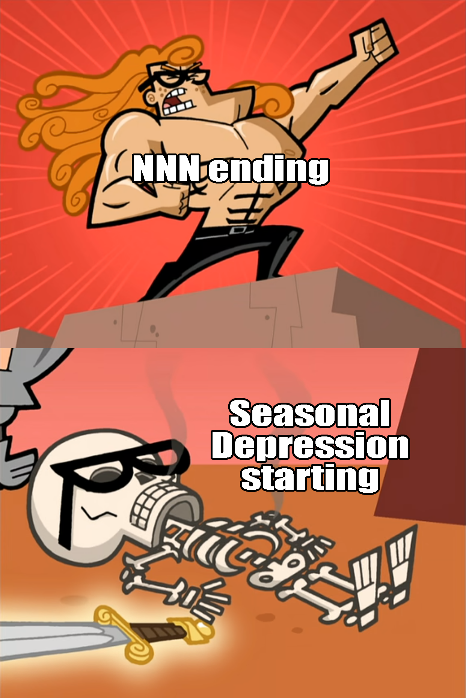

---

## 52. Predicted label: **Sadness**

- **Title:** Just another Ponzi scheme...
- **Meme caption:** Meme poster is trying to convey that they crypto market is a disaster.
- **Raw model response:** `Sadness.`
- **Manual judgment:** 
- **Human label if different:** 
- **Notes:** 

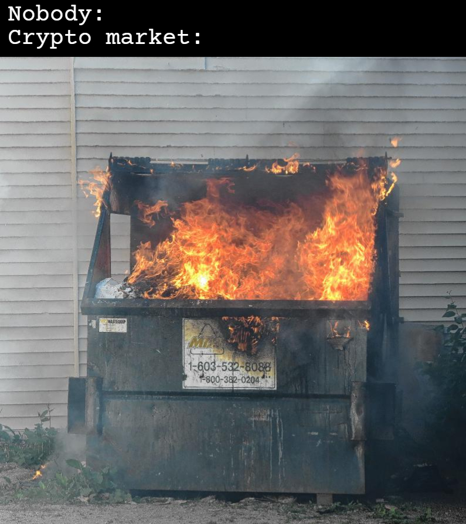

---

## 53. Predicted label: **Sadness**

- **Title:** based on a true story
- **Meme caption:** Meme poster gets sad when the the missing his dog.
- **Raw model response:** `Sadness`
- **Manual judgment:** 
- **Human label if different:** 
- **Notes:** 

---

## 54. Predicted label: **Sadness**

- **Title:** I miss you bruh
- **Meme caption:** Meme poster is sad when he realizes that something that was always there is now gone.
- **Raw model response:** `Sadness`
- **Manual judgment:** 
- **Human label if different:** 
- **Notes:** 

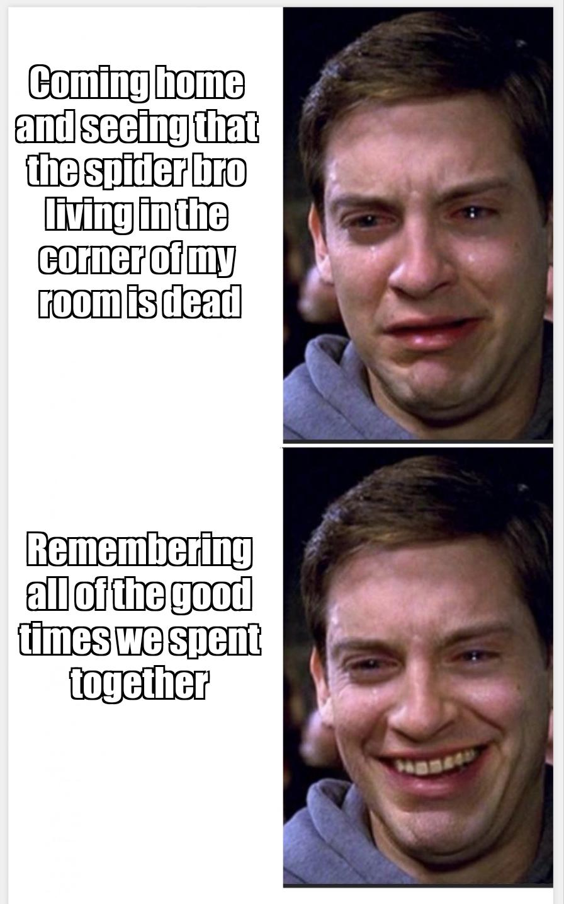

---

## 55. Predicted label: **Sadness**

- **Title:** FarmersOnly
- **Meme caption:** The meme poster is broken by the results of the crops and feels bad for them.
- **Raw model response:** `Sadness.`
- **Manual judgment:** 
- **Human label if different:** 
- **Notes:** 

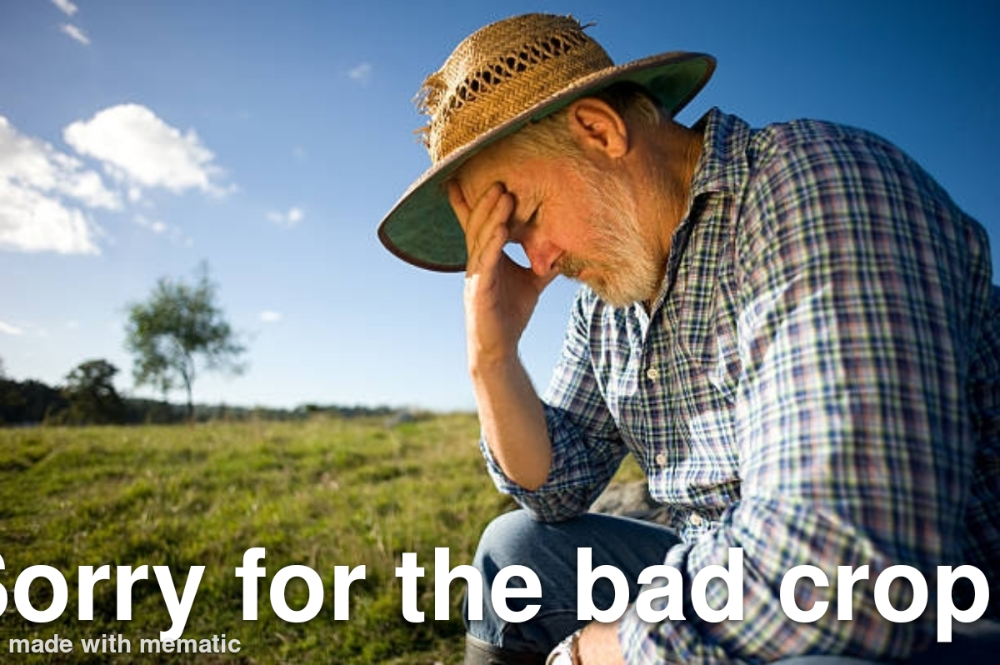

---

## 56. Predicted label: **Sadness**

- **Title:** It gets confusing when the Movie/game was scraped in the first place.
- **Meme caption:** The meme poster is sad about getting its product leaked on online.
- **Raw model response:** `Sadness`
- **Manual judgment:** 
- **Human label if different:** 
- **Notes:** 

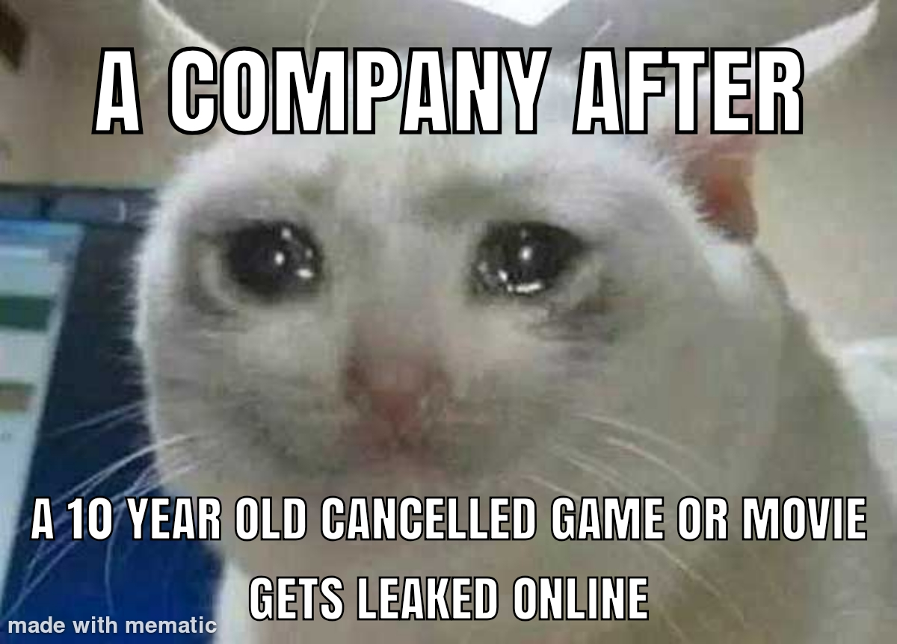

---

## 57. Predicted label: **Sadness**

- **Title:** Cheer up Charlie
- **Meme caption:** The meme poster is encouraged to purchase a lottery ticket only to lose two dollars instead of winning.
- **Raw model response:** `Sadness`
- **Manual judgment:** 
- **Human label if different:** 
- **Notes:** 

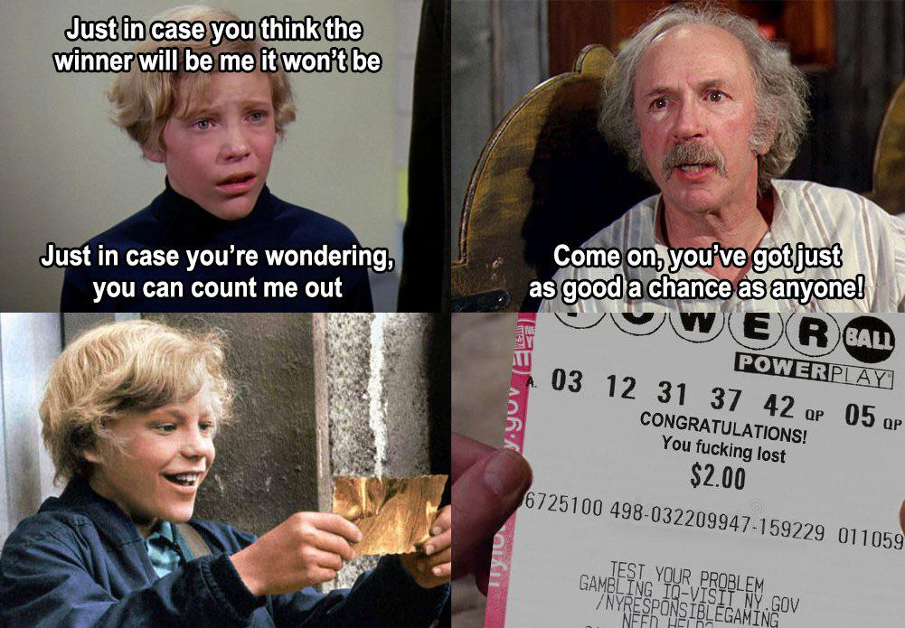

---

## 58. Predicted label: **Sadness**

- **Title:** Happy No Nut November
- **Meme caption:** Meme poster is trying to convey  that  sad incident happen .
- **Raw model response:** `Sadness`
- **Manual judgment:** 
- **Human label if different:** 
- **Notes:** 

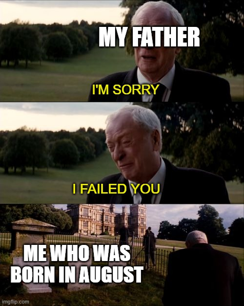

---

## 59. Predicted label: **Sadness**

- **Title:** Ok, bye
- **Meme caption:** Meme poster is sad when the boy realise loneliness.
- **Raw model response:** `Sadness`
- **Manual judgment:** 
- **Human label if different:** 
- **Notes:** 

---

## 60. Predicted label: **Sadness**

- **Title:** Cry me a river
- **Meme caption:** Meme poster is sad their mom keeps meeting new men.
- **Raw model response:** `Sadness`
- **Manual judgment:** 
- **Human label if different:** 
- **Notes:** 

---

## 61. Predicted label: **Surprise**

- **Title:** Avatar: The last hand
- **Meme caption:** Meme poster is trying to convey that They dont think avatar was a good movie
- **Raw model response:** `Surprise.`
- **Manual judgment:** 
- **Human label if different:** 
- **Notes:** 

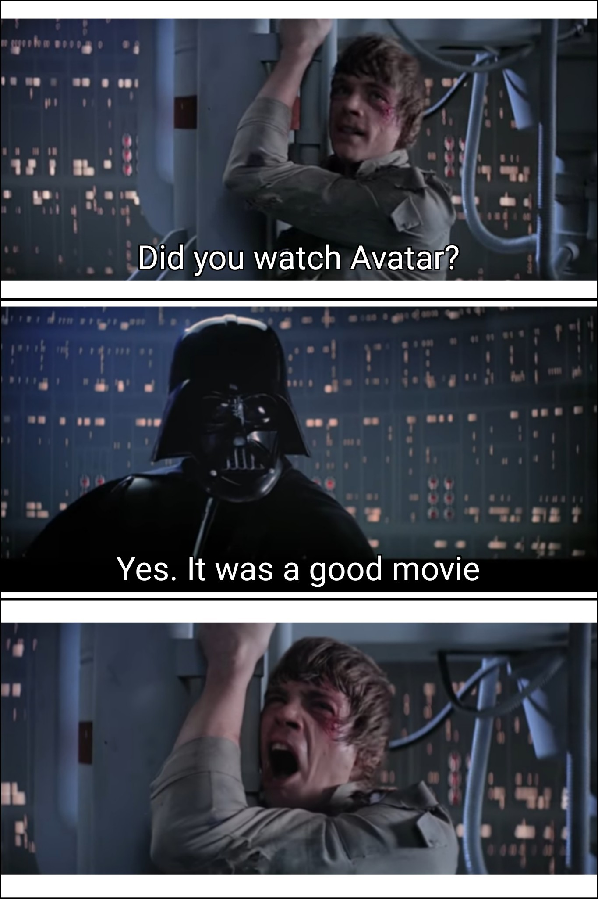

---

## 62. Predicted label: **Surprise**

- **Title:** they both blame it on the jews
- **Meme caption:** When the meme poster was in the interview, the corporates asked her to figure out the differences between the same objects.
- **Raw model response:** `The dominant intended emotion of the internet meme is surprise.`
- **Manual judgment:** 
- **Human label if different:** 
- **Notes:** 

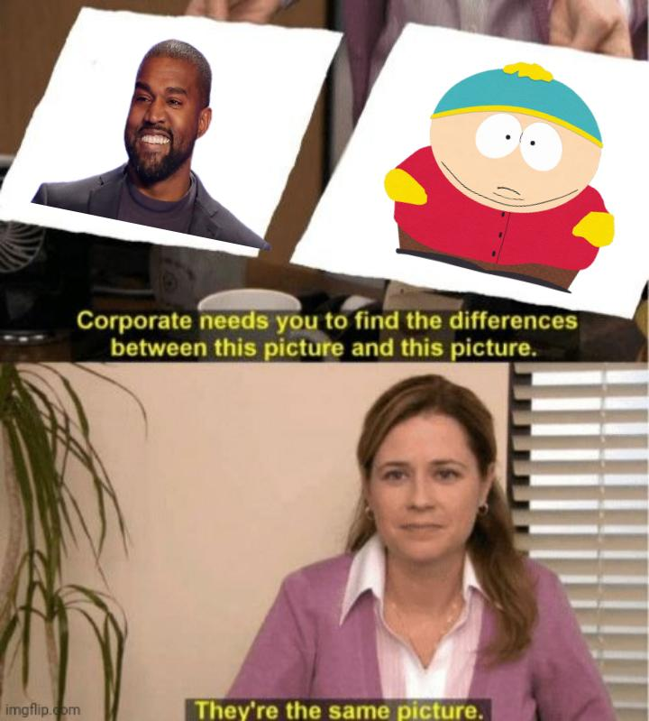

---

## 63. Predicted label: **Surprise**

- **Title:** Bring a water and maybe a snack, lines will be LONG today
- **Meme caption:** The meme poster is saying that the line will be long for voting.
- **Raw model response:** `The dominant intended emotion of the internet meme is "surprise".`
- **Manual judgment:** 
- **Human label if different:** 
- **Notes:** 

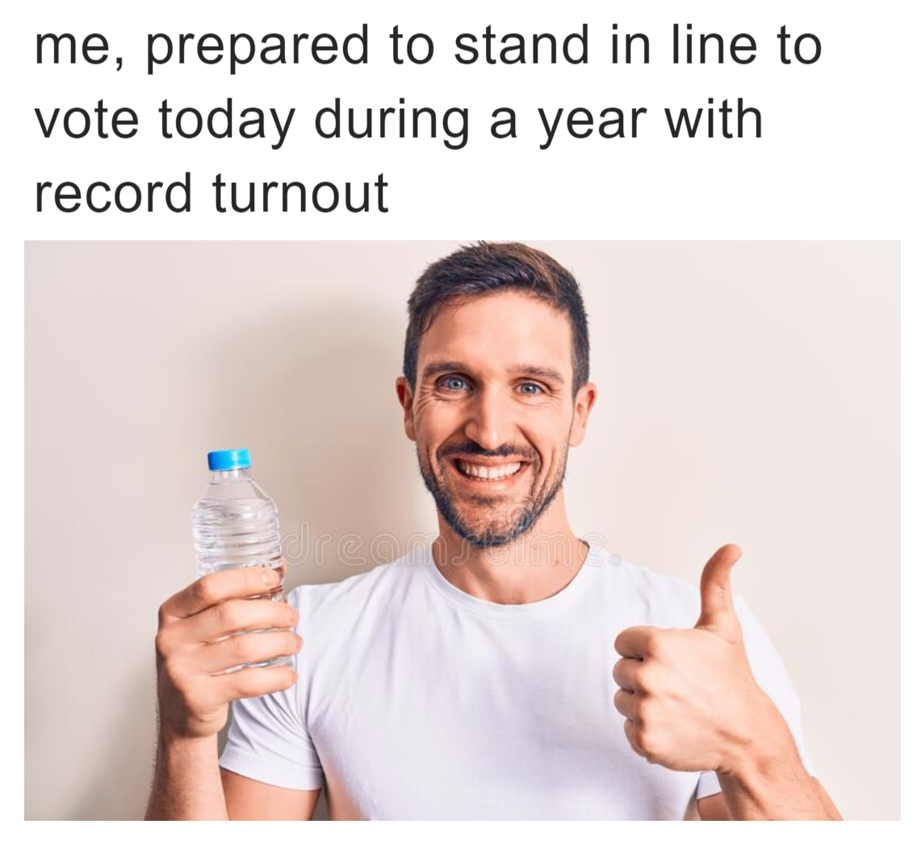

---

## 64. Predicted label: **Surprise**

- **Title:** Nothing is impossible
- **Meme caption:** Meme poster is trying to convey that There is another reason that Kil Jong Un is firing missiles into the ocean.
- **Raw model response:** `Surprise`
- **Manual judgment:** 
- **Human label if different:** 
- **Notes:** 

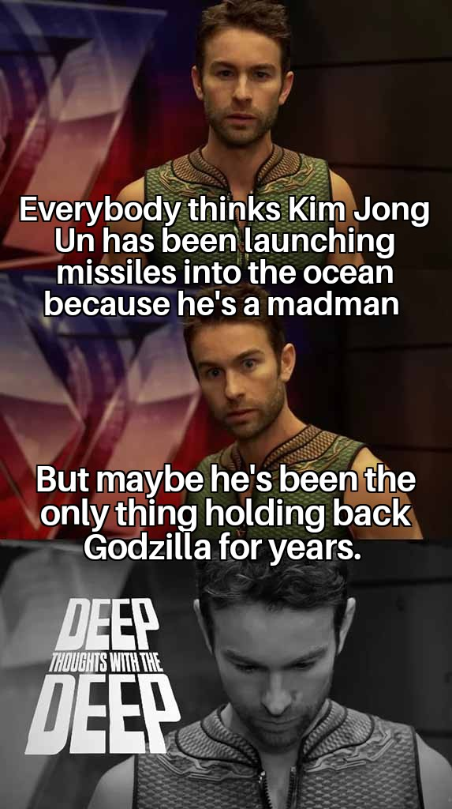

---

## 65. Predicted label: **Surprise**

- **Title:** And watch millennials go ba-na-na-S!
- **Meme caption:** Meme poster is trying to convey that how pictures poses and colors used to be in the past
- **Raw model response:** `Surprise`
- **Manual judgment:** 
- **Human label if different:** 
- **Notes:** 

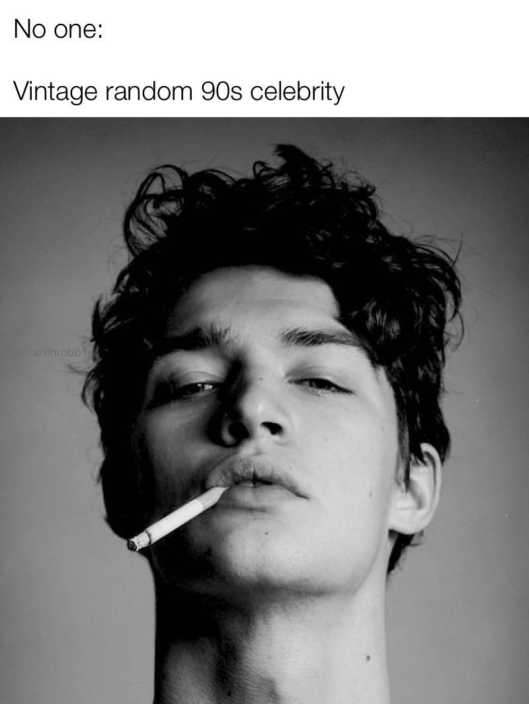

---

## 66. Predicted label: **Surprise**

- **Title:** I wonder
- **Meme caption:** Meme poster is trying to convey that it confuses them when they say "you too" when a fast food employee tells them to enjoy their meal.
- **Raw model response:** `Surprise`
- **Manual judgment:** 
- **Human label if different:** 
- **Notes:** 

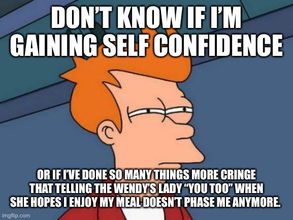

---

## 67. Predicted label: **Surprise**

- **Title:** I still have that jacket
- **Meme caption:** Meme poster is trying to convey that people wore crazy things seven years ago.
- **Raw model response:** `Surprise`
- **Manual judgment:** 
- **Human label if different:** 
- **Notes:** 

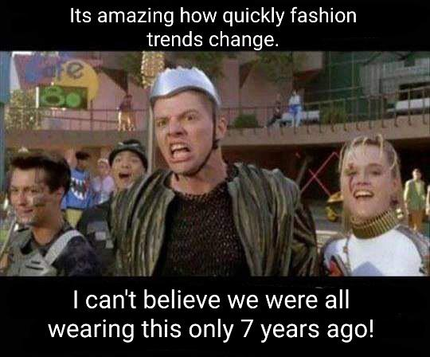

---

## 68. Predicted label: **Surprise**

- **Title:** Everything hurts
- **Meme caption:** Meme poster is trying to convey how their body started falling apart at 30.
- **Raw model response:** `Surprise`
- **Manual judgment:** 
- **Human label if different:** 
- **Notes:** 

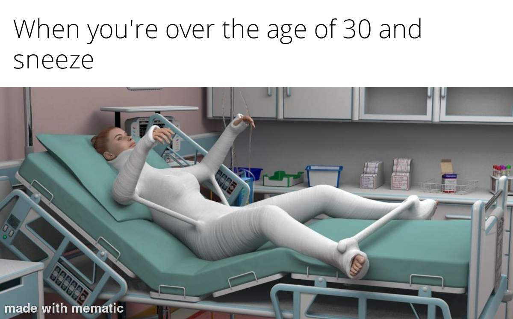

---

## 69. Predicted label: **Surprise**

- **Title:** Spiderman
- **Meme caption:** The meme poster is teasing Twitter for selling the verification tick to everyone and its consequences.
- **Raw model response:** `Surprise`
- **Manual judgment:** 
- **Human label if different:** 
- **Notes:** 

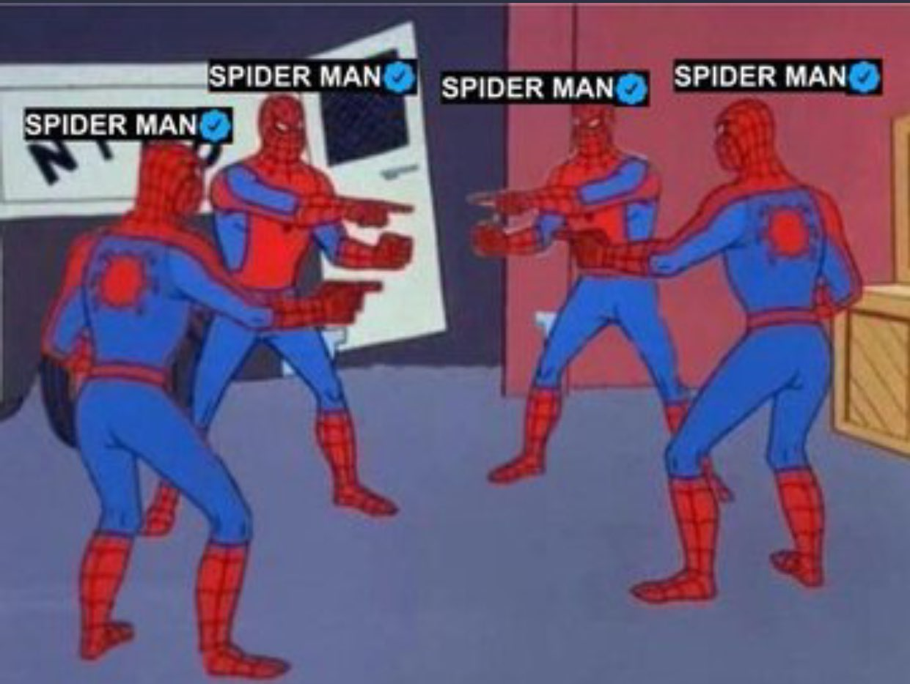

---

## 70. Predicted label: **Surprise**

- **Title:** iron wheels the movie coming to a theatre near you
- **Meme caption:** Meme poster is trying to convey that Doctor Strange is confused by the timeline where Iron Wheels exist.
- **Raw model response:** `Surprise`
- **Manual judgment:** 
- **Human label if different:** 
- **Notes:** 

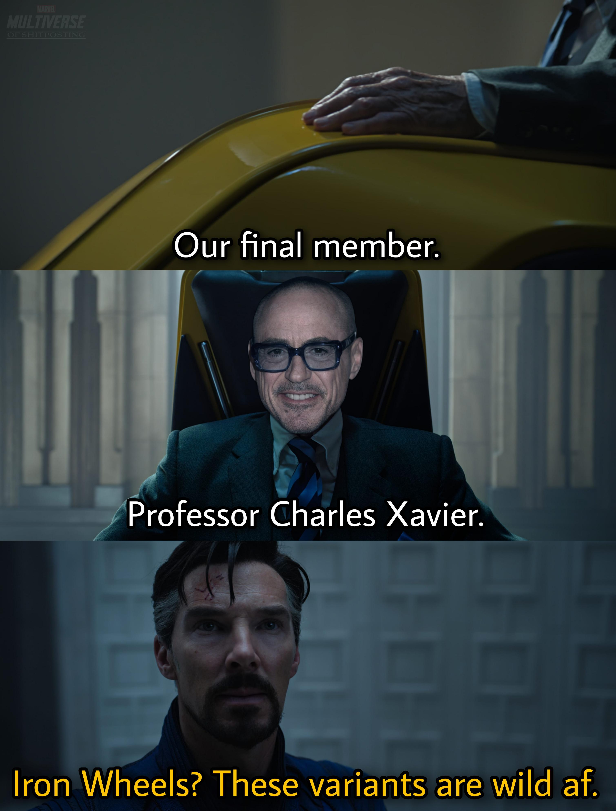

---

## 71. Predicted label: **INVALID**

- **Title:** Whats the best cheese to eat your pasta with?
- **Meme caption:** The meme poster have shown the competition behinds the foods like a paste which is consumed by many people
- **Raw model response:** `neutrality`
- **Manual judgment:** 
- **Human label if different:** 
- **Notes:** 

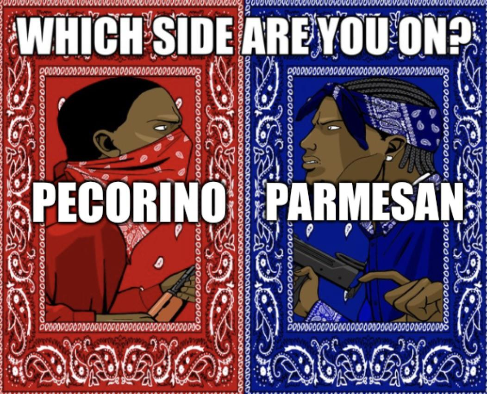

---

## 72. Predicted label: **INVALID**

- **Title:** Cock toe twins
- **Meme caption:** Meme poster is trying to convey they are ashame to reveal their playlist to friends
- **Raw model response:** `Shame`
- **Manual judgment:** 
- **Human label if different:** 
- **Notes:** 

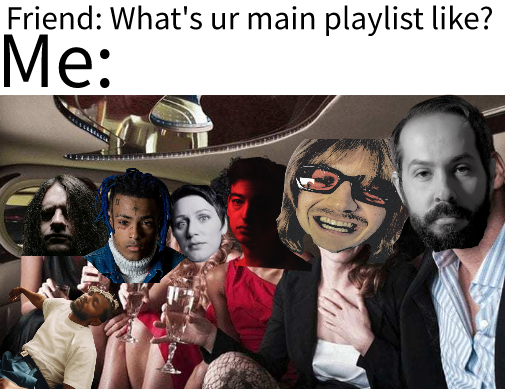

---

## 73. Predicted label: **INVALID**

- **Title:** Even through pain, I'm still not giving up.
- **Meme caption:** Meme poster is conveying boredom while waiting on someone to come back.
- **Raw model response:** `Boredom`
- **Manual judgment:** 
- **Human label if different:** 
- **Notes:** 

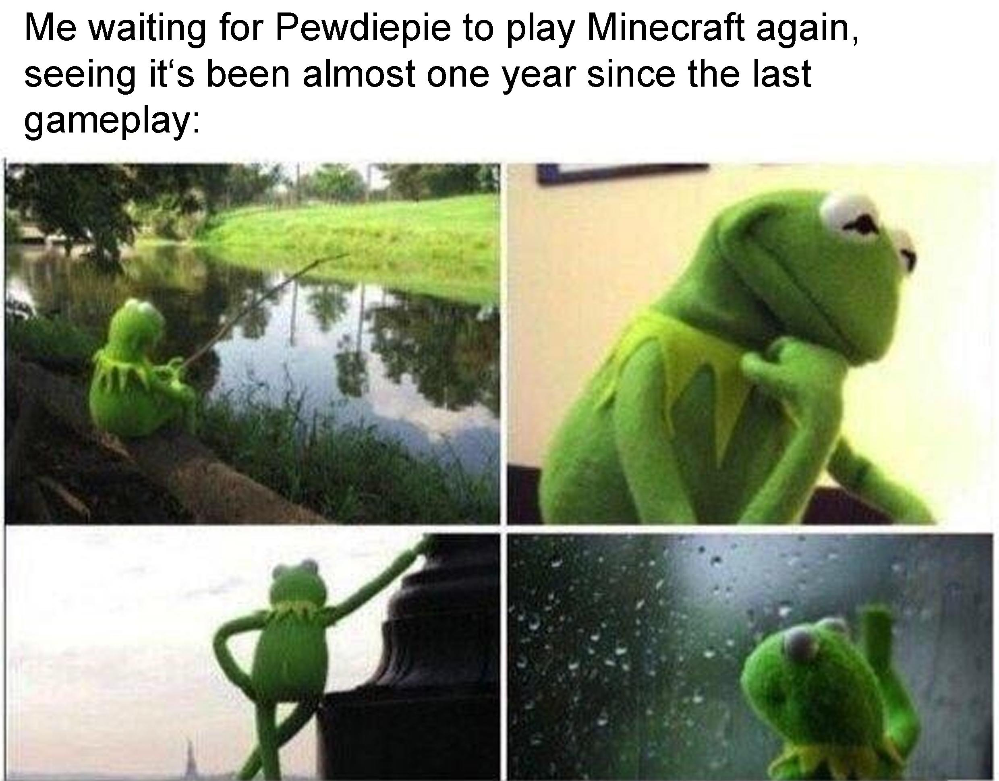

---

## 74. Predicted label: **INVALID**

- **Title:** Winter is coming
- **Meme caption:** Meme poster is trying to convey that it's cold outside and the couch has warm blankets to prepare for winter.
- **Raw model response:** `Warmth`
- **Manual judgment:** 
- **Human label if different:** 
- **Notes:** 

---

## 75. Predicted label: **INVALID**

- **Title:** seriously its getting old
- **Meme caption:** Meme poster is trying to convey that they're tired of YouTube's algorithm recommending videos that they aren't interested in.
- **Raw model response:** `Tired`
- **Manual judgment:** 
- **Human label if different:** 
- **Notes:** 

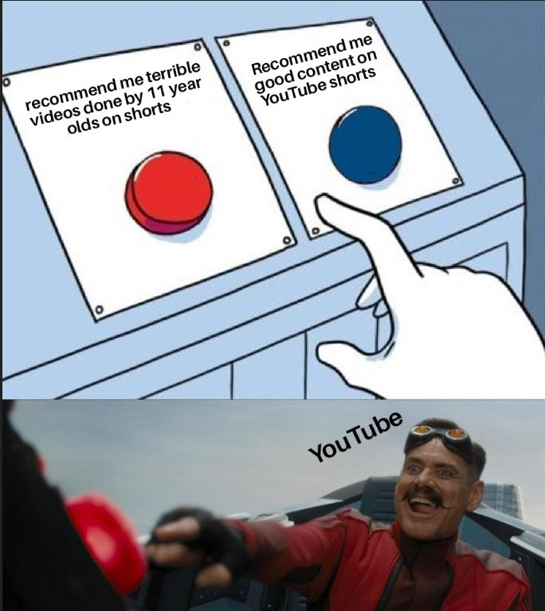

---

## 76. Predicted label: **INVALID**

- **Title:** Which one?
- **Meme caption:** Meme poster finds hard to choose crunchy cookies or gooey cookies.
- **Raw model response:** `neutrality`
- **Manual judgment:** 
- **Human label if different:** 
- **Notes:** 

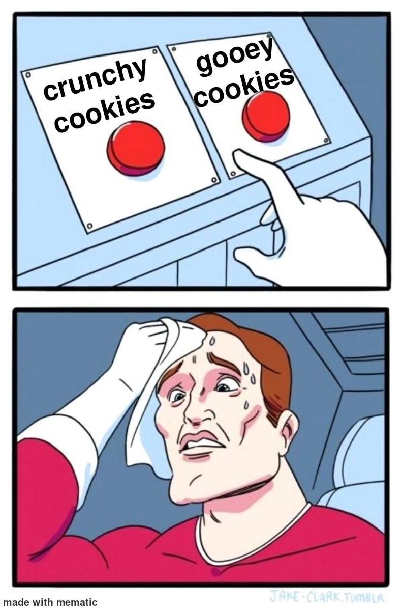

---

## 77. Predicted label: **INVALID**

- **Title:** Take away the pain
- **Meme caption:** Meme poster is trying to convey that they're humiliated when they read their old conversations online.
- **Raw model response:** `Humiliated`
- **Manual judgment:** 
- **Human label if different:** 
- **Notes:** 

---

## 78. Predicted label: **INVALID**

- **Title:** Gamers assemble
- **Meme caption:** Meme poster is try convey different between old and new one.
- **Raw model response:** `neutrality`
- **Manual judgment:** 
- **Human label if different:** 
- **Notes:** 

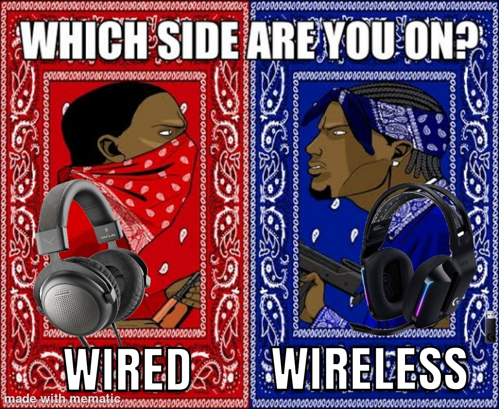

---

## 79. Predicted label: **INVALID**

- **Title:** Wish it wasnt true
- **Meme caption:** Meme poster is trying to convey that they are tired of their job.
- **Raw model response:** `Tired`
- **Manual judgment:** 
- **Human label if different:** 
- **Notes:** 

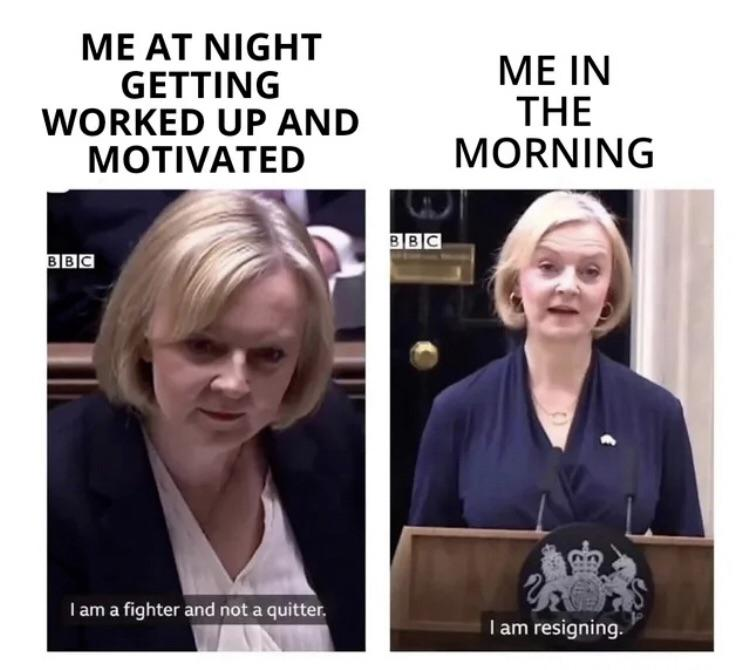

---

## 80. Predicted label: **INVALID**

- **Title:** I happen to be (insert whatever)...sounded better in my head
- **Meme caption:** Meme poster is trying to convey that you should always doubt the recollection of someone who was there when the meme got made.
- **Raw model response:** `Doubt`
- **Manual judgment:** 
- **Human label if different:** 
- **Notes:** 

---

