# Qwen-VL Manual Quality Check - image_caption

Use this file to inspect silver-label noise.

Suggested manual fields:
- Correct? yes/no/ambiguous
- Human label
- Notes

---

## 1. Predicted label: **Anger**

- **Title:** The twitter experience
- **Meme caption:** Meme poster is trying to convey that they're fed up with people being crucified over semantic on Twitter.
- **Raw model response:** `Anger`
- **Manual judgment:** 
- **Human label if different:** 
- **Notes:** 

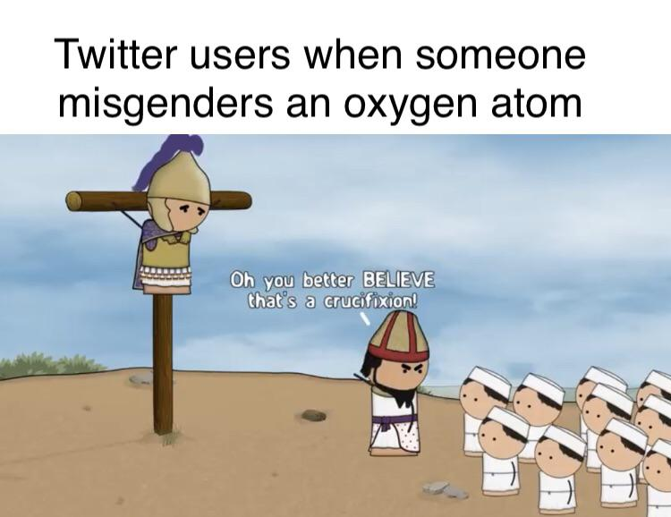

---

## 2. Predicted label: **Anger**

- **Title:** Time to retaliate
- **Meme caption:** Meme poster is trying to convey that it's annoying Microsoft word automatically tries to underline words spelled correctly in other versions of English.
- **Raw model response:** `Anger`
- **Manual judgment:** 
- **Human label if different:** 
- **Notes:** 

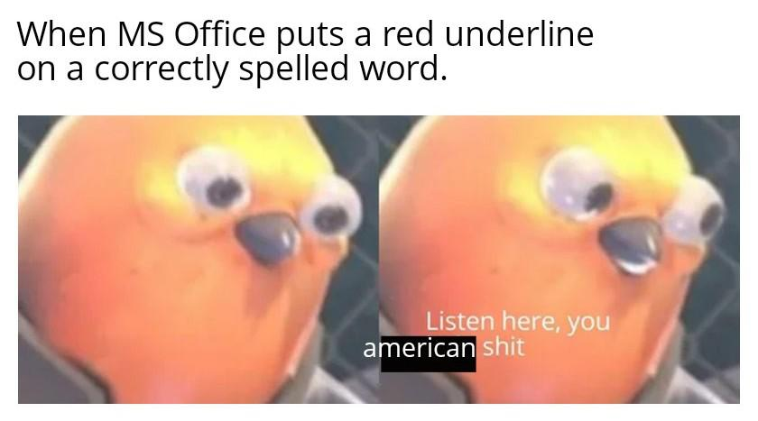

---

## 3. Predicted label: **Anger**

- **Title:** Is He a Joke to You?
- **Meme caption:** Meme poster is trying to convey that the Nordic Thor would be mad at what Disney and Marvel have done to the character
- **Raw model response:** `Anger`
- **Manual judgment:** 
- **Human label if different:** 
- **Notes:** 

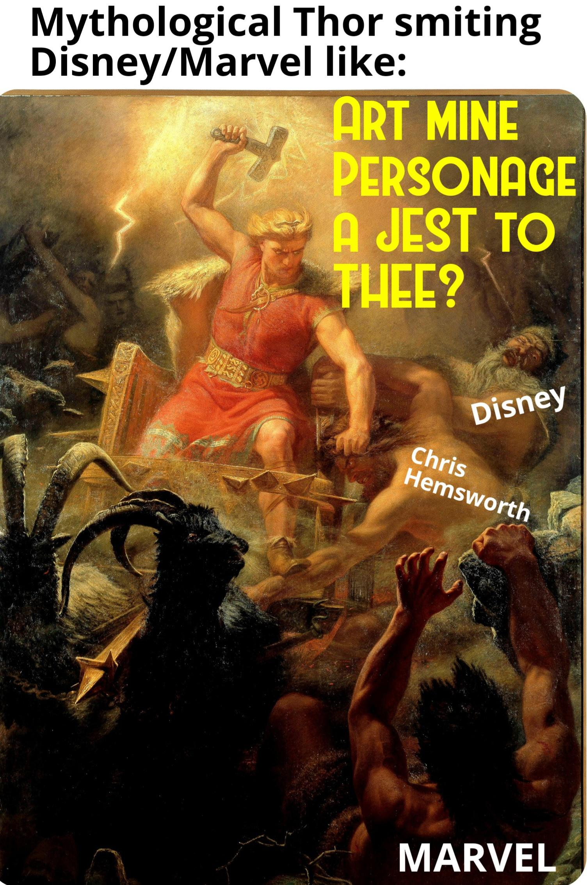

---

## 4. Predicted label: **Anger**

- **Title:** Stop spoiling yourself
- **Meme caption:** The meme poster is always tempted more, as they will just watch the preview and have to wait for the episode, rather than the people who watch the episodes and the people who watch the preview just before watching the episode.
- **Raw model response:** `Anger`
- **Manual judgment:** 
- **Human label if different:** 
- **Notes:** 

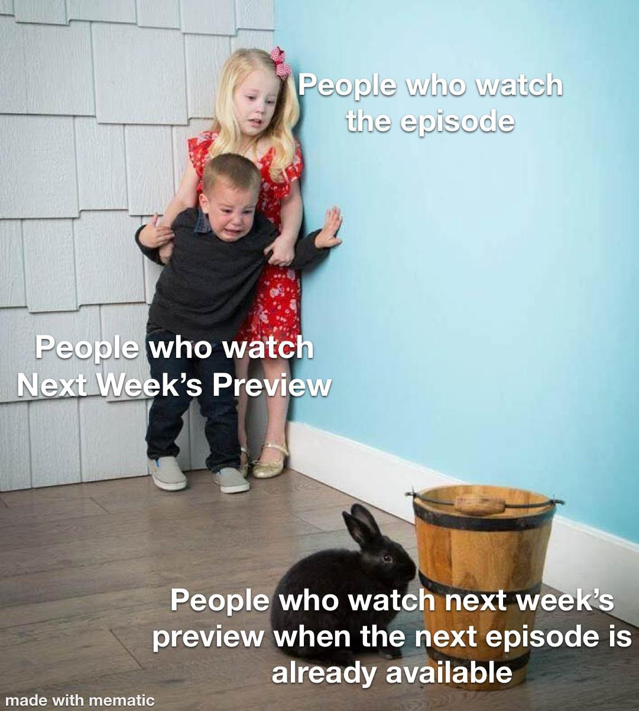

---

## 5. Predicted label: **Anger**

- **Title:** Sorry for having time
- **Meme caption:** Meme poster is trying to convey that there are too many short ads on long Youtube videos.
- **Raw model response:** `Anger`
- **Manual judgment:** 
- **Human label if different:** 
- **Notes:** 

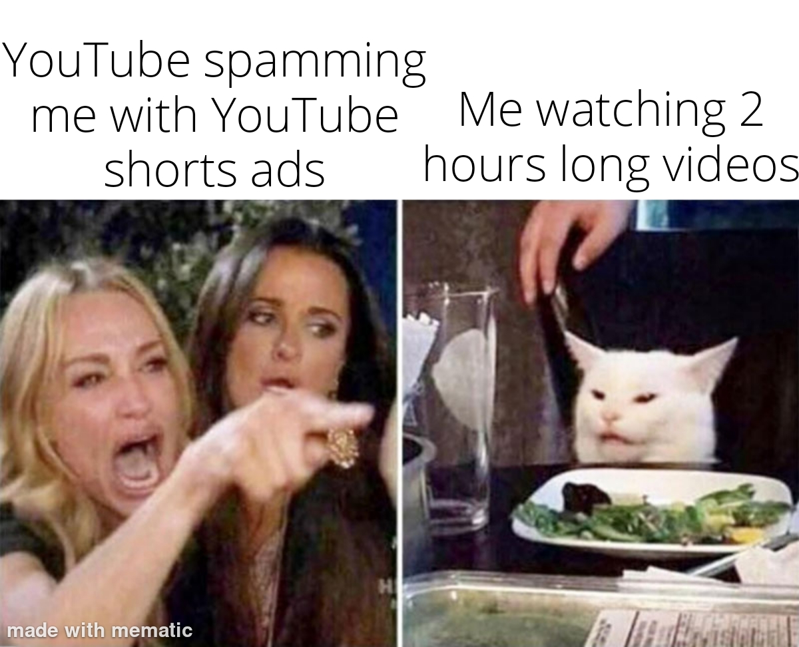

---

## 6. Predicted label: **Anger**

- **Title:** Hey you, yes you.
- **Meme caption:** Meme poster is trying to convey that peoples' feelings are hurt too easily nowadays.
- **Raw model response:** `Anger`
- **Manual judgment:** 
- **Human label if different:** 
- **Notes:** 

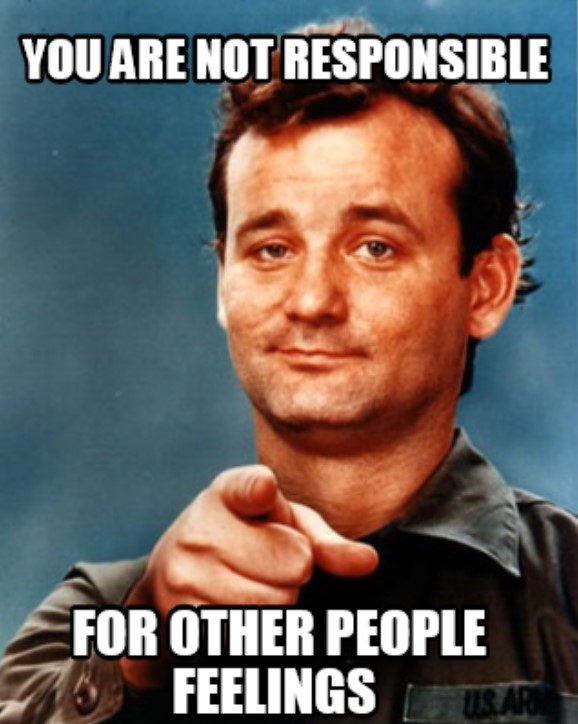

---

## 7. Predicted label: **Anger**

- **Title:** Theyre putting spices in the pumpkin pies to turn the capybaras gay!
- **Meme caption:** Meme poster is trying to convey that both political parties have bad ideas.
- **Raw model response:** `Anger`
- **Manual judgment:** 
- **Human label if different:** 
- **Notes:** 

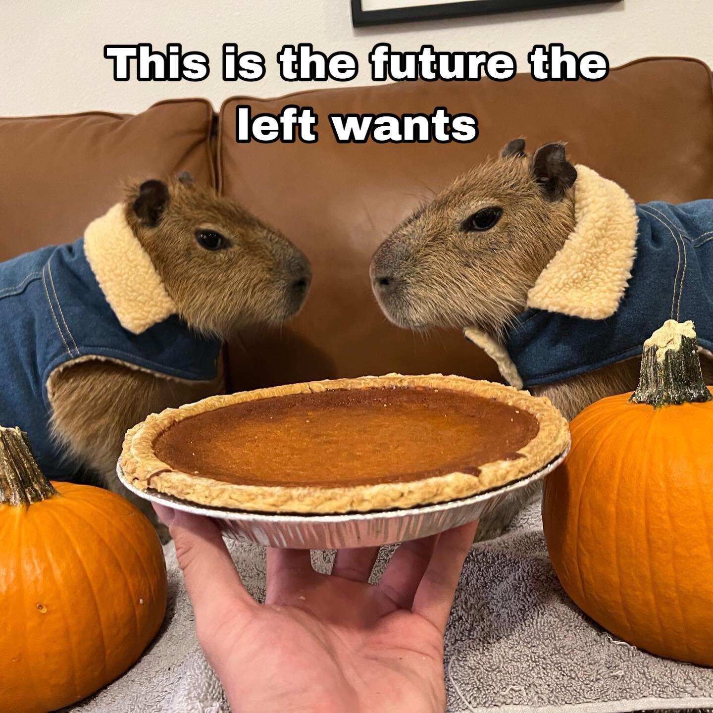

---

## 8. Predicted label: **Anger**

- **Title:** Do you even lift, bro?
- **Meme caption:** Meme poster is angry when people comment about them not being able to lift weights.
- **Raw model response:** `Anger`
- **Manual judgment:** 
- **Human label if different:** 
- **Notes:** 

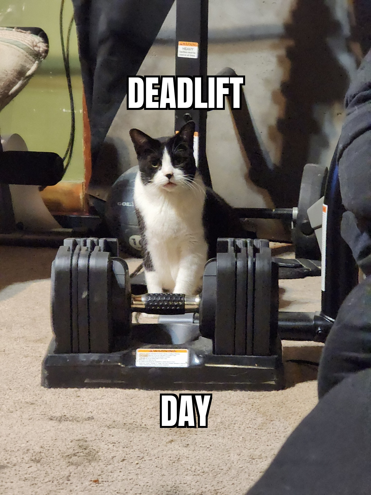

---

## 9. Predicted label: **Anger**

- **Title:** "Why don't you do NNN?"
- **Meme caption:** Meme poster gets mad on break  something with force.
- **Raw model response:** `Anger`
- **Manual judgment:** 
- **Human label if different:** 
- **Notes:** 

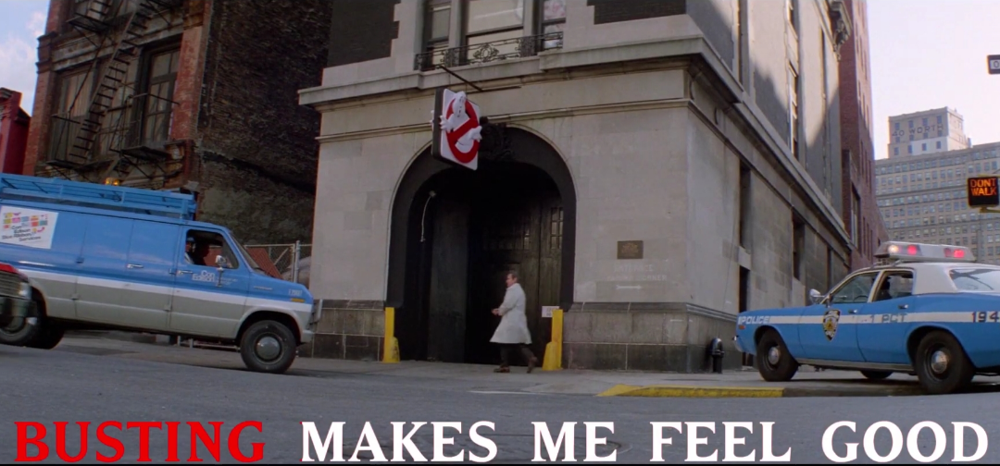

---

## 10. Predicted label: **Anger**

- **Title:** Believe me Donkey
- **Meme caption:** Meme poster is trying to convey they are going to cause a blow up the world
- **Raw model response:** `Anger`
- **Manual judgment:** 
- **Human label if different:** 
- **Notes:** 

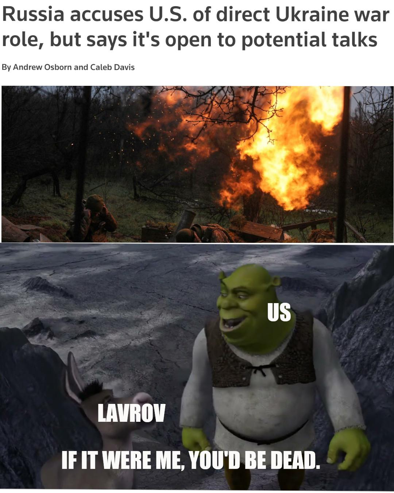

---

## 11. Predicted label: **Disgust**

- **Title:** "don't worry it's eatable"
- **Meme caption:** Meme poster is frustrated that bananas ripen unevenly.
- **Raw model response:** `Disgust`
- **Manual judgment:** 
- **Human label if different:** 
- **Notes:** 

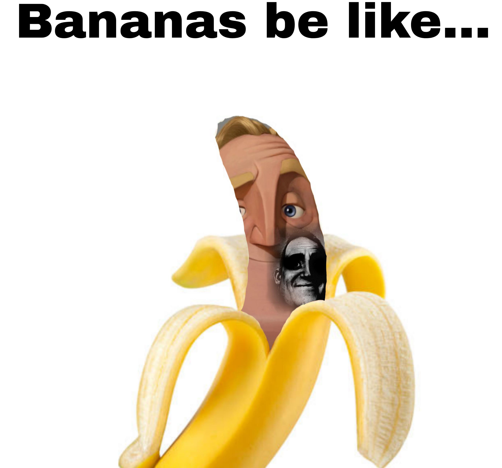

---

## 12. Predicted label: **Disgust**

- **Title:** It didn't really work, did it?
- **Meme caption:** Meme poster is trying to convey that YouTube removing the dislike button didn't work to remove negative sentiment about videos.
- **Raw model response:** `Disgust`
- **Manual judgment:** 
- **Human label if different:** 
- **Notes:** 

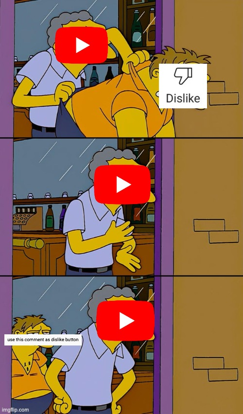

---

## 13. Predicted label: **Disgust**

- **Title:** Giga Sandler
- **Meme caption:** Adam Sandler's movie career is many bad films and one good one and Adam Sandler doesn't care.
- **Raw model response:** `Disgust`
- **Manual judgment:** 
- **Human label if different:** 
- **Notes:** 

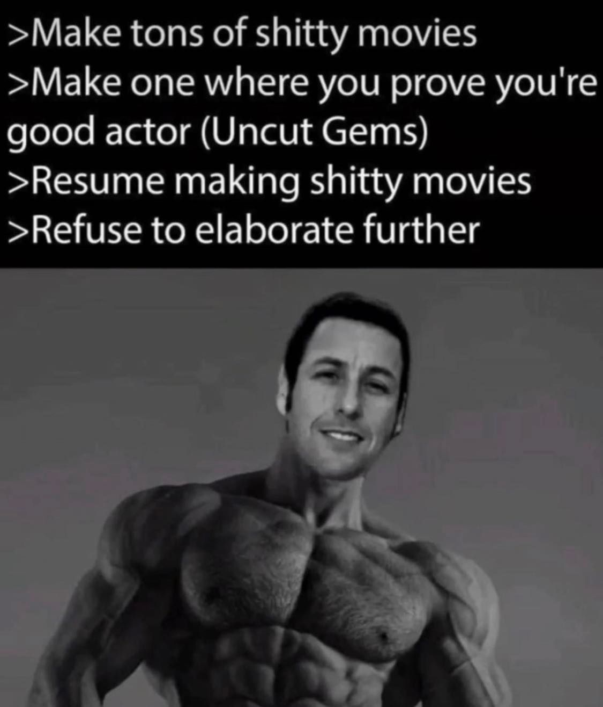

---

## 14. Predicted label: **Disgust**

- **Title:** My New Favorite Movie Quote
- **Meme caption:** Meme poster is trying to convey that their parents don't approve of their hobbies and actions.
- **Raw model response:** `Disgust`
- **Manual judgment:** 
- **Human label if different:** 
- **Notes:** 

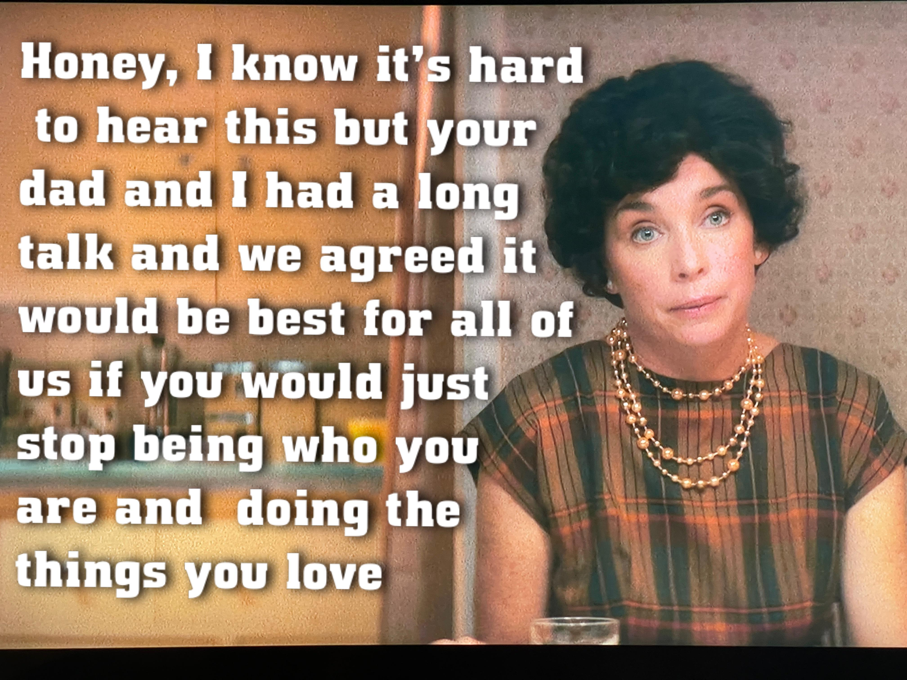

---

## 15. Predicted label: **Disgust**

- **Title:** Good riddance
- **Meme caption:** Meme poster is trying to convey that they dislike the guy in the cowboy hat.
- **Raw model response:** `Disgust`
- **Manual judgment:** 
- **Human label if different:** 
- **Notes:** 

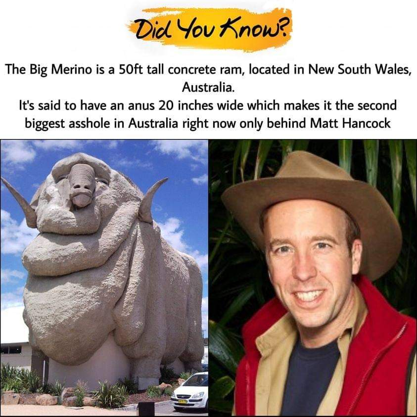

---

## 16. Predicted label: **Disgust**

- **Title:** Seriously, what's the holdup?
- **Meme caption:** The meme poster is hesitating to pay the workers a fair salary for boosting them rather than thinking of other moral ways.
- **Raw model response:** `Disgust`
- **Manual judgment:** 
- **Human label if different:** 
- **Notes:** 

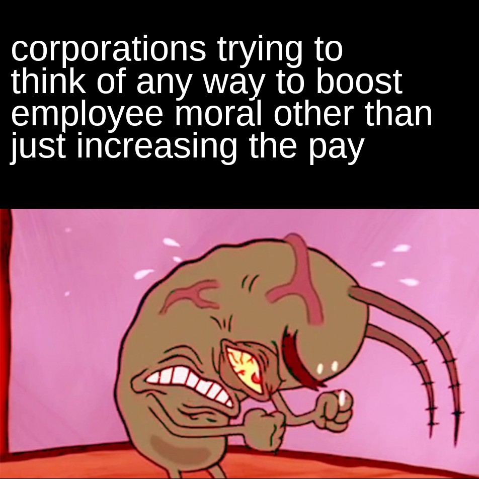

---

## 17. Predicted label: **Disgust**

- **Title:** I'll see your flock of Cobra Chickens, and raise you a soar of...
- **Meme caption:** The meme poster exposes our faults and the trashes on the world we make.
- **Raw model response:** `Disgust`
- **Manual judgment:** 
- **Human label if different:** 
- **Notes:** 

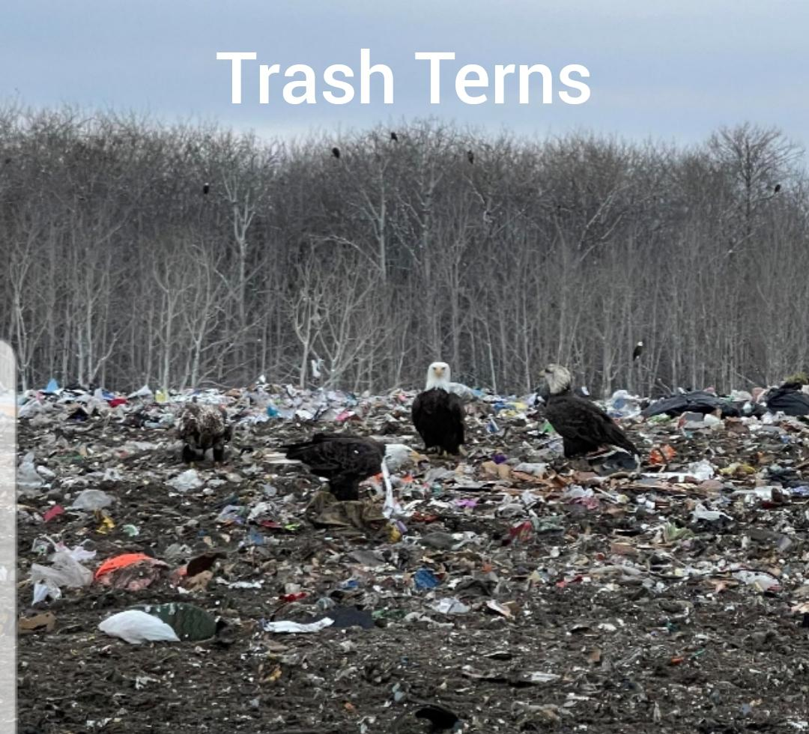

---

## 18. Predicted label: **Disgust**

- **Title:** Vaping is cringe
- **Meme caption:** Meme poster is trying to convey how much they dislike vaping.
- **Raw model response:** `Disgust`
- **Manual judgment:** 
- **Human label if different:** 
- **Notes:** 

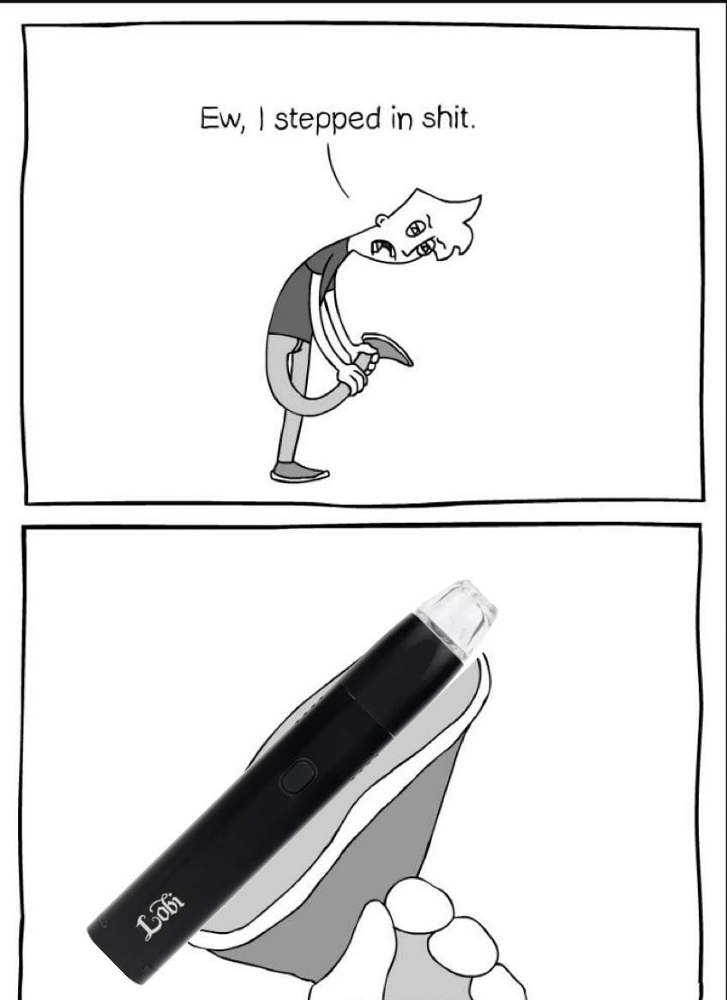

---

## 19. Predicted label: **Disgust**

- **Title:** glad we progressed... in some ways
- **Meme caption:** Meme poster is trying to convey that Today's Americans are lazier than their ancestors who had to walk miles up mountains to get anywhere.
- **Raw model response:** `Disgust`
- **Manual judgment:** 
- **Human label if different:** 
- **Notes:** 

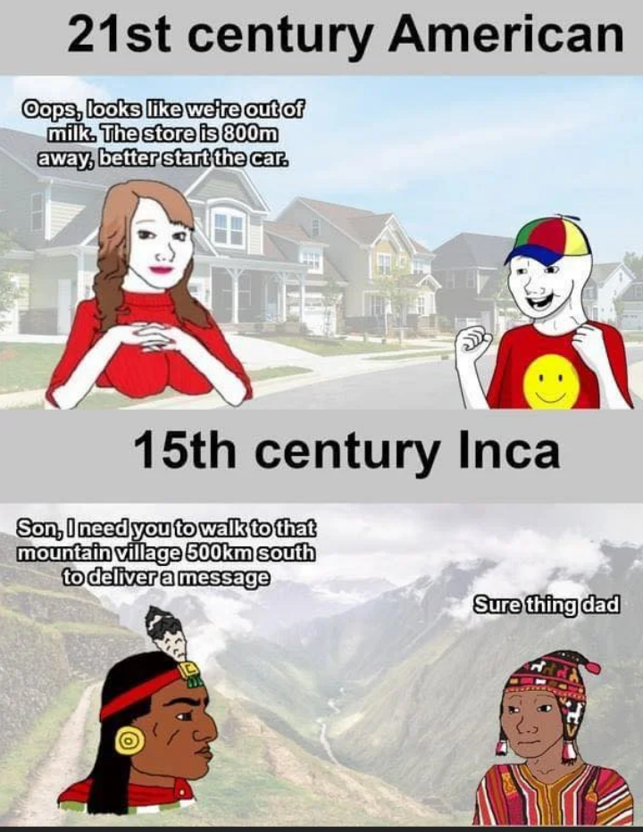

---

## 20. Predicted label: **Disgust**

- **Title:** Once these two words come up, it's recipe for disaster
- **Meme caption:** Customers don't want the products of their youth updated for the modern times.
- **Raw model response:** `Disgust`
- **Manual judgment:** 
- **Human label if different:** 
- **Notes:** 

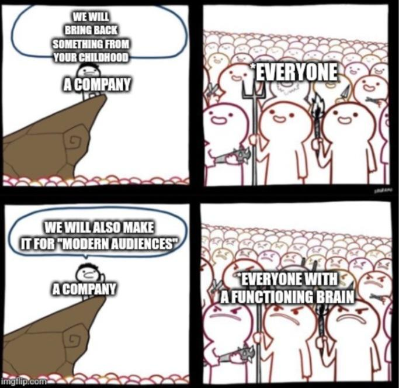

---

## 21. Predicted label: **Fear**

- **Title:** don't matter where you go, you're gonna be my juicy burger
- **Meme caption:** Meme poster is trying to convey that every direction the cow goes, it will become a burger.
- **Raw model response:** `Fear`
- **Manual judgment:** 
- **Human label if different:** 
- **Notes:** 

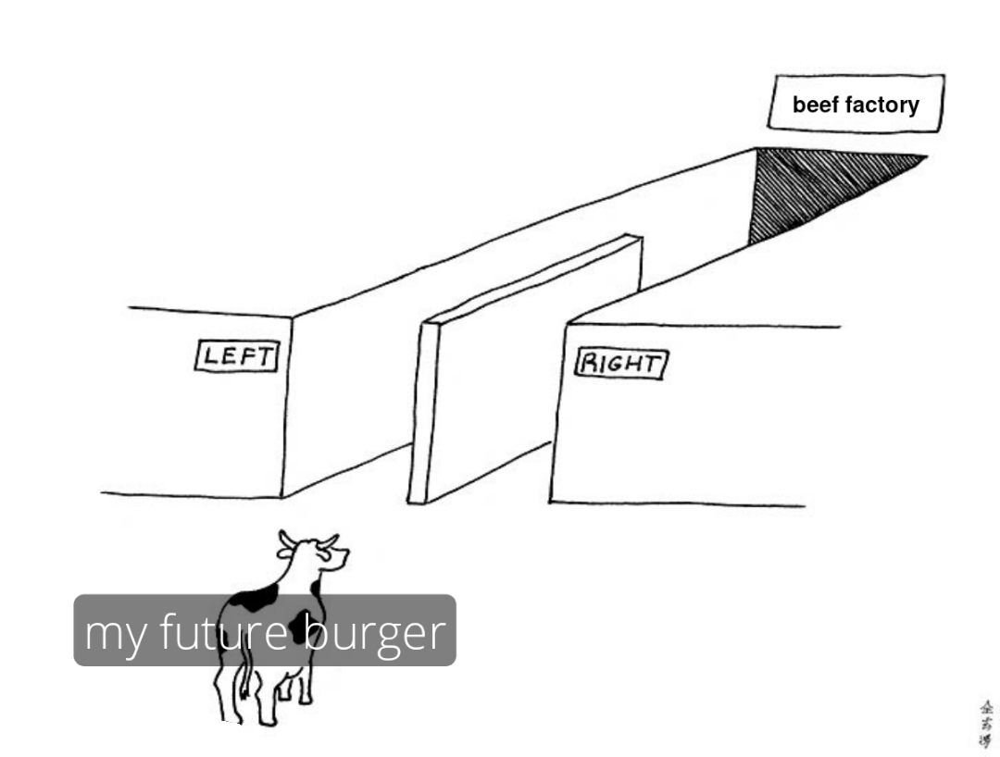

---

## 22. Predicted label: **Fear**

- **Title:** qatar.exe has stopped functioning
- **Meme caption:** Meme poster is trying to convey that LGBT people showing their pride refuse to bow down to other get rebuked by evangelical christians and even more by muslims.
- **Raw model response:** `Fear`
- **Manual judgment:** 
- **Human label if different:** 
- **Notes:** 

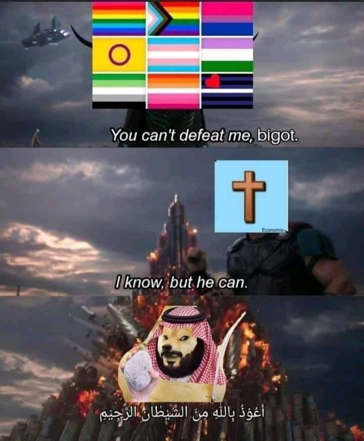

---

## 23. Predicted label: **Fear**

- **Title:** fascists are mad they can't silence political dissidents anymore
- **Meme caption:** Meme poster is trying to convey that facists are now the ones getting blasted instead of the political disonents.
- **Raw model response:** `Fear`
- **Manual judgment:** 
- **Human label if different:** 
- **Notes:** 

---

## 24. Predicted label: **Fear**

- **Title:** Relatable
- **Meme caption:** Meme poster is trying to convey that Siblings plot revenge after they are hit by their other sibling.
- **Raw model response:** `Fear`
- **Manual judgment:** 
- **Human label if different:** 
- **Notes:** 

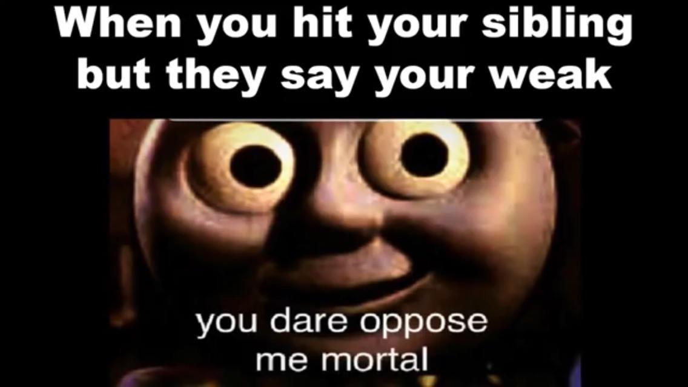

---

## 25. Predicted label: **Fear**

- **Title:** Confidential noises...
- **Meme caption:** Meme poster is trying to convey that the opposite of nervous is confident and that there is a bit of wordplay here
- **Raw model response:** `Fear`
- **Manual judgment:** 
- **Human label if different:** 
- **Notes:** 

---

## 26. Predicted label: **Fear**

- **Title:** It's painful
- **Meme caption:** Meme poster feels embarrassed when they are being chased by someone, they quickly run away, and then they turn around and see that the person isn't chasing them anymore.
- **Raw model response:** `Fear`
- **Manual judgment:** 
- **Human label if different:** 
- **Notes:** 

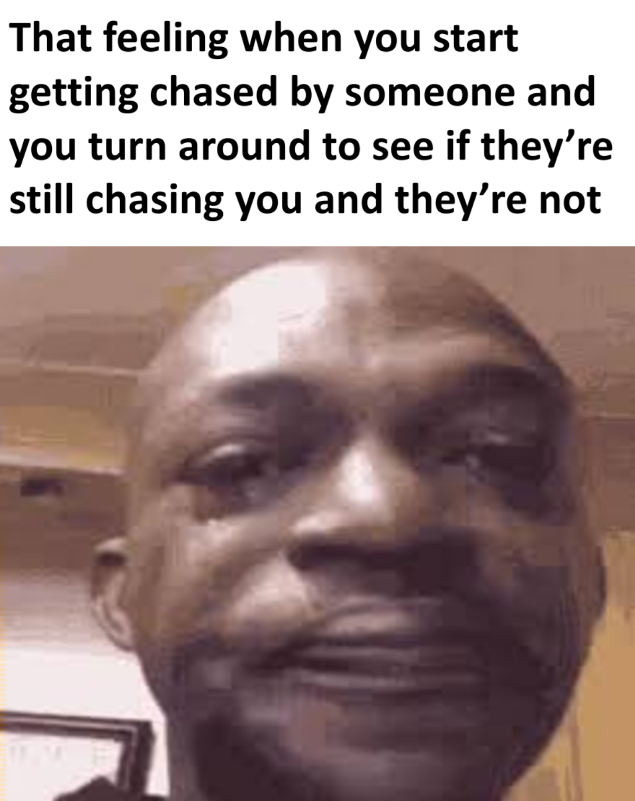

---

## 27. Predicted label: **Fear**

- **Title:** How are we convinced this would go well?
- **Meme caption:** Meme poster is trying to convey that humans can't get along with aliens if we can't along with ourselves.
- **Raw model response:** `Fear`
- **Manual judgment:** 
- **Human label if different:** 
- **Notes:** 

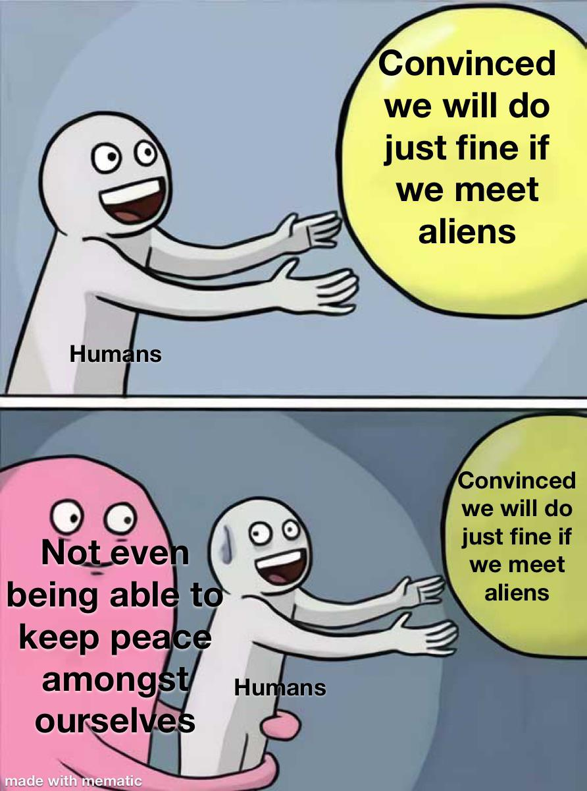

---

## 28. Predicted label: **Fear**

- **Title:** Most sane Ohioan
- **Meme caption:** Meme poster is trying to convey that People in Ohio are pretty dangerous
- **Raw model response:** `Fear`
- **Manual judgment:** 
- **Human label if different:** 
- **Notes:** 

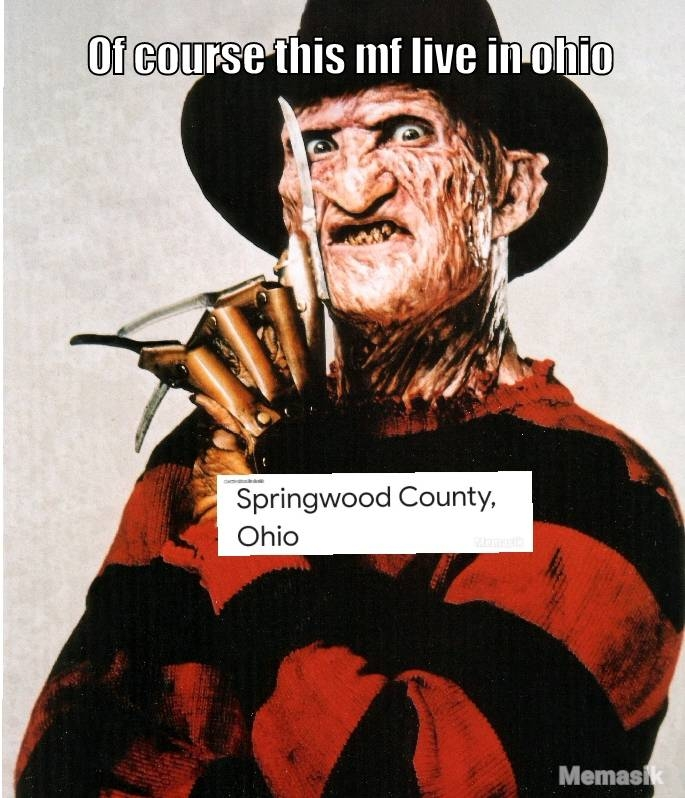

---

## 29. Predicted label: **Fear**

- **Title:** I CANT TAKE IT ANYMORE
- **Meme caption:** The meme poster's favorite sites are threatening him and he finds a work around.
- **Raw model response:** `Fear`
- **Manual judgment:** 
- **Human label if different:** 
- **Notes:** 

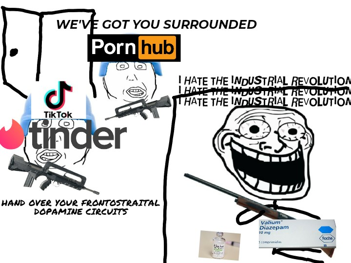

---

## 30. Predicted label: **Fear**

- **Title:** Mamma mia!
- **Meme caption:** Meme poster is implying that the Leaning Tower of Piza would fall without tourists.
- **Raw model response:** `Fear`
- **Manual judgment:** 
- **Human label if different:** 
- **Notes:** 

---

## 31. Predicted label: **Joy**

- **Title:** For people of a certain age, it do be like that.
- **Meme caption:** Poster enjoys sister decor use of beaded curtains
- **Raw model response:** `Joy`
- **Manual judgment:** 
- **Human label if different:** 
- **Notes:** 

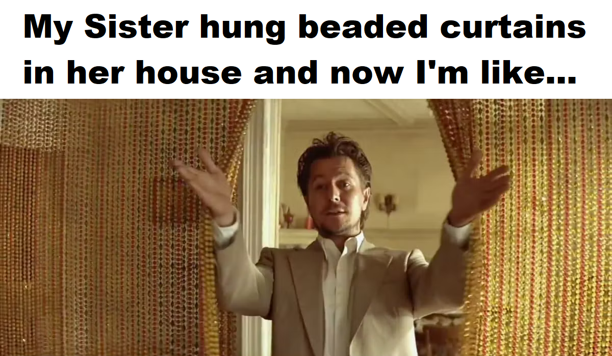

---

## 32. Predicted label: **Joy**

- **Title:** Sorry, I've just spent some time on r/LinkedInLunatics
- **Meme caption:** Meme poster changes their title depending on what social media service they are using.
- **Raw model response:** `Joy`
- **Manual judgment:** 
- **Human label if different:** 
- **Notes:** 

---

## 33. Predicted label: **Joy**

- **Title:** Power +1000
- **Meme caption:** Meme poster is feeling like the top after opening a book to the exact page they wanted.
- **Raw model response:** `Joy`
- **Manual judgment:** 
- **Human label if different:** 
- **Notes:** 

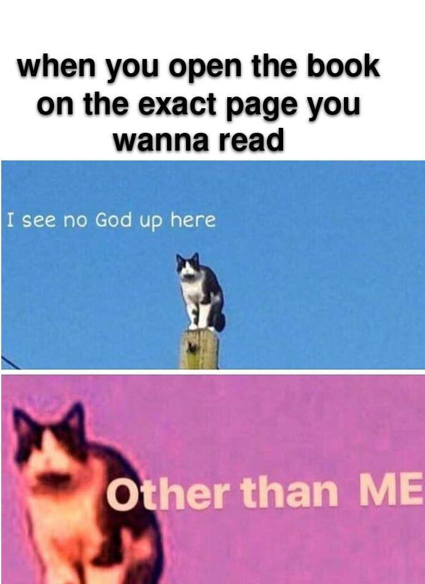

---

## 34. Predicted label: **Joy**

- **Title:** Level of hype is 100
- **Meme caption:** Meme poster is trying to convey that they don't mind spending money on the new Guardians movie.
- **Raw model response:** `Joy`
- **Manual judgment:** 
- **Human label if different:** 
- **Notes:** 

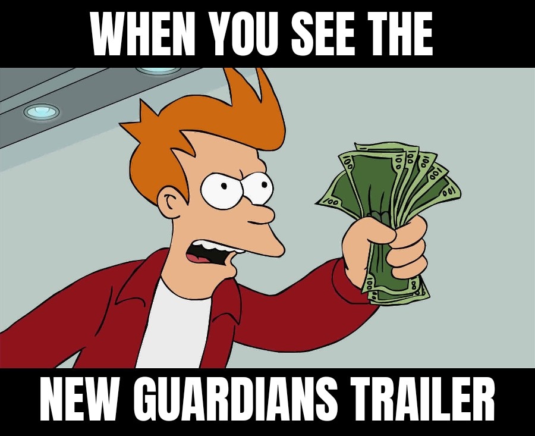

---

## 35. Predicted label: **Joy**

- **Title:** you know I love you all still tho, right?
- **Meme caption:** Meme poster is trying to convey that Reddit is a place where the worst of humanity is with love from the meme poster.
- **Raw model response:** `Joy`
- **Manual judgment:** 
- **Human label if different:** 
- **Notes:** 

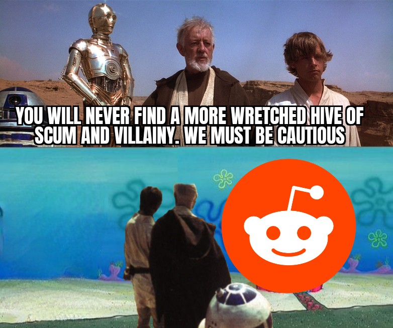

---

## 36. Predicted label: **Joy**

- **Title:** The greatest secret between the teacher and me
- **Meme caption:** Meme poster is trying to convey that the teacher playing along with his skit is giving him joy
- **Raw model response:** `Joy`
- **Manual judgment:** 
- **Human label if different:** 
- **Notes:** 

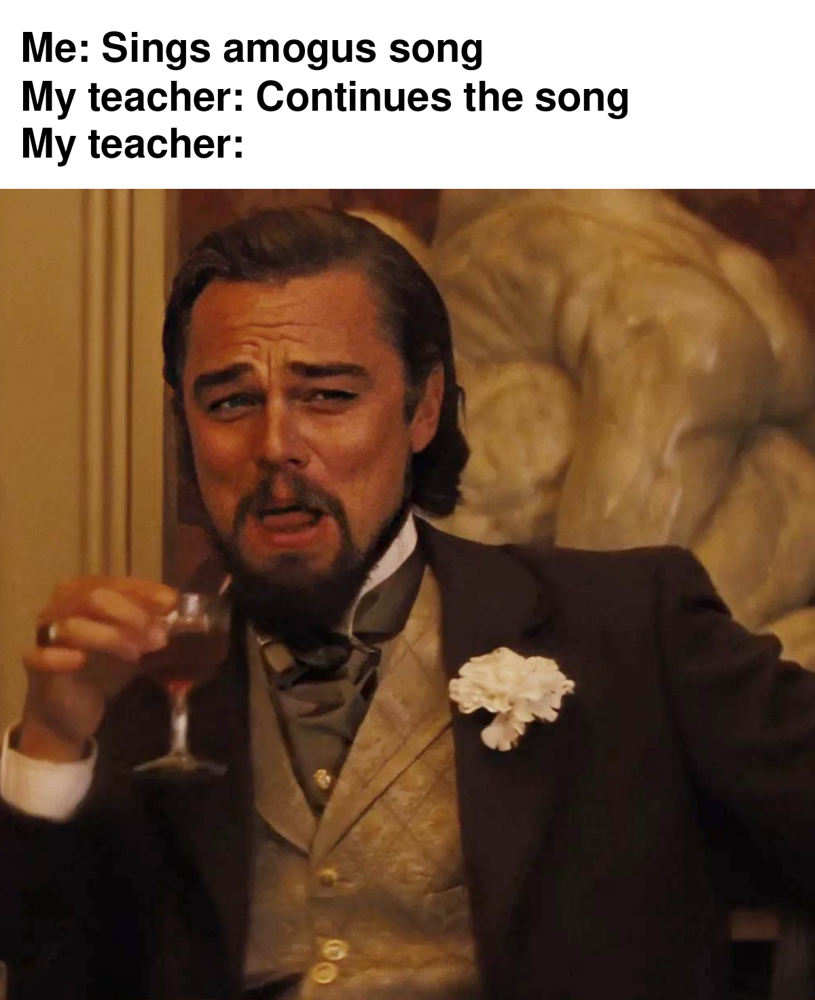

---

## 37. Predicted label: **Joy**

- **Title:** no way I'm the only one who does this
- **Meme caption:** Meme poster is trying to convey that they want to get down to the roots of lore
- **Raw model response:** `Joy`
- **Manual judgment:** 
- **Human label if different:** 
- **Notes:** 

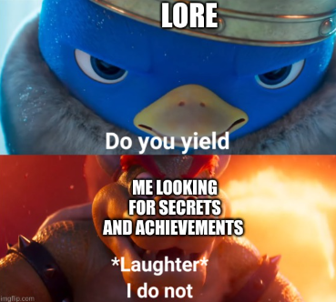

---

## 38. Predicted label: **Joy**

- **Title:** Amog Us Boo
- **Meme caption:** Meme poster is trying to convey that Halloween costumes are based on similar themes.
- **Raw model response:** `Joy`
- **Manual judgment:** 
- **Human label if different:** 
- **Notes:** 

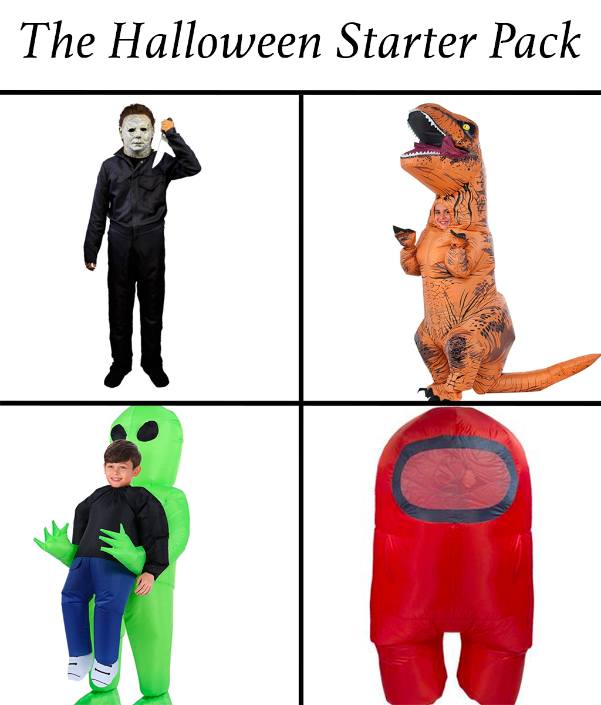

---

## 39. Predicted label: **Joy**

- **Title:** this is my first homemade meme
- **Meme caption:** Meme poster gets satisfied to drink wine.
- **Raw model response:** `Joy`
- **Manual judgment:** 
- **Human label if different:** 
- **Notes:** 

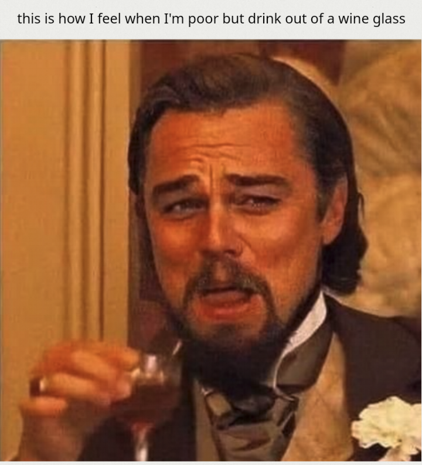

---

## 40. Predicted label: **Joy**

- **Title:** Now get ready for your colleagues to destroy it
- **Meme caption:** The meme poster feels proud to finish the website.
- **Raw model response:** `Joy`
- **Manual judgment:** 
- **Human label if different:** 
- **Notes:** 

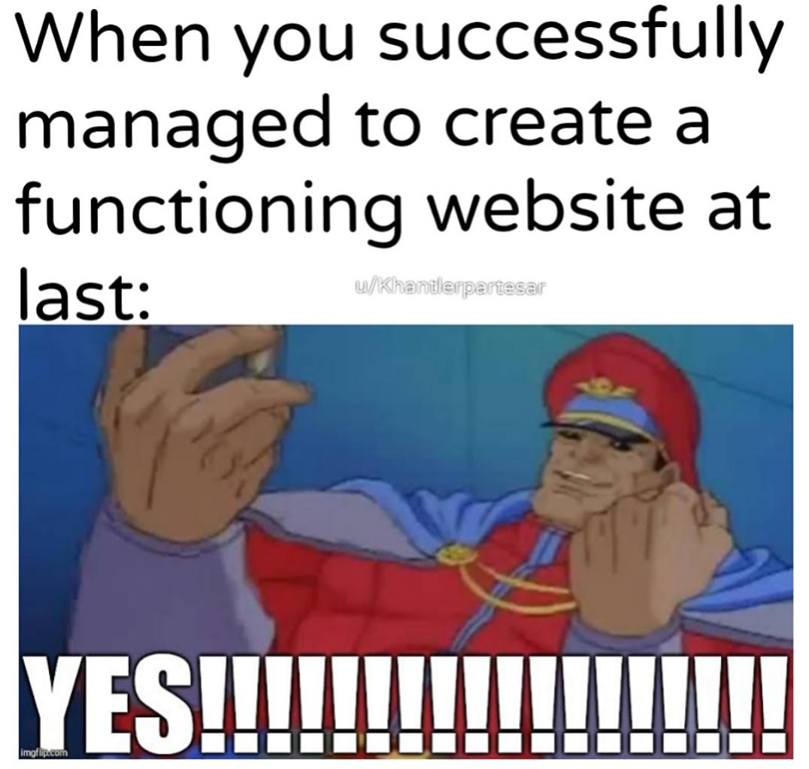

---

## 41. Predicted label: **Neutral**

- **Title:** enjoy this one
- **Meme caption:** Meme poster is conveying that the monkeys had it easier than us.
- **Raw model response:** `Neutral`
- **Manual judgment:** 
- **Human label if different:** 
- **Notes:** 

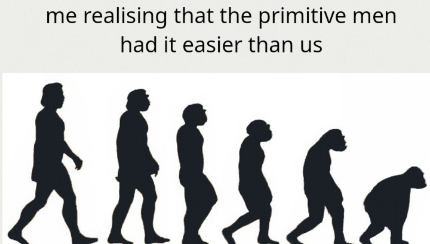

---

## 42. Predicted label: **Neutral**

- **Title:** sometimes it's a dinosaur.
- **Meme caption:** Meme poster is trying to convey that some of their silliest thoughts have no meaning, contrary to what their psychologist says.
- **Raw model response:** `Neutral`
- **Manual judgment:** 
- **Human label if different:** 
- **Notes:** 

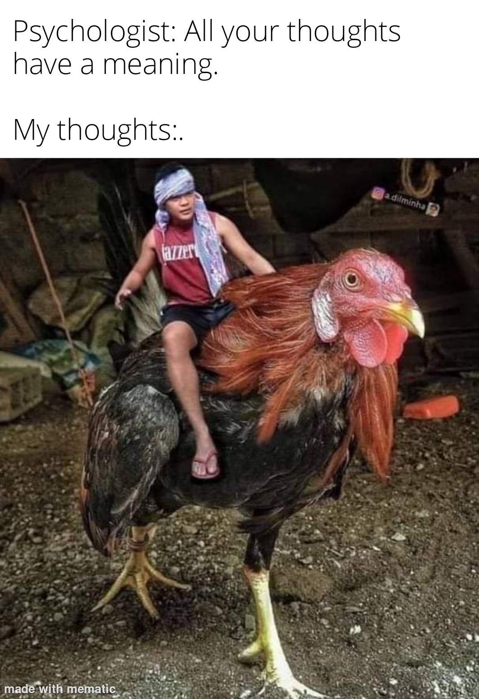

---

## 43. Predicted label: **Neutral**

- **Title:** Saw this popup on a website
- **Meme caption:** Meme poster feels like the the computer is alerting them to what they wanted the ad blocker to do.
- **Raw model response:** `Neutral`
- **Manual judgment:** 
- **Human label if different:** 
- **Notes:** 

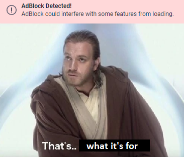

---

## 44. Predicted label: **Neutral**

- **Title:** Even back then.
- **Meme caption:** The meme poster warns and mocks the doctor for prescribing drugs for medication.
- **Raw model response:** `Neutral`
- **Manual judgment:** 
- **Human label if different:** 
- **Notes:** 

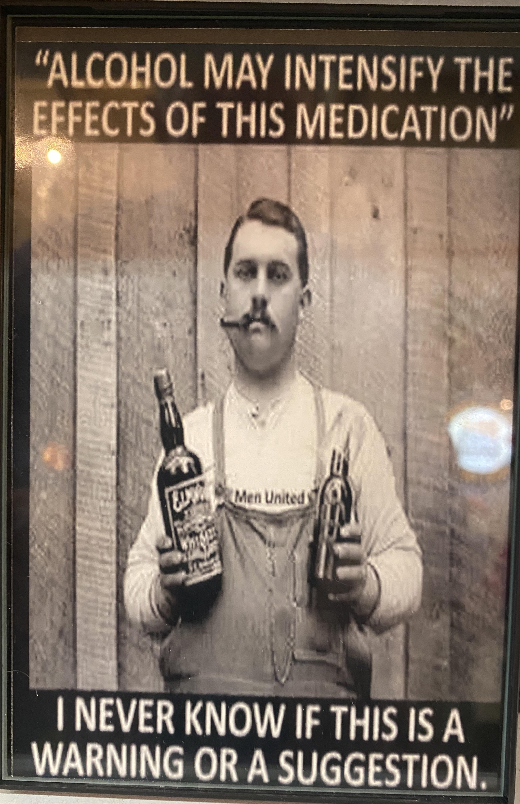

---

## 45. Predicted label: **Neutral**

- **Title:** Me when sleep/wake up
- **Meme caption:** Meme poster is trying to convey that make they difference night and morning.
- **Raw model response:** `Neutral`
- **Manual judgment:** 
- **Human label if different:** 
- **Notes:** 

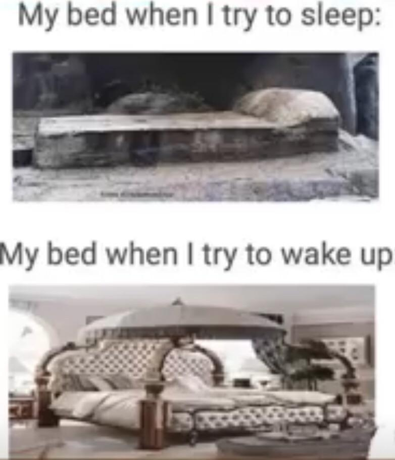

---

## 46. Predicted label: **Neutral**

- **Title:** I happen to be (insert whatever)...sounded better in my head
- **Meme caption:** Meme poster is trying to convey that you should always doubt the recollection of someone who was there when the meme got made.
- **Raw model response:** `Neutral`
- **Manual judgment:** 
- **Human label if different:** 
- **Notes:** 

---

## 47. Predicted label: **Neutral**

- **Title:** It has been an honor
- **Meme caption:** The meme poster is sharing its feelings rather than being aware of the current worst situation.
- **Raw model response:** `Neutral`
- **Manual judgment:** 
- **Human label if different:** 
- **Notes:** 

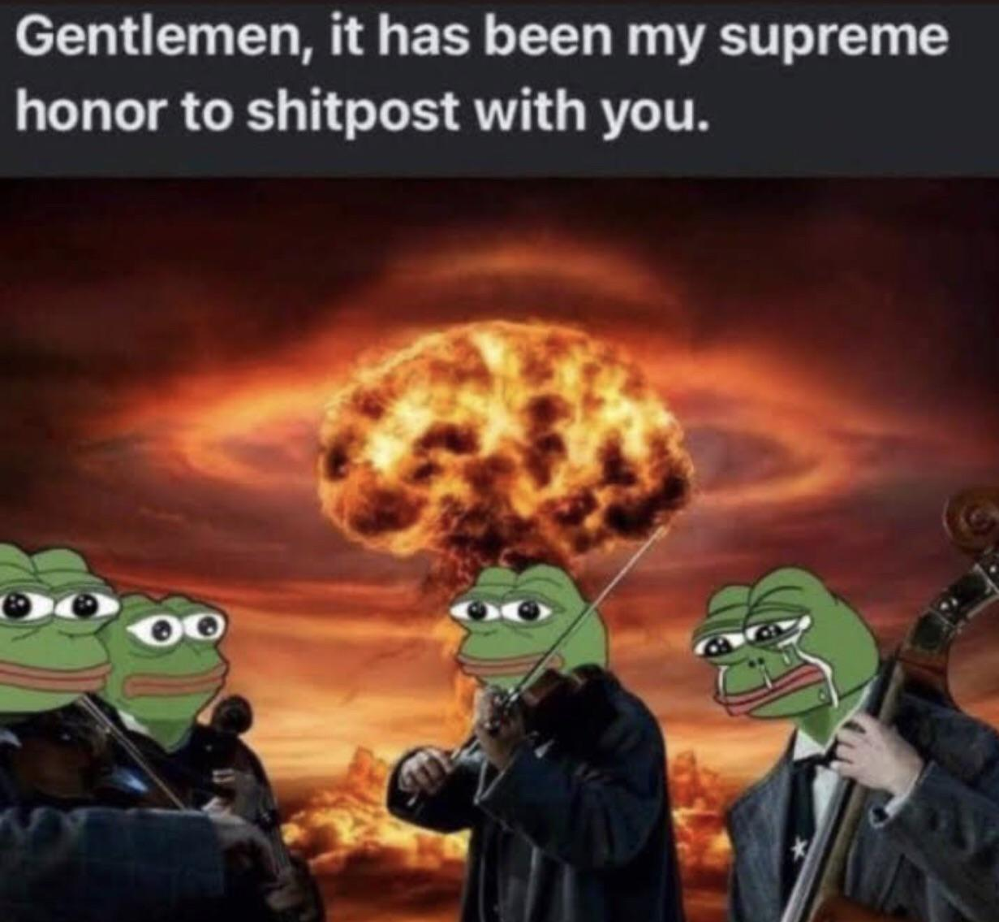

---

## 48. Predicted label: **Neutral**

- **Title:** Unfortunately
- **Meme caption:** The meme poster is explaining to his friends that he is not leaving them out because he has many friends.
- **Raw model response:** `Neutral`
- **Manual judgment:** 
- **Human label if different:** 
- **Notes:** 

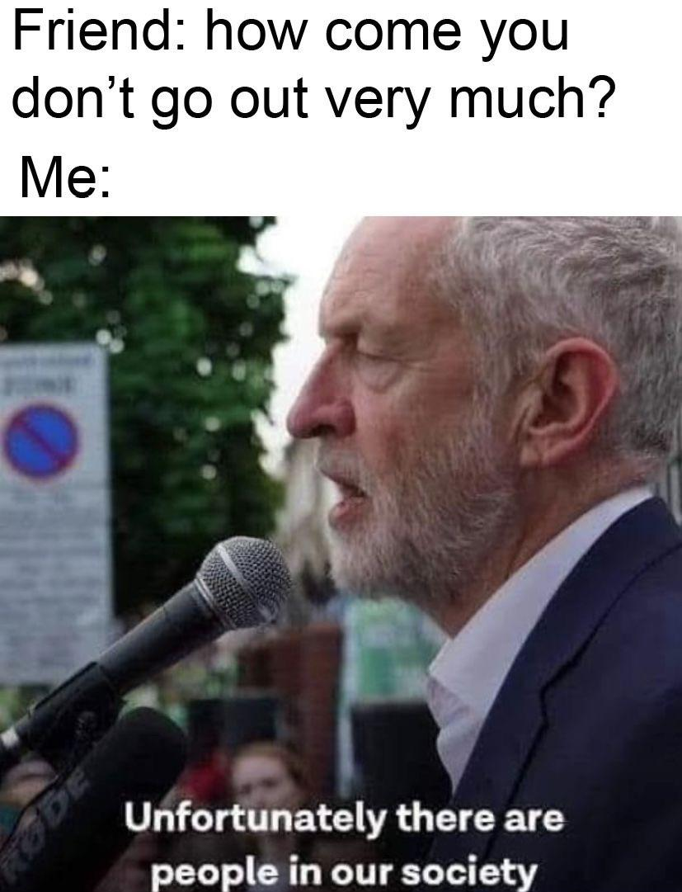

---

## 49. Predicted label: **Neutral**

- **Title:** it's not much, but it's honest work
- **Meme caption:** Meme poster is trying to convey that Wikipedia editor are quick to change the most minor mistakes.
- **Raw model response:** `Neutral`
- **Manual judgment:** 
- **Human label if different:** 
- **Notes:** 

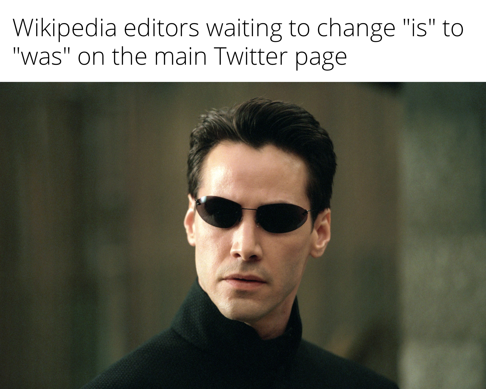

---

## 50. Predicted label: **Neutral**

- **Title:** it's always the Germans
- **Meme caption:** Meme poster is trying to convey that Germany has a different letter for s than the rest of the world.
- **Raw model response:** `Neutral`
- **Manual judgment:** 
- **Human label if different:** 
- **Notes:** 

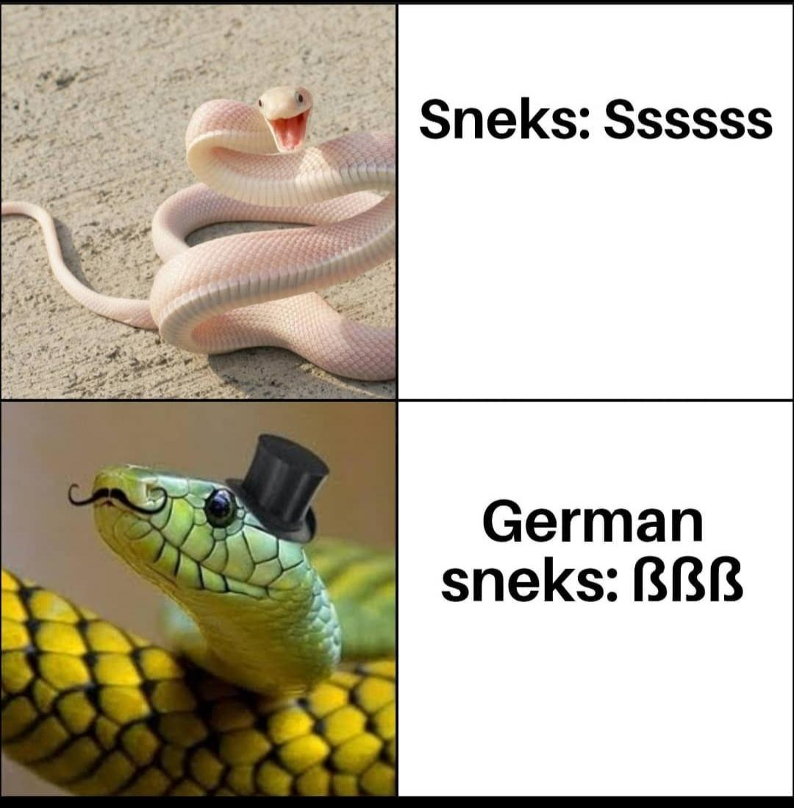

---

## 51. Predicted label: **Sadness**

- **Title:** DK, CHUNKY'S DEAD
- **Meme caption:** The meme poster feels bad about his life, after listening to to the lyrics rather than the music.
- **Raw model response:** `Sadness`
- **Manual judgment:** 
- **Human label if different:** 
- **Notes:** 

---

## 52. Predicted label: **Sadness**

- **Title:** Your opinion
- **Meme caption:** Meme poster feels like crying after watching anime but is holding it in because their friend is nearby.
- **Raw model response:** `Sadness`
- **Manual judgment:** 
- **Human label if different:** 
- **Notes:** 

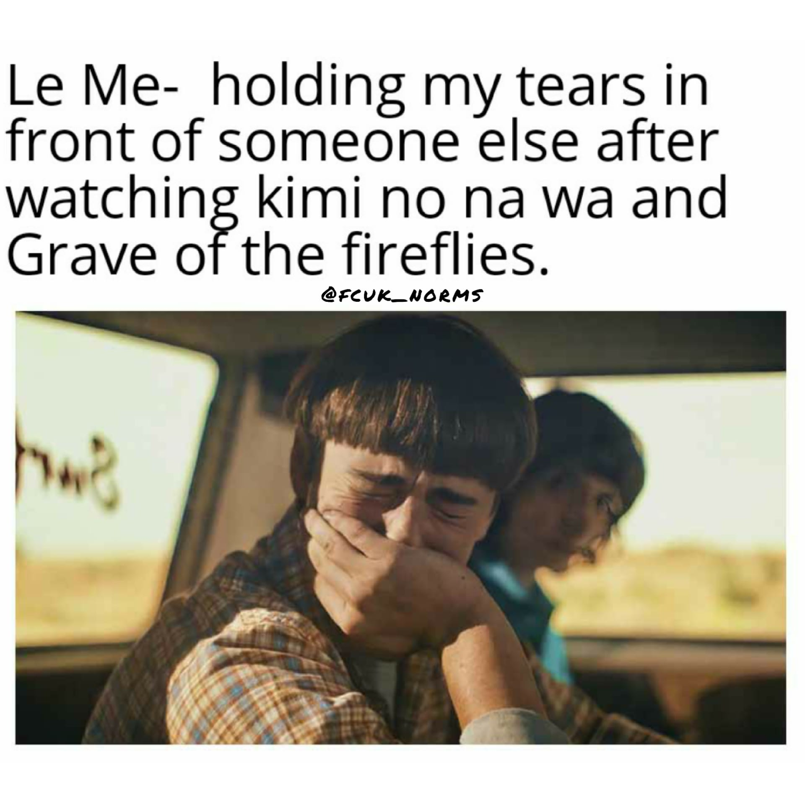

---

## 53. Predicted label: **Sadness**

- **Title:** This didn't happen recently, but it did happen.
- **Meme caption:** The meme poster feels sad for his friend at the Obituary section in the newspaper.
- **Raw model response:** `Sadness`
- **Manual judgment:** 
- **Human label if different:** 
- **Notes:** 

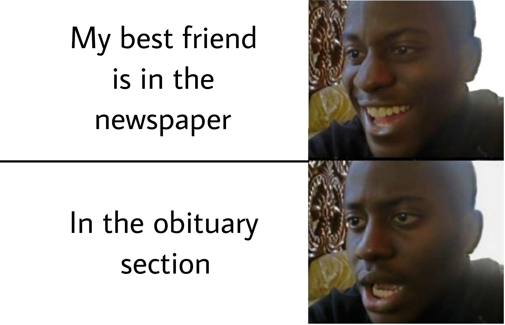

---

## 54. Predicted label: **Sadness**

- **Title:** Happy No Nut November
- **Meme caption:** Meme poster is trying to convey  that  sad incident happen .
- **Raw model response:** `Sadness`
- **Manual judgment:** 
- **Human label if different:** 
- **Notes:** 

---

## 55. Predicted label: **Sadness**

- **Title:** So patiently waiting...
- **Meme caption:** Meme poster waited so long for the new Spiderverse movie and they died.
- **Raw model response:** `Sadness`
- **Manual judgment:** 
- **Human label if different:** 
- **Notes:** 

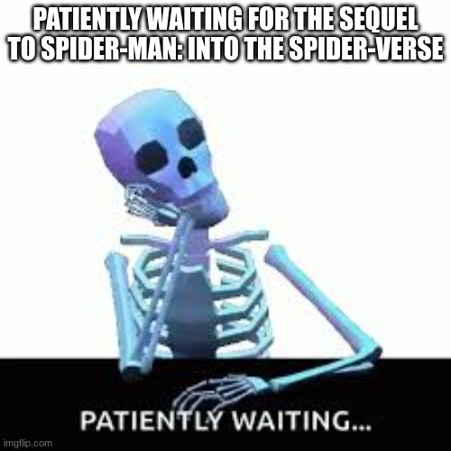

---

## 56. Predicted label: **Sadness**

- **Title:** Irony Check
- **Meme caption:** A person is sad until they learn there are sadder people on Reddit.
- **Raw model response:** `Sadness`
- **Manual judgment:** 
- **Human label if different:** 
- **Notes:** 

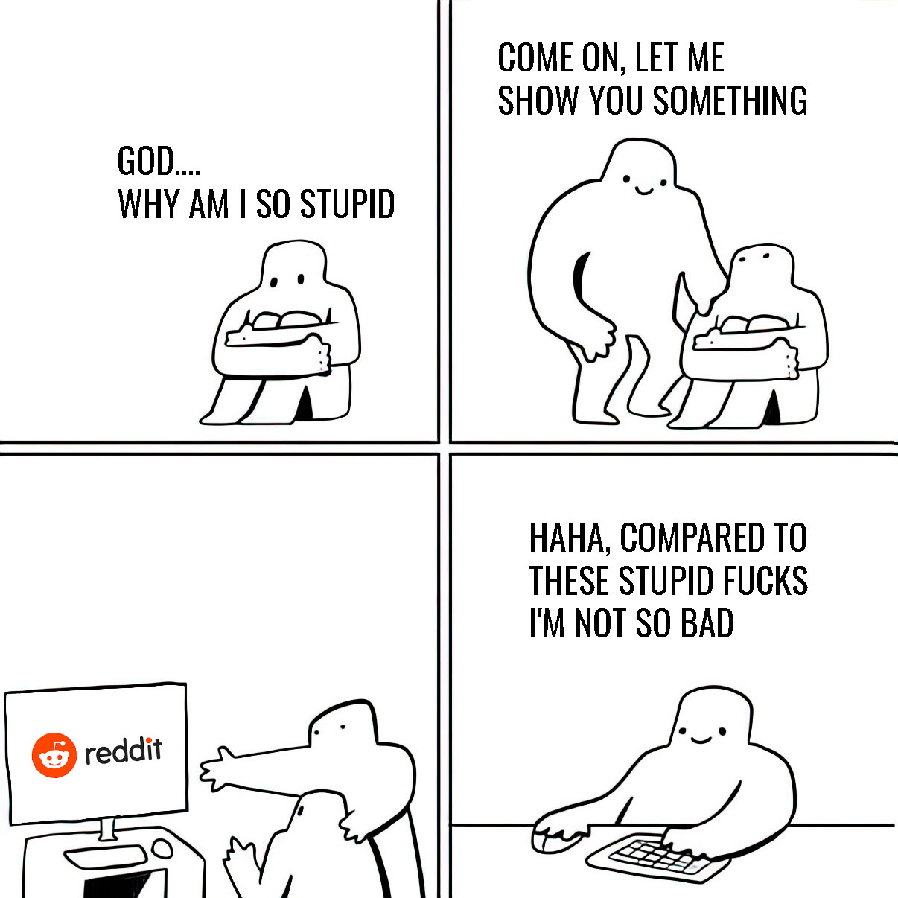

---

## 57. Predicted label: **Sadness**

- **Title:** Maybe he's just dead
- **Meme caption:** Meme poster feels sad and worried when they text "good morning" to someone and that person hasn't responded several hours later.
- **Raw model response:** `Sadness`
- **Manual judgment:** 
- **Human label if different:** 
- **Notes:** 

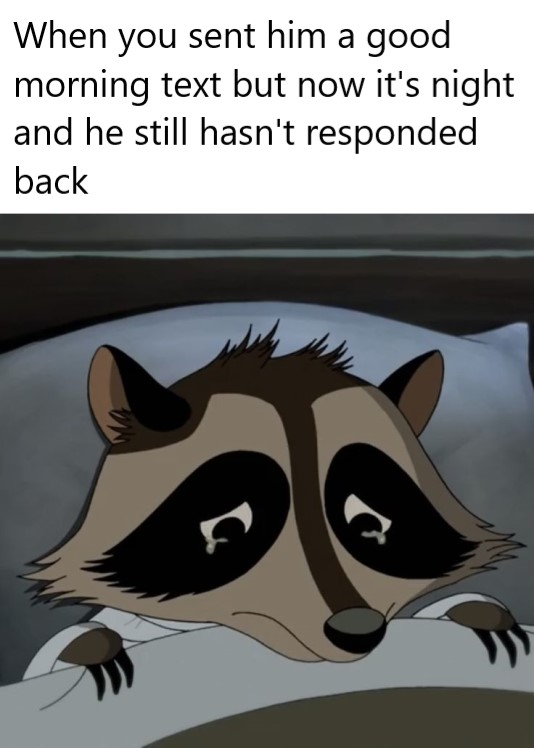

---

## 58. Predicted label: **Sadness**

- **Title:** Top 10 anime betrayals
- **Meme caption:** Meme poster is trying to convey that The character is disappointed that Mulan is actually a woman
- **Raw model response:** `Sadness`
- **Manual judgment:** 
- **Human label if different:** 
- **Notes:** 

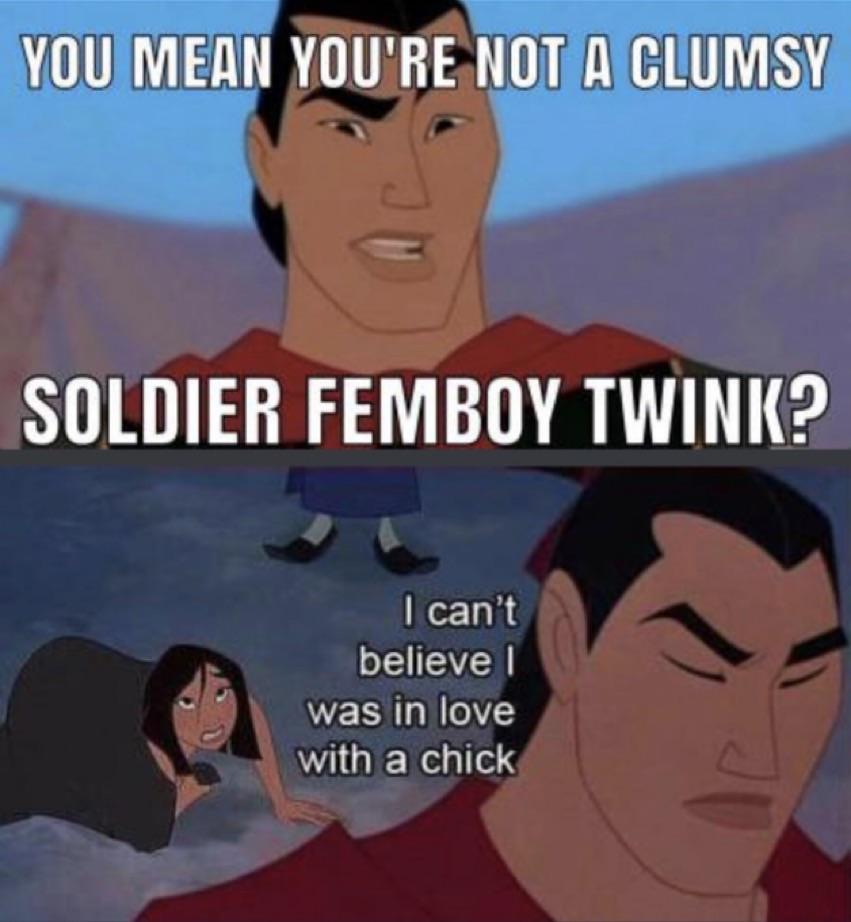

---

## 59. Predicted label: **Sadness**

- **Title:** A little late but still sad
- **Meme caption:** The meme poster feels sad for the failure of a space vehicle rather than feeling bad for cinemas.
- **Raw model response:** `Sadness`
- **Manual judgment:** 
- **Human label if different:** 
- **Notes:** 

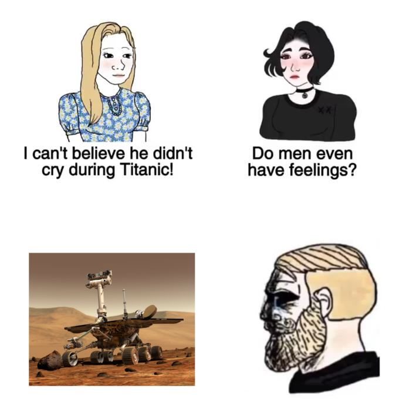

---

## 60. Predicted label: **Sadness**

- **Title:** 2022 is terrible
- **Meme caption:** The poster is sad about the demise of a superstar actor.
- **Raw model response:** `Sadness`
- **Manual judgment:** 
- **Human label if different:** 
- **Notes:** 

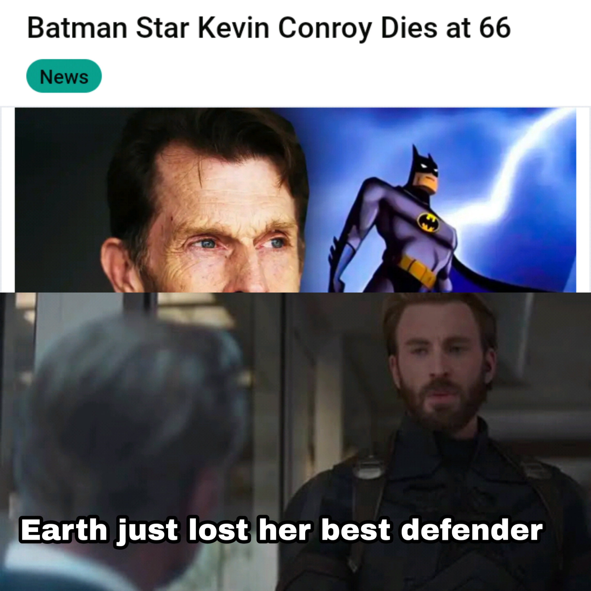

---

## 61. Predicted label: **Surprise**

- **Title:** Don't eat them though
- **Meme caption:** Meme poster finds that all websites look unattractive when you first visit them, though you may eventually get used to them once you've used them long enough.
- **Raw model response:** `Surprise`
- **Manual judgment:** 
- **Human label if different:** 
- **Notes:** 

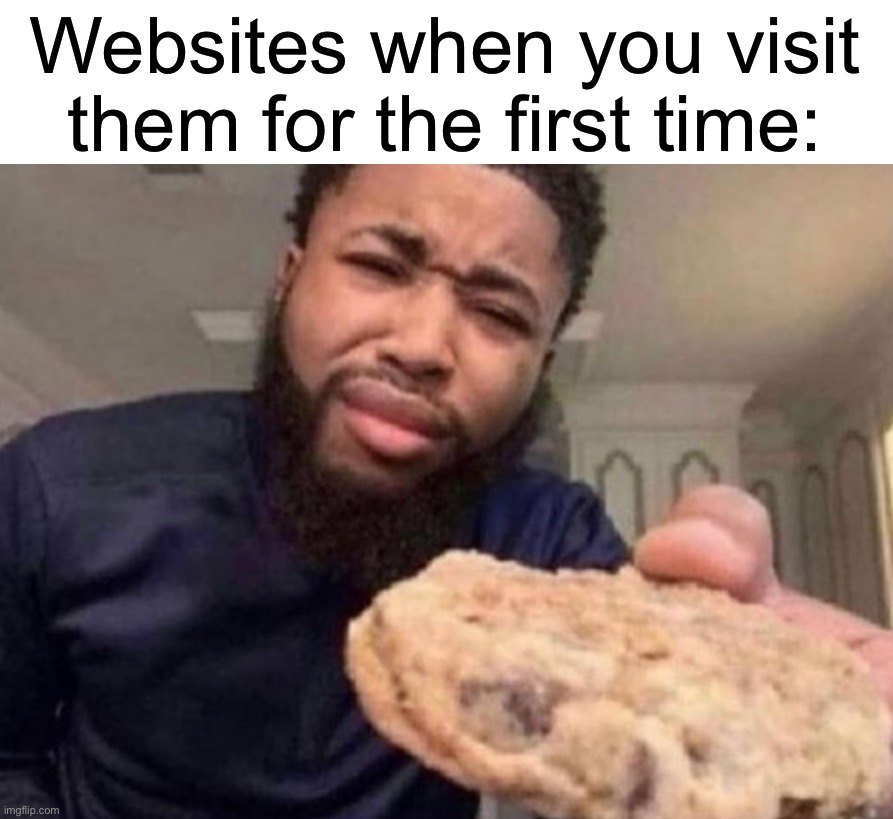

---

## 62. Predicted label: **Surprise**

- **Title:** I literally can not fall asleep in a warm bed, its very strange
- **Meme caption:** Meme poster is trying to convey that the pillow that's most warm on one side is unpleasant sleep on, while the cold side is quite peaceful.
- **Raw model response:** `Surprise`
- **Manual judgment:** 
- **Human label if different:** 
- **Notes:** 

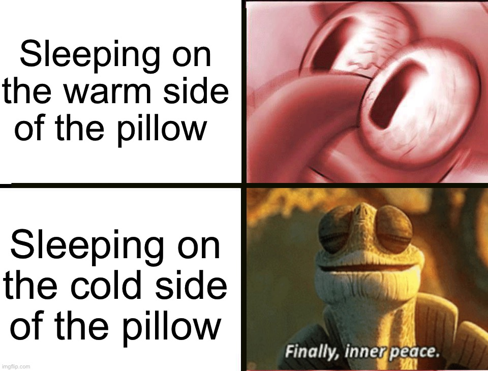

---

## 63. Predicted label: **Surprise**

- **Title:** didn't think of that
- **Meme caption:** Meme poster thought they outsmarted their mom but realizes they didn't.
- **Raw model response:** `Surprise`
- **Manual judgment:** 
- **Human label if different:** 
- **Notes:** 

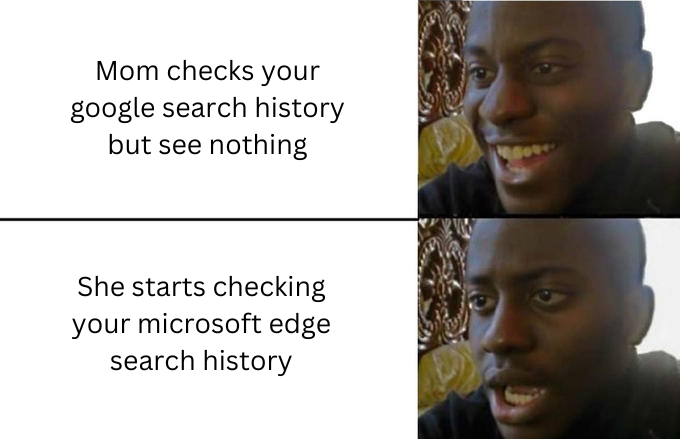

---

## 64. Predicted label: **Surprise**

- **Title:** Now we know...
- **Meme caption:** Meme poster thinks reddit bots are really aliens.
- **Raw model response:** `Surprise`
- **Manual judgment:** 
- **Human label if different:** 
- **Notes:** 

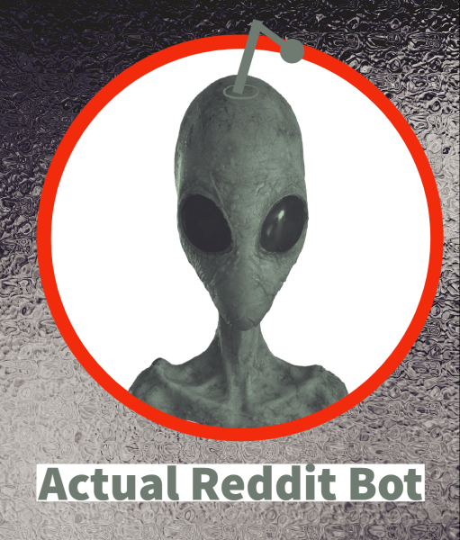

---

## 65. Predicted label: **Surprise**

- **Title:** Why make it more confusing
- **Meme caption:** The meme poster is shocked to learn that horses have such small horsepower.
- **Raw model response:** `Surprise`
- **Manual judgment:** 
- **Human label if different:** 
- **Notes:** 

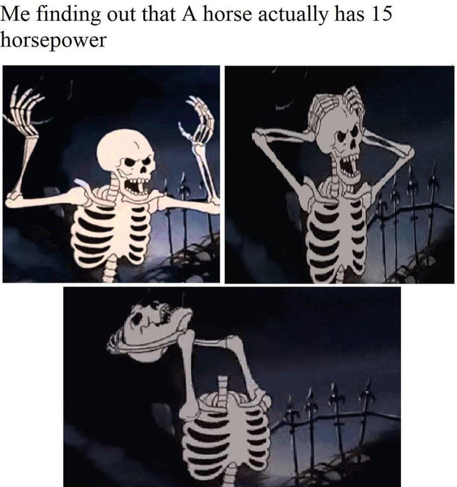

---

## 66. Predicted label: **Surprise**

- **Title:** Why did you do this to me?
- **Meme caption:** Meme poster is trying to convey that it's frustrating when you are an introvert and unexpected people show up and you have to breathe deep to get through it
- **Raw model response:** `Surprise`
- **Manual judgment:** 
- **Human label if different:** 
- **Notes:** 

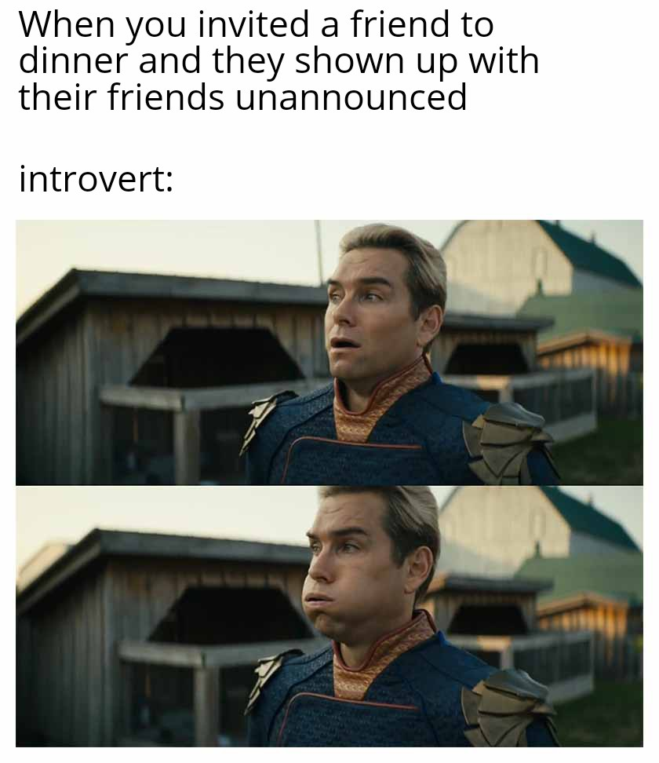

---

## 67. Predicted label: **Surprise**

- **Title:** imagine living in hell
- **Meme caption:** Meme poster is trying to convey that young people don't know how to use the long hand and short hand of a clock
- **Raw model response:** `Surprise`
- **Manual judgment:** 
- **Human label if different:** 
- **Notes:** 

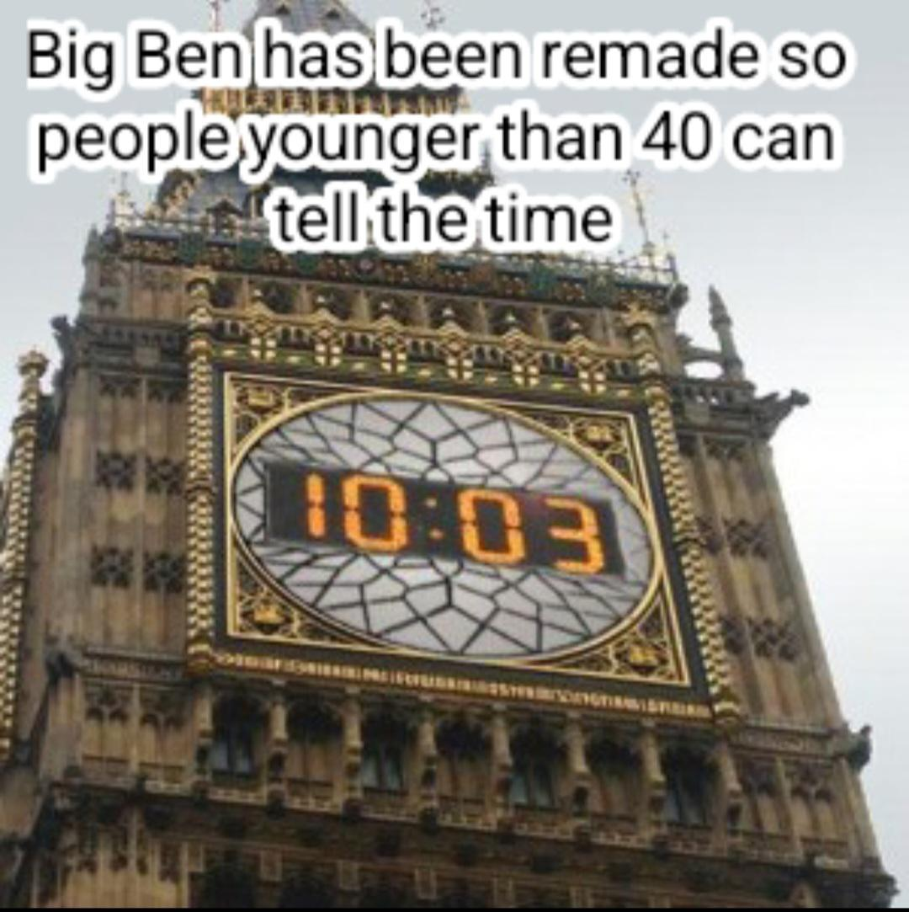

---

## 68. Predicted label: **Surprise**

- **Title:** whole gang for this one
- **Meme caption:** Meme poster is trying to convey that other streaming services are celebrating the end of Netflix.
- **Raw model response:** `Surprise`
- **Manual judgment:** 
- **Human label if different:** 
- **Notes:** 

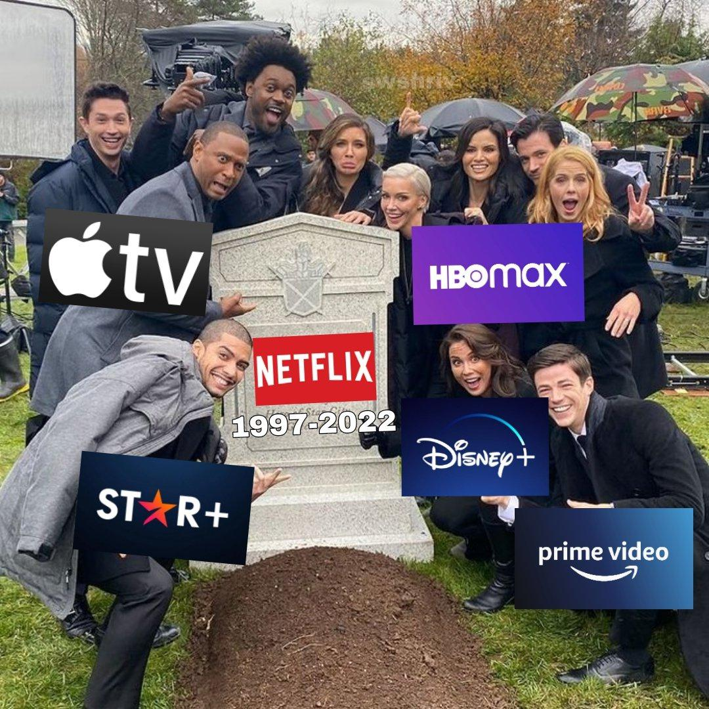

---

## 69. Predicted label: **Surprise**

- **Title:** British thing
- **Meme caption:** Meme poster is trying to convey that they find British people unattractive.
- **Raw model response:** `Surprise`
- **Manual judgment:** 
- **Human label if different:** 
- **Notes:** 

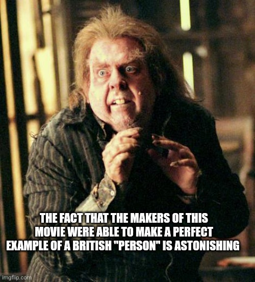

---

## 70. Predicted label: **Surprise**

- **Title:** Mistakes where made.
- **Meme caption:** Meme poster is trying to convey that phone always ruins their schedule.
- **Raw model response:** `Surprise`
- **Manual judgment:** 
- **Human label if different:** 
- **Notes:** 

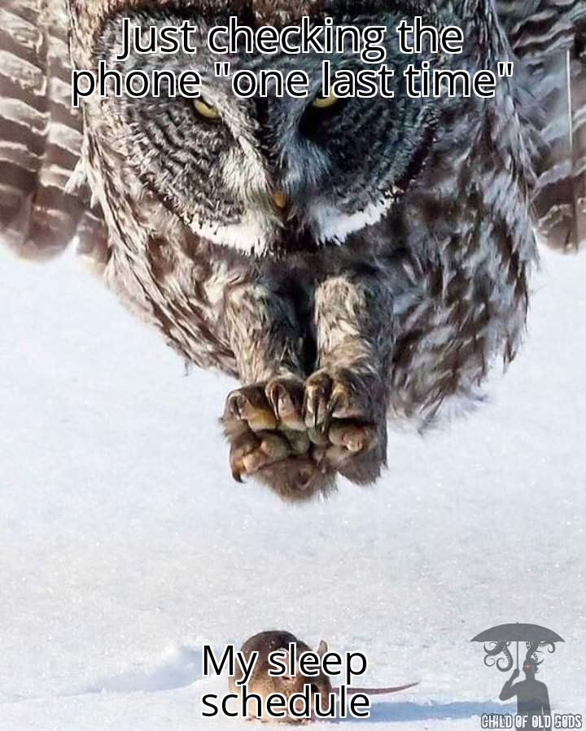

---

## 71. Predicted label: **INVALID**

- **Title:** the bane of many
- **Meme caption:** Meme poster is trying to convey that they are plagued by writer's block.
- **Raw model response:** `Writer's block`
- **Manual judgment:** 
- **Human label if different:** 
- **Notes:** 

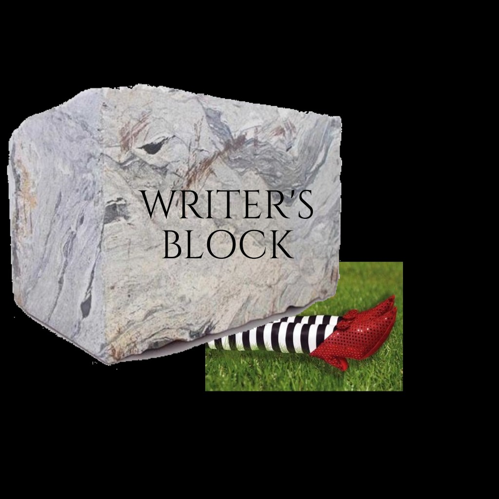

---

## 72. Predicted label: **INVALID**

- **Title:** Sorry I had to censor the username but I wrote in the comments
- **Meme caption:** Meme poster shows the difference between what the media is reporting vs what actually happened.
- **Raw model response:** `The truth`
- **Manual judgment:** 
- **Human label if different:** 
- **Notes:** 

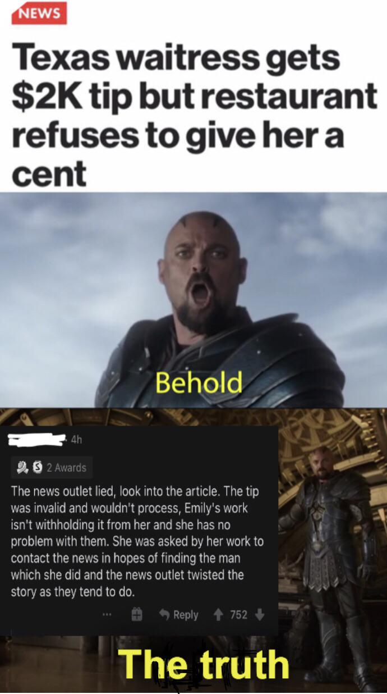

---

## 73. Predicted label: **INVALID**

- **Title:** Take away the pain
- **Meme caption:** Meme poster is trying to convey that they're humiliated when they read their old conversations online.
- **Raw model response:** `Anxiety`
- **Manual judgment:** 
- **Human label if different:** 
- **Notes:** 

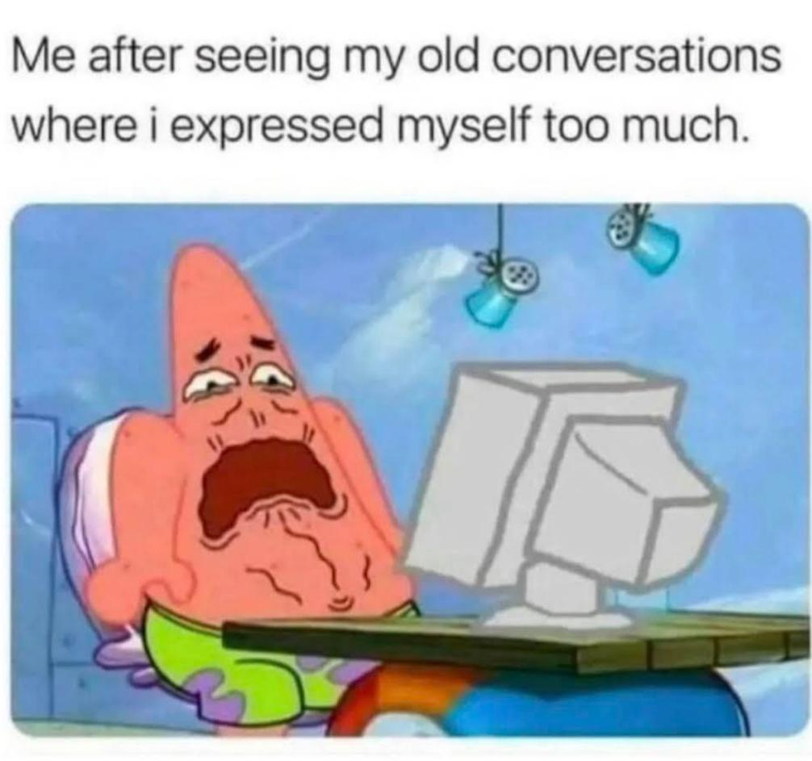

---

